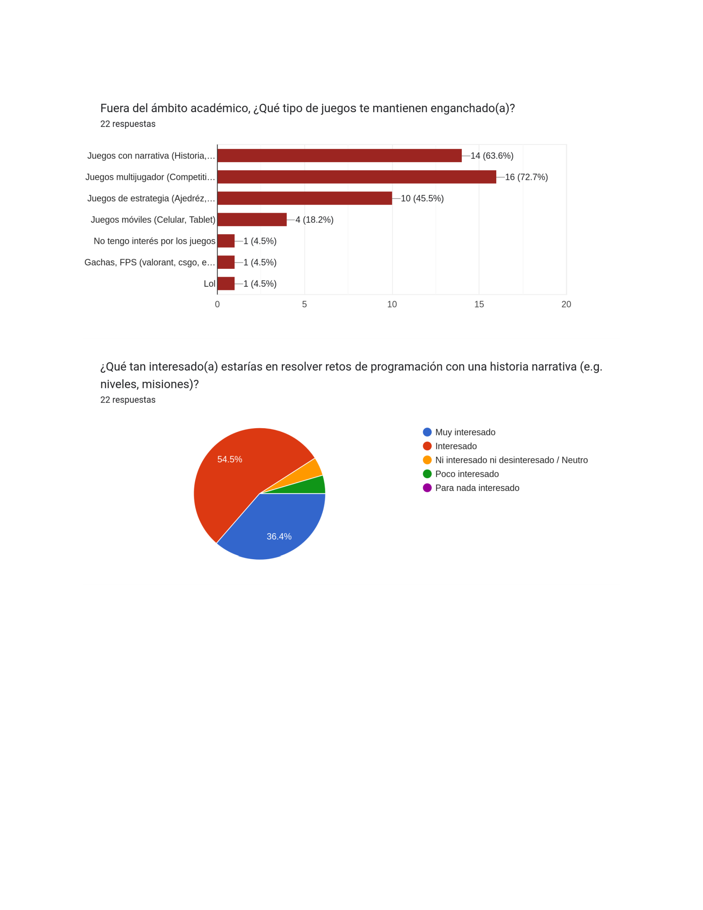
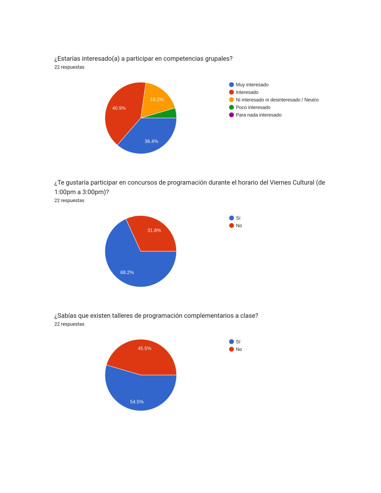
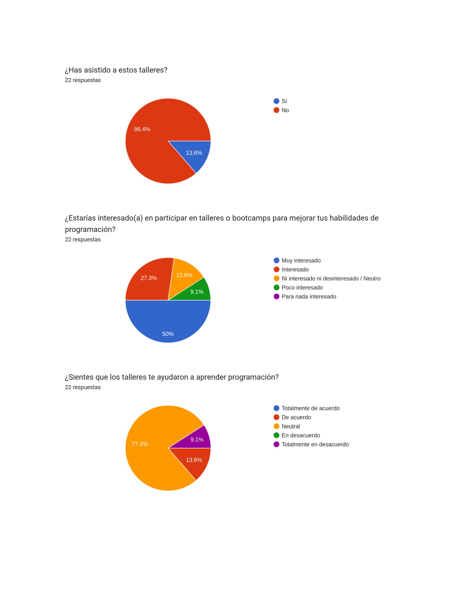
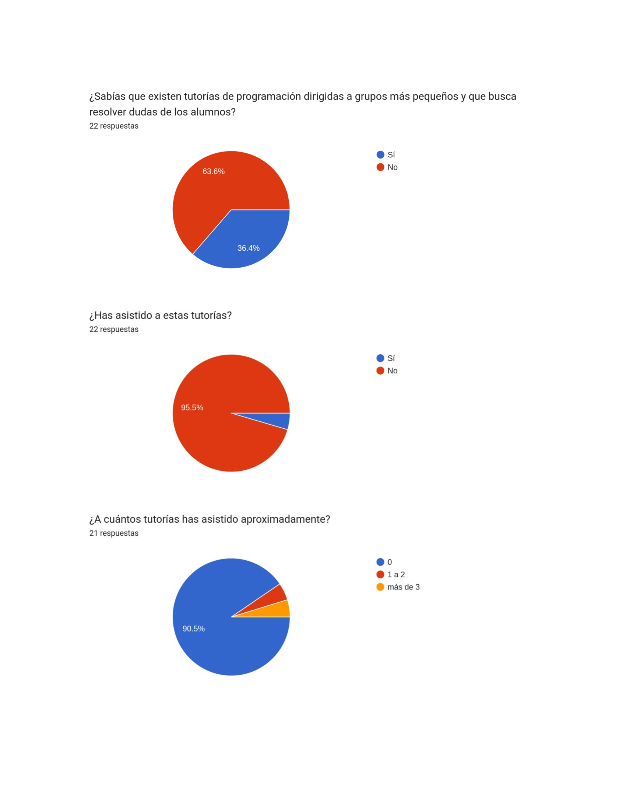

# Capítulo II: Requirements Elicitation & Analysis
## 2.1. Competidores

 
 
2. Wayground (Quizizz) Fue fundado en 2015. Comenzó como una herramienta para crear y compartir quizzes interactivos, y ha evolucionado hacia una plataforma integral de instrucción, práctica y evaluación respaldada por IA. Funciona como un modelo freemium, ofreciendo acceso inicial gratuito y un plan premium (aproximadamente USD 10/mes) con recursos educativos ampliados, personalización y sin anuncios. Su competencia se considera directa parcial: comparten propósito educativo gamificado, pero Wayground no está específicamente alineada con retos académicos estructurados dentro de una plataforma universitaria. 
 
 
3. Codecademy Go Lanzada el 4 de octubre de 2018, es la versión móvil de Codecademy, pensada para practicar y repasar conceptos de programación en cualquier lugar. Aunque la plataforma principal (Codecademy) fue fundada en 2011, esta app complementaria funciona con un modelo freemium/subscripción, donde el uso básico es gratuito y el acceso completo requiere una suscripción Pro. La competencia es parcialmente indirecta: aunque se comparte el enfoque en aprendizaje de programación, está centrada en el autoaprendizaje individual, sin la capa de gamificación institucional ni seguimiento docente en el contexto universitario.
  
 

### 2.1.1. Análisis competitivo

### 2.1.2. Estrategias y tácticas frente a competidores

<table border="1" cellpadding="6" cellspacing="0">
  <tr>
    <th colspan="6">Competitive analysis landscape</th>
  </tr>
  <tr>
    <td>¿Por qué llevar a cabo este análisis?</td>
    <td colspan="5">Escriba en el recuadro la pregunta que busca responder o el objetivo de este análisis.</td>
  </tr>

  <tr>
    <td>(En la cabecera colocar por cada competidor nombre y logo)</td>
    <td></td>
    <th>Level Up Journey</th>
    <th>Kahoot</th>
    <th>Wayground</th>
    <th>Codecademy Go</th>
  </tr>

  <!-- PERFIL -->
  <tr>
    <td rowspan="2">Perfil</td>
    <td>Overview</td>
    <td>Plataforma universitaria con dinámicas de gamificación (retos, insignias, ranking y comunidad) diseñada para estudiantes de primeros ciclos.</td><td>Aplicación global de cuestionarios interactivos y juegos en tiempo real, utilizada en colegios y universidades para reforzar aprendizajes.</td><td>Plataforma de quizzes gamificados con soporte multimedia, personalización con IA y acceso sin necesidad de registro.</td><td>plicación móvil de Codecademy para reforzar prácticas de programación con lecciones cortas, quizzes y recordatorios en cualquier lugar.</td>
  </tr>
  <tr>
    <td>Ventaja competitiva ¿Qué valor ofrece a los clientes?</td>
    <td>Integra motivación, seguimiento académico y comunidad en un solo entorno, enfocado en reducir deserción y mejorar tasas de aprobación en la UPC.</td><td>Alta penetración en el mercado, experiencia social inmediata en el aula y facilidad de uso multiplataforma (web y móvil).</td><td>Atractiva para estudiantes por su dinamismo visual, memes y rankings opcionales; popular en educación básica y media.</td><td>Permite a los estudiantes practicar código desde el celular, manteniendo continuidad en el aprendizaje con ejercicios guiados y progresivos.</td>
  </tr>

  <!-- PERFIL DE MARKETING -->
  <tr>
    <td rowspan="3">Perfil de Marketing</td>
    <td>Estrategias de marketing</td>
    <td>Alianzas institucionales con la UPC para integrarse en cursos obligatorios de primeros ciclos.  Comunicación interna universitaria (charlas, ferias académicas, talleres) destacando logros y testimonios de estudiantes.  Campañas de “historias de éxito” que muestren mejoras en motivación, retención y notas.  Gamificación en la difusión: retos promocionales y recompensas digitales para fomentar el uso inicial.</td><td>Posicionamiento como referente global en aprendizaje gamificado.  Freemium: versión gratuita masiva y planes premium para instituciones educativas y corporaciones.  Uso de redes sociales y eventos internacionales de educación para fortalecer marca y comunidad.  Marketing viral gracias a la facilidad de compartir juegos y resultados entre estudiantes.</td><td>Experiencia gratuita y accesible para captar volumen de usuarios y luego convertir a planes premium.  Comunicación dirigida a profesores con la promesa de clases más divertidas y menos esfuerzo en preparación.  Uso de memes, música y elementos de cultura digital juvenil como herramienta de atracción.  Estrategia mobile-first con fuerte presencia en app stores y reseñas positivas para captar a usuarios móviles.</td><td>Marketing digital orientado a personas interesadas en programación y cambio de carrera.  Promoción en plataformas como YouTube, Google Ads y foros tecnológicos.  Planes de suscripción accesibles y descuentos estudiantiles para fidelizar usuarios jóvenes.  Construcción de comunidad online con foros, proyectos compartidos y métricas de progreso visibles.</td>
  </tr>
  <tr>
    <td>Mercado Objetivo</td>
    <td>Estudiantes de primero a tercer ciclo en la UPC (con énfasis en Ingeniería de Software, Sistemas y Ciberseguridad en la primera etapa), profesores que requieren herramientas para motivar y monitorear el avance de sus alumnos, y la propia universidad que busca reducir la deserción temprana.</td><td>Docentes y estudiantes de todos los niveles educativos (desde primaria hasta educación superior), además de empresas que utilizan dinámicas de juego para capacitación corporativa.  Estrategias de Marketing:</td><td>Docentes de educación básica y media que buscan dinamizar sus clases, así como estudiantes que desean experiencias interactivas más atractivas que los métodos tradicionales.</td><td>Estudiantes autodidactas y universitarios que desean reforzar sus conocimientos de programación en cualquier momento y lugar, especialmente en EE.UU., Latinoamérica y Europa.</td>
  </tr>
  <tr>
    <td>Productos &amp; Servicio</td>
    <td>Plataforma educativa gamificada para estudiantes de primeros ciclos, con retos semanales, logros, editor de código y comunidad académica.</td><td>Juegos de cuestionarios interactivos en tiempo real para aulas y empresas; disponible en versión básica gratuita y planes premium.</td><td>Plataforma de quizzes gamificados con multimedia, IA personalizada y acceso sin registro.</td><td>App móvil de refuerzo de programación con lecciones cortas, quizzes y recordatorios de estudio.</td>
  </tr>

  <!-- PERFIL DE PRODUCTO -->
  <tr>
    <td rowspan="3">Perfil de Producto</td>
    <td>Precios &amp; Costos</td>
    <td>Piloto inicial gratuito dentro de la UPC; modelo a futuro basado en licencias institucionales y posibles planes de expansión a universidades externas.</td><td>Modelo freemium, con versiones de pago desde USD 10/mes para docentes y planes empresariales más avanzados.</td><td>Modelo freemium con planes premium para escuelas y docentes, aproximadamente desde USD 8/mes.</td><td>Modelo basado en suscripción; la app es gratuita pero el acceso a contenido completo se incluye en el plan Codecademy Pro (USD 19–39/mes).</td>
  </tr>
  <tr>
    <td>Canales de distribución</td>
    <td>Aplicación web y aplicación móvil en desarrollo, integradas al ecosistema digital universitario.</td><td>Web y aplicaciones móviles (iOS y Android).</td><td>Web y aplicaciones móviles (iOS y Android).</td><td>Aplicación móvil (iOS y Android), complementaria a la plataforma web de Codecademy.</td>
  </tr>
  <tr>
    <td>(Web y/o Móvil)</td>
    <td>Web y Móvil</td><td>Web y Móvil</td><td>Web y Móvil</td><td>Web y Móvil</td>
  </tr>

  <!-- ANÁLISIS SWOT -->
  <tr>
    <td rowspan="5">Análisis SWOT</td>
    <td colspan="5">
      Realice esto para su startup y sus competidores. Sus fortalezas deberían apoyar sus oportunidades y contribuir a lo que ustedes definen como su posible ventaja competitiva.
    </td>
  </tr>
  <tr>
    <td>Fortalezas</td>
    <td>Plataforma diseñada específicamente para primeros ciclos universitarios; integra gamificación con editor de código y comunidad; alineada a objetivos de retención institucional.</td><td>Reconocimiento global; alta penetración en aulas; facilidad de uso; fuerte efecto viral.</td><td>Experiencia visual atractiva; memes, música y personalización; acceso sin registro; fuerte presencia móvil.</td><td>Enfoque práctico para reforzar programación; disponibilidad móvil; marca consolidada de Codecademy.</td>
  </tr>
  <tr>
    <td>Debilidades</td>
    <td>Producto en etapa piloto; alcance inicial limitado a la UPC; dependencia del apoyo institucional para escalar.</td><td>Poca personalización a nivel universitario; se centra en quizzes simples, no en procesos académicos profundos.</td><td>Orientado más a educación básica/media; menos adecuado para contextos universitarios complejos.</td><td>Experiencia fragmentada: app solo refuerza, no enseña desde cero; barrera de pago elevada.</td>
  </tr>
  <tr>
    <td>Oportunidades</td>
    <td>Escalar a todas las carreras de la UPC y luego a otras universidades; creciente interés en gamificación educativa; posibilidad de expandir con apps móviles.</td><td>Expansión a mercados corporativos y universitarios; integración con herramientas LMS.</td><td>Crecimiento en Latinoamérica con instituciones que buscan innovación pedagógica; potencial de adaptación al nivel superior.</td><td>Alta demanda global de formación en programación; tendencia a microaprendizajes móviles.</td>
  </tr>
  <tr>
    <td>Amenazas</td>
    <td>Competencia de grandes plataformas internacionales; riesgo de baja adopción si estudiantes no perciben valor; dependencia del presupuesto institucional.</td><td>Competidores similares que ofrecen mayor profundidad en funciones; saturación de mercado.</td><td>Aparición de nuevas apps más especializadas para universidades; riesgo de ser percibida como poco seria en educación superior.</td><td>Competencia con plataformas gratuitas como freeCodeCamp; estudiantes pueden preferir alternativas open-source.</td>
  </tr>
</table>

## 2.2. Entrevistas
### 2.2.1. Diseño de entrevistas

### 2.2.2. Registro de entrevistas

  
  
  
  
  
  
  

| **Segmento objetivo #1:**                                    | Estudiantes de primero a tercer ciclo                        |
| :----------------------------------------------------------- | ------------------------------------------------------------ |
| **Entrevista 1:** Entrevista a Rojas Hinostroza, Peter Ivan Anibal |      |
| **Sexo:** Masculino                                          | **Edad:** 21                                                 |
| **Instante en el que inicia:** 0:01                          | **Duración:** 3:51                                           |
| **URL:**                                                     | [upc-pre-202501-2520-1827-LevelUpJourney-needfinding-sprint-1](https://upcedupe-my.sharepoint.com/:v:/g/personal/u202319963_upc_edu_pe/EaERftCyMghLlaoIYkS0BD8BwedNPszKe4tzNZwsrEGMjQ?nav=eyJyZWZlcnJhbEluZm8iOnsicmVmZXJyYWxBcHAiOiJTdHJlYW1XZWJBcHAiLCJyZWZlcnJhbFZpZXciOiJTaGFyZURpYWxvZy1MaW5rIiwicmVmZXJyYWxBcHBQbGF0Zm9ybSI6IldlYiIsInJlZmVycmFsTW9kZSI6InZpZXcifX0%3D&e=3hCbfo) |
| **Resumen:**                                                 | El entrevistado, Peter, indicó que su nivel de inglés se encuentra entre intermedio y avanzado, con experiencia previa en una academia (ICPNA). Señaló que ingresó a la universidad sin conocimientos de programación, esperando aprender desde cero en los cursos iniciales. Respecto a su proceso de aprendizaje, se describió con una velocidad promedio o regular y comentó que estaría dispuesto a dedicar entre una y dos horas semanales para practicar ejercicios adicionales. **Datos adicionales:** **Lenguajes de programación:** C++  **Dispositivos:** iPhone, Windows (laptop/PC)  **Programas de estudio:** YouTube, aprendizaje autodidacta  **Motivaciones:** Mejorar su desempeño académico |

### 2.2.3. Análisis de entrevistas

En este apartado se documenta de manera estructurada cada una de las entrevistas realizadas a los diferentes segmentos objetivo. Para cada entrevista, se incluye información relevante como el perfil del entrevistado, el registro de sus respuestas, observaciones contextuales, y un resumen de los principales hallazgos obtenidos.

 Esta sistematización permite asegurar la trazabilidad de los datos recolectados, facilitando su posterior análisis y su utilización en la construcción de artefactos de usuario, tales como User Personas, Empathy Maps y User Task Matrices.

| Segmento                                                    | Características Objetivas Comunes                            | Características Subjetivas Comunes                           |
| ----------------------------------------------------------- | ------------------------------------------------------------ | ------------------------------------------------------------ |
| Segmento objetivo #1: Estudiantes de primero a tercer ciclo | **Sexo:** Masculino y femenino  **Edad:** 17 a 21 años  **Dispositivos:** Laptop con Windows, smartphone (iPhone/Android)  **Programas:** YouTube, VS Code, Figma, plataformas online (Platzi, Udemy)  **Canales de información:** Redes sociales (Instagram, TikTok), buscadores (Google/YouTube), foros estudiantiles  **Canales de venta y exposición:** Ferias universitarias, páginas web de universidades, grupos de Facebook, recomendaciones entre compañeros  **Marcas preferidas:** Nike, Adidas, Lenovo, Apple | **Motivación:** Mejorar su desempeño académico, aprender programación desde cero, participar en competencias, progresar con sistemas de rangos o niveles, y obtener retroalimentación clara y práctica.   **Frustración:** Falta de retroalimentación clara al resolver errores, dificultad por falta de bases en programación, exceso de teoría frente a la práctica, poco tiempo disponible para retos extracurriculares. |
| Segmento objetivo #2: Profesores de primero a tercer ciclo  |                                                              |                                                              |

## 2.3. Needfinding
### 2.3.1. User Personas

### 2.3.2. User Task Matrix

### 2.3.3. User Journey Mapping
### 2.3.4. Empathy Mapping
### 2.3.5. As-is Scenario Mapping
## 2.4. Ubiquitous Language

