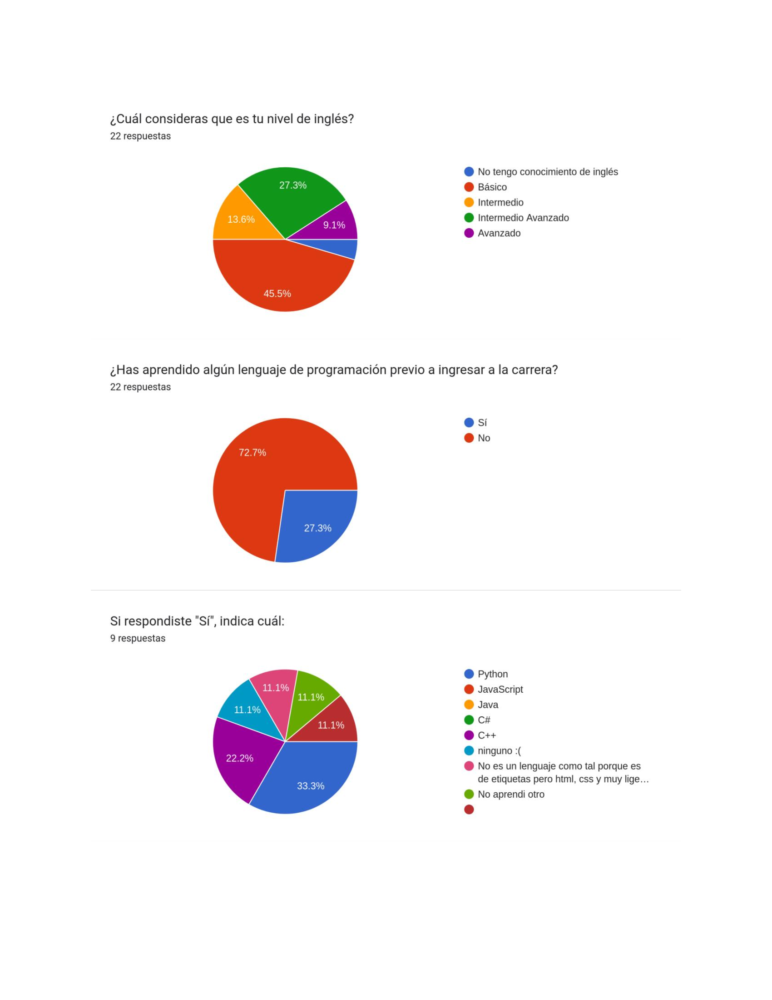
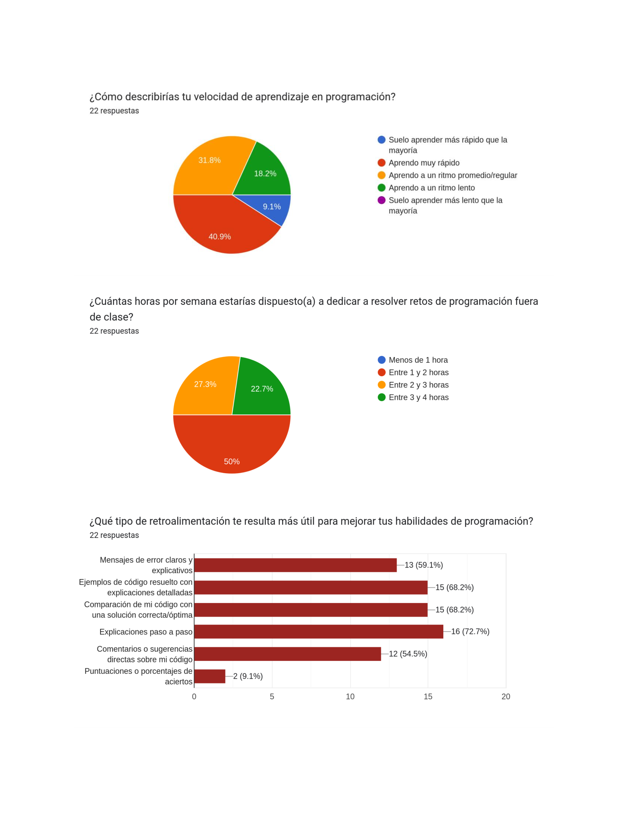
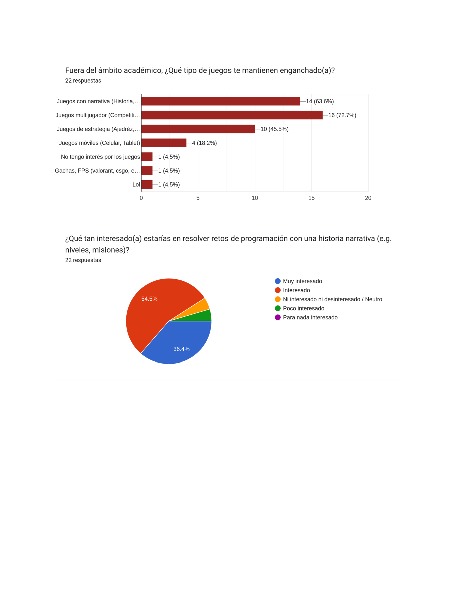
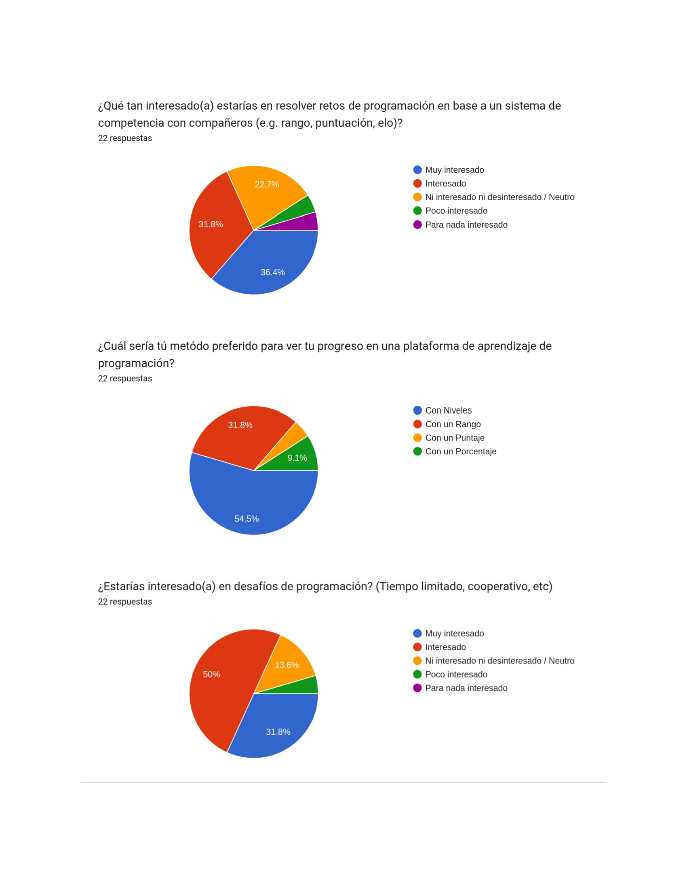
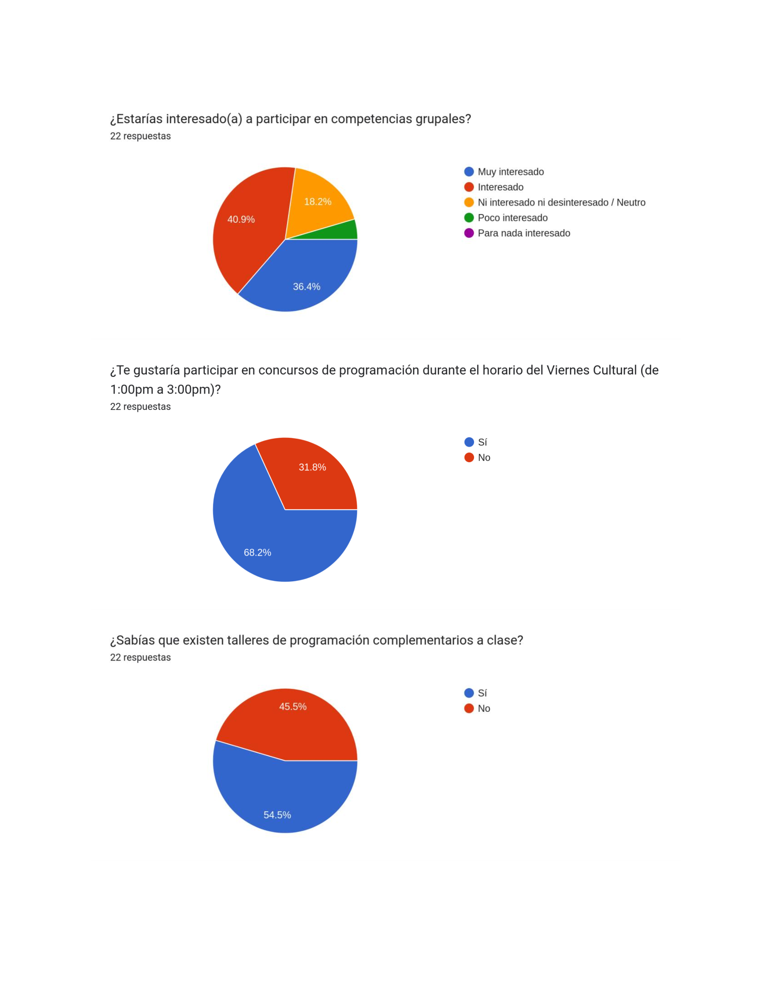
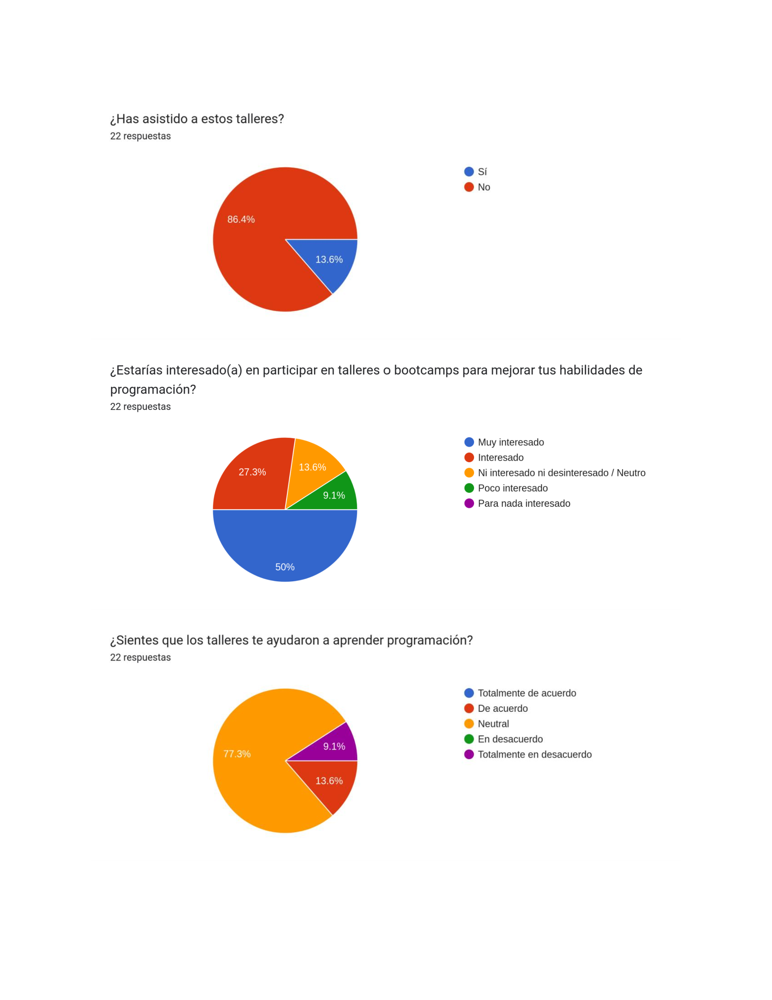
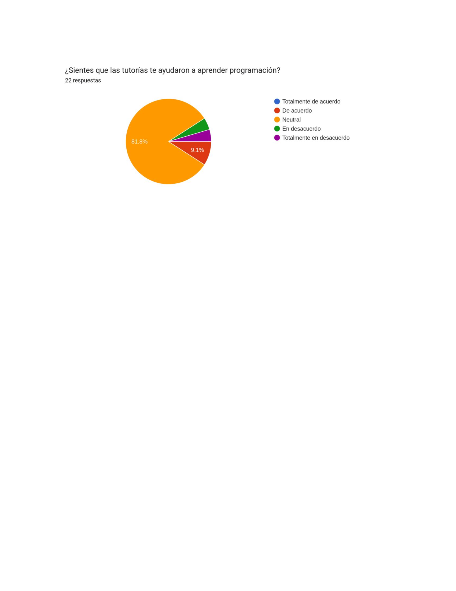
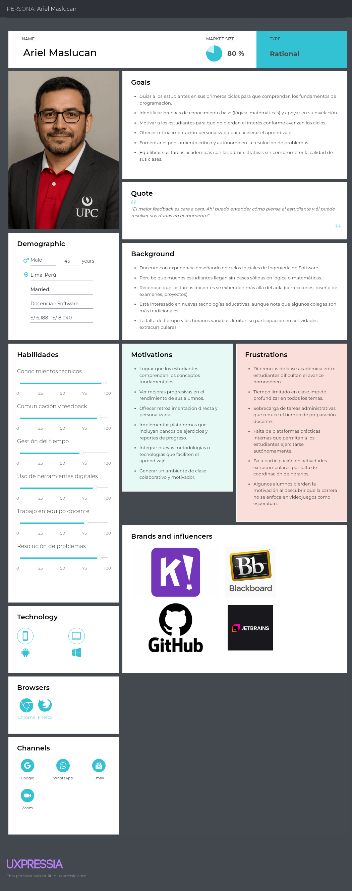
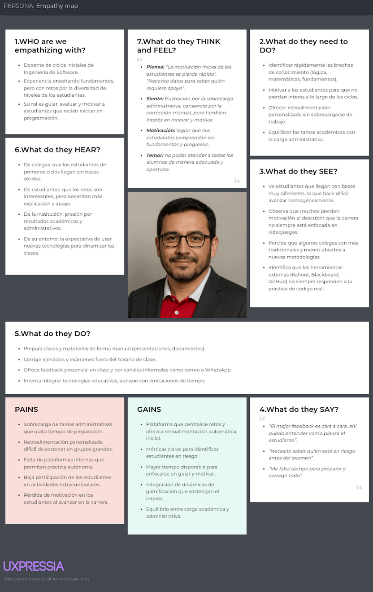
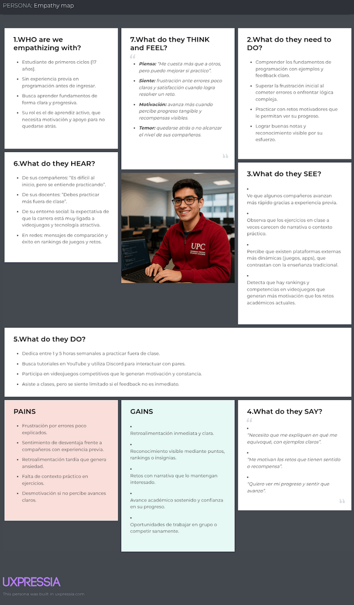

# Capítulo II: Requirements Elicitation & Analysis
## 2.1. Competidores

 
 
2. Wayground (Quizizz) Fue fundado en 2015. Comenzó como una herramienta para crear y compartir quizzes interactivos, y ha evolucionado hacia una plataforma integral de instrucción, práctica y evaluación respaldada por IA. Funciona como un modelo freemium, ofreciendo acceso inicial gratuito y un plan premium (aproximadamente USD 10/mes) con recursos educativos ampliados, personalización y sin anuncios. Su competencia se considera directa parcial: comparten propósito educativo gamificado, pero Wayground no está específicamente alineada con retos académicos estructurados dentro de una plataforma universitaria. 
 
 
3. Codecademy Go Lanzada el 4 de octubre de 2018, es la versión móvil de Codecademy, pensada para practicar y repasar conceptos de programación en cualquier lugar. Aunque la plataforma principal (Codecademy) fue fundada en 2011, esta app complementaria funciona con un modelo freemium/subscripción, donde el uso básico es gratuito y el acceso completo requiere una suscripción Pro. La competencia es parcialmente indirecta: aunque se comparte el enfoque en aprendizaje de programación, está centrada en el autoaprendizaje individual, sin la capa de gamificación institucional ni seguimiento docente en el contexto universitario.
  
 

### 2.1.1. Análisis competitivo

### 2.1.2. Estrategias y tácticas frente a competidores

<table border="1" cellpadding="6" cellspacing="0">
  <tr>
    <th colspan="6">Competitive analysis landscape</th>
  </tr>
  <tr>
    <td>¿Por qué llevar a cabo este análisis?</td>
    <td colspan="5">Escriba en el recuadro la pregunta que busca responder o el objetivo de este análisis.</td>
  </tr>

  <tr>
    <td>(En la cabecera colocar por cada competidor nombre y logo)</td>
    <td></td>
    <th>Level Up Journey</th>
    <th>Kahoot</th>
    <th>Wayground</th>
    <th>Codecademy Go</th>
  </tr>

  <!-- PERFIL -->
  <tr>
    <td rowspan="2">Perfil</td>
    <td>Overview</td>
    <td>Plataforma universitaria con dinámicas de gamificación (retos, insignias, ranking y comunidad) diseñada para estudiantes de primeros ciclos.</td><td>Aplicación global de cuestionarios interactivos y juegos en tiempo real, utilizada en colegios y universidades para reforzar aprendizajes.</td><td>Plataforma de quizzes gamificados con soporte multimedia, personalización con IA y acceso sin necesidad de registro.</td><td>plicación móvil de Codecademy para reforzar prácticas de programación con lecciones cortas, quizzes y recordatorios en cualquier lugar.</td>
  </tr>
  <tr>
    <td>Ventaja competitiva ¿Qué valor ofrece a los clientes?</td>
    <td>Integra motivación, seguimiento académico y comunidad en un solo entorno, enfocado en reducir deserción y mejorar tasas de aprobación en la UPC.</td><td>Alta penetración en el mercado, experiencia social inmediata en el aula y facilidad de uso multiplataforma (web y móvil).</td><td>Atractiva para estudiantes por su dinamismo visual, memes y rankings opcionales; popular en educación básica y media.</td><td>Permite a los estudiantes practicar código desde el celular, manteniendo continuidad en el aprendizaje con ejercicios guiados y progresivos.</td>
  </tr>

  <!-- PERFIL DE MARKETING -->
  <tr>
    <td rowspan="3">Perfil de Marketing</td>
    <td>Estrategias de marketing</td>
    <td>Alianzas institucionales con la UPC para integrarse en cursos obligatorios de primeros ciclos.  Comunicación interna universitaria (charlas, ferias académicas, talleres) destacando logros y testimonios de estudiantes.  Campañas de “historias de éxito” que muestren mejoras en motivación, retención y notas.  Gamificación en la difusión: retos promocionales y recompensas digitales para fomentar el uso inicial.</td><td>Posicionamiento como referente global en aprendizaje gamificado.  Freemium: versión gratuita masiva y planes premium para instituciones educativas y corporaciones.  Uso de redes sociales y eventos internacionales de educación para fortalecer marca y comunidad.  Marketing viral gracias a la facilidad de compartir juegos y resultados entre estudiantes.</td><td>Experiencia gratuita y accesible para captar volumen de usuarios y luego convertir a planes premium.  Comunicación dirigida a profesores con la promesa de clases más divertidas y menos esfuerzo en preparación.  Uso de memes, música y elementos de cultura digital juvenil como herramienta de atracción.  Estrategia mobile-first con fuerte presencia en app stores y reseñas positivas para captar a usuarios móviles.</td><td>Marketing digital orientado a personas interesadas en programación y cambio de carrera.  Promoción en plataformas como YouTube, Google Ads y foros tecnológicos.  Planes de suscripción accesibles y descuentos estudiantiles para fidelizar usuarios jóvenes.  Construcción de comunidad online con foros, proyectos compartidos y métricas de progreso visibles.</td>
  </tr>
  <tr>
    <td>Mercado Objetivo</td>
    <td>Estudiantes de primero a tercer ciclo en la UPC (con énfasis en Ingeniería de Software, Sistemas y Ciberseguridad en la primera etapa), profesores que requieren herramientas para motivar y monitorear el avance de sus alumnos, y la propia universidad que busca reducir la deserción temprana.</td><td>Docentes y estudiantes de todos los niveles educativos (desde primaria hasta educación superior), además de empresas que utilizan dinámicas de juego para capacitación corporativa.  Estrategias de Marketing:</td><td>Docentes de educación básica y media que buscan dinamizar sus clases, así como estudiantes que desean experiencias interactivas más atractivas que los métodos tradicionales.</td><td>Estudiantes autodidactas y universitarios que desean reforzar sus conocimientos de programación en cualquier momento y lugar, especialmente en EE.UU., Latinoamérica y Europa.</td>
  </tr>
  <tr>
    <td>Productos &amp; Servicio</td>
    <td>Plataforma educativa gamificada para estudiantes de primeros ciclos, con retos semanales, logros, editor de código y comunidad académica.</td><td>Juegos de cuestionarios interactivos en tiempo real para aulas y empresas; disponible en versión básica gratuita y planes premium.</td><td>Plataforma de quizzes gamificados con multimedia, IA personalizada y acceso sin registro.</td><td>App móvil de refuerzo de programación con lecciones cortas, quizzes y recordatorios de estudio.</td>
  </tr>

  <!-- PERFIL DE PRODUCTO -->
  <tr>
    <td rowspan="3">Perfil de Producto</td>
    <td>Precios &amp; Costos</td>
    <td>Piloto inicial gratuito dentro de la UPC; modelo a futuro basado en licencias institucionales y posibles planes de expansión a universidades externas.</td><td>Modelo freemium, con versiones de pago desde USD 10/mes para docentes y planes empresariales más avanzados.</td><td>Modelo freemium con planes premium para escuelas y docentes, aproximadamente desde USD 8/mes.</td><td>Modelo basado en suscripción; la app es gratuita pero el acceso a contenido completo se incluye en el plan Codecademy Pro (USD 19–39/mes).</td>
  </tr>
  <tr>
    <td>Canales de distribución</td>
    <td>Aplicación web y aplicación móvil en desarrollo, integradas al ecosistema digital universitario.</td><td>Web y aplicaciones móviles (iOS y Android).</td><td>Web y aplicaciones móviles (iOS y Android).</td><td>Aplicación móvil (iOS y Android), complementaria a la plataforma web de Codecademy.</td>
  </tr>
  <tr>
    <td>(Web y/o Móvil)</td>
    <td>Web y Móvil</td><td>Web y Móvil</td><td>Web y Móvil</td><td>Web y Móvil</td>
  </tr>

  <!-- ANÁLISIS SWOT -->
  <tr>
    <td rowspan="5">Análisis SWOT</td>
    <td colspan="5">
      Realice esto para su startup y sus competidores. Sus fortalezas deberían apoyar sus oportunidades y contribuir a lo que ustedes definen como su posible ventaja competitiva.
    </td>
  </tr>
  <tr>
    <td>Fortalezas</td>
    <td>Plataforma diseñada específicamente para primeros ciclos universitarios; integra gamificación con editor de código y comunidad; alineada a objetivos de retención institucional.</td><td>Reconocimiento global; alta penetración en aulas; facilidad de uso; fuerte efecto viral.</td><td>Experiencia visual atractiva; memes, música y personalización; acceso sin registro; fuerte presencia móvil.</td><td>Enfoque práctico para reforzar programación; disponibilidad móvil; marca consolidada de Codecademy.</td>
  </tr>
  <tr>
    <td>Debilidades</td>
    <td>Producto en etapa piloto; alcance inicial limitado a la UPC; dependencia del apoyo institucional para escalar.</td><td>Poca personalización a nivel universitario; se centra en quizzes simples, no en procesos académicos profundos.</td><td>Orientado más a educación básica/media; menos adecuado para contextos universitarios complejos.</td><td>Experiencia fragmentada: app solo refuerza, no enseña desde cero; barrera de pago elevada.</td>
  </tr>
  <tr>
    <td>Oportunidades</td>
    <td>Escalar a todas las carreras de la UPC y luego a otras universidades; creciente interés en gamificación educativa; posibilidad de expandir con apps móviles.</td><td>Expansión a mercados corporativos y universitarios; integración con herramientas LMS.</td><td>Crecimiento en Latinoamérica con instituciones que buscan innovación pedagógica; potencial de adaptación al nivel superior.</td><td>Alta demanda global de formación en programación; tendencia a microaprendizajes móviles.</td>
  </tr>
  <tr>
    <td>Amenazas</td>
    <td>Competencia de grandes plataformas internacionales; riesgo de baja adopción si estudiantes no perciben valor; dependencia del presupuesto institucional.</td><td>Competidores similares que ofrecen mayor profundidad en funciones; saturación de mercado.</td><td>Aparición de nuevas apps más especializadas para universidades; riesgo de ser percibida como poco seria en educación superior.</td><td>Competencia con plataformas gratuitas como freeCodeCamp; estudiantes pueden preferir alternativas open-source.</td>
  </tr>
</table>

## 2.2. Entrevistas
### 2.2.1. Diseño de entrevistas

### 2.2.2. Registro de entrevistas

  
  
  
  
  
  
  
  

**Segmento objetivo #1: Estudiantes de primero a tercer ciclo**

| Segmento objetivo #1:                                        | Estudiantes de primero a tercer ciclo                        |
| ------------------------------------------------------------ | ------------------------------------------------------------ |
| Entrevista 1: Entrevista a Rojas Hinostroza, Peter Ivan Anibal |  |
| Sexo: Masculino                                              | Edad: 21                                                     |
| Instante en el que inicia: 0:01                              | Duración: 3:51                                               |
| URL:                                                         | [upc-pre-202501-2520-1827-LevelUpJourney-needfinding-sprint-1](https://upcedupe-my.sharepoint.com/:v:/g/personal/u202319963_upc_edu_pe/EaERftCyMghLlaoIYkS0BD8BwedNPszKe4tzNZwsrEGMjQ?nav=eyJyZWZlcnJhbEluZm8iOnsicmVmZXJyYWxBcHAiOiJTdHJlYW1XZWJBcHAiLCJyZWZlcnJhbFZpZXciOiJTaGFyZURpYWxvZy1MaW5rIiwicmVmZXJyYWxBcHBQbGF0Zm9ybSI6IldlYiIsInJlZmVycmFsTW9kZSI6InZpZXcifX0%3D&e=3hCbfo) |
| Resumen:                                                     | El entrevistado, Peter, indicó que su nivel de inglés se encuentra entre intermedio y avanzado, con experiencia previa en una academia (ICPNA). Señaló que ingresó a la universidad sin conocimientos de programación, esperando aprender desde cero en los cursos iniciales. Respecto a su proceso de aprendizaje, se describió con una velocidad promedio o regular y comentó que estaría dispuesto a dedicar entre una y dos horas semanales para practicar ejercicios adicionales.Datos adicionales:Lenguajes de programación: C++ Dispositivos: iPhone, Windows (laptop/PC) Programas de estudio: YouTube, aprendizaje autodidacta Motivaciones: Mejorar su desempeño académico |

| Segmento objetivo #1:                              | Estudiantes de primero a tercer ciclo                        |
| -------------------------------------------------- | ------------------------------------------------------------ |
| Entrevista 2: Entrevista a Herrera Ambrosio, Lenin |  |
| Sexo: Masculino                                    | Edad 18 años                                                 |
| Instante en el que inicia: 0:01                    | Duración: 4:20 minutos                                       |
| URL:                                               | [ upc-pre-202501-2520-1827-LevelUpJourney-needfinding-sprint-1 ](https://youtu.be/cRoHHZ-S9Kk?si=g_10MkZPR1juQ4yF) |
| Resumen:                                           | Lenin es estudiante del segundo ciclo de Ingeniería de Software. Indicó que antes de ingresar a la carrera no tenía experiencia previa programando, aunque había visto superficialmente Python. Comentó que eligió estudiar Ingeniería de Software porque le gustan mucho los videojuegos y le interesa conocer cómo se diseñan y desarrollan. Actualmente se encuentra en nivel básico de inglés, sin certificaciones formales.Suele practicar programación diariamente, aprovechando los huecos de su horario, y le dedica alrededor de 4 horas al día. Aunque encuentra algunos temas complicados, disfruta el aprendizaje. Prefiere los juegos competitivos, como Clash Royale o Call of Duty, y le motiva la competencia y los sistemas de puntuación/rangos.Durante las clases, consideró que los retos fueron novedosos pero sentía que necesitaba más explicación directa de los conceptos. Le gustaría que en clase se implementen clasificaciones o rankings entre los estudiantes, tanto a nivel de aula como de toda la universidad. Prefiere trabajar en grupo, ya que considera que fomenta la cooperación, y estaría interesado en participar en los viernes culturales con retos de programación. Ha usado tutorías solo de forma ocasional cuando necesitaba ayuda puntual. Datos adicionales: Lenguajes de programación: Python (solo lo ha visto superficialmente) Dispositivos: Laptop con Windows Programas de estudio: No mencionados Motivaciones: Interés en videojuegos, aprender desarrollo y diseño de juegos, motivación por competencia y rankings |

| Segmento objetivo #1:                                    | Estudiantes de primero a tercer ciclo                        |
| -------------------------------------------------------- | ------------------------------------------------------------ |
| Entrevista 3: Entrevista a Cristian Anthony Merino Vilca |  |
| Sexo: Masculino                                          | Edad 17 años                                                 |
| Instante en el que inicia: 0:01                          | Duración: 4:30 minutos                                       |
| URL:                                                     | [ upc-pre-202501-2520-1827-LevelUpJourney-needfinding-sprint-1](https://youtu.be/456zuDi00H8?si=ZcTgG9o9Q6EZPHUx) |
| Resumen:                                                 | El entrevistado tiene 17 años y se encuentra en los primeros ciclos de Ingeniería de Software. Indicó que cuenta con un nivel de inglés B1, certificado a través de una evaluación realizada en su colegio. Comentó que decidió estudiar Ingeniería de Software porque desea profundizar en el mundo de la tecnología, ya que le gustan la programación y las matemáticas, y ve que la tecnología es un campo en constante evolución.Antes de ingresar a la carrera, tenía conocimientos previos básicos en C++. Describe su velocidad de aprendizaje como intermedia o regular, y no ha tenido grandes dificultades en el primer ciclo ya que algunos temas ya los conocía. Suele dedicar unas 2 horas semanales al estudio independiente. Aunque no recibe mucho feedback directo de los profesores, considera que el material proporcionado ha sido útil para su aprendizaje.Le gustan los juegos de ritmo, especialmente uno llamado "Osu", y disfruta de los rankings y la competencia. Ha participado antes en competencias de robótica y programación. Le interesaría que en su carrera existieran plataformas con rankings y competencias entre estudiantes. Prefiere los sistemas de rangos más que los de porcentajes, y le gusta tanto competir de forma individual como en equipo. También estaría dispuesto a participar en retos de programación durante los viernes culturales, incluso si tuvieran un tiempo límite, ya que considera que esa presión puede ser positiva. Datos adicionales: Lenguajes de programación: C++ Dispositivos: Laptop con Windows Programas de estudio: Materiales brindados por la universidad Motivaciones: Interés en tecnología, programación, matemáticas, y competitividad (rangos y competencias). |

**Segmento objetivo #2: Profesores de primero a tercer ciclo**

| Segmento objetivo #1:                           | Profesores de primero a tercer ciclo                         |
| ----------------------------------------------- | ------------------------------------------------------------ |
| Entrevista 1: Entrevista a Ernesto Ocampo Tello |  |
| Sexo: Masculino                                 | Edad: 51                                                     |
| Instante en el que inicia: 0:01                 | Duración: 9:37                                               |
| URL:                                            | [ upc-pre-202501-2520-1827-LevelUpJourney-needfinding-sprint-1](https://youtu.be/M9ktf8nqDr0?si=vOz3wLKACbIpo_dR) |
| Resumen:                                        | El profesor Ernesto comentó que los estudiantes de primeros ciclos suelen iniciar con mucha motivación, pero esta disminuye conforme avanzan, sobre todo cuando descubren que la carrera no se centra en el desarrollo de videojuegos como algunos esperaban. Señaló que muchos ingresan sin bases sólidas en lógica o matemáticas debido a diferencias en la formación escolar previa, lo que genera dificultades para aprender programación. Mencionó haber utilizado herramientas como Kahoot para gamificar el aprendizaje, aunque el tiempo limitado de clase dificulta su implementación constante. Considera que estas dinámicas fomentan más la integración social que el aprendizaje profundo, pero aun así pueden ser útiles para generar un ambiente positivo. Destacó que el feedback más efectivo es el presencial y personalizado, ya que permite entender el razonamiento del estudiante y resolver dudas en el momento. Además, comentó que su trabajo docente se extiende fuera del aula, dedicando tiempo a corregir, planificar y diseñar actividades. Propuso que una plataforma de práctica para estudiantes debería incluir un banco de ejercicios prácticos y preguntas teóricas con retroalimentación automática, para que los estudiantes puedan reforzar lo aprendido. También resaltó que la mejora del rendimiento estudiantil se refleja en su participación en clase y en sus evaluaciones. Finalmente, indicó que las insignias, recompensas o clasificaciones pueden ser motivadoras porque los estudiantes actuales valoran el reconocimiento social. Considera que los docentes adoptan nuevas tecnologías de forma constante, aunque algunos son más tradicionales. Aun así, la participación en actividades extracurriculares como los “viernes culturales” depende de la disponibilidad horaria, pues los docentes suelen trabajar en varias sedes y tienen alta carga administrativa. |

| Segmento objetivo #1:                                  | Profesores de primero a tercer ciclo                         |
| ------------------------------------------------------ | ------------------------------------------------------------ |
| Entrevista 2: Entrevista a Juan Carlos Morales Arevalo |  |
| Sexo: Masculino                                        | Edad: 47                                                     |
| Instante en el que inicia: 0:01                        | Duración: 17:18                                              |
| URL:                                                   | [ upc-pre-202501-2520-1827-LevelUpJourney-needfinding-sprint-1 ](https://youtu.be/ViVUbU_v3YA) |
| Resumen:                                               | El profesor Juan Carlos Morales indicó que los estudiantes de primeros ciclos suelen ingresar a la universidad con alta motivación, especialmente aquellos que participaron en actividades previas como Innóvate, aunque algunos presentan un choque al adaptarse a la metodología universitaria, diferente a la del colegio. Señaló que este cambio puede generar una leve disminución en la motivación inicial, aunque no implica una pérdida total del interés. También comentó que un pequeño grupo de estudiantes llega con conocimientos previos en Python o C++, lo que refleja un interés temprano en la programación.Respecto a las dificultades técnicas, mencionó que rara vez se presentan problemas graves con los equipos o el acceso a los servicios, y que cuando ocurren son casos aislados que se resuelven rápidamente con soporte técnico. La mayoría de incidencias se relacionan con errores de contraseña o desconocimiento inicial del sistema. Destacó que los materiales del curso siempre están disponibles mediante copias de seguridad externas, lo que garantiza continuidad incluso ante fallos temporales del aula virtual.En cuanto a herramientas de apoyo, indicó que, además de las funcionalidades del aula virtual y Teams, los docentes pueden emplear libremente plataformas como Kahoot o Padlet para dinamizar las clases, dependiendo de su iniciativa personal. Considera que incorporar una plataforma gamificada con retos de programación podría ser útil para reforzar el aprendizaje, siempre que ofrezca beneficios concretos que justifiquen el esfuerzo adicional de los estudiantes. Señaló que, si solo se basa en puntos o rankings, podría perder atractivo frente a otras prioridades académicas, como ocurre con aplicaciones de aprendizaje de idiomas.Asimismo, subrayó que la motivación sostenida requiere no solo recompensas simbólicas, sino también integrar la participación en la plataforma dentro de la evaluación académica, por ejemplo, como parte de la nota de participación. Finalmente, mencionó que estaría dispuesto a participar en los “viernes culturales” para presentar la plataforma o dirigir ejercicios, siempre que coincida con su horario de clases. También sugirió implementar entrevistas vocacionales al ingreso, para alinear expectativas y evitar deserciones motivadas por desconocimiento sobre la naturaleza real de la carrera. |

| Entrevista 2: Paty Janet Uceda Martos |  |
| ------------------------------------- | ------------------------------------------------------------ |
| Sexo: Femenino                        | Edad: 45                                                     |
| Instante en el que inicia: 0:01       | Duración: 20.08                                              |
| URL:                                  | [ upc-pre-202501-2520-1827-LevelUpJourney-needfinding-sprint-1 ](https://www.youtube.com/watch?v=fDNfHCTuGF8) |
| Resumen:                              | El profesor entrevistado señaló que los estudiantes de primeros ciclos suelen iniciar sus estudios con una alta motivación, especialmente motivados por su interés en los videojuegos y la tecnología. Sin embargo, indicó que dicha motivación tiende a disminuir conforme avanzan las semanas, principalmente cuando se enfrentan a los primeros retos relacionados con la lógica y la programación. Mencionó que muchos estudiantes ingresan sin una base sólida en pensamiento lógico ni hábitos de estudio autónomo, lo que dificulta su adaptación al ritmo universitario y contribuye a su desánimo inicial.Asimismo, destacó que varios provienen de instituciones escolares donde no se fomenta el razonamiento lógico ni la comprensión lectora, lo que repercute en su capacidad para resolver problemas y entender enunciados. Esta falta de hábitos de lectura, organización y autonomía genera que muchos estudiantes no revisen materiales ni entreguen tareas a tiempo, pese a contar con capacitaciones e inducciones iniciales.En cuanto a las estrategias para fomentar la motivación, comentó que emplea herramientas como Kahoot, Quizizz y ClassDojo, priorizando dinámicas grupales que promuevan la interacción, la competencia sana y el reconocimiento público del esfuerzo de los estudiantes. También incorpora controles rápidos, retos individuales y grupales, y espacios breves de práctica en clase para mantener su atención, aunque reconoció que el tiempo de clase suele ser limitado para practicar todo lo necesario.Finalmente, sugirió que una plataforma gamificada podría incluir un sistema de puntuaciones, retos progresivos, retroalimentación inmediata, bitácoras de notas personales y glosarios propios para reforzar hábitos de estudio y facilitar el aprendizaje autónomo. Además, expresó disposición a participar en actividades extracurriculares como los “Viernes Culturales”, proponiendo realizar sesiones de resolución de retos de programación en vivo para motivar y captar el interés de los estudiantes. |

### 2.2.3. Análisis de entrevistas

En este apartado se documenta de manera estructurada cada una de las entrevistas realizadas a los diferentes segmentos objetivo. Para cada entrevista, se incluye información relevante como el perfil del entrevistado, el registro de sus respuestas, observaciones contextuales, y un resumen de los principales hallazgos obtenidos. 

Las entrevistas realizadas permitió identificar patrones consistentes en los dos segmentos objetivo priorizados para la investigación: estudiantes de primero a tercer ciclo y docentes que imparten cursos en esos mismos niveles. Este proceso consistió en transcribir y sistematizar las respuestas, codificar temáticamente los hallazgos y comparar la información cualitativa obtenida de cada entrevista con los datos cuantitativos provenientes del formulario aplicado a 22 estudiantes.

La triangulación de fuentes permitió aumentar la validez de los hallazgos y comprender tanto los factores motivacionales como las principales barreras que enfrentan los estudiantes en sus primeros ciclos, así como las percepciones y estrategias de los docentes para abordar estos retos.

 Esta sistematización permite asegurar la trazabilidad de los datos recolectados, facilitando su posterior análisis y su utilización en la construcción de artefactos de usuario, tales como User Personas, Empathy Maps y User Task Matrices.

| Segmento                                                    | Características Objetivas Comunes                            | Características Subjetivas Comunes                           |
| ----------------------------------------------------------- | ------------------------------------------------------------ | ------------------------------------------------------------ |
| Segmento objetivo #1: Estudiantes de primero a tercer ciclo | Sexo: Principalmente masculino (algunas mujeres)    Edad: 17 a 21 años    Dispositivos: Laptop con Windows, smartphone Android/iPhone    Conocimientos previos: Escasos o básicos en C++ o Python    Herramientas de estudio: YouTube, VS Code, Google Classroom, apuntes de clase, materiales de Blackboard    **Canales de información**: Redes sociales, buscadores, foros estudiantiles    Contexto académico: Alta carga de cursos introductorios, transición del colegio a universidad | **Motivación:** Aprender programación desde cero, mejorar su rendimiento académico, progresar mediante sistemas de rangos, puntos o niveles, recibir retroalimentación inmediata, participar en competencias, retos semanales y rankings con otros estudiantes.    **Frustración:** Pérdida de motivación al enfrentar los primeros retos lógicos, falta de comprensión lectora, escasos hábitos de estudio autónomo, exceso de teoría frente a la práctica, poca práctica guiada y falta de feedback directo de docentes. |
| Segmento objetivo #2: Profesores de primero a tercer ciclo  | **Sexo**: Masculino y femenino  **Edad**: 45 a 51 años  **Experiencia docente:** Dictan cursos de fundamentos, lógica, IHC, BD y móviles  **Herramientas usadas**: Blackboard (UPC Class), Microsoft Teams, Kahoot, Quizizz, Padlet, ClassDojo  **Prácticas pedagógicas**: Controles rápidos, retos grupales, material estandarizado con respaldo externo, sesiones presenciales  **Contexto laboral:** Alta carga administrativa y de corrección, disponibilidad limitada para actividades extracurriculares | **Motivación**: Mantener la motivación inicial de los estudiantes, fomentar la participación activa, el trabajo en equipo, el aprendizaje autónomo y el pensamiento lógico. Consideran útil una plataforma gamificada si integra retos progresivos, rankings, glosarios y bitácoras de estudio, y si su uso impacta en la nota de participación.  **Frustración**: Ven cómo muchos estudiantes pierden motivación al enfrentar dificultades iniciales, no revisan materiales, no leen anuncios ni entregan tareas, y carecen de hábitos de organización y planificación. También señalan la falta de tiempo en clase para practicar. |

## 2.3. Needfinding
### 2.3.1. User Personas

### 2.3.2. User Task Matrix

A continuación se presenta el User Task Matrix, construido a partir de las entrevistas realizadas a los dos segmentos definidos: Profesores y Estudiantes

**Segmento objetivo #1: Estudiantes de primero a tercer ciclo**

| **N°** | **Tarea**                                                   | **Frecuencia** | **Importancia** | **Justificación / Observación**                              |
| ------ | ----------------------------------------------------------- | -------------- | --------------- | ------------------------------------------------------------ |
| 1      | Explorar la landing page y conocer la plataforma            | Often          | High            | Primer contacto, define la comprensión inicial del sistema.  |
| 2      | Explorar retos semanales y actividades asignadas            | Often          | High            | Conecta directamente con el plan académico y motiva la práctica regular. |
| 3      | Resolver retos y enviar soluciones                          | Often          | High            | Núcleo de la experiencia de aprendizaje; permite medir competencias. |
| 4      | Revisar retroalimentación inmediata de sus envíos           | Often          | High            | Feedback rápido mantiene la motivación y evita frustración.  |
| 5      | Consultar su progreso (puntos, niveles, insignias)          | Often          | Medium          | Relevante para motivación, pero no crítico para la continuidad. |
| 6      | Compararse en rankings ( clase, reto)                       | Sometimes      | Medium          | Aporta competitividad sana, motiva a seguir practicando.     |
| 7      | Participar en el foro/comunidad (comentar, dar “like”)      | Sometimes      | Medium          | Fomenta interacción y aprendizaje social, pero no es esencial. |
| 8      | Editar perfil (nombre, avatar, institución)                 | Rare           | Medium          | Refuerza la identidad digital, de baja frecuencia pero útil. |
| 9      | Participar en actividades culturales (ej. viernes cultural) | Sometimes      | Medium          | Genera pertenencia y conexión con la comunidad universitaria. |

Segmento objetivo #2: Profesores de primero a tercer ciclo

| **N°** | **Tarea**                                                    | **Frecuencia** | **Importancia** | **Justificación / Observación**                              |
| ------ | ------------------------------------------------------------ | -------------- | --------------- | ------------------------------------------------------------ |
| 1      | Crear actividades y retos académicos                         | Often          | High            | Actividad central del docente en la plataforma.              |
| 2      | Publicar anuncios o posteos en la comunidad                  | Sometimes      | Medium          | Refuerza la comunicación académica y administrativa.         |
| 3      | Dar seguimiento al progreso de las actividades               | Sometimes      | High            | Clave para detectar avances y dificultades en clase.         |
| 4      | Fomentar participación en comunidad/talleres                 | Often          | Medium          | Apoya la motivación y dinamiza el aprendizaje.               |
| 5      | Detectar estudiantes en riesgo                               | Sometimes      | High            | Fundamental para prevenir la deserción y brindar apoyo temprano. |
| 6      | Usar la plataforma en vivo durante clase                     | Often          | High            | Incrementa la interacción y refuerza el aprendizaje práctico. |
| 7      | Calificar entregas con rúbricas o comentarios                | Sometimes      | High            | Permite enriquecer el feedback automático con una mirada pedagógica. |
| 8      | Configurar parámetros de retos (dificultad, plazos, criterios) | Often          | Medium          | Otorga flexibilidad y adaptación a los objetivos de cada curso. |
| 9      | Generar y exportar reportes de desempeño                     | Sometimes      | Medium          | Facilita la evaluación académica y la gestión administrativa. |

El análisis del User Task Matrix revela varias tareas que son altamente frecuentes y relevantes para cada segmento:

**Tareas con mayor frecuencia e importancia:**

- **Para estudiantes:**

- Explorar retos semanales y actividades asignadas
- Resolver retos y enviar soluciones
- Revisar retroalimentación inmediata de sus envíos

- **Para Profesores:**

- Crear actividades y retos académicos
- Fomentar participación en comunidad o talleres extracurriculares
- Usar la plataforma en vivo durante clase 

### 2.3.3. User Journey Mapping
### 2.3.4. Empathy Mapping

**Segmento objetivo #1: Estudiantes de primero a tercer ciclo**

**Segmento objetivo #2: Profesores de primero a tercer ciclo**

### 2.3.5. As-is Scenario Mapping
## 2.4. Ubiquitous Language

| Term      | Definition                                                   |
| --------- | ------------------------------------------------------------ |
| Student   | Usuario principal de la plataforma, perteneciente a los primeros ciclos universitarios (1° a 3°). Interactúa con los retos de programación resolviéndolos en el editor de código, acumulando puntos, logros y posiciones en el ranking. |
| Teacher   | Usuario que diseña, gestiona y evalúa los retos de programación. Define las instrucciones, casos de prueba y criterios de evaluación automática. |
| Admin     | Usuario con permisos de supervisión y moderación. Puede gestionar usuarios. |
| Activity  | Actividad académica creada por un profesor que el estudiante debe resolver en el editor de código. |
| Points    | Puntaje que el estudiante obtiene al resolver el reto, calculado según corrección, eficiencia. |
| Score     | Total acumulado de puntos de un estudiante en toda la plataforma. Es la métrica principal para el progreso, nivel y ranking. |
| Ranking   | Clasificación de los estudiantes basada en puntos acumulados, retos completados y desempeño en la plataforma. Puede mostrarse a nivel global, por curso o por reto específico. |
| Rank      | Distinción visual o insignia especial otorgada al estudiante cuando alcanza un determinado puesto o hito dentro del ranking. |
| Level     | Representa el grado de experiencia del estudiante dentro de la plataforma. Aumenta conforme se acumula score y se completan hitos específicos. |
| Profile   | Espacio individual del estudiante donde se muestran sus retos completados, historial de envíos, puntos, insignias, niveles alcanzados y progreso general dentro de la plataforma. |
| Community | Sección tipo feed donde solo Teachers pueden publicar y los Students solo pueden comentar. Usada para avisos y actividades. |
