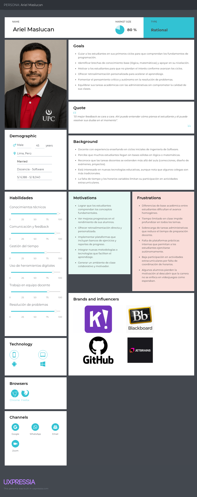
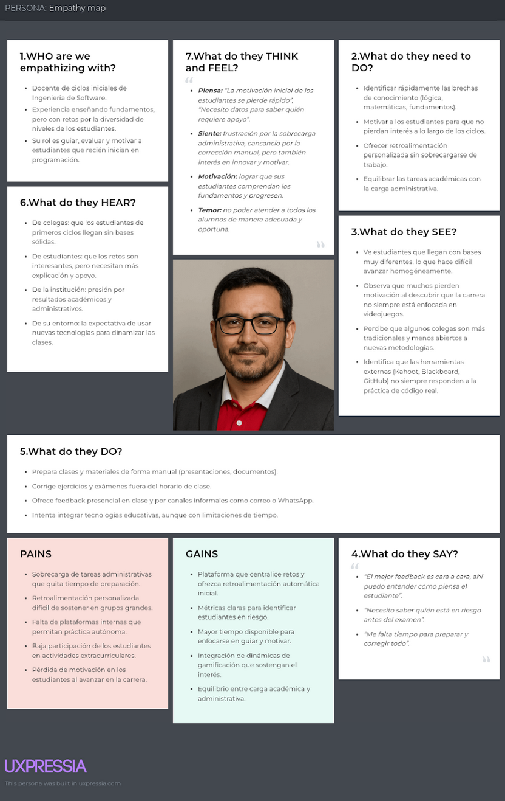
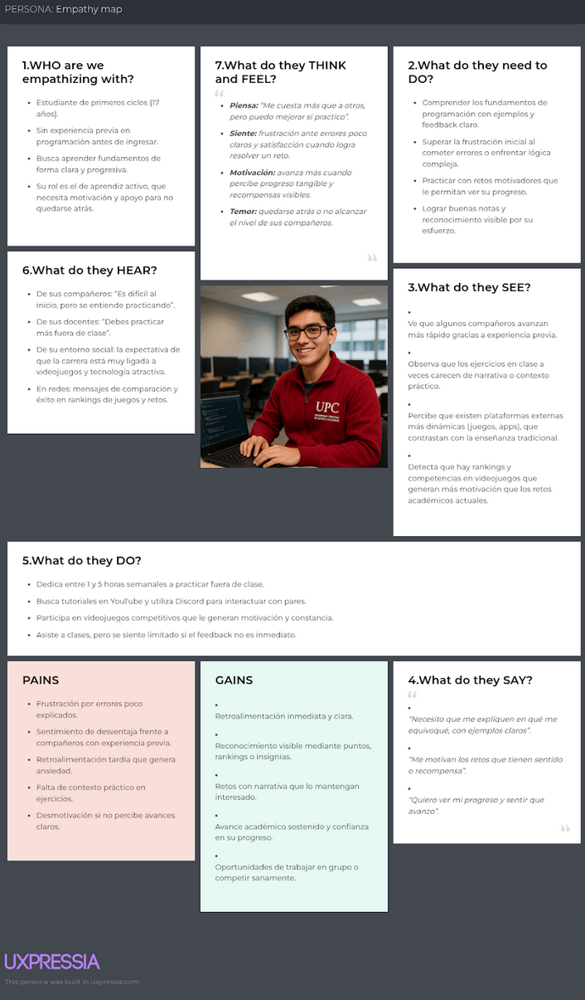

# Capítulo II: Requirements Development and Software Solution Design
## 2.1. Competidores

Competidor 1: **Google Classroom**

Google Classroom fue lanzado en agosto de 2014 como parte del ecosistema educativo de Google Workspace. Su objetivo principal es facilitar la gestión de tareas, la comunicación académica y la distribución de materiales en cursos escolares y universitarios. Opera bajo un modelo gratuito para instituciones educativas, ofreciendo funciones avanzadas mediante Google Workspace for Education Plus. Su nivel de competencia con LevelUp Journey es **directo**, ya que integra un sistema de anuncios, comentarios, notificaciones y un flujo centralizado de comunicados entre docentes y estudiantes. Aunque no adopta un formato de chat, cumple un rol similar: ser un canal oficial para transmitir información académica de forma ordenada.

 
 

Competidor 2: **Microsoft Teams para Educación**

Microsoft Teams, lanzado en 2017, se consolidó como herramienta institucional durante la expansión del trabajo remoto. En su versión para educación, integra clases virtuales, canales de comunicación, avisos, chats, repositorios de archivos y tareas. Opera bajo un modelo freemium ligado a suscripciones de Microsoft 365. La competencia es **directa**, ya que incluye canales de anuncios, notificaciones y comunicación estructurada entre docentes y estudiantes. Sin embargo, su diseño está orientado a trabajo colaborativo general y no exclusivamente a centralizar anuncios académicos de forma simplificada.

 
 

Competidor 3: **Moodle (App Oficial)**

Moodle, creado en 2002 y con aplicación móvil desde 2013, es una plataforma ampliamente utilizada por universidades para administrar cursos. Funciona en un modelo open-source, permitiendo a las instituciones personalizar su propio LMS. La app de Moodle incluye anuncios, mensajes, foros, notificaciones push y seguimiento básico del estudiante. Su competencia con LevelUp Journey es **directa parcial**, ya que gestiona comunicación académica, pero su uso suele ser complejo, orientado a múltiples herramientas y no específicamente a anuncios rápidos en formato chat.

 
 

### 2.1.1. Análisis competitivo

### 2.1.2. Estrategias y tácticas frente a competidores

Competitive analysis landscape

| Categoría                                 | Detalle                                                      |
| ----------------------------------------- | ------------------------------------------------------------ |
| **¿Por qué llevar a cabo este análisis?** | El objetivo de este análisis es comparar y encontrar fortalezas y debilidades frente a competidores directamente relacionados con nuestro producto, para así desarrollar estrategias y tácticas frente a ellos y crecer en el mercado objetivo. |

Competidores

| Categorías Competidores | Level Up Journey 
 
  | Google Classroom 
 
  | Microsoft Teams Educación 
 
  | Moodle App 
 
  |
| ----------------------- | ------------------------------------------------------------ | ------------------------------------------------------------ | ------------------------------------------------------------ | ------------------------------------------------------------ |

Perfil

| Subcategoría            | Level Up Journey                                             | Google Classroom                                             | Microsoft Teams Educación                                    | Moodle App                                                   |
| ----------------------- | ------------------------------------------------------------ | ------------------------------------------------------------ | ------------------------------------------------------------ | ------------------------------------------------------------ |
| **Overview**            | Plataforma universitaria centrada en anuncios académicos en formato chat, con reacciones, notificaciones y priorización informativa. | LMS global para gestionar cursos, tareas y anuncios institucionales. | Plataforma de comunicación institucional con canales, mensajes, videollamadas y anuncios. | LMS open-source ampliamente usado por universidades.         |
| **Ventaja competitiva** | Comunicación académica centralizada y simple; formato chat; enfoque exclusivo en primeros ciclos. | Ecosistema Google integrado; gratuito; alta adopción mundial. | Integración completa con Microsoft 365 y herramientas de colaboración. | Personalización total; flexibilidad; fuerte soporte comunitario. |

Perfil de Marketing

| Subcategoría                 | Level Up Journey                                             | Google Classroom                                    | Microsoft Teams Educación                                    | Moodle App                                                   |
| ---------------------------- | ------------------------------------------------------------ | --------------------------------------------------- | ------------------------------------------------------------ | ------------------------------------------------------------ |
| **Estrategias de marketing** | Implementación institucional en cursos iniciales; difusión interna; adopción rápida por claridad informativa. | Modelo freemium masivo; viralidad educativa global. | Integración institucional con Office 365; marketing educativo. | Promoción desde comunidad open-source y adopción universitaria. |
| **Mercado objetivo**         | Estudiantes de primeros ciclos y docentes con necesidad de comunicación clara. | Instituciones educativas globales.                  | Universidades, colegios y organizaciones.                    | Universidades, institutos y centros de formación.            |
| **Productos & Servicio**     | Plataforma de anuncios académicos tipo chat.                 | Gestión de cursos, tareas y anuncios.               | Canales, mensajes, videollamadas, actividades.               | Cursos, foros, archivos, anuncios, mensajería interna.       |

Perfil de Producto

| Subcategoría                | Level Up Journey                                     | Google Classroom                                  | Microsoft Teams Educación         | Moodle App                                 |
| --------------------------- | ---------------------------------------------------- | ------------------------------------------------- | --------------------------------- | ------------------------------------------ |
| **Precios & Costos**        | Piloto gratuito en UPC; modelo institucional futuro. | Gratuito para instituciones con opciones premium. | Incluido en planes Microsoft 365. | Gratuito (open-source); costos de hosting. |
| **Canales de distribución** | Web y móvil.                                         | Web y móvil.                                      | Web y móvil.                      | Web y móvil.                               |
| **(Web y/o Móvil)**         | Web y Móvil                                          | Web y Móvil                                       | Web y Móvil                       | Web y Móvil                                |

Análisis SWOT

| Subcategoría      | Level Up Journey                                             | Google Classroom                                             | Microsoft Teams Educación                    | Moodle App                                          |
| ----------------- | ------------------------------------------------------------ | ------------------------------------------------------------ | -------------------------------------------- | --------------------------------------------------- |
| **Fortalezas**    | Enfoque exclusivo en comunicación académica; simplicidad; formato chat. | Marca global consolidada; estabilidad; confianza.            | Integración robusta con Microsoft 365.       | Flexibilidad, personalización, comunidad global.    |
| **Debilidades**   | Producto nuevo; adopción inicial limitada; dependencia institucional. | No es especializado en primeros ciclos; interfaz no tipo chat. | Puede ser complejo; sobrecarga de funciones. | Interfaz menos intuitiva; requiere personalización. |
| **Oportunidades** | Escalar a toda la universidad; integración futura con analíticas. | Crecimiento global; integración con IA.                      | Expansión en educación híbrida.              | Mayor adopción en universidades latinoamericanas.   |
| **Amenazas**      | Competencia de plataformas consolidadas; preferencia estudiantil por chats informales. | Saturación del mercado educativo.                            | Competencia de canales más simples.          | Aparición de LMS más modernos.                      |

## 2.2. Entrevistas
### 2.2.1. Diseño de entrevistas

En esta sección se identifica la información necesaria para comprender de manera profunda a los segmentos objetivo previamente definidos. El propósito es obtener datos que permitan validar los supuestos del producto, comprender hábitos de comunicación académica, detectar problemas reales con los canales actuales y evaluar la disposición de los usuarios para adoptar una plataforma centralizada de anuncios.

Para el primer segmento objetivo, conformado por estudiantes de primero a tercer ciclo de diversas carreras, se elaboró un formulario en Google Forms con preguntas orientadas a explorar cómo reciben actualmente los anuncios académicos, qué canales utilizan con mayor frecuencia, qué dificultades experimentan al intentar mantenerse informados y qué características valorizan en un sistema de comunicación. Este formulario fue distribuido entre estudiantes de ciclos iniciales y servirá como base para el análisis cuantitativo del comportamiento informativo. Además, se realizaron dos entrevistas presenciales a estudiantes de este grupo, enfocadas en profundizar en su experiencia real con los canales de comunicación, su nivel de saturación informativa y su percepción sobre la necesidad de un sistema centralizado. Las entrevistas fueron grabadas para su posterior revisión con el fin de contrastar hallazgos cualitativos y cuantitativos.

Enlace al formulario: https://forms.gle/czpVxtTDRwnce7bS6

Para el segundo segmento objetivo, conformado por profesores que dictan cursos de primeros ciclos, no se utilizó un formulario estructurado. En su lugar, se realizaron dos entrevistas individuales a docentes de la Universidad Peruana de Ciencias Aplicadas (UPC). Estas entrevistas proporcionaron información cualitativa sobre los retos de comunicación en el aula, las dificultades que enfrentan los estudiantes para seguir anuncios importantes, la efectividad de los canales actuales y la percepción de los docentes respecto a una plataforma que centralice y ordene la información. Los docentes también brindaron información sobre su experiencia enviando anuncios por distintos medios y sobre la viabilidad de adoptar un sistema institucional que les permita difundir comunicados de manera más eficiente.

- Formulario para Estudiantes de primero a tercer ciclo
  
  Las preguntas del formulario fueron rediseñadas para alinearse con la problemática de **organización informativa**, dispersión de anuncios, saturación de chats y necesidad de un canal centralizado. Las preguntas son las siguientes:
  
  1. ¿En qué canales recibes con mayor frecuencia anuncios académicos de tus cursos?
  2. ¿Con qué frecuencia se te pierden comunicados importantes entre mensajes personales?
  3. ¿Qué tan útil te sería contar con un único canal centralizado para recibir anuncios académicos?
  4. ¿Qué tipo de anuncios te gustaría poder filtrar o clasificar (tareas, exámenes, avisos urgentes, eventos, recordatorios)?
  5. ¿Con qué frecuencia revisas tu correo institucional Outlook?
  6. ¿Con qué frecuencia dependes del delegado del curso para enterarte de anuncios importantes?
  7. ¿Qué tan fácil te resulta identificar qué anuncios son urgentes cuando recibes muchos mensajes?
  8. ¿Qué tipo de notificaciones te ayudarían a organizar mejor tus tareas y actividades académicas?
  9. ¿Qué tan dispuesto(a) estarías a utilizar un sistema tipo chat ordenado, sin mensajes personales?
  10. ¿Qué tan útil sería poder reaccionar a los anuncios (por ejemplo: visto, me interesa, asistiré)?
  11. ¿Con qué frecuencia revisas anuncios antiguos que no encuentras rápidamente en los chats?
  12. ¿Preferirías recibir los anuncios en un formato tipo chat o en un dashboard tradicional?
  
  
  
- Formulario para Profesores de primero a tercer ciclo
  
  Las preguntas para docentes fueron replanteadas para evaluar su experiencia enviando anuncios, los problemas de comunicación actuales y sus necesidades reales en relación con un canal centralizado:
  
  1. ¿Qué tan efectiva consideras la comunicación actual con tus estudiantes respecto a anuncios y recordatorios?
  
  2. ¿Qué canales utilizas para enviar comunicados (WhatsApp, Classroom, Teams, Moodle, correo institucional)?
  
  3. ¿Qué dificultades encuentras al difundir información académica por varios canales?
  
  4. ¿Qué tan frecuente es que tus estudiantes olviden o no lean los anuncios importantes?
  
  5. ¿Qué tipo de anuncios envías con mayor frecuencia (tareas, recordatorios, evaluaciones, eventos)?
  
  6. ¿Qué funcionalidades te resultan más valiosas en un sistema centralizado de anuncios?
  
  7. ¿Qué indicadores te gustaría monitorear (visualizaciones, confirmaciones, reacciones, asistencia)?
  
  8. ¿Qué tan útil consideras una función que permita verificar quién leyó un anuncio?
  
  9. ¿Qué barreras identificas para adoptar una plataforma institucional única para la comunicación?
  
  10. ¿Qué tan dispuesto(a) estarías a reemplazar los grupos de WhatsApp por un sistema institucional más ordenado?
  
      

### 2.2.2. Registro de entrevistas

En este apartado se documenta el proceso de recopilación de información mediante entrevistas realizadas a los distintos segmentos objetivo. El propósito es registrar el perfil de los entrevistados, los principales comentarios obtenidos y los hallazgos más relevantes que permitan comprender a fondo los problemas de comunicación académica que enfrentan los estudiantes y docentes en los primeros ciclos universitarios.

La recolección de información se centró en entrevistas presenciales a estudiantes de los primeros ciclos de la Universidad Peruana de Ciencias Aplicadas (UPC). Estas entrevistas fueron grabadas y permitieron obtener testimonios directos sobre la forma en que los estudiantes reciben anuncios académicos, los canales que utilizan actualmente, las dificultades que experimentan para mantenerse informados y su percepción frente a la saturación de mensajes en chats personales. Asimismo, se exploraron sus expectativas respecto a un sistema centralizado que organice los comunicados de manera clara, priorizada y accesible.

De manera complementaria, se realizaron entrevistas individuales a docentes encargados de cursos de primeros ciclos en la UPC. Estas conversaciones permitieron identificar retos importantes en la comunicación hacia los estudiantes, tales como la difusión de mensajes por múltiples canales, la falta de control sobre los grupos administrados por los alumnos, la baja lectura del correo institucional y la incertidumbre sobre si los anuncios fueron realmente recibidos y comprendidos. Los docentes también brindaron información valiosa sobre la necesidad de contar con métricas de alcance y confirmación, así como sobre la importancia de utilizar un canal institucional único y ordenado para mejorar la claridad informativa del curso.

La integración de la perspectiva estudiantil y docente permitió comprender de manera precisa el problema central: la ausencia de un sistema institucional que centralice y ordene los anuncios académicos, reduzca la dispersión en canales informales y asegure que los estudiantes reciban información esencial durante los primeros ciclos, etapa clave para su adaptación y permanencia universitaria.

**Segmento objetivo #1: Estudiantes de primero a tercer ciclo**

| Segmento objetivo #1:                                        | Estudiantes de primero a tercer ciclo                        |
| ------------------------------------------------------------ | ------------------------------------------------------------ |
| **Entrevista 1:** Entrevista a Rojas Hinostroza, Peter Ivan Anibal |               |
| **Sexo:** Masculino                                          | **Edad:** 21                                                 |
| **Inicio de entrevista:** 0:01                               | **Final de entrevista:** 3:51                                |
| **Duración:** 3:50                                           |                                                              |
| **URL:**                                                     | [upc-pre-202501-2520-1827-LevelUpJourney-needfinding-sprint-1](https://acortar.link/gShiWj) |
| **Resumen:**                                                 | Durante la entrevista, Peter comentó que recibe la mayoría de los anuncios académicos a través de grupos de WhatsApp administrados por estudiantes, lo que le genera dificultades para distinguir mensajes importantes entre conversaciones personales. Indicó que en varias ocasiones ha perdido avisos de tareas o recordatorios debido a la saturación del chat y la falta de un canal claro para comunicados oficiales. Señaló que revisa poco su correo institucional y depende del delegado del curso para mantenerse al día. Expresó interés en contar con una plataforma centralizada donde solo se publiquen anuncios académicos filtrados y ordenados, permitiéndole ver la información sin distracciones. Mencionó que valora recibir notificaciones claras y la posibilidad de reaccionar o confirmar que leyó un comunicado. |

| Segmento objetivo #1:                                  | Estudiantes de primero a tercer ciclo                        |
| ------------------------------------------------------ | ------------------------------------------------------------ |
| **Entrevista 2:** Entrevista a Herrera Ambrosio, Lenin |               |
| **Sexo:** Masculino                                    | **Edad:** 18                                                 |
| **Inicio de entrevista:** 3:52                         | **Final de entrevista:** 8:10                                |
| **Duración:** 4:18                                     |                                                              |
| **URL:**                                               | [upc-pre-202501-2520-1827-LevelUpJourney-needfinding-sprint-1](https://acortar.link/gShiWj) |
| **Resumen:**                                           | Lenin indicó que recibe la mayoría de los anuncios académicos a través de grupos de WhatsApp administrados por estudiantes, y mencionó que con frecuencia los mensajes importantes se pierden entre conversaciones personales. Señaló que no revisa su correo institucional con regularidad y depende del delegado para enterarse de recordatorios o cambios en el curso. Comentó que varios docentes publican anuncios en diferentes plataformas, lo que provoca confusión sobre dónde consultar información oficial. Expresó que le gustaría un sistema donde los avisos estuvieran organizados por prioridad y que pueda verlos sin ruido de mensajes. También valoraría poder reaccionar a los anuncios para indicar si asistirá a una actividad o si leyó el mensaje. Considera útil que exista un historial claro para buscar comunicados pasados sin tener que revisar todo un chat personal. Manifestó disposición a usar un canal centralizado institucional si le permite ahorrar tiempo y evitar perder información importante. |

| Segmento objetivo #1:                                        | Estudiantes de primero a tercer ciclo                        |
| ------------------------------------------------------------ | ------------------------------------------------------------ |
| **Entrevista 3:** Entrevista a Merino Vilca, Cristian Anthony |               |
| **Sexo:** Masculino                                          | **Edad:** 17                                                 |
| **Inicio de entrevista:** 8:11                               | **Final de entrevista:** 12:40                               |
| **Duración:** 4:29                                           |                                                              |
| **URL:**                                                     | [upc-pre-202501-2520-1827-LevelUpJourney-needfinding-sprint-1](https://acortar.link/gShiWj) |
| **Resumen:**                                                 | Cristian comentó que recibe anuncios académicos por diversos medios como WhatsApp, Classroom y correos institucionales, pero considera que la información queda desordenada debido a la cantidad de mensajes que llegan por los chats del curso. Señaló que en varias ocasiones no ha visto avisos importantes porque se mezclan con conversaciones sociales o memes enviados por otros compañeros. Explicó que revisa su correo institucional solo cuando se lo solicitan, y que muchas veces se entera de información relevante tarde debido a la falta de un canal oficial unificado. Expresó la necesidad de contar con un sistema más estructurado donde únicamente se publiquen comunicados formales y donde pueda ver claramente qué es urgente y qué puede revisar más tarde. Indicó que le gustaría tener reacciones rápidas en los anuncios para confirmar lectura o mostrar interés, y valoraría una función para buscar anuncios antiguos sin necesidad de revisar chats extensos. Se mostró totalmente dispuesto a utilizar un canal único institucional que elimine la dependencia del delegado y reduzca la dispersión de anuncios entre varias plataformas. |

**Segmento objetivo #2: Profesores de primero a tercer ciclo**

| Segmento objetivo #2:                               | Profesores de primero a tercer ciclo                         |
| --------------------------------------------------- | ------------------------------------------------------------ |
| **Entrevista 1:** Entrevista a Ernesto Ocampo Tello |              |
| **Sexo:** Masculino                                 | **Edad:** 51                                                 |
| **Inicio de entrevista:** 0:01                      | **Final de entrevista:** 9:37                                |
| **Duración:** 9:36                                  |                                                              |
| **URL:**                                            | [upc-pre-202501-2520-1827-LevelUpJourney-needfinding-sprint-1](https://acortar.link/bM7Ffr) |
| **Resumen:**                                        | Durante la entrevista, el profesor Ernesto explicó que uno de los principales problemas en los primeros ciclos es la dispersión de información académica en diversos canales como WhatsApp, Classroom, Teams y correos institucionales. Señaló que muchos estudiantes no revisan los anuncios importantes porque los mensajes se mezclan con conversaciones informales en los grupos del curso. Indicó que la dependencia del delegado para la difusión de avisos genera retrasos, confusiones o pérdidas de información. También mencionó que los estudiantes suelen pedir aclaraciones sobre anuncios que ya fueron enviados, lo que incrementa la carga de comunicación docente. Expresó que un canal institucional único, ordenado y libre de mensajes sociales permitiría una comunicación más eficiente y reduciría la necesidad de repetir información. Considera valioso contar con métricas de lectura y confirmación, ya que los docentes necesitan verificar el alcance real de los comunicados. Además, destacó que tener categorías de anuncios y notificaciones priorizadas ayudaría a que los estudiantes identifiquen lo urgente sin depender de múltiples plataformas. Señaló que la principal barrera para los estudiantes es la falta de hábito para revisar canales oficiales, y que una herramienta simple, tipo chat y enfocada exclusivamente en anuncios, aumentaría la probabilidad de uso. Finalmente, mostró disposición a adoptar una plataforma institucional de comunicación siempre que reduzca la duplicidad de mensajes y facilite el seguimiento del curso. |

| Segmento objetivo #2:                                      | Profesores de primero a tercer ciclo                         |
| ---------------------------------------------------------- | ------------------------------------------------------------ |
| **Entrevista 2:** Entrevista a Juan Carlos Morales Arévalo |              |
| **Sexo:** Masculino                                        | **Edad:** 47                                                 |
| **Inicio de entrevista:** 9:38                             | **Final de entrevista:** 26:53                               |
| **Duración:** 17:15                                        |                                                              |
| **URL:**                                                   | [upc-pre-202501-2520-1827-LevelUpJourney-needfinding-sprint-1](https://acortar.link/bM7Ffr) |
| **Resumen:**                                               | El profesor Juan Carlos señaló que uno de los retos recurrentes en los primeros ciclos es la desorganización en la comunicación académica, ya que los estudiantes reciben anuncios por distintos medios como WhatsApp, Teams, Classroom y correos institucionales. Explicó que esta multiplicidad de canales genera confusión e incrementa las consultas repetidas, pues los estudiantes no recuerdan en qué plataforma se publicó cada aviso. Indicó que muchos alumnos dependen del delegado para reenviar información, lo que produce demoras o pérdidas de comunicados cuando el delegado no está disponible. Comentó que, aunque los estudiantes suelen iniciar motivados, la falta de claridad informativa provoca estrés en periodos de alta carga académica. Señaló que sería de gran utilidad contar con un canal único y oficial donde solo se publiquen anuncios formales, evitando el ruido de los chats sociales. Además, destacó la importancia de que los docentes puedan verificar quién leyó los anuncios, ya que esto permitiría asegurar un seguimiento adecuado y reduciría la repetición innecesaria de instrucciones. Propuso que la plataforma incluya categorías de anuncios, recordatorios automáticos y notificaciones visibles para que los estudiantes prioricen actividades urgentes. También mencionó que algunos docentes podrían m |

| Segmento objetivo #2:                                  | Profesores de primero a tercer ciclo                         |
| ------------------------------------------------------ | ------------------------------------------------------------ |
| **Entrevista 3:** Entrevista a Paty Janet Uceda Martos |              |
| **Sexo:** Femenino                                     | **Edad:** 45                                                 |
| **Inicio de entrevista:** 26:54                        | **Final de entrevista:** 47:02                               |
| **Duración:** 20:08                                    |                                                              |
| **URL:**                                               | [upc-pre-202501-2520-1827-LevelUpJourney-needfinding-sprint-1](https://acortar.link/bM7Ffr) |
| **Resumen:**                                           | La profesora Paty señaló que uno de los principales problemas en los primeros ciclos es la dificultad de los estudiantes para mantenerse informados debido a la dispersión de anuncios en múltiples canales. Explicó que los alumnos reciben información por WhatsApp, Classroom, Teams y correo institucional, lo que provoca confusión y pérdida de avisos importantes. Comentó que muchos estudiantes no revisan el correo electrónico con frecuencia y dependen exclusivamente del delegado, quien a veces reenvía los mensajes tarde o incompletos. Indicó que, al no contar con un canal único para anuncios, los estudiantes constantemente preguntan por información que ya ha sido enviada, lo que genera sobrecarga comunicacional para los docentes. Señaló que la falta de hábitos organizativos y de lectura influye en que muchos alumnos no logren distinguir mensajes urgentes entre conversaciones cotidianas del chat. Considera fundamental que exista una plataforma institucional donde solo se publiquen anuncios formales, sin distracciones, con categorías claras y notificaciones priorizadas. Destacó que sería muy útil visualizar quién ha leído cada anuncio o ha reaccionado, pues permitiría asegurar que todos están al tanto de las instrucciones y reduciría la repetición de mensajes. Sugirió que la plataforma incluya recordatorios automáticos para fechas importantes. Finalmente, expresó completa disposición a adoptar una herramienta de comunicación centralizada siempre que simplifique la gestión docente y mejore la claridad informativa para los estudiantes. |

### 2.2.3. Análisis de entrevistas

En este apartado se documenta de manera estructurada cada una de las entrevistas realizadas a los segmentos objetivo definidos para la investigación. Para cada entrevista se consigna el perfil del entrevistado, el registro de sus respuestas, observaciones contextuales y un resumen analítico de los principales hallazgos identificados.

Las entrevistas permitieron identificar patrones consistentes en los dos segmentos priorizados: estudiantes de primero a tercer ciclo y docentes que imparten cursos en estos niveles. El proceso contempló la transcripción y organización de las respuestas, la codificación temática de los comentarios y la comparación sistemática entre los testimonios de los distintos participantes. Esto permitió comprender cómo experimentan los estudiantes la dispersión informativa en múltiples canales y cómo los docentes enfrentan dificultades para difundir anuncios de manera clara, oportuna y centralizada.

La triangulación entre perspectivas estudiantiles y docentes fortaleció la validez de los hallazgos, facilitando la identificación de las principales barreras en la comunicación académica, las causas de la pérdida de anuncios importantes, el grado de dependencia del delegado, y las consecuencias que la desorganización informativa tiene en el rendimiento y adaptación universitaria. Asimismo, se analizaron las expectativas y necesidades expresadas por los docentes en relación con un canal institucional único que reduzca la duplicidad de mensajes y permita verificar el alcance de los comunicados.

Esta sistematización asegura la trazabilidad de la información recolectada, permitiendo que los hallazgos derivados de las entrevistas se utilicen de manera directa en la construcción de artefactos clave para el diseño del producto, tales como User Personas, Empathy Maps, Journey Maps y User Task Matrices, garantizando que las decisiones de diseño se fundamenten en evidencia real y contextualizada.

| Segmento                                                     | Características Objetivas Comunes                            | Características Subjetivas Comunes                           | Insights                                                     |
| ------------------------------------------------------------ | ------------------------------------------------------------ | ------------------------------------------------------------ | ------------------------------------------------------------ |
| **Segmento objetivo #1: Estudiantes de primero a tercer ciclo** | - Sexo: Mayoritariamente masculino, aunque también participan mujeres.  - Edad: Entre 17 y 21 años.  - Dispositivos: Laptop con Windows, smartphone Android/iPhone.  - Conocimientos previos: Limitados en temas académicos universitarios; uso frecuente de herramientas digitales básicas.  - Canales de información actuales: WhatsApp, Telegram, Classroom, Teams, redes sociales y chats informales.  - Contexto académico: Etapa de adaptación del colegio a la universidad; alta carga de cursos introductorios; dependencia del delegado. | - **Motivación:** Mantenerse informados sin saturarse, acceder a anuncios claros y organizados, recibir recordatorios oportunos, distinguir fácilmente lo urgente, y evitar perder tareas o avisos importantes. Buscan simplicidad, rapidez y orden en la comunicación académica.  - **Frustración:** Pierden información entre chats saturados, no revisan el correo institucional, se confunden al recibir comunicados por múltiples plataformas, dependen del delegado y sienten ansiedad cuando reciben demasiados mensajes mezclados con conversaciones sociales. | - **Desorden informativo como mayor fuente de estrés** Los estudiantes se sienten abrumados por la mezcla de mensajes personales y académicos en WhatsApp, lo que genera pérdida de información relevante.  - **Necesidad de un canal único y oficial** Existe una demanda fuerte por contar con un espacio exclusivo donde se publiquen únicamente anuncios formales, sin ruido ni distracciones.  - **Notificaciones priorizadas = mayor tranquilidad** Los estudiantes quieren alertas claras que indiquen cuándo un anuncio es urgente o próximo a vencer.  - **Búsqueda rápida es esencial** Les cuesta revisar chats extensos; necesitan encontrar anuncios anteriores sin esfuerzo.  - **Reacciones como mecanismo simple de interacción** Desean confirmar lectura o interés sin tener que escribir mensajes, para reducir ruido y aumentar orden.  - **Evitan plataformas complejas** Prefieren herramientas simples estilo chat, no dashboards pesados que demanden más tiempo. |
| **Segmento objetivo #2: Profesores de primero a tercer ciclo** | - Sexo: Masculino y femenino.  - Edad: Entre 45 y 51 años.  - Experiencia docente: Dictan cursos introductorios donde la comunicación constante es crítica (Fundamentos, Lógica, IHC, BD, Móviles, entre otros).  - Canales usados actualmente: Blackboard, Classroom, Teams, WhatsApp, correo institucional.  - Prácticas de comunicación: Reenvío de avisos, delegación de mensajes, uso de anuncios en Classroom y Teams, envío repetido por diferentes canales.  - Contexto laboral: Alta carga administrativa, corrección constante, poco tiempo para gestión de comunicación adicional. | - **Motivación:** Garantizar que los estudiantes reciban y comprendan los avisos; reducir la duplicidad de mensajes; simplificar la coordinación del curso; obtener confirmaciones de lectura; y evitar consultas repetitivas. Valoran herramientas institucionales simples, estables y centralizadas.  - **Frustración:** Los estudiantes no revisan el correo, ignoran los anuncios formales, se confunden por usar demasiados canales, y dependen demasiado del delegado. La falta de trazabilidad obliga a repetir información y genera pérdida de tiempo. | - **Multicanalidad = confusión constante** Los docentes ven cómo WhatsApp, Classroom, Teams y el correo institucional generan mensajes dispersos, ocasionando confusión y reiteración de instrucciones.  - **Delegado no es una solución sostenible** Dependencia excesiva del delegado incompleta o distorsiona los mensajes, generando problemas de coordinación en clase.  - **Necesidad urgente de trazabilidad** Los docentes necesitan saber quién leyó un anuncio y cuándo, para evitar repetir información y monitorear el compromiso del grupo.  - **Centralización ahorra tiempo docente** Un canal único eliminaría la doble o triple publicación de anuncios en diferentes plataformas.  - **Clasificación y priorización son críticas** Los profesores requieren que los anuncios tengan categorías claras para que los estudiantes identifiquen lo urgente sin confusiones.  - **Infraestructura simple favorece adopción** Los docentes están dispuestos a usar una nueva plataforma si esta reduce la carga comunicacional y mejora la organización del curso. |

## 2.3. Needfinding
### 2.3.1. User Personas

En esta sección se construyeron perfiles representativos denominados *User Personas*, elaborados a partir del análisis cualitativo de las entrevistas realizadas a estudiantes y docentes de primeros ciclos de la Universidad Peruana de Ciencias Aplicadas (UPC). Cada User Persona sintetiza patrones comunes identificados en los segmentos objetivo e incluye aspectos como datos sociodemográficos, motivaciones, frustraciones, objetivos, comportamientos digitales y relación con los canales de comunicación académica.

El propósito de estos arquetipos es orientar el diseño centrado en el usuario, permitiendo comprender las necesidades reales del público y guiando decisiones estratégicas sobre funcionalidades, usabilidad, experiencia visual y tono comunicacional de **LevelUp Journey**. Para esta investigación se desarrollaron dos perfiles principal

**Segmento objetivo #1:Estudiantes de primero a tercer ciclo**

**Segmento objetivo #2: Profesores de primero a tercer ciclo**

### 2.3.2. User Task Matrix

A continuación se presenta el User Task Matrix, construido a partir de las entrevistas realizadas a los dos segmentos definidos: Profesores y Estudiantes

**Segmento objetivo #1: Estudiantes de primero a tercer ciclo**

| **N°** | **Tarea**                                                    | **Frecuencia** | **Importancia** | **Justificación / Observación**                              |
| ------ | ------------------------------------------------------------ | -------------- | --------------- | ------------------------------------------------------------ |
| 1      | Revisar el canal principal de anuncios en formato chat       | Often          | High            | Es el medio principal para enterarse de información académica sin distracciones. |
| 2      | Leer anuncios nuevos y entender su prioridad (urgente / general) | Often          | High            | Permite organizar tareas y actividades según su nivel de urgencia. |
| 3      | Reaccionar a un anuncio (ej. “Visto”, “Asistiré”, “Me interesa”) | Often          | High            | Reduce el ruido en los chats y permite confirmar lectura sin enviar mensajes adicionales. |
| 4      | Recibir y gestionar notificaciones importantes               | Often          | High            | Ayuda a evitar la pérdida de información crítica en momentos de alta carga académica. |
| 5      | Buscar anuncios antiguos mediante filtros o historial        | Sometimes      | High            | Es esencial cuando necesitan recuperar información que se perdió entre conversaciones. |
| 6      | Filtrar anuncios por categorías (ej. tareas, recordatorios, exámenes) | Sometimes      | Medium          | Facilita la comprensión del flujo académico, pero no se usa de forma diaria. |
| 7      | Ver anuncios fijados o destacados                            | Often          | Medium          | Sirve para ubicar rápidamente información prioritaria o vigente durante la semana. |
| 8      | Consultar recordatorios automáticos (plazos, fechas importantes) | Sometimes      | Medium          | Refuerza hábitos organizativos en estudiantes que dependen del delegado. |
| 9      | Actualizar su perfil básico (foto, nombre, ciclo)            | Rare           | Low             | Actividad necesaria ocasionalmente, pero no influye en la comunicación diaria. |

**Segmento objetivo #2: Profesores de primero a tercer ciclo**

| **N°** | **Tarea**                                                    | **Frecuencia** | **Importancia** | **Justificación / Observación**                              |
| ------ | ------------------------------------------------------------ | -------------- | --------------- | ------------------------------------------------------------ |
| 1      | Publicar anuncios académicos (tareas, recordatorios, avisos urgentes) | Often          | High            | Es su principal acción en la plataforma y reemplaza el uso de múltiples canales. |
| 2      | Clasificar y etiquetar anuncios (ej. “Examen”, “Recordatorio”, “Aviso”) | Often          | High            | Permite que los estudiantes identifiquen la importancia y tipo de comunicado. |
| 3      | Fijar anuncios importantes para toda la clase                | Sometimes      | High            | Garantiza que la información crítica se mantenga visible.    |
| 4      | Revisar quién leyó o reaccionó a cada anuncio                | Often          | High            | Permite monitorear alcance y evitar repetir mensajes innecesariamente. |
| 5      | Enviar recordatorios automáticos o programados               | Sometimes      | Medium          | Facilita la gestión docente en semanas de alta carga.        |
| 6      | Responder consultas breves mediante reacciones o aclaraciones estructuradas | Sometimes      | Medium          | Reduce confusión y mantiene orden sin generar conversaciones extensas. |
| 7      | Ver historial de anuncios enviados                           | Sometimes      | Medium          | Útil para verificar coherencia y evitar duplicados entre semanas. |
| 8      | Gestionar categorías o grupos de curso                       | Rare           | Medium          | Actividad de configuración inicial más que una tarea diaria. |
| 9      | Supervisar tendencias de lectura o nivel de atención del grupo | Sometimes      | Medium          | Ayuda a identificar estudiantes que podrían necesitar apoyo temprano. |

El análisis del *User Task Matrix* permite identificar las tareas que presentan simultáneamente **alta frecuencia** y **alta importancia** dentro del uso previsto de *LevelUp Journey*. Estas tareas son cruciales para garantizar una comunicación académica clara, ordenada y accesible para estudiantes y docentes en los primeros ciclos.

### **Para estudiantes**

- **Revisar el canal principal de anuncios en formato chat**
   Es la actividad esencial que realizan múltiples veces al día para mantenerse informados sin depender de chats saturados o del delegado.
- **Leer anuncios nuevos y comprender su nivel de prioridad (urgente / general)**
   Esta acción determina su capacidad para organizar tareas, identificar recordatorios importantes y actuar a tiempo ante avisos críticos.
- **Recibir y gestionar notificaciones importantes**
   Permite que no se pierda información relevante durante semanas de exámenes o alta carga académica, reduciendo ansiedad y confusión.
- **Reaccionar a los anuncios para confirmar lectura o interés**
   Facilita la interacción sin generar ruido en los chats, permitiendo una comunicación más ordenada y eficiente.

### **Para profesores**

- **Publicar anuncios académicos esenciales (tareas, recordatorios, avisos urgentes)**
   Es la tarea central del docente en la plataforma y reemplaza el uso disperso de múltiples canales externos.
- **Clasificar y etiquetar anuncios según su naturaleza**
   Garantiza que los estudiantes comprendan rápidamente qué es urgente, qué es informativo y qué está asociado a fechas importantes.
- **Revisar quién leyó o reaccionó a cada anuncio**
   Permite monitorear el alcance real de los comunicados, identificar estudiantes que podrían necesitar apoyo y evitar repetir información innecesariamente.
- **Fijar anuncios importantes para mantenerlos visibles**
   Facilita que los alumnos no pierdan de vista información crítica durante la sem

### 2.3.3. User Journey Mapping
### 2.3.4. Empathy Mapping

**Segmento objetivo #1: Estudiantes de primero a tercer ciclo**

**Segmento objetivo #2: Profesores de primero a tercer ciclo**

### 2.3.5. Ubiquitous Language

| Termino | Definicion |
| --- | --- |
| Usuario | Identidad base con userID (UUID), profileID (UUID externo), username, rol global y URLs de perfil/banner; sirve como autor de posts, propietario de comunidades y origen de reacciones. |
| Rol global | Nivel de permiso general (`student` por defecto, `teacher`, `admin`; existen `member` y `owner` por compatibilidad). Solo `teacher` y `admin` pueden crear comunidades. |
| Perfil (profileID) | Identificador de perfil externo ligado al usuario; se usa para verificar si alguien es propietario de una comunidad al gestionar suscripciones o permisos. |
| Comunidad | Espacio tematico con ownerID, nombre, descripcion, icono, banner y bandera `isPrivate`; solo el propietario puede actualizar info, privacidad o eliminarla. |
| Propietario de comunidad | Usuario que creo la comunidad; no puede desuscribirse de ella y es la maxima autoridad para cambios de privacidad, info y borrado. |
| Comunidad publica | Comunidad con `isPrivate=false`; cualquier usuario puede auto-suscribirse y siempre queda con rol `member`. |
| Comunidad privada | Comunidad con `isPrivate=true`; solo propietario o admins existentes pueden agregar o quitar suscripciones; la validacion compara profileID del solicitante con el ownerID. |
| Suscripcion | Relacion usuario-comunidad con subscriptionID y timestamps que otorga un rol de comunidad; no se permite duplicar suscripciones en la misma comunidad. |
| Rol de comunidad | Rol local `member`/`admin`/`owner` que define privilegios dentro de una comunidad: member publica mensajes; admin/owner pueden publicar anuncios, borrar posts y gestionar suscripciones en comunidades privadas. |
| Auto-suscripcion | Alta realizada por el propio usuario; en comunidades publicas es la unica via de entrada y asigna siempre rol `member` para evitar escalar privilegios. |
| Post o publicacion | Contenido markdown con al menos un salto de linea, opcionalmente con imagenes http/https sin duplicados; cada autor solo puede tener una publicacion activa por comunidad; se guarda con comunidadID, authorID y tipo. |
| Mensaje | Tipo de post `message`; puede ser publicado por cualquier miembro/admin/owner de la comunidad. |
| Anuncio | Tipo de post `announcement`; solo admin u owner pueden publicarlo y es el contenido que alimenta el feed de usuarios suscritos. |
| Reaccion | Marcacion de un usuario sobre un post; tipos validos `like`, `love`, `haha`, `wow`, `sad`, `angry`; si el usuario ya reacciono se actualiza el tipo en lugar de duplicar. |
| Feed de usuario | Lista paginada de anuncios provenientes de las comunidades a las que el usuario esta suscrito; se arma cruzando suscripciones y posts de tipo announcement. |
| Contador de suscripciones | Total de suscripciones de una comunidad; se expone para conocer su tamano y apoyar decisiones de permiso en los endpoints. |
