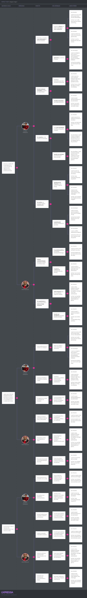

# 2.4. Requirements specification
## 2.4.1. User Stories.

  

 

<table>
  <tr>
    <th>Story ID</th>
    <th>User</th>
    <th>Priority</th>
    <th>Epic</th>
  </tr>
  <tr>
    <td>IAM-US-001</td>
    <td>Usuario</td>
    <td>Alta</td>
    <td>Como usuario nuevo, quiero registrarme con email y contraseña para acceder a la plataforma</td>
  </tr>
  <tr>
    <th colspan="4" style="color: green;">Title</th>
  </tr>
  <tr>
    <td colspan="4">Registro con validaciones y rol por defecto</td>
  </tr>
  <tr>
    <th colspan="4" style="color: green;">Description</th>
  </tr>
  <tr>
    <td colspan="4">
      Como usuario nuevo, quiero registrarme con email y contraseña para acceder a la plataforma con rol estudiante por defecto.
    </td>
  </tr>
  <tr>
    <th colspan="4" style="color: green;">Acceptance Criteria</th>
  </tr>
  <tr>
    <td colspan="4">
      <ul>
        <li>Escenario: registro exitoso</li>
        <li>Dado que proporciono un email válido (RFC 5322) y una contraseña que cumple políticas</li>
        <li>Cuando envío la solicitud de registro sin roles</li>
        <li>Entonces el sistema crea el usuario con email normalizado en minúsculas y rol <strong>ROLE_STUDENT</strong> asignado</li>
      </ul>
    </td>
  </tr>
</table>

<table>
  <tr>
    <th>Story ID</th>
    <th>User</th>
    <th>Priority</th>
    <th>Epic</th>
  </tr>
  <tr>
    <td>IAM-US-002</td>
    <td>Usuario</td>
    <td>Alta</td>
    <td>Como usuario autenticado, quiero iniciar sesión y gestionar tokens</td>
  </tr>
  <tr>
    <th colspan="4" style="color: green;">Title</th>
  </tr>
  <tr>
    <td colspan="4">Inicio de sesión (email/contraseña)</td>
  </tr>
  <tr>
    <th colspan="4" style="color: green;">Description</th>
  </tr>
  <tr>
    <td colspan="4">
      Como usuario, quiero iniciar sesión para obtener tokens y acceder a recursos protegidos.
    </td>
  </tr>
  <tr>
    <th colspan="4" style="color: green;">Acceptance Criteria</th>
  </tr>
  <tr>
    <td colspan="4">
      <ul>
        <li>Escenario: autenticación válida</li>
        <li>Dado que existe un usuario con email y contraseña correctos</li>
        <li>Cuando solicito iniciar sesión</li>
        <li>Entonces el sistema autentica con comparación segura y devuelve los datos del usuario junto con un par de tokens (acceso y actualización)</li>
      </ul>
    </td>
  </tr>
</table>
<table>
  <tr>
    <th>Story ID</th>
    <th>User</th>
    <th>Priority</th>
    <th>Epic</th>
  </tr>
  <tr>
    <td>IAM-US-003</td>
    <td>Usuario</td>
    <td>Alta</td>
    <td>Como usuario autenticado, quiero iniciar sesión y gestionar tokens</td>
  </tr>
  <tr>
    <th colspan="4" style="color: green;">Title</th>
  </tr>
  <tr>
    <td colspan="4">Rechazo por credenciales inválidas</td>
  </tr>
  <tr>
    <th colspan="4" style="color: green;">Description</th>
  </tr>
  <tr>
    <td colspan="4">
      Como usuario, quiero recibir mensajes claros si mis credenciales son inválidas para corregir el acceso.
    </td>
  </tr>
  <tr>
    <th colspan="4" style="color: green;">Acceptance Criteria</th>
  </tr>
  <tr>
    <td colspan="4">
      <ul>
        <li>Escenario: autenticación inválida</li>
        <li>Dado un email o contraseña incorrectos</li>
        <li>Cuando intento iniciar sesión</li>
        <li>Entonces el sistema rechaza la solicitud indicando credenciales inválidas</li>
      </ul>
    </td>
  </tr>
</table>

<table>
  <tr>
    <th>Story ID</th>
    <th>User</th>
    <th>Priority</th>
    <th>Epic</th>
  </tr>
  <tr>
    <td>IAM-US-004</td>
    <td>Usuario autenticado</td>
    <td>Alta</td>
    <td>Como usuario autenticado, quiero iniciar sesión y gestionar tokens</td>
  </tr>
  <tr>
    <th colspan="4" style="color: green;">Title</th>
  </tr>
  <tr>
    <td colspan="4">Renovación de token (refresh)</td>
  </tr>
  <tr>
    <th colspan="4" style="color: green;">Description</th>
  </tr>
  <tr>
    <td colspan="4">
      Como usuario, quiero renovar mi token con el refresh para mantener la sesión sin volver a autenticarme.
    </td>
  </tr>
  <tr>
    <th colspan="4" style="color: green;">Acceptance Criteria</th>
  </tr>
  <tr>
    <td colspan="4">
      <ul>
        <li>Escenario: refresh token válido</li>
        <li>Dado que poseo un token de actualización válido y no expirado</li>
        <li>Cuando solicito renovar la sesión</li>
        <li>Entonces el sistema genera y retorna nuevos tokens (acceso y actualización) reemplazando los anteriores</li>
      </ul>
    </td>
  </tr>
</table>

<table>
  <tr>
    <th>Story ID</th>
    <th>User</th>
    <th>Priority</th>
    <th>Epic</th>
  </tr>
  <tr>
    <td>IAM-US-005</td>
    <td>Usuario autenticado</td>
    <td>Alta</td>
    <td>Como usuario autenticado, quiero iniciar sesión y gestionar tokens</td>
  </tr>
  <tr>
    <th colspan="4" style="color: green;">Title</th>
  </tr>
  <tr>
    <td colspan="4">Validación de token de acceso</td>
  </tr>
  <tr>
    <th colspan="4" style="color: green;">Description</th>
  </tr>
  <tr>
    <td colspan="4">
      Como usuario, quiero validar mi token para confirmar que mi sesión sigue activa.
    </td>
  </tr>
  <tr>
    <th colspan="4" style="color: green;">Acceptance Criteria</th>
  </tr>
  <tr>
    <td colspan="4">
      <ul>
        <li>Escenario: token válido</li>
        <li>Dado un token de acceso vigente emitido por el sistema</li>
        <li>Cuando solicito validarlo</li>
        <li>Entonces el sistema confirma su validez y devuelve el email asociado</li>
      </ul>
    </td>
  </tr>
</table>

<table>
  <tr>
    <th>Story ID</th>
    <th>User</th>
    <th>Priority</th>
    <th>Epic</th>
  </tr>
  <tr>
    <td>IAM-US-006</td>
    <td>Usuario nuevo</td>
    <td>Alta</td>
    <td>Como usuario nuevo, quiero registrarme con email y contraseña para acceder a la plataforma</td>
  </tr>
  <tr>
    <th colspan="4" style="color: green;">Title</th>
  </tr>
  <tr>
    <td colspan="4">Autenticación con proveedores (Google/GitHub)</td>
  </tr>
  <tr>
    <th colspan="4" style="color: green;">Description</th>
  </tr>
  <tr>
    <td colspan="4">
      Como usuario, quiero autenticarme con Google o GitHub para ingresar rápidamente.
    </td>
  </tr>
  <tr>
    <th colspan="4" style="color: green;">Acceptance Criteria</th>
  </tr>
  <tr>
    <td colspan="4">
      <ul>
        <li>Escenario: primer login con OAuth2</li>
        <li>Dado que me autentico por primera vez con Google o GitHub</li>
        <li>Cuando el proveedor retorna mis datos válidos</li>
        <li>Entonces el sistema registra automáticamente la cuenta, asigna <strong>ROLE_STUDENT</strong> y emite un token de acceso</li>
      </ul>
    </td>
  </tr>
</table>

<table>
  <tr>
    <th>Story ID</th>
    <th>User</th>
    <th>Priority</th>
    <th>Epic</th>
  </tr>
  <tr>
    <td>IAM-US-007</td>
    <td>Usuario de GitHub sin email</td>
    <td>Alta</td>
    <td>Como usuario nuevo, quiero registrarme con email y contraseña para acceder a la plataforma</td>
  </tr>
  <tr>
    <th colspan="4" style="color: green;">Title</th>
  </tr>
  <tr>
    <td colspan="4">Caso GitHub sin email</td>
  </tr>
  <tr>
    <th colspan="4" style="color: green;">Description</th>
  </tr>
  <tr>
    <td colspan="4">
      Como usuario de GitHub sin email, quiero un identificador alternativo para completar el login.
    </td>
  </tr>
  <tr>
    <th colspan="4" style="color: green;">Acceptance Criteria</th>
  </tr>
  <tr>
    <td colspan="4">
      <ul>
        <li>Escenario: identificador alternativo</li>
        <li>Dado que GitHub no devuelve email</li>
        <li>Cuando completo la autenticación</li>
        <li>Entonces el sistema genera un identificador <strong>&lt;login&gt;@github.oauth</strong> y emite un token de acceso</li>
      </ul>
    </td>
  </tr>
</table>

<table>
  <tr>
    <th>Story ID</th>
    <th>User</th>
    <th>Priority</th>
    <th>Epic</th>
  </tr>
  <tr>
    <td>IAM-US-008</td>
    <td>Administrador</td>
    <td>Alta</td>
    <td>Como administrador o docente, quiero gestionar usuarios y roles</td>
  </tr>
  <tr>
    <th colspan="4" style="color: green;">Title</th>
  </tr>
  <tr>
    <td colspan="4">Listar usuarios (ADMIN)</td>
  </tr>
  <tr>
    <th colspan="4" style="color: green;">Description</th>
  </tr>
  <tr>
    <td colspan="4">
      Como administrador, quiero listar usuarios para gestionarlos y auditarlos.
    </td>
  </tr>
  <tr>
    <th colspan="4" style="color: green;">Acceptance Criteria</th>
  </tr>
  <tr>
    <td colspan="4">
      <ul>
        <li>Escenario: listado de usuarios</li>
        <li>Dado que soy <strong>ROLE_ADMIN</strong> autenticado</li>
        <li>Cuando consulto la lista de usuarios</li>
        <li>Entonces recibo <strong>id</strong>, <strong>email</strong> y <strong>roles</strong> de todos los usuarios</li>
      </ul>
    </td>
  </tr>
</table>

<table>
  <tr>
    <th>Story ID</th>
    <th>User</th>
    <th>Priority</th>
    <th>Epic</th>
  </tr>
  <tr>
    <td>IAM-US-009</td>
    <td>Administrador o docente</td>
    <td>Alta</td>
    <td>Como administrador o docente, quiero gestionar usuarios y roles</td>
  </tr>
  <tr>
    <th colspan="4" style="color: green;">Title</th>
  </tr>
  <tr>
    <td colspan="4">Obtener usuario por ID o email</td>
  </tr>
  <tr>
    <th colspan="4" style="color: green;">Description</th>
  </tr>
  <tr>
    <td colspan="4">
      Como administrador o docente, quiero obtener usuarios por ID o email para consultar su información.
    </td>
  </tr>
  <tr>
    <th colspan="4" style="color: green;">Acceptance Criteria</th>
  </tr>
  <tr>
    <td colspan="4">
      <ul>
        <li>Escenario: consulta de usuario</li>
        <li>Dado que poseo un token válido</li>
        <li>Cuando consulto un usuario por <strong>UUID</strong> o por <strong>email</strong></li>
        <li>Entonces obtengo su información con roles si existe; de lo contrario, el sistema responde <em>no encontrado</em></li>
      </ul>
    </td>
  </tr>
</table>

<table>
  <tr>
    <th>Story ID</th>
    <th>User</th>
    <th>Priority</th>
    <th>Epic</th>
  </tr>
  <tr>
    <td>IAM-US-010</td>
    <td>Administrador o docente</td>
    <td>Alta</td>
    <td>Como administrador o docente, quiero gestionar usuarios y roles</td>
  </tr>
  <tr>
    <th colspan="4" style="color: green;">Title</th>
  </tr>
  <tr>
    <td colspan="4">Listar roles y consultar rol</td>
  </tr>
  <tr>
    <th colspan="4" style="color: green;">Description</th>
  </tr>
  <tr>
    <td colspan="4">
      Como administrador o docente, quiero listar y consultar roles para validar permisos.
    </td>
  </tr>
  <tr>
    <th colspan="4" style="color: green;">Acceptance Criteria</th>
  </tr>
  <tr>
    <td colspan="4">
      <ul>
        <li>Escenario: catálogo de roles</li>
        <li>Dado que poseo permisos (<strong>ROLE_TEACHER</strong> o <strong>ROLE_ADMIN</strong>)</li>
        <li>Cuando listo o consulto un rol por nombre</li>
        <li>Entonces obtengo <strong>ROLE_STUDENT</strong>, <strong>ROLE_TEACHER</strong> o <strong>ROLE_ADMIN</strong> según corresponda</li>
      </ul>
    </td>
  </tr>
</table>

<table>
  <tr>
    <th>Story ID</th>
    <th>User</th>
    <th>Priority</th>
    <th>Epic</th>
  </tr>
  <tr>
    <td>IAM-US-011</td>
    <td>Administrador o docente</td>
    <td>Alta</td>
    <td>Como administrador o docente, quiero gestionar usuarios y roles</td>
  </tr>
  <tr>
    <th colspan="4" style="color: green;">Title</th>
  </tr>
  <tr>
    <td colspan="4">Seed de roles base</td>
  </tr>
  <tr>
    <th colspan="4" style="color: green;">Description</th>
  </tr>
  <tr>
    <td colspan="4">
      Como administrador o docente, quiero crear roles base para preparar el sistema.
    </td>
  </tr>
  <tr>
    <th colspan="4" style="color: green;">Acceptance Criteria</th>
  </tr>
  <tr>
    <td colspan="4">
      <ul>
        <li>Escenario: inicialización/verificación de roles</li>
        <li>Dado que el sistema arranca o ejecuto la operación de <em>seed</em></li>
        <li>Cuando verifico los roles predefinidos</li>
        <li>Entonces se crean los que falten sin duplicar los existentes</li>
      </ul>
    </td>
  </tr>
</table>

<table>
  <tr>
    <th>Story ID</th>
    <th>User</th>
    <th>Priority</th>
    <th>Epic</th>
  </tr>
  <tr>
    <td>IAM-US-012</td>
    <td>Usuario</td>
    <td>Alta</td>
    <td>Como usuario, quiero evaluar la fortaleza de mi contraseña</td>
  </tr>
  <tr>
    <th colspan="4" style="color: green;">Title</th>
  </tr>
  <tr>
    <td colspan="4">Puntaje de fortaleza 0–5</td>
  </tr>
  <tr>
    <th colspan="4" style="color: green;">Description</th>
  </tr>
  <tr>
    <td colspan="4">
      Como usuario, quiero evaluar la fortaleza de mi contraseña para mejorar la seguridad.
    </td>
  </tr>
  <tr>
    <th colspan="4" style="color: green;">Acceptance Criteria</th>
  </tr>
  <tr>
    <td colspan="4">
      <ul>
        <li>Escenario: cálculo de puntaje</li>
        <li>Dado una contraseña propuesta</li>
        <li>Cuando solicito evaluar su seguridad</li>
        <li>Entonces recibo un puntaje de <strong>0–5</strong> y se considera fuerte con puntaje <strong>≥ 4</strong></li>
      </ul>
    </td>
  </tr>
</table>

<table>
  <tr>
    <th>Story ID</th>
    <th>User</th>
    <th>Priority</th>
    <th>Epic</th>
  </tr>
  <tr>
    <td>IAM-US-013</td>
    <td>Administrador o docente</td>
    <td>Alta</td>
    <td>Como administrador o docente, quiero gestionar usuarios y roles</td>
  </tr>
  <tr>
    <th colspan="4" style="color: green;">Title</th>
  </tr>
  <tr>
    <td colspan="4">Asignación de múltiples roles</td>
  </tr>
  <tr>
    <th colspan="4" style="color: green;">Description</th>
  </tr>
  <tr>
    <td colspan="4">
      Como administrador o docente, quiero asignar múltiples roles a un usuario para controlar sus permisos.
    </td>
  </tr>
  <tr>
    <th colspan="4" style="color: green;">Acceptance Criteria</th>
  </tr>
  <tr>
    <td colspan="4">
      <ul>
        <li>Escenario: asignación y deduplicación</li>
        <li>Dado un usuario existente y un conjunto de roles válidos</li>
        <li>Cuando asigno roles (individual o en lote)</li>
        <li>Entonces el sistema valida su existencia, evita duplicados y garantiza al menos <strong>ROLE_STUDENT</strong> si no hay roles definidos</li>
      </ul>
    </td>
  </tr>
</table>

<table>
  <tr>
    <th>Story ID</th>
    <th>User</th>
    <th>Priority</th>
    <th>Epic</th>
  </tr>
  <tr>
    <td>TIAM-001</td>
    <td>Desarrollador</td>
    <td>Alta</td>
    <td>Como usuario nuevo, quiero registrarme con email y contraseña para acceder a la plataforma con seguridad (rol estudiante por defecto).</td>
  </tr>
  <tr>
    <th colspan="4" style="color: green;">Title</th>
  </tr>
  <tr>
    <td colspan="4">Implementar POST /auth/signup</td>
  </tr>
  <tr>
    <th colspan="4" style="color: green;">Description</th>
  </tr>
  <tr>
    <td colspan="4">
      Como desarrollador, quiero implementar el endpoint de registro para crear usuarios seguros y asignar un rol por defecto que permita el acceso inicial a la plataforma.
    </td>
  </tr>
  <tr>
    <th colspan="4" style="color: green;">Acceptance Criteria</th>
  </tr>
  <tr>
    <td colspan="4">
      <ul>
        <li><strong>Escenario: registro exitoso</strong></li>
        <li>Dado el endpoint "/auth/signup" disponible sobre HTTPS</li>
        <li>Y un payload con email válido (RFC 5322) y contraseña que cumple políticas</li>
        <li>Cuando persisto el usuario con contraseña cifrada en BCrypt y sin roles explícitos</li>
        <li>Entonces respondo <strong>201 Created</strong> con el usuario creado y <strong>ROLE_STUDENT</strong> asignado</li>
      </ul>
      <ul>
        <li><strong>Escenario: email duplicado o datos inválidos</strong></li>
        <li>Dado un email ya registrado o payload inválido</li>
        <li>Cuando valido los datos de entrada</li>
        <li>Entonces respondo <strong>409 Conflict</strong> (duplicado) o <strong>400 Bad Request</strong> con mensajes claros</li>
      </ul>
    </td>
  </tr>
</table>

<table>
  <tr>
    <th>Story ID</th>
    <th>User</th>
    <th>Priority</th>
    <th>Epic</th>
  </tr>
  <tr>
    <td>TIAM-002</td>
    <td>Desarrollador</td>
    <td>Alta</td>
    <td>Como usuario autenticado, quiero iniciar sesión y gestionar tokens (validar y refrescar) para mantener una sesión segura y continua.</td>
  </tr>
  <tr>
    <th colspan="4" style="color: green;">Title</th>
  </tr>
  <tr>
    <td colspan="4">Implementar POST /auth/signin</td>
  </tr>
  <tr>
    <th colspan="4" style="color: green;">Description</th>
  </tr>
  <tr>
    <td colspan="4">
      Como desarrollador, quiero implementar el inicio de sesión con verificación segura para emitir tokens JWT y permitir sesiones <em>stateless</em>.
    </td>
  </tr>
  <tr>
    <th colspan="4" style="color: green;">Acceptance Criteria</th>
  </tr>
  <tr>
    <td colspan="4">
      <ul>
        <li><strong>Escenario: autenticación válida</strong></li>
        <li>Dado credenciales correctas (email normalizado y contraseña hash BCrypt)</li>
        <li>Cuando verifico y genero <code>accessToken</code> (≤1h) y <code>refreshToken</code> (≤7d)</li>
        <li>Entonces respondo <strong>200 OK</strong> con <code>{ user, accessToken, refreshToken }</code></li>
      </ul>
      <ul>
        <li><strong>Escenario: autenticación inválida y auditoría</strong></li>
        <li>Dado email o contraseña incorrectos</li>
        <li>Cuando rechazo el acceso</li>
        <li>Entonces respondo <strong>401 Unauthorized</strong> y registro intento fallido con <em>timestamp</em> e IP</li>
      </ul>
    </td>
  </tr>
</table>

<table>
  <tr>
    <th>Story ID</th>
    <th>User</th>
    <th>Priority</th>
    <th>Epic</th>
  </tr>
  <tr>
    <td>TIAM-003</td>
    <td>Desarrollador</td>
    <td>Alta</td>
    <td>Como usuario autenticado, quiero iniciar sesión y gestionar tokens (validar y refrescar) para mantener una sesión segura y continua.</td>
  </tr>
  <tr>
    <th colspan="4" style="color: green;">Title</th>
  </tr>
  <tr>
    <td colspan="4">Implementar POST /auth/token/refresh</td>
  </tr>
  <tr>
    <th colspan="4" style="color: green;">Description</th>
  </tr>
  <tr>
    <td colspan="4">
      Como desarrollador, quiero implementar la renovación de tokens para extender sesiones válidas sin reautenticación, mejorando la experiencia de usuario (UX) y la seguridad.
    </td>
  </tr>
  <tr>
    <th colspan="4" style="color: green;">Acceptance Criteria</th>
  </tr>
  <tr>
    <td colspan="4">
      <ul>
        <li><strong>Escenario: refresh válido</strong></li>
        <li>Dado un <code>refreshToken</code> vigente emitido por el sistema</li>
        <li>Cuando valido su firma y expiración</li>
        <li>Entonces emito nuevos <code>accessToken</code> y <code>refreshToken</code> y respondo <strong>200 OK</strong></li>
      </ul>
      <ul>
        <li><strong>Escenario: refresh inválido o expirado</strong></li>
        <li>Dado un token alterado o vencido</li>
        <li>Entonces respondo <strong>401 Unauthorized</strong> con el motivo del rechazo</li>
      </ul>
    </td>
  </tr>
</table>

<table>
  <tr>
    <th>Story ID</th>
    <th>User</th>
    <th>Priority</th>
    <th>Epic</th>
  </tr>
  <tr>
    <td>TIAM-004</td>
    <td>Desarrollador</td>
    <td>Alta</td>
    <td>Como usuario autenticado, quiero iniciar sesión y gestionar tokens (validar y refrescar) para mantener una sesión segura y continua.</td>
  </tr>
  <tr>
    <th colspan="4" style="color: green;">Title</th>
  </tr>
  <tr>
    <td colspan="4">Implementar POST /auth/token/validate</td>
  </tr>
  <tr>
    <th colspan="4" style="color: green;">Description</th>
  </tr>
  <tr>
    <td colspan="4">
      Como desarrollador, quiero exponer la validación de token de acceso para permitir a los clientes verificar sesiones activas con confianza.
    </td>
  </tr>
  <tr>
    <th colspan="4" style="color: green;">Acceptance Criteria</th>
  </tr>
  <tr>
    <td colspan="4">
      <ul>
        <li><strong>Escenario: token válido</strong></li>
        <li>Dado un <code>accessToken</code> con firma HMAC-SHA válida y no expirado</li>
        <li>Cuando valido el token</li>
        <li>Entonces respondo <strong>200 OK</strong> con <code>{ valid: true, email }</code></li>
      </ul>
      <ul>
        <li><strong>Escenario: token inválido</strong></li>
        <li>Dado un token mal firmado o expirado</li>
        <li>Entonces respondo <strong>401 Unauthorized</strong> con <code>{ valid: false, reason }</code></li>
      </ul>
    </td>
  </tr>
</table>

<table>
  <tr>
    <th>Story ID</th>
    <th>User</th>
    <th>Priority</th>
    <th>Epic</th>
  </tr>
  <tr>
    <td>TIAM-005</td>
    <td>Desarrollador</td>
    <td>Alta</td>
    <td>Como administrador o docente (ROLE_ADMIN/ROLE_TEACHER), quiero gestionar usuarios y roles para controlar el acceso y permisos del sistema.</td>
  </tr>
  <tr>
    <th colspan="4" style="color: green;">Title</th>
  </tr>
  <tr>
    <td colspan="4">Implementar /auth/oauth2/authorize y /auth/oauth2/callback</td>
  </tr>
  <tr>
    <th colspan="4" style="color: green;">Description</th>
  </tr>
  <tr>
    <td colspan="4">
      Como desarrollador, quiero integrar OAuth2 (Google/GitHub) con registro automático para soportar inicio social y simplificar la autenticación del usuario.
    </td>
  </tr>
  <tr>
    <th colspan="4" style="color: green;">Acceptance Criteria</th>
  </tr>
  <tr>
    <td colspan="4">
      <ul>
        <li><strong>Escenario: primer login con email</strong></li>
        <li>Dado que el proveedor retorna un email verificado</li>
        <li>Cuando proceso el callback</li>
        <li>Entonces creo el usuario si no existe, asigno <strong>ROLE_STUDENT</strong> y emito <code>accessToken</code></li>
      </ul>
      <ul>
        <li><strong>Escenario: GitHub sin email</strong></li>
        <li>Dado que el proveedor no retorna email pero sí login</li>
        <li>Cuando proceso el callback</li>
        <li>Entonces genero identificador <strong>"@github.oauth"</strong> y emito <code>accessToken</code></li>
      </ul>
    </td>
  </tr>
</table>

<table>
  <tr>
    <th>Story ID</th>
    <th>User</th>
    <th>Priority</th>
    <th>Epic</th>
  </tr>
  <tr>
    <td>TIAM-006</td>
    <td>Desarrollador</td>
    <td>Alta</td>
    <td>Como administrador o docente (ROLE_ADMIN/ROLE_TEACHER), quiero gestionar usuarios y roles para controlar el acceso y permisos del sistema.</td>
  </tr>
  <tr>
    <th colspan="4" style="color: green;">Title</th>
  </tr>
  <tr>
    <td colspan="4">Implementar GET /users (paginado)</td>
  </tr>
  <tr>
    <th colspan="4" style="color: green;">Description</th>
  </tr>
  <tr>
    <td colspan="4">
      Como desarrollador, quiero listar usuarios con control RBAC para permitir una gestión administrativa segura y eficiente.
    </td>
  </tr>
  <tr>
    <th colspan="4" style="color: green;">Acceptance Criteria</th>
  </tr>
  <tr>
    <td colspan="4">
      <ul>
        <li><strong>Escenario: acceso ADMIN</strong></li>
        <li>Dado un <code>accessToken</code> válido con <strong>ROLE_ADMIN</strong></li>
        <li>Cuando consulto <code>/users</code> con paginación</li>
        <li>Entonces respondo <strong>200 OK</strong> con <code>[{ id, email, roles }]</code> en &lt; 200 ms promedio</li>
      </ul>
      <ul>
        <li><strong>Escenario: acceso denegado</strong></li>
        <li>Dado un usuario sin <strong>ROLE_ADMIN</strong></li>
        <li>Entonces respondo <strong>403 Forbidden</strong></li>
      </ul>
    </td>
  </tr>
</table>

<table>
  <tr>
    <th>Story ID</th>
    <th>User</th>
    <th>Priority</th>
    <th>Epic</th>
  </tr>
  <tr>
    <td>TIAM-007</td>
    <td>Desarrollador</td>
    <td>Alta</td>
    <td>Como administrador o docente (ROLE_ADMIN/ROLE_TEACHER), quiero gestionar usuarios y roles para controlar el acceso y permisos del sistema.</td>
  </tr>
  <tr>
    <th colspan="4" style="color: green;">Title</th>
  </tr>
  <tr>
    <td colspan="4">Implementar GET /users/{userId} y GET /users:by-email</td>
  </tr>
  <tr>
    <th colspan="4" style="color: green;">Description</th>
  </tr>
  <tr>
    <td colspan="4">
      Como desarrollador, quiero obtener un usuario por ID o email con control RBAC para facilitar consultas puntuales y mantener la seguridad de acceso.
    </td>
  </tr>
  <tr>
    <th colspan="4" style="color: green;">Acceptance Criteria</th>
  </tr>
  <tr>
    <td colspan="4">
      <ul>
        <li><strong>Escenario: por ID</strong></li>
        <li>Dado <strong>ROLE_ADMIN</strong> o el propio usuario</li>
        <li>Cuando consulto <code>/users/{userId}</code></li>
        <li>Entonces respondo <strong>200 OK</strong> o <strong>404 Not Found</strong> si no existe</li>
      </ul>
      <ul>
        <li><strong>Escenario: por email</strong></li>
        <li>Dado <strong>ROLE_ADMIN</strong> o <strong>ROLE_TEACHER</strong> según políticas</li>
        <li>Cuando consulto <code>/users:by-email?email=...</code></li>
        <li>Entonces respondo <strong>200 OK</strong> o <strong>404 Not Found</strong>; si falta email, <strong>400 Bad Request</strong></li>
      </ul>
    </td>
  </tr>
</table>

<table>
  <tr>
    <th>Story ID</th>
    <th>User</th>
    <th>Priority</th>
    <th>Epic</th>
  </tr>
  <tr>
    <td>TIAM-008</td>
    <td>Desarrollador</td>
    <td>Alta</td>
    <td>Como administrador o docente (ROLE_ADMIN/ROLE_TEACHER), quiero gestionar usuarios y roles para controlar el acceso y permisos del sistema.</td>
  </tr>
  <tr>
    <th colspan="4" style="color: green;">Title</th>
  </tr>
  <tr>
    <td colspan="4">Implementar GET /roles y GET /roles/{roleName}</td>
  </tr>
  <tr>
    <th colspan="4" style="color: green;">Description</th>
  </tr>
  <tr>
    <td colspan="4">
      Como desarrollador, quiero exponer un catálogo de roles y sus detalles para soportar la interfaz de administración y mantener la gestión de permisos centralizada.
    </td>
  </tr>
  <tr>
    <th colspan="4" style="color: green;">Acceptance Criteria</th>
  </tr>
  <tr>
    <td colspan="4">
      <ul>
        <li><strong>Escenario: listado de roles</strong></li>
        <li>Dado un usuario autenticado</li>
        <li>Cuando consulto <code>/roles</code></li>
        <li>Entonces respondo <strong>200 OK</strong> con <code>[ROLE_STUDENT, ROLE_TEACHER, ROLE_ADMIN]</code></li>
      </ul>
      <ul>
        <li><strong>Escenario: detalle de rol</strong></li>
        <li>Dado <strong>ROLE_TEACHER</strong> o <strong>ROLE_ADMIN</strong></li>
        <li>Cuando consulto <code>/roles/{roleName}</code></li>
        <li>Entonces respondo <strong>200 OK</strong> con el rol o <strong>404 Not Found</strong></li>
      </ul>
    </td>
  </tr>
</table>

<table>
  <tr>
    <th>Story ID</th>
    <th>User</th>
    <th>Priority</th>
    <th>Epic</th>
  </tr>
  <tr>
    <td>TIAM-009</td>
    <td>Desarrollador</td>
    <td>Alta</td>
    <td>Como administrador o docente (ROLE_ADMIN/ROLE_TEACHER), quiero gestionar usuarios y roles para controlar el acceso y permisos del sistema.</td>
  </tr>
  <tr>
    <th colspan="4" style="color: green;">Title</th>
  </tr>
  <tr>
    <td colspan="4">Implementar POST /roles/seed</td>
  </tr>
  <tr>
    <th colspan="4" style="color: green;">Description</th>
  </tr>
  <tr>
    <td colspan="4">
      Como desarrollador, quiero inicializar o sembrar roles base de manera idempotente para asegurar que el sistema esté listo desde el arranque sin duplicar registros.
    </td>
  </tr>
  <tr>
    <th colspan="4" style="color: green;">Acceptance Criteria</th>
  </tr>
  <tr>
    <td colspan="4">
      <ul>
        <li><strong>Escenario: seed idempotente</strong></li>
        <li>Dado que algunos roles no existen</li>
        <li>Cuando invoco <code>/roles/seed</code> con permisos (<strong>ROLE_TEACHER</strong> o <strong>ROLE_ADMIN</strong>)</li>
        <li>Entonces creo solo los faltantes y respondo <strong>200 OK</strong></li>
        <li>Y si todos existen, respondo <strong>200 OK</strong> sin duplicar</li>
      </ul>
    </td>
  </tr>
</table>

<table>
  <tr>
    <th>Story ID</th>
    <th>User</th>
    <th>Priority</th>
    <th>Epic</th>
  </tr>
  <tr>
    <td>TIAM-010</td>
    <td>Desarrollador</td>
    <td>Alta</td>
    <td>Como usuario, quiero evaluar la fortaleza de mi contraseña para mejorar mi seguridad antes de registrarme o cambiarla.</td>
  </tr>
  <tr>
    <th colspan="4" style="color: green;">Title</th>
  </tr>
  <tr>
    <td colspan="4">Implementar POST /auth/password/strength</td>
  </tr>
  <tr>
    <th colspan="4" style="color: green;">Description</th>
  </tr>
  <tr>
    <td colspan="4">
      Como desarrollador, quiero evaluar la fortaleza de contraseñas para guiar a los usuarios hacia credenciales seguras y reducir riesgos de seguridad en la autenticación.
    </td>
  </tr>
  <tr>
    <th colspan="4" style="color: green;">Acceptance Criteria</th>
  </tr>
  <tr>
    <td colspan="4">
      <ul>
        <li><strong>Escenario: cálculo de puntaje</strong></li>
        <li>Dado una contraseña propuesta</li>
        <li>Cuando aplico la política (longitud + variedad, penalizar patrones/secuencias/repeticiones)</li>
        <li>Entonces respondo <strong>200 OK</strong> con <code>{ score: 0..5, strong: score &gt;= 4 }</code></li>
      </ul>
      <ul>
        <li><strong>Escenario: payload inválido</strong></li>
        <li>Dado ausencia de contraseña</li>
        <li>Entonces respondo <strong>400 Bad Request</strong></li>
      </ul>
    </td>
  </tr>
</table>

<table>
  <tr>
    <th>Story ID</th>
    <th>User</th>
    <th>Priority</th>
    <th>Epic</th>
  </tr>
  <tr>
    <td>TIAM-011</td>
    <td>Desarrollador</td>
    <td>Alta</td>
    <td>Como administrador o docente (ROLE_ADMIN/ROLE_TEACHER), quiero gestionar usuarios y roles para controlar el acceso y permisos del sistema.</td>
  </tr>
  <tr>
    <th colspan="4" style="color: green;">Title</th>
  </tr>
  <tr>
    <td colspan="4">Implementar POST /users/{userId}/roles</td>
  </tr>
  <tr>
    <th colspan="4" style="color: green;">Description</th>
  </tr>
  <tr>
    <td colspan="4">
      Como desarrollador, quiero asignar múltiples roles a un usuario con validaciones y deduplicación para mantener coherencia de permisos.
    </td>
  </tr>
  <tr>
    <th colspan="4" style="color: green;">Acceptance Criteria</th>
  </tr>
  <tr>
    <td colspan="4">
      <ul>
        <li><strong>Escenario: asignación válida</strong></li>
        <li>Dado <strong>ROLE_ADMIN</strong> o <strong>ROLE_TEACHER</strong> con permisos</li>
        <li>Cuando envío roles existentes evitando duplicados</li>
        <li>Entonces respondo <strong>200 OK</strong> con roles asignados; si el conjunto es vacío, garantizo <strong>ROLE_STUDENT</strong></li>
      </ul>
      <ul>
        <li><strong>Escenario: roles inválidos o sin permisos</strong></li>
        <li>Dado roles inexistentes o actor sin privilegios</li>
        <li>Entonces respondo <strong>400 Bad Request</strong> o <strong>403 Forbidden</strong></li>
      </ul>
    </td>
  </tr>
</table>

<table>
  <tr>
    <th>Story ID</th>
    <th>User</th>
    <th>Priority</th>
    <th>Epic</th>
  </tr>
  <tr>
    <td>TIAM-012</td>
    <td>Desarrollador</td>
    <td>Alta</td>
    <td>Como administrador o docente (ROLE_ADMIN/ROLE_TEACHER), quiero gestionar usuarios y roles para controlar el acceso y permisos del sistema.</td>
  </tr>
  <tr>
    <th colspan="4" style="color: green;">Title</th>
  </tr>
  <tr>
    <td colspan="4">Documentación OpenAPI 3.0</td>
  </tr>
  <tr>
    <th colspan="4" style="color: green;">Description</th>
  </tr>
  <tr>
    <td colspan="4">
      Como desarrollador, quiero documentar automáticamente la API para facilitar la integración y reducir la ambigüedad en los contratos de los endpoints.
    </td>
  </tr>
  <tr>
    <th colspan="4" style="color: green;">Acceptance Criteria</th>
  </tr>
  <tr>
    <td colspan="4">
      <ul>
        <li><strong>Escenario: descriptor accesible</strong></li>
        <li>Dado el servicio levantado</li>
        <li>Cuando accedo a Swagger UI o al JSON OpenAPI</li>
        <li>Entonces encuentro todos los endpoints con esquemas, parámetros y respuestas documentadas</li>
      </ul>
    </td>
  </tr>
</table>

<table>
  <tr>
    <th>Story ID</th>
    <th>User</th>
    <th>Priority</th>
    <th>Epic</th>
  </tr>
  <tr>
    <td>TIAM-013</td>
    <td>Desarrollador</td>
    <td>Alta</td>
    <td>Como administrador o docente (ROLE_ADMIN/ROLE_TEACHER), quiero gestionar usuarios y roles para controlar el acceso y permisos del sistema.</td>
  </tr>
  <tr>
    <th colspan="4" style="color: green;">Title</th>
  </tr>
  <tr>
    <td colspan="4">Configurar HTTPS y CORS</td>
  </tr>
  <tr>
    <th colspan="4" style="color: green;">Description</th>
  </tr>
  <tr>
    <td colspan="4">
      Como desarrollador, quiero aplicar CORS seguro y HTTPS/TLS para proteger datos en tránsito y restringir orígenes.
    </td>
  </tr>
  <tr>
    <th colspan="4" style="color: green;">Acceptance Criteria</th>
  </tr>
  <tr>
    <td colspan="4">
      <ul>
        <li><strong>Escenario: CORS restringido</strong></li>
        <li>Dado <code>CORS_ALLOWED_ORIGINS</code> configurado</li>
        <li>Cuando llega una solicitud desde un origen no autorizado</li>
        <li>Entonces respondo con bloqueo CORS apropiado</li>
      </ul>
      <ul>
        <li><strong>Escenario: transporte seguro</strong></li>
        <li>Dado el despliegue en ambientes productivos</li>
        <li>Entonces el servicio opera bajo <strong>HTTPS/TLS 1.2+</strong></li>
      </ul>
    </td>
  </tr>
</table>

<table>
  <tr>
    <th>Story ID</th>
    <th>User</th>
    <th>Priority</th>
    <th>Epic</th>
  </tr>
  <tr>
    <td>TIAM-014</td>
    <td>Desarrollador</td>
    <td>Alta</td>
    <td>Como administrador o docente (ROLE_ADMIN/ROLE_TEACHER), quiero gestionar usuarios y roles para controlar el acceso y permisos del sistema.</td>
  </tr>
  <tr>
    <th colspan="4" style="color: green;">Title</th>
  </tr>
  <tr>
    <td colspan="4">Filtro de autenticación/autorización JWT</td>
  </tr>
  <tr>
    <th colspan="4" style="color: green;">Description</th>
  </tr>
  <tr>
    <td colspan="4">
      Como desarrollador, quiero validar JWT en endpoints protegidos para asegurar acceso por rol y mantener sesiones <em>stateless</em>.
    </td>
  </tr>
  <tr>
    <th colspan="4" style="color: green;">Acceptance Criteria</th>
  </tr>
  <tr>
    <td colspan="4">
      <ul>
        <li><strong>Escenario: acceso autorizado</strong></li>
        <li>Dado un <code>accessToken</code> válido con rol adecuado</li>
        <li>Cuando accedo a un endpoint protegido (p.ej., <code>/users</code>)</li>
        <li>Entonces respondo <strong>200 OK</strong></li>
      </ul>
      <ul>
        <li><strong>Escenario: acceso denegado</strong></li>
        <li>Dado token ausente, inválido o rol insuficiente</li>
        <li>Entonces respondo <strong>401/403</strong> según corresponda</li>
      </ul>
    </td>
  </tr>
</table>

<table>
  <tr>
    <th>Story ID</th>
    <th>User</th>
    <th>Priority</th>
    <th>Epic</th>
  </tr>
  <tr>
    <td>TIAM-015</td>
    <td>Desarrollador</td>
    <td>Alta</td>
    <td>Como administrador o docente (ROLE_ADMIN/ROLE_TEACHER), quiero gestionar usuarios y roles para controlar el acceso y permisos del sistema.</td>
  </tr>
  <tr>
    <th colspan="4" style="color: green;">Title</th>
  </tr>
  <tr>
    <td colspan="4">Logging y métricas de seguridad</td>
  </tr>
  <tr>
    <th colspan="4" style="color: green;">Description</th>
  </tr>
  <tr>
    <td colspan="4">
      Como desarrollador, quiero registrar logs estructurados y métricas de autenticación para auditoría y monitoreo del sistema.
    </td>
  </tr>
  <tr>
    <th colspan="4" style="color: green;">Acceptance Criteria</th>
  </tr>
  <tr>
    <td colspan="4">
      <ul>
        <li><strong>Escenario: intento fallido</strong></li>
        <li>Dado un intento de login fallido</li>
        <li>Cuando lo registro con <em>timestamp</em>, IP y email</li>
        <li>Entonces queda disponible para auditoría y monitoreo</li>
      </ul>
      <ul>
        <li><strong>Escenario: trazabilidad</strong></li>
        <li>Dado operaciones clave (<code>signup</code>, <code>signin</code>, <code>refresh</code>, <code>roles</code>)</li>
        <li>Entonces se registran en logs estructurados con niveles <strong>INFO/WARN/ERROR</strong></li>
      </ul>
    </td>
  </tr>
</table>

<table>
  <tr>
    <th>Story ID</th>
    <th>User</th>
    <th>Priority</th>
    <th>Epic</th>
  </tr>
  <tr>
    <td>PROF-US-001</td>
    <td>Usuario</td>
    <td>Alta</td>
    <td>Como usuario, quiero crear y mantener mi perfil para identificarme en la plataforma y en rankings.</td>
  </tr>
  <tr>
    <th colspan="4" style="color: green;">Title</th>
  </tr>
  <tr>
    <td colspan="4">Crear perfil con username y rank inicial</td>
  </tr>
  <tr>
    <th colspan="4" style="color: green;">Description</th>
  </tr>
  <tr>
    <td colspan="4">
      Como usuario, quiero crear mi perfil con un <em>username</em> y un <em>rank</em> inicial para participar en la gamificación y aparecer en los rankings de la plataforma.
    </td>
  </tr>
  <tr>
    <th colspan="4" style="color: green;">Acceptance Criteria</th>
  </tr>
  <tr>
    <td colspan="4">
      <ul>
        <li><strong>Escenario: creación de perfil</strong></li>
        <li>Dado que estoy autenticado y proporciono nombre, apellido y URL opcional</li>
        <li>Cuando registro mi perfil</li>
        <li>Entonces el sistema crea el perfil y genera un <strong>Username</strong> en formato <code>USER#########</code></li>
        <li>Y asigna el nivel <strong>Bronze</strong> con <strong>1000 puntos</strong></li>
        <li>Y registra el evento en el historial de cambios de puntuación</li>
      </ul>
    </td>
  </tr>
</table>

<table>
  <tr>
    <th>Story ID</th>
    <th>User</th>
    <th>Priority</th>
    <th>Epic</th>
  </tr>
  <tr>
    <td>PROF-US-002</td>
    <td>Usuario</td>
    <td>Alta</td>
    <td>Como usuario, quiero crear y mantener mi perfil para identificarme en la plataforma y en rankings.</td>
  </tr>
  <tr>
    <th colspan="4" style="color: green;">Title</th>
  </tr>
  <tr>
    <td colspan="4">Consultar perfil por ID o Username</td>
  </tr>
  <tr>
    <th colspan="4" style="color: green;">Description</th>
  </tr>
  <tr>
    <td colspan="4">
      Como usuario, quiero consultar mi perfil por ID o <em>username</em> para ver mi información actual registrada en la plataforma.
    </td>
  </tr>
  <tr>
    <th colspan="4" style="color: green;">Acceptance Criteria</th>
  </tr>
  <tr>
    <td colspan="4">
      <ul>
        <li><strong>Escenario: consulta de perfil</strong></li>
        <li>Dado un perfil existente</li>
        <li>Cuando consulto por su ID o por su <em>Username</em></li>
        <li>Entonces obtengo el nombre completo, el <strong>Username</strong> y la URL de perfil si existe</li>
      </ul>
    </td>
  </tr>
</table>

<table>
  <tr>
    <th>Story ID</th>
    <th>User</th>
    <th>Priority</th>
    <th>Epic</th>
  </tr>
  <tr>
    <td>PROF-US-003</td>
    <td>Docente o Administrador</td>
    <td>Alta</td>
    <td>Como usuario, quiero crear y mantener mi perfil para identificarme en la plataforma y en rankings.</td>
  </tr>
  <tr>
    <th colspan="4" style="color: green;">Title</th>
  </tr>
  <tr>
    <td colspan="4">Listar perfiles</td>
  </tr>
  <tr>
    <th colspan="4" style="color: green;">Description</th>
  </tr>
  <tr>
    <td colspan="4">
      Como docente o administrador, quiero listar los perfiles de los usuarios para poder administrarlos desde la plataforma.
    </td>
  </tr>
  <tr>
    <th colspan="4" style="color: green;">Acceptance Criteria</th>
  </tr>
  <tr>
    <td colspan="4">
      <ul>
        <li><strong>Escenario: listado de perfiles</strong></li>
        <li>Dado que poseo permisos para listar perfiles</li>
        <li>Cuando consulto el listado general</li>
        <li>Entonces recibo <strong>id</strong>, <strong>nombre completo</strong>, <strong>Username</strong> y <strong>URL</strong> de cada perfil</li>
      </ul>
    </td>
  </tr>
</table>

<table>
  <tr>
    <th>Story ID</th>
    <th>User</th>
    <th>Priority</th>
    <th>Epic</th>
  </tr>
  <tr>
    <td>PROF-US-004</td>
    <td>Docente o Administrador</td>
    <td>Alta</td>
    <td>Como administrador o docente, quiero gestionar puntuación y niveles para reflejar progreso y motivar a los usuarios.</td>
  </tr>
  <tr>
    <th colspan="4" style="color: green;">Title</th>
  </tr>
  <tr>
    <td colspan="4">Seed de niveles competitivos</td>
  </tr>
  <tr>
    <th colspan="4" style="color: green;">Description</th>
  </tr>
  <tr>
    <td colspan="4">
      Como docente o administrador, quiero inicializar los niveles competitivos para habilitar el ranking general de la plataforma.
    </td>
  </tr>
  <tr>
    <th colspan="4" style="color: green;">Acceptance Criteria</th>
  </tr>
  <tr>
    <td colspan="4">
      <ul>
        <li><strong>Escenario: inicialización de niveles</strong></li>
        <li>Dado que el sistema no tiene niveles registrados</li>
        <li>Cuando ejecuto la operación de <em>seed</em></li>
        <li>Entonces se crean los 7 niveles (<strong>Bronze → Grandmaster</strong>) con rangos establecidos</li>
        <li>Y si ya existen, la operación no duplica registros</li>
      </ul>
    </td>
  </tr>
</table>

<table>
  <tr>
    <th>Story ID</th>
    <th>User</th>
    <th>Priority</th>
    <th>Epic</th>
  </tr>
  <tr>
    <td>PROF-US-005</td>
    <td>Usuario</td>
    <td>Alta</td>
    <td>Como administrador o docente, quiero gestionar puntuación y niveles para reflejar progreso y motivar a los usuarios.</td>
  </tr>
  <tr>
    <th colspan="4" style="color: green;">Title</th>
  </tr>
  <tr>
    <td colspan="4">Consultar niveles</td>
  </tr>
  <tr>
    <th colspan="4" style="color: green;">Description</th>
  </tr>
  <tr>
    <td colspan="4">
      Como usuario, quiero consultar los niveles competitivos para conocer sus rangos y requisitos, entendiendo mi progreso dentro del sistema de gamificación.
    </td>
  </tr>
  <tr>
    <th colspan="4" style="color: green;">Acceptance Criteria</th>
  </tr>
  <tr>
    <td colspan="4">
      <ul>
        <li><strong>Escenario: catálogo de niveles</strong></li>
        <li>Dado niveles competitivos existentes</li>
        <li>Cuando los consulto todos o por nombre</li>
        <li>Entonces recibo su <strong>nombre</strong>, <strong>rango de puntuación</strong> y <strong>orden</strong></li>
      </ul>
    </td>
  </tr>
</table>

<table>
  <tr>
    <th>Story ID</th>
    <th>User</th>
    <th>Priority</th>
    <th>Epic</th>
  </tr>
  <tr>
    <td>PROF-US-006</td>
    <td>Docente o Administrador</td>
    <td>Alta</td>
    <td>Como administrador o docente, quiero gestionar puntuación y niveles para reflejar progreso y motivar a los usuarios.</td>
  </tr>
  <tr>
    <th colspan="4" style="color: green;">Title</th>
  </tr>
  <tr>
    <td colspan="4">Agregar puntos y evaluar ascenso</td>
  </tr>
  <tr>
    <th colspan="4" style="color: green;">Description</th>
  </tr>
  <tr>
    <td colspan="4">
      Como docente o administrador, quiero agregar puntos y evaluar el ascenso de los usuarios para reflejar sus logros y avances dentro del sistema de gamificación.
    </td>
  </tr>
  <tr>
    <th colspan="4" style="color: green;">Acceptance Criteria</th>
  </tr>
  <tr>
    <td colspan="4">
      <ul>
        <li><strong>Escenario: incremento de puntuación</strong></li>
        <li>Dado un perfil con puntaje actual y total acumulado</li>
        <li>Cuando agrego <strong>N puntos</strong> con una razón y referencia opcional</li>
        <li>Entonces el puntaje actual y el total acumulado aumentan en <strong>N</strong></li>
        <li>Y se registra un evento de auditoría con el puntaje anterior/nuevo y el tipo de cambio</li>
        <li>Y si el nuevo puntaje cruza el umbral de nivel, el nivel competitivo se actualiza</li>
      </ul>
    </td>
  </tr>
</table>

<table>
  <tr>
    <th>Story ID</th>
    <th>User</th>
    <th>Priority</th>
    <th>Epic</th>
  </tr>
  <tr>
    <td>PROF-US-007</td>
    <td>Usuario</td>
    <td>Alta</td>
    <td>Como usuario, quiero consultar mi puntuación/nivel e historial para seguir mi progreso y auditar cambios.</td>
  </tr>
  <tr>
    <th colspan="4" style="color: green;">Title</th>
  </tr>
  <tr>
    <td colspan="4">Consultar nivel y puntuación actual</td>
  </tr>
  <tr>
    <th colspan="4" style="color: green;">Description</th>
  </tr>
  <tr>
    <td colspan="4">
      Como usuario, quiero consultar mi puntuación y nivel actuales para conocer mi estado competitivo dentro de la plataforma y evaluar mi progreso.
    </td>
  </tr>
  <tr>
    <th colspan="4" style="color: green;">Acceptance Criteria</th>
  </tr>
  <tr>
    <td colspan="4">
      <ul>
        <li><strong>Escenario: estado competitivo</strong></li>
        <li>Dado un perfil existente</li>
        <li>Cuando consulto su estado competitivo</li>
        <li>Entonces obtengo el <strong>ID del perfil</strong>, el <strong>nivel actual</strong> (ID y nombre), la <strong>puntuación vigente</strong> y la <strong>total acumulada</strong></li>
      </ul>
    </td>
  </tr>
</table>

<table>
  <tr>
    <th>Story ID</th>
    <th>User</th>
    <th>Priority</th>
    <th>Epic</th>
  </tr>
  <tr>
    <td>PROF-US-008</td>
    <td>Usuario o Administrador</td>
    <td>Alta</td>
    <td>Como usuario, quiero consultar mi puntuación/nivel e historial para seguir mi progreso y auditar cambios.</td>
  </tr>
  <tr>
    <th colspan="4" style="color: green;">Title</th>
  </tr>
  <tr>
    <td colspan="4">Ver historial de cambios de puntuación</td>
  </tr>
  <tr>
    <th colspan="4" style="color: green;">Description</th>
  </tr>
  <tr>
    <td colspan="4">
      Como usuario o administrador, quiero ver el historial de puntuación para auditar los cambios y mantener la trazabilidad del progreso dentro del sistema.
    </td>
  </tr>
  <tr>
    <th colspan="4" style="color: green;">Acceptance Criteria</th>
  </tr>
  <tr>
    <td colspan="4">
      <ul>
        <li><strong>Escenario: auditoría de puntajes</strong></li>
        <li>Dado un perfil con eventos de puntuación</li>
        <li>Cuando consulto el historial</li>
        <li>Entonces veo la <strong>fecha/hora</strong>, el <strong>tipo de cambio</strong>, los <strong>puntos</strong>, el <strong>puntaje anterior/nuevo</strong>, la <strong>razón</strong> y la <strong>referencia externa</strong> por cada evento</li>
      </ul>
    </td>
  </tr>
</table>

<table>
  <tr>
    <th>Story ID</th>
    <th>User</th>
    <th>Priority</th>
    <th>Epic</th>
  </tr>
  <tr>
    <td>PROF-US-009</td>
    <td>Usuario</td>
    <td>Alta</td>
    <td>Como comunidad, quiero un leaderboard con límites para reconocer a los mejores y fomentar competencia sana.</td>
  </tr>
  <tr>
    <th colspan="4" style="color: green;">Title</th>
  </tr>
  <tr>
    <td colspan="4">Leaderboard con límite y orden</td>
  </tr>
  <tr>
    <th colspan="4" style="color: green;">Description</th>
  </tr>
  <tr>
    <td colspan="4">
      Como usuario, quiero ver el leaderboard para conocer a los mejores participantes y motivarme a mejorar mi rendimiento en la plataforma.
    </td>
  </tr>
  <tr>
    <th colspan="4" style="color: green;">Acceptance Criteria</th>
  </tr>
  <tr>
    <td colspan="4">
      <ul>
        <li><strong>Escenario: top por puntuación</strong></li>
        <li>Dado perfiles con distintas puntuaciones</li>
        <li>Cuando solicito el leaderboard con límite <strong>L</strong> (por defecto 10, máximo 100)</li>
        <li>Entonces recibo la lista ordenada de mayor a menor puntuación</li>
        <li>Y cada entrada muestra el <strong>ID del perfil</strong>, el <strong>nombre del nivel</strong> y la <strong>puntuación</strong></li>
      </ul>
    </td>
  </tr>
</table>

<table>
  <tr>
    <th>Story ID</th>
    <th>User</th>
    <th>Priority</th>
    <th>Epic</th>
  </tr>
  <tr>
    <td>PROF-US-010</td>
    <td>Docente o Administrador</td>
    <td>Alta</td>
    <td>Como administrador o docente, quiero gestionar puntuación y niveles para reflejar progreso y motivar a los usuarios.</td>
  </tr>
  <tr>
    <th colspan="4" style="color: green;">Title</th>
  </tr>
  <tr>
    <td colspan="4">Reasignación automática de nivel</td>
  </tr>
  <tr>
    <th colspan="4" style="color: green;">Description</th>
  </tr>
  <tr>
    <td colspan="4">
      Como docente o administrador, quiero que el sistema reasigne el nivel automáticamente para mantener la coherencia con los rangos establecidos de cada nivel competitivo.
    </td>
  </tr>
  <tr>
    <th colspan="4" style="color: green;">Acceptance Criteria</th>
  </tr>
  <tr>
    <td colspan="4">
      <ul>
        <li><strong>Escenario: cruce de umbral</strong></li>
        <li>Dado un perfil con nivel actual y puntaje cercano al umbral superior</li>
        <li>Cuando recibe puntos que superan el rango del nivel actual</li>
        <li>Entonces el sistema reasigna el nivel competitivo correspondiente según los rangos definidos</li>
      </ul>
    </td>
  </tr>
</table>

## 2.4.2. Impact Mapping.

## 2.4.3. Product Backlog.

| # Orden | Epic / Story ID | Título                                                       | Descripción                                                  | Story Points |
| ------- | --------------- | ------------------------------------------------------------ | ------------------------------------------------------------ | ------------ |
| 1       | 1 / US01        | Registro de estudiante                                       | Como un estudiante Quiero acceder a la página de Registro Para poder registrarme con mi correo y contraseña | 3            |
| 2       | 1 / US02        | Inicio de sesión de estudiante                               | Como un estudiante Quiero acceder a la página de Inicio de sesión Para poder autenticarme con mi correo y contraseña | 3            |
| 3       | 3 / US03        | Publicación                                                  | Como un profesor Quiero crear una publicación con texto e imágenes Para poder interactuar con mis estudiantes y comunicar eventos | 2            |
| 4       | 3 / US04        | Dar "Me gusta"                                               | Como un estudiante Quiero dar "Me gusta" o "Ya no me gusta" a una publicación de la comunidad Para poder expresar mi opinión y apoyar a los demás | 2            |
| 5       | 3 / US05        | Comentar                                                     | Como un estudiante Quiero escribir un comentario bajo una publicación Para poder participar en la discusión | 1            |
| 6       | 4 / US06        | Panel de Sesión en Vivo                                      | Como un profesor Quiero ver el recuento de estudiantes, la distribución de respuestas y el tiempo de respuesta promedio Para poder monitorear la clase en tiempo real. | 5            |
| 7       | 4 / US07        | Gráfico de Distribución de Respuestas                        | Como un profesor Quiero un gráfico de respuestas (A/B/C/D o números) Para poder identificar rápidamente los conceptos erróneos. | 5            |
| 8       | 4 / US08        | Panel de Tiempo Promedio                                     | Como un profesor Quiero ver el tiempo de respuesta promedio para la pregunta actual Para poder marcar el ritmo de la sesión. | 2            |
| 9       | 5 / US09        | Ver Informe de Resumen de Cuestionario                       | Como un administrador Quiero ver el puntaje promedio, la tasa de participación y el tiempo de respuesta promedio para un cuestionario Para poder evaluar el rendimiento general. | 3            |
| 10      | 5 / US10        | Preguntas Más Difíciles                                      | Como un administrador Quiero una lista de las preguntas más difíciles (tasa de corrección más baja) Para poder detectar conceptos erróneos. | 2            |
| 11      | 6 / US11        | Añadir configuración de perfil a través del Front-end        | Como un estudiante Quiero editar mi perfil (nombre, nombre de usuario, avatar) Para poder personalizar mi experiencia en la plataforma | 1            |
| 12      | 7 / US12        | Añadir progreso para el estudiante a través del Front-end    | Como un estudiante Quiero ver mi nivel, puntos, insignias y racha Para mantenerme motivado y seguir mi crecimiento | 2            |
| 13      | 7 / US13        | Añadir clasificación (leaderboard) a través del Front-end    | Como un estudiante Quiero ver las clasificaciones por alcance (global, clase, desafío) Para poder comparar mi progreso y mantenerme comprometido | 3            |
| 14      | 8 / US14        | Añadir lista unificada de actividades a través del Front-end | Como un estudiante Quiero ver todas mis actividades asignadas en un solo lugar Para poder planificar y priorizar mi tiempo de estudio | 3            |
| 15      | 9 / US15        | Añadir Ver Progreso de la Clase a través del Front-end       | Como un profesor Quiero una visión general del progreso de la clase con métricas clave (finalización, puntaje promedio, entregas tardías) Para poder detectar rápidamente las fortalezas y debilidades de un vistazo. | 2            |
| 16      | 9 / US16        | Ver Progreso del Estudiante (Detalle)                        | Como un profesor Quiero abrir el detalle del progreso de un estudiante Para poder revisar sus actividades completadas/pendientes. | 2            |
| 17      | 9 / US17        | Crear Actividad (Tarea)                                      | Como un profesor Quiero crear una nueva actividad para mi clase Para que los estudiantes puedan ver las instrucciones y una fecha de vencimiento. | 3            |
| 18      | 9 / US18        | Añadir Editar / Cerrar Actividad a través del Front-end      | Como un profesor Quiero editar una actividad existente y opcionalmente cerrar las entregas Para poder corregir detalles y detener el trabajo tardío. | 2            |
| 19      | 10 / US19       | Enviar y ver retroalimentación a través del Front-end        | Como estudiante Quiero ver mi puntaje y una retroalimentación básica justo después de enviar una actividad autocalificable Para saber de inmediato qué hice bien o mal | 2            |
| 20      | 10 / US20       | Consultar retroalimentación de una entrega a través del Front-end | Como estudiante Quiero abrir la retroalimentación de mi entrega Para poder aprender de las explicaciones y de las notas de la rúbrica | 3            |
| 21      | 10 / US21       | Reintentar actividad con nueva retroalimentación             | Como estudiante Quiero volver a intentar una actividad y recibir retroalimentación Para poder mejorar dentro de los intentos permitidos | 1            |
| 22      | 1 / TS01        | Añadir estudiante a través de API RESTful                    | Como Desarrollador quiero añadir un Estudiante a través de la API para que esté disponible para construir funcionalidades para mis aplicaciones. | 3            |
| 23      | 1 / TS02        | Añadir autenticación de estudiante a través de API RESTful   | Como Desarrollador quiero autenticar a un Estudiante a través de la API para que el Estudiante pueda acceder a las funcionalidades protegidas de la aplicación. | 3            |
| 24      | 2 / TS03        | Emisión de Token (Inicio de sesión)                          | Como Desarrollador quiero que la puerta de enlace (gateway) autentique las credenciales y emita tokens para que los servicios posteriores reciban una identidad verificada. | 2            |
| 25      | 3 / TS04        | Publicar a través de API RESTful                             | Como Desarrollador quiero crear una publicación de la comunidad a través de la API para que los profesores puedan publicar contenido validado de forma segura. | 3            |
| 26      | 3 / TS05        | Dar "Me gusta" a través de API                               | Como Desarrollador quiero registrar "Me gusta" y "Ya no me gusta" a través de la API para que las interacciones de los usuarios sean consistentes y seguras. | 1            |
| 27      | 3 / TS06        | Comentar a través de API                                     | Como Desarrollador quiero agregar, validar y almacenar comentarios a través de la API para que los estudiantes puedan interactuar de forma segura bajo las publicaciones. | 2            |
| 28      | 4 / TS07        | API de Ingestión de Eventos                                  | Como Desarrollador quiero ingerir eventos de participación (unirse/responder) para que el agregador pueda calcular métricas en tiempo real. | 2            |
| 29      | 4 / TS08        | API de Transmisión en Tiempo Real                            | Como Desarrollador quiero transmitir instantáneas en vivo a la interfaz de usuario del profesor para que las métricas se actualicen sin sondeo. | 2            |
| 30      | 5 / TS09        | API de Resumen de Cuestionario                               | Como Desarrollador quiero un endpoint para recuperar métricas a nivel de cuestionario para que la UI pueda renderizar el panel de resumen. | 2            |
| 31      | 5 / TS10        | Estadísticas por Pregunta API                                | Como Desarrollador quiero un endpoint para recuperar estadísticas por pregunta para que la UI pueda mostrar las preguntas más difíciles y los detalles. | 2            |
| 32      | 6 / TS11        | Añadir crear perfil a través de API                          | Como Desarrollador quiero crear un perfil de usuario a través de la API para que los nuevos usuarios puedan inicializar su perfil. | 2            |
| 33      | 6 / TS12        | Añadir actualizar perfil a través de API                     | Como Desarrollador quiero actualizar un perfil de usuario existente a través de la API para que los usuarios puedan editar su nombre, nombre de usuario y avatar. | 1            |
| 34      | 7 / TS13        | Añadir progreso a través de API                              | Como Desarrollador quiero devolver el progreso actual (nivel, puntos, insignias, racha) para que el panel del estudiante pueda ser renderizado. | 1            |
| 35      | 7 / TS14        | Añadir clasificación (leaderboard) a través de API           | Como Desarrollador quiero un endpoint de clasificación unificado para que el cliente pueda obtener rangos por alcance y período. | 2            |
| 36      | 8 / TS15        | Añadir lista de actividades del estudiante a través de API   | Como Desarrollador, quiero obtener las actividades de un estudiante a través de la API para que el Front-end pueda mostrarlas en "Mis Actividades". | 3            |
| 37      | 8 / TS16        | Añadir detalles de la actividad a través de API              | Como Desarrollador, quiero recuperar los detalles de la actividad para que los estudiantes puedan ver instrucciones, enlaces y opciones de entrega. | 3            |
| 38      | 9 / TS17        | API de Progreso (a nivel de clase)                           | Como Desarrollador quiero un endpoint para recuperar el progreso de la clase (métricas simples + filas de estudiantes) para que la UI pueda renderizar la vista de progreso. | 3            |
| 39      | 9 / TS18        | API de Creación de Actividad                                 | Como Desarrollador, quiero un endpoint para recuperar la lista de actividades de un solo estudiante en una clase para que la UI pueda mostrar sus detalles. | 3            |
| 40      | 10 / TS19       | API  de Creación de entrega con retroalimentación inmediata  | Como desarrollador Quiero un endpoint que cree una entrega y (si es autocalificable) devuelva retroalimentación inmediata Para que los estudiantes puedan leer los resultados de inmediato | 3            |
| 41      | 10 / TS20       | API de Política de visibilidad de retroalimentación (simple) | Como desarrollador Quiero exponer la política de visibilidad de retroalimentación/soluciones de una actividad Para que los estudiantes sepan qué podrán leer después de enviar su entrega | 2            |
| 42      | 1 / SP01        | WebSocket + OAuth2 para Sesiones en Vivo                     | Como equipo de desarrollo Queremos investigar cómo integrar WebSocket con OAuth2 y JWT Para documentar un método seguro de establecer sesiones en vivo con autenticación válida. | 3            |
| 43      | 2 / SP02        | API Gateway para Autenticación y Rate Limiting               | Como equipo de desarrollo Queremos evaluar el uso de un API Gateway Para definir una estrategia centralizada de autenticación, límites de uso y enrutamiento hacia los microservicios. | 3            |
| 44      | 3 / SP03        | Apache Kafka para Respuestas en Vivo                         | Como equipo de desarrollo Queremos investigar el uso de Apache Kafka para procesar respuestas en tiempo real Para identificar una arquitectura que permita calcular métricas de sesión sin afectar el rendimiento. | 2            |
| 45      | 3 / SP04        | Proveedor PostgreSQL: Aiven                                  | Como equipo de desarrollo Queremos evaluar a Aiven como proveedor de PostgreSQL gestionado Para determinar si cumple con los requisitos de alta disponibilidad, seguridad y respaldos automáticos de nuestra base de datos principal. | 2            |
| 46      | 3 / SP05        | Spring Data Mongo para Social Feed                           | Como equipo de desarrollo Queremos investigar el uso de Spring Data MongoDB Para validar si soporta publicaciones, comentarios y reacciones con el rendimiento y escalabilidad que necesitamos en la parte social. | 1            |
| 47      | 4 / SP06        | Observabilidad en Tiempo Real con OpenTelemetry              | Como equipo de desarrollo Queremos explorar el uso de OpenTelemetry junto con Prometheus y Grafana Para establecer una solución de monitoreo en tiempo real de métricas, trazas y errores que garantice la calidad de servicio. | 5            |
