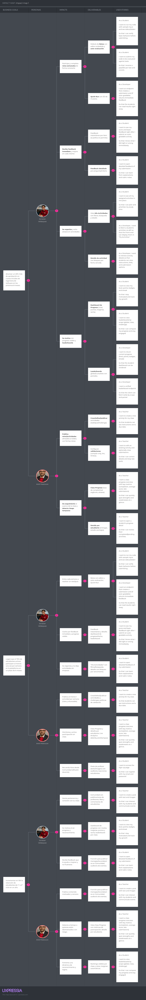

# Capítulo III: Requirements specification
## 3.1. To-Be Scenario Mapping.

## 3.2. User Stories.

| Epic / Story ID | Título                                          | Descripción                                                  | Criterios de Aceptación                                      | Relacionado con (Epic ID) |
| --------------- | ----------------------------------------------- | ------------------------------------------------------------ | ------------------------------------------------------------ | ------------------------- |
| US01            | Student Registration                            | As a Student I want to access the Sign-up page So that I can register with my email and password | Scenario: User opens Sign-up page   Given the user is not authenticated   When the user navigates to the "Sign-up" page   Then the system displays the registration form   And the user is able to register  Scenario: User registers successfully   Given the Sign-up page is displayed   When the user enters a valid input   And proceeds to registration   Then the system validates the input   And the system redirects the user to the Sign-in page  Scenario: Empty input field   Given the Sign-up page is displayed   When the user leaves the an input field empty   And proceeds to registration   Then the system shows an error message | 1                         |
| US02            | Add Student through RESTful API                 | As a Developer I want to add a Student through the API So that it can be available to build features for my applications. | Scenario: Add Student with unique email  Given the endpoint /api/v1/authentication/sign-up is available When a POST request is sent with values for email, password, and name And the email does not already exist in the database Then a response is received with Status 201 And a Student Resource is included in the Response Body with:   a new generated ID   registered values for email and name   role: STUDENT And the password is stored hashed with BCrypt  Scenario: Add Student with existing email  Given the endpoint /api/v1/authentication/sign-up is available When a POST request is sent with values for email, password, and name And a Student Resource with the same email is already stored Then a response is received with Status 400 And a message is included in the Response Body: User with email student@example.com already exists   Scenario: Invalid email format  Given the endpoint /api/v1/authentication/sign-up is available When a POST request is sent with an incorrectly formatted email (e.g. invalid-email) Then a response is received with Status 400 And a message is included: Invalid email format  Scenario: Missing required fields  Given the endpoint /api/v1/authentication/sign-up is available When a POST request is sent without email or password Then a response is received with Status 400 And a message is included: Email address and password are required | 1                         |
| US03            | Student Authentication                          | As a Student I want to access the Sign-in page So that I can authenticate with my email and password | Scenario: Student opens Sign-in page   Given the student is not authenticated   When the student navigates to the "Sign-in" page   Then the system displays the authentication form   And the student is able to sign in  Scenario: Student signs in successfully   Given the Sign-in page is displayed   When the student enters valid credentials   Then the system validates the input   And the student accesses the platform  Scenario: Empty input   Given the Sign-in page is displayed   When the student submits without completing a required field   Then the system shows an error message  Scenario: Incorrect credentials   Given the Sign-in page is displayed   When the student enters invalid credentials   Then the system shows an error message   And the student remains on the Sign-in page | 1                         |
| US04            | Add Authenticate Student through RESTful API    | As a Developer I want to authenticate a Student through the API So that the Student can access the protected functionalities of the application | Scenario: Successful authentication with valid credentials  Given the endpoint "/api/v1/authentication/sign-in" is available When a POST request is sent with values for email and password:  email: "student@example.com"  password: "correctPassword123" And the credentials are valid in the database Then a response is received with Status 200 (OK) And an AuthenticatedUserResource is included in the Response Body with:  id: "generated-uuid"  email_address: "student@example.com"  token: "jwt-token-here"  roles: ["ROLE_STUDENT"] And the JWT token is valid for 1 hour (according to configuration)  Scenario: Failed authentication with incorrect credentials  Given the endpoint "/api/v1/authentication/sign-in" is available When a POST request is sent with incorrect credentials:  email: "student@example.com"  password: "wrongPassword" Then a response is received with Status 401 (Unauthorized) And a message is included in the Response Body: "Invalid email or password"  Scenario: Authentication with non-existent user  Given the endpoint "/api/v1/authentication/sign-in" is available When a POST request is sent with an email that does not exist:  email: "nonexistent@example.com"  password: "anyPassword123" Then a response is received with Status 401 (Unauthorized) And a message is included in the Response Body: "Invalid email or password"   Scenario: Invalid email format  Given the endpoint "/api/v1/authentication/sign-in" is available When a POST request is sent with a badly formatted email:  email: "invalid-email-format"  password: "validPassword123" Then a response is received with Status 400 (Bad Request) And a message is included:  "Invalid email format"  Scenario: Missing required fields  Given the endpoint "/api/v1/authentication/sign-in" is available When a POST request is sent without email or password Then a response is received with Status 400 (Bad Request) And a message is included: "Email address and password are required" | 1                         |
| US53            | Token Issuance (Login)                          | As a Developer I want the gateway to authenticate credentials and issue tokens So that downstream services receive a verified identity. | Scenario: Issue tokens on valid credentials   Given the user exists and the password hash matches   When POST /auth/login with valid body   Then 200 with accessToken (JWT) and refreshToken  Scenario: Reject invalid credentials   When POST /auth/login with wrong password   Then 401 with title "Unauthorized"  Scenario: Enforce lockout   Given 5 failed attempts within 10 minutes   When POST /auth/login   Then 423 with title "Account Locked" | 2                         |
| US05            | Posting                                         | As a Teacher I want to create a post with text and images So that I can interact with my students and communicate events | Scenario: Teacher opens Create Post page   Given the teacher is authenticated   When the teacher navigates to "Community > New Post"   Then the system displays a form with:     - text area     - optional image input     - preview section     - publish option (disabled until valid)  Scenario: Teacher creates a text-only post successfully   Given the "New Post" form is displayed   When the teacher enters valid text   And no image is provided   Then the system publishes the post   And shows a success message   And the new post appears in the community feed  Scenario: Edit a post successfully   Given the teacher is authenticated   And the teacher has an existing post   When the teacher edits the post with valid changes   Then the system updates the post   And the updated version is shown in the community feed   And a confirmation message is displayed  Scenario: Delete a post successfully   Given the teacher is authenticated   And the teacher has an existing post   When the teacher deletes the post   Then the system removes it from the community feed   And a confirmation message is displayed | 3                         |
| US06            | Posting through RESTful API                     | As a Developer I want to create a community post via the API So that professors can publish validated content safely | Feature: Community Posts API  Scenario: Create post with valid text and one image URL   Given the endpoint "/api/v1/community/posts" is available   And the requester has ROLE_PROFESSOR   When a POST request is sent with:     text: "Nos vemos en el taller del viernes. Material en el enlace."     images: ["https://cdn.example.com/materiales/banner.png"]   Then 201 is returned   And a Post Resource with a generated id is returned   And the image URL is stored as a URL field in the database   And an audit event "community.post.created" is recorded  Scenario: Create text-only post   Given the endpoint is available   And the requester has ROLE_PROFESSOR   When a POST request is sent with:     text: "Recordatorio: entrega del reto 2 el domingo 23:59."     images: []   Then 201 is returned   And the post contains no images   And an audit event "community.post.created" is recorded  Scenario: Reject non-HTTP/HTTPS image URL   Given the endpoint is available   And the requester has ROLE_PROFESSOR   When a POST request is sent with:     text: "Adjunto imagen del diagrama."     images: ["ftp://example.com/diagram.jpg"]   Then 400 is returned   And the message includes "Image URL must use HTTP or HTTPS"  Scenario: Update post with new text and image URL   Given the endpoint "/api/v1/community/posts/{id}" is available   And the requester has ROLE_PROFESSOR   And the requester owns the post   When a PUT request is sent with:     text: "Actualización: el taller se movió al sábado."     images: ["https://cdn.example.com/materiales/updated-banner.png"]   Then 200 is returned   And the Post Resource reflects the new text and image URL   And an audit event "community.post.updated" is recorded  Scenario: Delete post successfully   Given the endpoint "/api/v1/community/posts/{id}" is available   And the requester has ROLE_PROFESSOR   And the requester owns the post   When a DELETE request is sent   Then 204 is returned   And the post is no longer retrievable   And an audit event "community.post.deleted" is recorded | 3                         |
| US07            | Liking                                          | As a Student I want to like or unlike a community post So that I can express my opinion and support others | Scenario: Like a post successfully   Given the student is authenticated   And the community feed is displayed   When the student likes a post   Then the option changes to "Unlike"   And the like counter increases by 1   And a confirmation message is shown  Scenario: Unlike a post successfully   Given the student has already liked a post   When the student unlikes the post   Then the option changes back to "Like"   And the like counter decreases by 1   And a confirmation message is shown  Scenario: Prevent multiple submissions   Given the student attempts to like a post repeatedly   Then the system processes only one action   And the counter reflects a single like | 3                         |
| US08            | Commenting                                      | As a Student I want to write a comment under a post So that I can participate in the discussion | Scenario: Add valid comment   Given the student is authenticated   And the post detail view is open   When the student enters text between 3 and 500 characters   Then the comment is displayed under the post   And a confirmation message is shown  Scenario: Empty comment   Given the post detail view is open   When the student submits without entering text   Then the system shows an error "Comment cannot be empty"  Scenario: Too long comment   Given the post detail view is open   When the student enters more than 500 characters   Then the system shows an error "Comment must not exceed 500 characters"  Scenario: Unsupported characters in comment   Given the post detail view is open   When the student enters text with unsupported characters   Then the system shows an error "Unsupported characters detected"   And the comment is not published | 3                         |
| US09            | Liking trough API                               | As a Developer I want to register likes/unlikes through the API So that user interactions are consistent and secure | Scenario: Like post successfully   Given the endpoint /api/v1/community/posts/{id}/like is available   When a POST request is sent with a valid token   Then Status 200 is returned   And the response body includes the updated likeCount  Scenario: Unlike post successfully   Given the endpoint /api/v1/community/posts/{id}/like is available   When a DELETE request is sent with a valid token   Then Status 200 is returned   And the likeCount decreases by 1  Scenario: Double like attempt   When a POST request is sent twice for the same user and post   Then the second request returns 200   And the likeCount remains the same | 3                         |
| US10            | Commenting trough API                           | As a Developer I want to add, validate, and store comments through the API So that students can safely interact under posts | Scenario: Add valid comment   Given the endpoint /api/v1/community/posts/{id}/comments is available   When a POST request is sent with:     text: Good job, this material is clear"   Then Status 201 is returned   And the Comment Resource includes id, authorId, text, createdAt  Scenario: Reject empty comment   When a POST request is sent with text: ""   Then Status 400 is returned   And the message "Comment cannot be empty" is included  Scenario: Reject text too long   When a POST request is sent with text longer than 500 characters   Then Status 400 is returned   And the message "Comment must not exceed 500 characters"  Scenario: Reject unsupported characters   When a POST request is sent with text containing 汉字   Then Status 400 is returned   And the message "Unsupported characters detected" | 3                         |
| US44            | Live Session Dashboard                          | As a Teacher I want to see studentCount, responseDistribution, and averageResponseTime So that I can monitor the class in real time. | Scenario: View live metrics for a session   Given I am assigned to class "cls_CS101_2025_2"   And session "ses_01A" is active   When I open "Live Analytics"   Then I see studentCount, totalResponses, averageResponseTimeMs   And I see responseDistribution for the current question  Scenario: No responses yet   Given session "ses_01A" is active with zero responses   When I open "Live Analytics"   Then I see "Waiting for responses..." and studentCount | 4                         |
| US45            | Response Distribution Chart                     | As a Teacher I want a chart of responses (A/B/C/D or numbers) So that I can identify misconceptions quickly. | Scenario: Show categorical distribution   Given the current question is multiple choice   When responses arrive   Then the chart displays counts per option (A,B,C,D) | 4                         |
| US46            | Average Time Panel                              | As a Teacher I want to see the average response time for the current question So that I can pace the session. | Scenario: Show average response time   Given responses include timing   When I view "Timing"   Then I see averageResponseTimeMs for the current question | 4                         |
| US47            | Events Ingestion API                            | As a Developer I want to ingest participation events (join/response) So that the aggregator can compute real-time metrics. | Scenario: Accept valid batch   When POST with well-formed events for session "ses_01A"   Then Status 202 and accepted equals the number of events  Scenario: Unauthenticated   When POST without Authorization   Then Status 401 problem+json  Scenario: Forbidden (not producer for class/session)   When POST by an unauthorized client   Then Status 403 problem+json  Scenario: Validation error   When an event has missing questionId for RESPONSE_SUBMITTED   Then Status 422 with errors[] pointing to events[i].questionId  Scenario: Payload too large   When events array exceeds max size   Then Status 413 with title "Payload Too Large"  Scenario: Rate limited   When producer exceeds QPS   Then Status 429 with "Retry-After"  Scenario: Aggregator unavailable   When the ingestion pipeline is down   Then Status 503 with title "Service Unavailable" | 4                         |
| US48            | Real-time Stream API                            | As a Developer I want to stream live snapshots to the teacher UI So that metrics update without polling. | Scenario: Authorized teacher subscribes   Given caller has ROLE_TEACHER and is assigned to the session   When GET /sessions/ses_01A/stream   Then Status 200 and SSE events "snapshot" and "heartbeat" are received  Scenario: Unauthenticated / Forbidden / Session not found   Then return 401 / 403 / 404 with problem+json and no stream  Scenario: Idle timeout   Given no updates for N seconds   When the server sends periodic heartbeat   Then the client stays connected and does not show stale data | 4                         |
| US49            | View Quiz Summary Report                        | As an Admin I want to view average score, participation rate, and average response time for a quiz So that I can gauge overall performance. | Scenario: View quiz summary   Given I am an administrator   And quiz "quiz_1001" has graded submissions   When I open "Quiz Reports" for quiz_1001   Then I see avgScore, participationRate, averageResponseTimeMs   And the time range and class filters applied are visible  Scenario: No data in range   Given there are no graded submissions in the selected date range   When I view the report   Then I see "No data for selected range" | 5                         |
| US50            | Hardest Questions                               | As an Admin I want a list of the hardest questions (lowest correctness rate) So that I can spot misconceptions. | Scenario: List hardest questions   Given quiz_1001 has question-level results   When I open "Hardest Questions"   Then I see a table with questionId, correctnessRate, attempts, avgTimeMs   And the table is sorted ascending by correctnessRate | 5                         |
| US51            | Quiz Summary API                                | As a Developer I want an endpoint to retrieve quiz-level metrics So that the UI can render the summary panel. | Scenario: Authorized admin retrieves summary   Given caller has ROLE_ADMIN   When GET /analytics/quizzes/{quizId}/summary with valid filters   Then Status 200 with metrics.avgScore, participationRate, averageResponseTimeMs  Scenario: Unauthenticated   When GET without Authorization   Then Status 401 problem+json  Scenario: Forbidden   Given caller lacks ROLE_ADMIN   When GET   Then Status 403 problem+json title "Forbidden"  Scenario: Quiz not found   When GET for unknown quizId   Then Status 404 problem+json  Scenario: Invalid date range   When from > to   Then Status 422 with errors[] on from/to  Scenario: Server error   Then Status 500 with problem+json and errorId | 5                         |
| US52            | Per-Question Stats API                          | I want an endpoint to retrieve per-question statistics So that the UI can show hardest questions and drilldowns. | Scenario: Fetch per-question stats   Given ROLE_ADMIN   When GET /analytics/quizzes/{quizId}/questions?sort=correctnessRate,asc   Then Status 200 with content[] and pagination  Scenario: Unsupported sort field   When sort=hackerField,asc   Then Status 400 with detail "Unsupported sort field: hackerField"  Scenario: Unauthenticated / Forbidden / Not found / Server error   Then return 401 / 403 / 404 / 500 with problem+json | 5                         |
| US11            | Add Profile settings trough Front-end           | As a Student I want to edit my profile (name, username, avatar) So that I can personalize my experience in the platform | Scenario: Open Profile Settings   Given the student is authenticated   When the student navigates to "Account > Profile"   Then the system displays a form with:     - Full Name (required)     - Username (required)     - Avatar URL (optional, http/https only)     - Institution (required)     - save option (disabled until valid)  Scenario: Update full name successfully   Given the Profile form is displayed   When the student enters a valid name of 3–80 characters (Latin charset)   Then the system updates the profile   And the header reflects the new name   And a confirmation message is shown  Scenario: Update username successfully   Given the Profile form is displayed   When the student enters a valid and available username (3–24, letters/numbers/underscores, starts with letter)   Then the profile updates with the new username   And a confirmation message is shown  Scenario: Username taken   Given the Profile form is displayed   When the student enters a username that already exists   Then the system shows an error "Username is already taken" | 6                         |
| US12            | Add Create Profile trough API                   | As a Developer I want to create a user profile via API So that new users can initialize their profile | Scenario: Create profile successfully   Given the endpoint "/api/v1/profile" is available   When a POST is sent with valid fullName, username, avatarUrl (https), institution   Then Status 201 is returned   And the ProfileResource includes id and the stored URL (not base64)  Scenario: Username already exists   When a POST is sent with username "juan_perez" that is already taken   Then Status 409 is returned   And the message "Username is already taken" is included  Scenario: Reject non-HTTP/HTTPS avatar   When a POST is sent with avatarUrl "ftp://example.com/a.jpg"   Then Status 400 is returned   And the message "Avatar URL must use HTTP or HTTPS" is included  Scenario: Reject unsupported characters   When a POST is sent with fullName containing unsupported characters (e.g., 汉字 or emojis)   Then Status 400 is returned   And details point to the invalid characters | 6                         |
| US13            | Add Update Profile trough API                   | As a Developer I want to update an existing user profile via API So that users can edit their name, username and avatar | Scenario: Update username to a new available value   Given the endpoint "/api/v1/profile" is available   And the requester is the profile owner   When a PUT is sent with username "mateo_dev"   Then Status 200 is returned   And the profile shows username "mateo_dev"  Scenario: Update avatar with valid https URL   When a PUT is sent with avatarUrl "https://cdn.example.com/u/avatar.png"   Then Status 200 is returned   And the avatarUrl is persisted as link (not inline/base64)  Scenario: Reject inline/base64 avatar   When a PUT is sent with avatarUrl "data:image/png;base64,...."   Then Status 400 is returned   And the message "Inline/base64 images are not allowed" is included | 6                         |
| US14            | Add pogress for student via Front-end           | As a Student I want to view my level, points, badges, and streak So that I stay motivated and track my growth | Scenario: Open Progress Dashboard   Given the student is authenticated   When the student navigates to "Progress"   Then the system displays:     - current level with progress bar to next level     - total points and weekly points     - latest 5 badges with tooltip     - current and longest streak     - links to view all badges and history  Scenario: View points history (last 30 days)   Given the Progress page is displayed   When the student selects the last 30 days option   Then a daily line chart shows earned points per day   And hovering shows the date and points  Scenario: Empty state for new students   Given the student has no points and no badges   When the Progress page is displayed   Then the system shows an encouraging empty state with tips to start challenges | 7                         |
| US15            | Add Leaderboard trough Front-end                | As a Student I want to view leaderboards by scope (global, class, challenge) So that I can compare my progress and stay engaged | Scenario: View Global leaderboard (All-time)   Given the student is authenticated   When the student opens "Leaderboards" and selects scope "Global" and period "All"   Then the system shows a paginated table with:     - Rank #, Username, Level, Points     - My row highlighted (even if not on current page)  Scenario: View Class leaderboard (weekly)   Given the student is enrolled in class "CS-101"   When the student selects scope "Class" and class "CS-101" and period "Weekly"   Then the table shows top students for that class this week   And ties are resolved by:     1) Higher Level     2) Earlier achievement timestamp  Scenario: View Challenge leaderboard (this challenge)   Given the student opens a challenge detail   When the student switches to the "Leaderboard" tab   Then the table shows rank for this challenge only   And only students with a valid submission appear  Scenario: Filters and pagination   Given the leaderboard is displayed   When the student changes period to "Monthly" and page to 2   Then the table refreshes with the correct results  Scenario: Privacy & visibility   Given some students have privacy set to “hide name”   When the leaderboard is rendered   Then those entries display masked names (e.g., "Student-****")   And my own entry is always fully visible to me | 7                         |
| US16            | Add progress trough API                         | As a Developer I want to return current progress (level, points, badges, streak) So that the student dashboard can be rendered | Scenario: Get my progress successfully   Given the endpoint "/api/v1/progress/me" is available   And the requester has ROLE_STUDENT   When a GET request is sent   Then Status 200 is returned with level, points, badges, streak | 7                         |
| US17            | Add Leaderboard trough APi                      | As a Developer I want a unified leaderboard endpoint So that the client can fetch ranks by scope and period | Scenario: Get Global leaderboard (All-time)   Given the endpoint "/api/v1/leaderboards" is available   When a GET is sent with scope=global&period=all&page=1&size=25   Then Status 200 is returned with a paginated list   And entries are sorted by points desc, ties resolved by level desc, then firstAchievedAt asc   And myEntry is included even if not on the current page  Scenario: Get Class leaderboard (Weekly) with membership   Given the requester is enrolled in class "cls_CS101_2025_2"   When a GET is sent with scope=class&classId=cls_CS101_2025_2&period=weekly   Then Status 200 is returned   And only members of the class are ranked  Scenario: Reject Class leaderboard without membership   Given the requester is not enrolled in "cls_MATH101"   When a GET is sent with scope=class&classId=cls_MATH101&period=weekly   Then Status 403 is returned   And a message "You are not a member of this class" is included  Scenario: Get Challenge leaderboard   When a GET is sent with scope=challenge&challengeId=ch_ABC123   Then Status 200 is returned   And only students with valid submissions for that challenge appear | 7                         |
| US18            | Add Unified list of activities trough Front-end | As a Student I want to see all my assigned activities in one place So that I can plan and prioritize my study time | Scenario: Open "My Activities"   Given the student is authenticated   When the student navigates to "Class > My Activities"   Then the system shows a paginated list with columns:     - Title, Type (Challenge/Quiz/Lab/Assignment)     - Class (e.g., CS-101)     - Due date (local time)     - Estimated time (mins)     - Status (Assigned/In progress/Submitted/Graded/Overdue)  Scenario: Filter and sort activities   Given the activities list is displayed   When the student filters by Status=Assigned and Due date=This week   And sorts by Due date ascending   Then the list updates accordingly  Scenario: Search by keyword   Given the activities list is displayed   When the student searches "Arreglos C++"   Then only activities whose title or description contains the term are shown | 8                         |
| US19            | Add List Student Activities trough API          | As a Developer, I want to fetch a student’s activities via API so that the Front-end can display them in “My Activities.” | Scenario: List my activities with filters   Given the endpoint "/api/v1/class-activities/me" is available   When a GET is sent with status=ASSIGNED,IN_PROGRESS&type=CHALLENGE,QUIZ&sort=dueAt,asc   Then Status 200 is returned with a paginated list   And all items belong to the requester student   Scenario: Rate limited   Given the endpoint "/api/v1/class-activities/me" is available   And the requester exceeds the rate limit   When a GET is sent   Then Status 429 is returned   And the response includes "Retry-After" header  Scenario: Upstream timeout   Given the endpoint depends on ActivityService   And ActivityService times out   When a GET is sent   Then Status 504 is returned   And the response contains title "Gateway Timeout"  Scenario: Unexpected server error   Given the endpoint "/api/v1/class-activities/me" is available   When an unhandled exception occurs   Then Status 500 is returned   And the response contains an error id for diagnostics | 8                         |
| US20            | Add Activity Details trough API                 | As a Developer, I want to retrieve activity details so that students can view instructions, links, and submission options. | Scenario: Get activity detail   Given the requester belongs to class "cls_CS101_2025_2"   When a GET is sent to "/api/v1/class-activities/act_01H"   Then Status 200 is returned with the activity detail  Scenario: Submission disabled due to due date passed   Given the activity "act_01H" exists   And its dueAt is in the past   When a GET is sent to "/api/v1/class-activities/act_01H"   Then Status 200 is returned with the activity detail   And the payload has submission.locked=true   And submission.lockReason="DUE_DATE_PASSED"  Scenario: Rate limited   Given the requester exceeds the rate limit   When a GET is sent to "/api/v1/class-activities/act_01H"   Then Status 429 is returned   And the response includes "Retry-After" header  Scenario: Unexpected server error   Given the endpoint "/api/v1/class-activities/{activityId}" is available   When an unhandled exception occurs   Then Status 500 is returned   And the response contains an error id for diagnostics | 8                         |
| US21            | Add View Class Progress via Front-end           | As a Teacher I want a class progress overview with key metrics (completion, average score, late submissions) So that I can quickly spot strengths and weaknesses at a glance. | Scenario: View progress for a class   Given I am assigned to class "cls_CS101_2025_2"   When I open "Class Progress"   Then I see completionRate and avgScore for the class   And a table of students with completion% and lastSubmissionAt  Scenario: No data yet   Given the class has no activities   When I open "Class Progress"   Then I see the message "No activities yet" | 9                         |
| US22            | View Student Progress (Detail)                  | As a Teacher I want to open a student’s progress detail So that I can review their completed/pending activities. | Scenario: Open student detail   Given I am on "Class Progress"   When I select student "std_01R"   Then I see their list of activities with title, status, dueAt, score  Scenario: Student without submissions   Given student "std_01R" has no submissions   When I open their detail   Then I see "No submissions yet" | 9                         |
| US23            | Create Activity (Task)                          | As a Teacher I want to create a new activity for my class So that students can see instructions and a due date. | Scenario: Create a basic task   Given I am assigned to "cls_CS101_2025_2"   When I create an activity with title, description and dueAt   Then the activity appears in the class activity list with status "DRAFT"  Scenario: Publish the activity   Given an activity is in "DRAFT"   When I publish it   Then students in the class can see it in their activities | 9                         |
| US24            | Add Edit / Close Activity via Front-end         | As a Teacher I want to edit an existing activity and optionally close submissions So that I can correct details and stop late work. | Scenario: Edit title and due date   Given the activity is in "DRAFT"   When I update title and dueAt   Then the changes are saved  Scenario: Close submissions   Given the activity is "PUBLISHED"   When I set "acceptSubmissions" to false   Then students can no longer submit | 9                         |
| US25            | Progress API (class-level)                      | As a Developer I want an endpoint to retrieve class progress (simple metrics + student rows) So that the UI can render the progress view. | Scenario: Authorized teacher gets class progress   Given caller has ROLE_TEACHER and is assigned to {classId}   When GET /teacher/{classId}/progress   Then Status 200 with completionRate, avgScore and students[]  Scenario: Unauthenticated   When GET /teacher/{classId}/progress without Authorization   Then Status 401 with application/problem+json  Scenario: Forbidden (not assigned)   Given caller has ROLE_TEACHER but not assigned to {classId}   When GET /teacher/{classId}/progress   Then Status 403 with problem+json title "Forbidden"  Scenario: Class not found   When GET /teacher/cls_UNKNOWN/progress   Then Status 404 with problem+json title "Class Not Found"  Scenario: Server error   When an unexpected error occurs   Then Status 500 with problem+json and an errorId | 9                         |
| US26            | Create Activity API                             | As a Developer I want an endpoint to retrieve a single student’s activity list in a class So that the UI can show their detail. | Scenario: Authorized teacher gets student progress   Given caller has ROLE_TEACHER and is assigned to {classId}   When GET /teacher/{classId}/students/{studentId}/progress   Then Status 200 with activities[]  Scenario: Student not in class   Given the student is not enrolled in {classId}   When GET /teacher/{classId}/students/{studentId}/progress   Then Status 404 with problem+json title "Student Not Found"  Scenario: Unauthenticated / Forbidden / Server error   Then return 401 / 403 / 500 respectively with problem+json | 9                         |
| US27            | Update/Publish/Close Activity API               | As a Developer I want to create a class activity So that teachers can add tasks. | Scenario: Valid creation   Given caller has ROLE_TEACHER and is assigned to classId   When POST /class-activities with valid body   Then Status 201 with activityId and status "DRAFT"  Scenario: Unauthenticated   When POST without Authorization   Then Status 401 problem+json  Scenario: Forbidden   Given caller not assigned to classId   When POST with that classId   Then Status 403 problem+json  Scenario: Validation error   When title is blank or dueAt is in the past   Then Status 422 with problem+json and errors[] per field  Scenario: Duplicate title (same class and dueAt)   Given an activity with same title and dueAt exists   When POST again   Then Status 409 problem+json title "Activity Conflict"  Scenario: Server error   Then Status 500 problem+json with errorId | 9                         |
| US28            | Submit and See Instant Feedback (auto-gradable) | As a Student I want to see my score and basic feedback right after I submit an auto-gradable activity So that I know what I did right or wrong immediately. | Scenario: Immediate feedback after submission   Given the activity "act_QZ1" is PUBLISHED and auto-gradable   And I am enrolled in class "cls_CS101_2025_2"   When I submit my answers   Then I see my score and per-item correctness   And I see a short explanation for each incorrect item (if allowed)  Scenario: Feedback policy hides solutions   Given showSolutions=false   When I submit   Then I see my score only   And I see the message "Solutions are hidden for this activity" | 10                        |
| US29            | View Detailed Feedback                          | As a Student I want to open detailed feedback of my submission So that I can learn from explanations and rubric notes. | Scenario: Open feedback detail   Given I have a successful submission for "act_QZ1"   When I open "View feedback"   Then I see question-by-question results, explanations (if allowed), and overall score  Scenario: Non auto-gradable activity   Given the activity type is TASK (manual grading)   When I submit   Then I see "Submission received — feedback pending" | 10                        |
| US30            | View Detailed Feedback                          | As a Student I want to retry an activity and get updated feedback So that I can improve within the allowed attempts. | As a Student I want to retry an activity and get updated feedback So that I can improve within the allowed attempts. | 10                        |
| US31            | Create Submission with Immediate Feedback       | As a Developer I want an endpoint that creates a submission and (if auto-gradable) returns immediate feedback So that the students can read results right away. | Scenario: Successful auto-graded submission   Given the activity is PUBLISHED and auto-gradable   And the student is enrolled and has attemptsRemaining > 0   When POST /class-activities/{activityId}/submissions with valid answers   Then Status 201 with score and items[] feedback  Scenario: Forbidden (not enrolled)   Given the caller is not enrolled in the class   When POST   Then Status 403 with problem+json title "Forbidden"  Scenario: Activity not found or not published   When POST for an unknown or non-PUBLISHED activity   Then Status 404 with title "Activity Not Found"  Scenario: Attempts exhausted   Given attemptsRemaining = 0   When POST   Then Status 409 with title "Attempts Exhausted"  Scenario: Submissions closed (past due or acceptSubmissions=false)   When POST after dueAt or when closed   Then Status 409 with title "Submissions Closed"  Scenario: Validation error   When the body is missing required fields or malformed   Then Status 422 with errors[] per field  Scenario: Payload too large (file upload TASK)   When the upload exceeds the limit   Then Status 413 with title "Payload Too Large"  Scenario: Unsupported media type   When the upload mime-type is not allowed   Then Status 415 with title "Unsupported Media Type"  Scenario: Auto-grader timeout / unavailable   When the grader does not respond in time   Then Status 504 (timeout) or 503 (service unavailable) with problem+json  Scenario: Unexpected server error   When an unhandled exception occurs   Then Status 500 with problem+json and an errorId | 10                        |
| US32            | Feedback Visibility Policy (simple)             | As a Developer I want to expose the feedback/solution visibility policy for an activity So that the studens knows what to read after submission. | Scenario: Retrieve policy   When GET /class-activities/{activityId}/feedback-policy   Then Status 200 with booleans for showScore, showItemCorrectness, showSolutions  Scenario: Not found / Unauthenticated / Forbidden   Then return 404 / 401 / 403 with problem+json respectively | 10                        |

## 3.3. Impact Mapping.

## 3.4. Product Backlog.

| # Orden | Epic / Story ID | Título                                          | Descripción                                                  | Relacionado con (Epic ID) |
| ------- | --------------- | ----------------------------------------------- | ------------------------------------------------------------ | ------------------------- |
| 1       | US01            | Student Registration                            | As a Student I want to access the Sign-up page So that I can register with my email and password | 1                         |
| 2       | US02            | Add Student through RESTful API                 | As a Developer I want to add a Student through the API So that it can be available to build features for my applications. | 1                         |
| 3       | US03            | Student Authentication                          | As a Student I want to access the Sign-in page So that I can authenticate with my email and password | 1                         |
| 4       | US04            | Add Authenticate Student through RESTful API    | As a Developer I want to authenticate a Student through the API So that the Student can access the protected functionalities of the application | 1                         |
| 5       | US53            | Token Issuance (Login)                          | As a Developer I want the gateway to authenticate credentials and issue tokens So that downstream services receive a verified identity. | 2                         |
| 6       | US05            | Posting                                         | As a Teacher I want to create a post with text and images So that I can interact with my students and communicate events | 3                         |
| 7       | US06            | Posting through RESTful API                     | As a Developer I want to create a community post via the API So that professors can publish validated content safely | 3                         |
| 8       | US07            | Liking                                          | As a Student I want to like or unlike a community post So that I can express my opinion and support others | 3                         |
| 9       | US08            | Commenting                                      | As a Student I want to write a comment under a post So that I can participate in the discussion | 3                         |
| 10      | US09            | Liking trough API                               | As a Developer I want to register likes/unlikes through the API So that user interactions are consistent and secure | 3                         |
| 11      | US10            | Commenting trough API                           | As a Developer I want to add, validate, and store comments through the API So that students can safely interact under posts | 3                         |
| 12      | US44            | Live Session Dashboard                          | As a Teacher I want to see studentCount, responseDistribution, and averageResponseTime So that I can monitor the class in real time. | 4                         |
| 13      | US45            | Response Distribution Chart                     | As a Teacher I want a chart of responses (A/B/C/D or numbers) So that I can identify misconceptions quickly. | 4                         |
| 14      | US46            | Average Time Panel                              | As a Teacher I want to see the average response time for the current question So that I can pace the session. | 4                         |
| 15      | US47            | Events Ingestion API                            | As a Developer I want to ingest participation events (join/response) So that the aggregator can compute real-time metrics. | 4                         |
| 16      | US48            | Real-time Stream API                            | As a Developer I want to stream live snapshots to the teacher UI So that metrics update without polling. | 4                         |
| 17      | US49            | View Quiz Summary Report                        | As an Admin I want to view average score, participation rate, and average response time for a quiz So that I can gauge overall performance. | 5                         |
| 18      | US50            | Hardest Questions                               | As an Admin I want a list of the hardest questions (lowest correctness rate) So that I can spot misconceptions. | 5                         |
| 19      | US51            | Quiz Summary API                                | As a Developer I want an endpoint to retrieve quiz-level metrics So that the UI can render the summary panel. | 5                         |
| 20      | US52            | Per-Question Stats API                          | I want an endpoint to retrieve per-question statistics So that the UI can show hardest questions and drilldowns. | 5                         |
| 21      | US11            | Add Profile settings trough Front-end           | As a Student I want to edit my profile (name, username, avatar) So that I can personalize my experience in the platform | 6                         |
| 22      | US12            | Add Create Profile trough API                   | As a Developer I want to create a user profile via API So that new users can initialize their profile | 6                         |
| 23      | US13            | Add Update Profile trough API                   | As a Developer I want to update an existing user profile via API So that users can edit their name, username and avatar | 6                         |
| 24      | US14            | Add pogress for student via Front-end           | As a Student I want to view my level, points, badges, and streak So that I stay motivated and track my growth | 7                         |
| 25      | US15            | Add Leaderboard trough Front-end                | As a Student I want to view leaderboards by scope (global, class, challenge) So that I can compare my progress and stay engaged | 7                         |
| 26      | US16            | Add progress trough API                         | As a Developer I want to return current progress (level, points, badges, streak) So that the student dashboard can be rendered | 7                         |
| 27      | US17            | Add Leaderboard trough APi                      | As a Developer I want a unified leaderboard endpoint So that the client can fetch ranks by scope and period | 7                         |
| 28      | US18            | Add Unified list of activities trough Front-end | As a Student I want to see all my assigned activities in one place So that I can plan and prioritize my study time | 8                         |
| 29      | US19            | Add List Student Activities trough API          | As a Developer, I want to fetch a student’s activities via API so that the Front-end can display them in “My Activities.” | 8                         |
| 30      | US20            | Add Activity Details trough API                 | As a Developer, I want to retrieve activity details so that students can view instructions, links, and submission options. | 8                         |
| 31      | US21            | Add View Class Progress via Front-end           | As a Teacher I want a class progress overview with key metrics (completion, average score, late submissions) So that I can quickly spot strengths and weaknesses at a glance. | 9                         |
| 32      | US22            | View Student Progress (Detail)                  | As a Teacher I want to open a student’s progress detail So that I can review their completed/pending activities. | 9                         |
| 33      | US23            | Create Activity (Task)                          | As a Teacher I want to create a new activity for my class So that students can see instructions and a due date. | 9                         |
| 34      | US24            | Add Edit / Close Activity via Front-end         | As a Teacher I want to edit an existing activity and optionally close submissions So that I can correct details and stop late work. | 9                         |
| 35      | US25            | Progress API (class-level)                      | As a Developer I want an endpoint to retrieve class progress (simple metrics + student rows) So that the UI can render the progress view. | 9                         |
| 36      | US26            | Create Activity API                             | As a Developer I want an endpoint to retrieve a single student’s activity list in a class So that the UI can show their detail. | 9                         |
| 37      | US27            | Update/Publish/Close Activity API               | As a Developer I want to create a class activity So that teachers can add tasks. | 9                         |
| 38      | US28            | Submit and See Instant Feedback (auto-gradable) | As a Student I want to see my score and basic feedback right after I submit an auto-gradable activity So that I know what I did right or wrong immediately. | 10                        |
| 39      | US29            | View Detailed Feedback                          | As a Student I want to open detailed feedback of my submission So that I can learn from explanations and rubric notes. | 10                        |
| 40      | US30            | View Detailed Feedback                          | As a Student I want to retry an activity and get updated feedback So that I can improve within the allowed attempts. | 10                        |
| 41      | US31            | Create Submission with Immediate Feedback       | As a Developer I want an endpoint that creates a submission and (if auto-gradable) returns immediate feedback So that the students can read results right away. | 10                        |
| 42      | US32            | Feedback Visibility Policy (simple)             | As a Developer I want to expose the feedback/solution visibility policy for an activity So that the studens knows what to read after submission. | 10                        |

