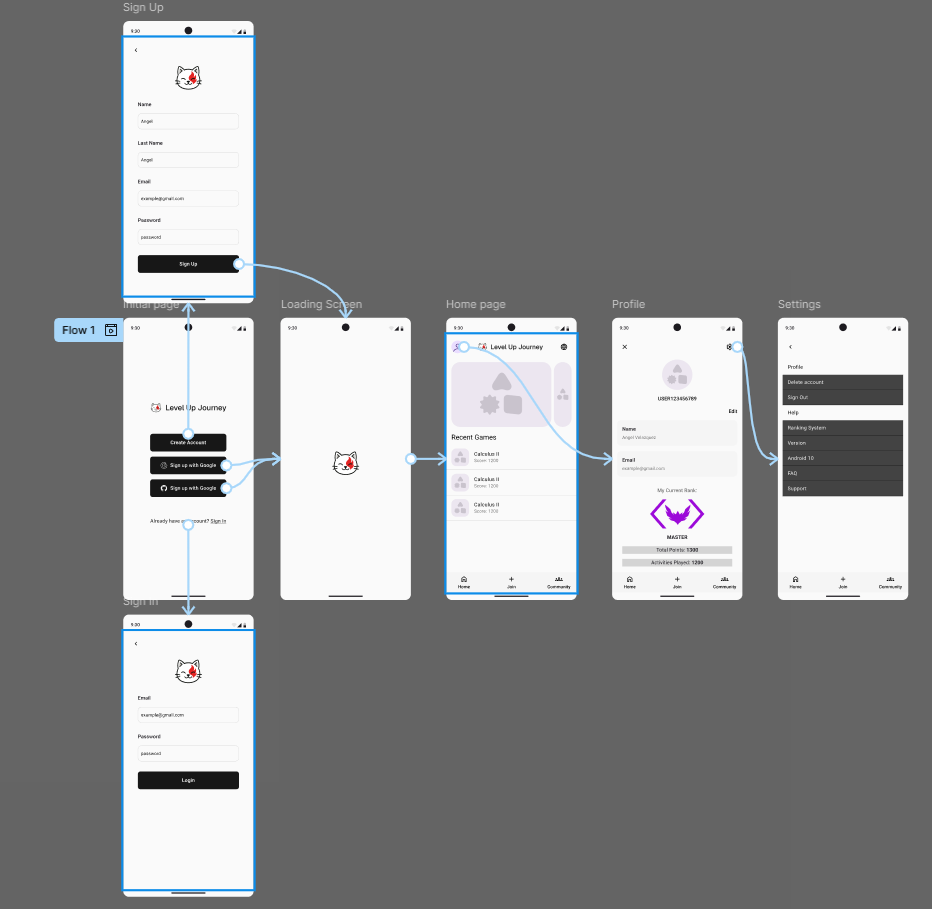
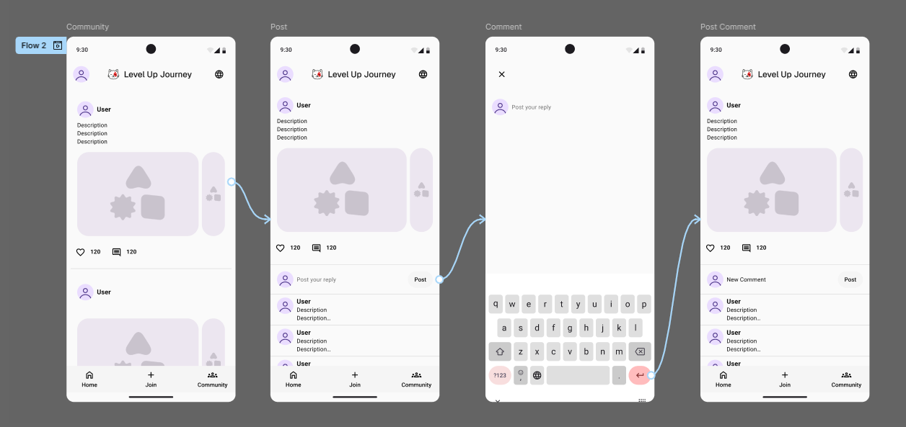
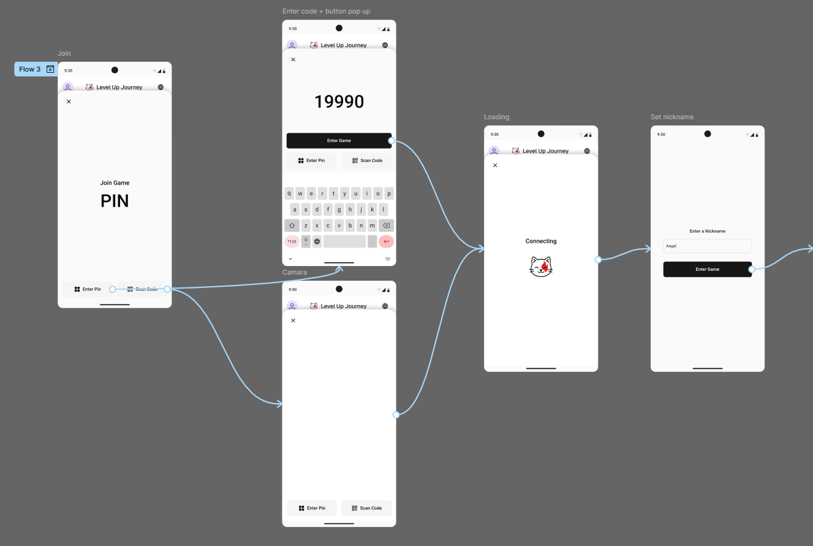
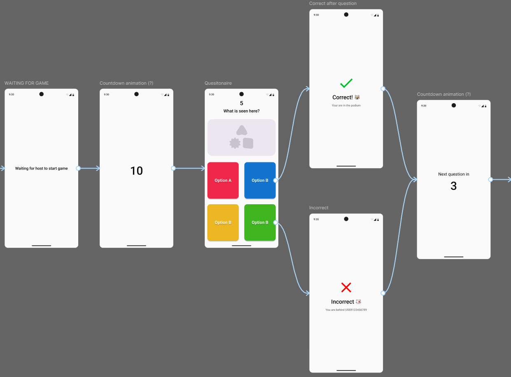
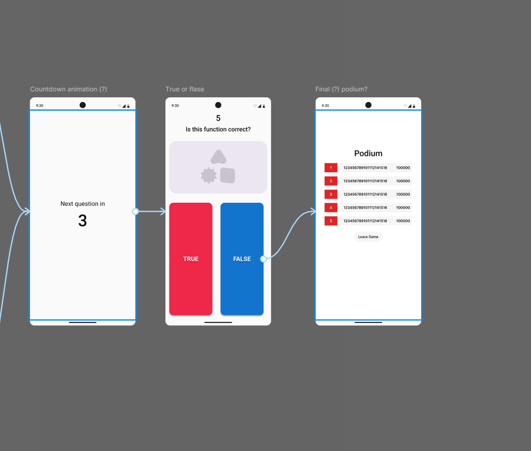
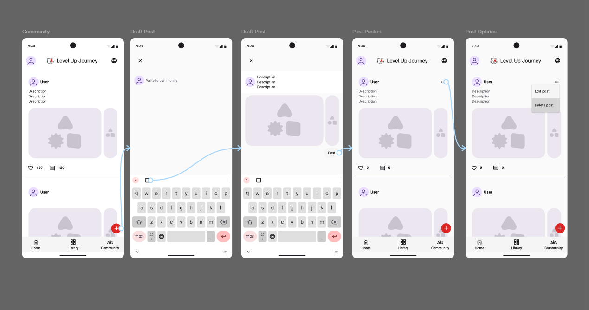
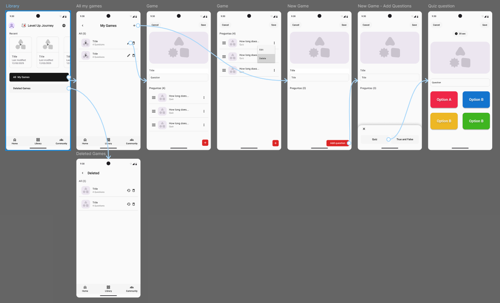
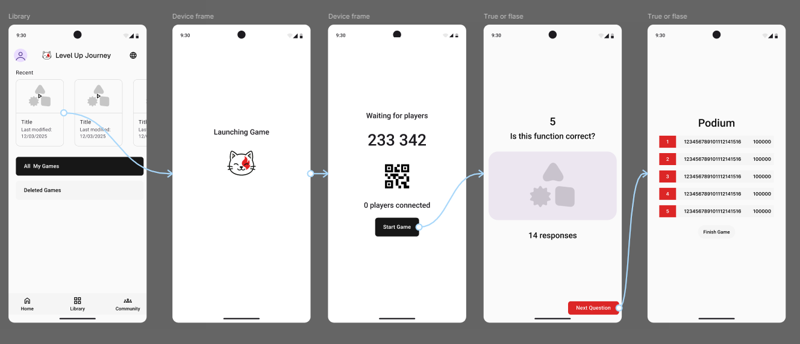

# Capítulo III: Solution UI/UX Design

## 3.1. Product design

### 3.1.1. Style Guidelines

Esta sección define la identidad visual y los patrones de diseño que aseguran consistencia en la landing page de Level Up Journey. Se estructura en torno a los principios de tipografía, color, iconografía, componentes interactivos y lineamientos gráficos generales, implementados mediante Tailwind CSS y Astro framework.

#### 3.1.1.1. General Style Guidelines

**Tipografía para Landing Page:**

- Fuentes primarias del sistema de fuentes web por defecto de Tailwind (inter, sans-serif)
- Jerarquía tipográfica con títulos principales (H1) de text-5xl a text-7xl (48px-72px), font-bold (700)
- Subtítulos (H2) de text-3xl a text-5xl (30px-48px), font-bold (700)
- Texto de párrafo de text-base a text-xl (16px-20px), font-normal (400)
- Texto secundario de text-sm (14px), text-gray-400
- Espaciado y legibilidad con interlineado leading-relaxed (1.625) para párrafos
- Márgenes del sistema de espaciado consistente (mb-4, mb-6, mb-12)
- Pesos tipográficos: font-normal (400), font-semibold (600), font-bold (700)

**Consideraciones para adaptación móvil:**

- Fuentes optimizadas como SF Pro Display o Roboto para mejor legibilidad en pantallas pequeñas
- Escala responsiva con tamaños adaptativos mediante breakpoints de Tailwind (sm:, md:, lg:)
- Contraste garantizado con texto blanco sobre fondos oscuros (neutral-950) con ratio de contraste mínimo 4.5:1
- Tamaño mínimo de 14px para texto de lectura, 16px para elementos interactivos

**Paleta de colores para Landing Page:**

- Color primario (Primary) red-600 (#DC2626) para botones principales y elementos de acción
- Color secundario (Secondary) neutral-700 (#404040) para bordes y elementos decorativos
- Color de fondo principal neutral-950 (#0A0A0A) para fondo general de la página
- Color de fondo secundario neutral-900 (#171717) para tarjetas, formularios y secciones destacadas
- Color de texto primario white (#FFFFFF) para títulos y texto principal
- Color de texto secundario gray-400 (#9CA3AF) para descripciones y texto complementario
- Color de acento red-600 (#DC2626) para elementos interactivos y llamadas a acción

**Implementación móvil:**

- Adaptación Material Design con colores equivalentes en formato ARGB para Android
- Modo oscuro nativo aprovechando el sistema de colores del dispositivo
- Colores de estado: Success (green-500), Warning (yellow-500), Error (red-500)

**Reglas de contraste y accesibilidad:**

- Ratio de contraste mínimo 4.5:1 para texto normal, 3:1 para texto grande (WCAG AA)
- Texto sobre fondo oscuro blanco (#FFFFFF) sobre neutral-950 (#0A0A0A) = ratio 15.8:1
- Texto secundario gray-400 (#9CA3AF) sobre neutral-950 = ratio 5.2:1
- Elementos interactivos con foco visible mediante outline o border

**Estados interactivos:**

- Hover con hover:bg-red-700 para botones, hover:border-gray-600 para tarjetas
- Focus con focus:ring-2 focus:ring-red-600 con outline visible
- Active con active:scale-95 para feedback táctil simulado
- Disabled con opacity-50 cursor-not-allowed con pointer-events deshabilitados

**Logotipo y elementos de marca:**

- Logotipo principal imagen SVG level-up-cat-happy.svg como favicon
- Título de marca "Level Up Journey" con fuente bold y jerarquía visual
- Proporciones logotipo circular con relación de aspecto 1:1
- Área protegida mínimo 8px de espacio alrededor del logotipo
- Restricciones no distorsionar proporciones, mantener colores originales
- Uso en fondos optimizado para fondos oscuros (neutral-950)

**Iconografía institucional y favicons:**

- Iconos de sección SVG optimizados en /assets/section2/icons/ (code.svg para editor de código, calendar-check.svg para retos semanales, hammer.svg para retroalimentación)

  - `code.svg` - Editor de código
    
    - `calendar-check.svg` - Retos semanales
      
    - `hammer.svg` - Retroalimentación
      
- Iconos de navegación i18n.svg, account.svg en /assets/header/

  
  
- Favicon level-up-cat-happy.svg versión optimizada 32x32px

  

**Imágenes e ilustraciones:**

- Estilo visual fotografía oscura con overlays para mejorar legibilidad
- Tratamiento overlay negro con opacidad 50% sobre imágenes de fondo
- Ilustraciones y gráficos vectoriales con iconos de lenguajes SVG en /assets/section1/programming-languages/ (C++, Java, JavaScript, Python)
- Gráficos vectoriales optimizados para escalabilidad

**Resolución y formato:**

- Formato preferido SVG para iconos, WebP/PNG para fotografías
- Resolución mínimo 2x para retina displays
- Compresión optimización automática vía Astro

**Lineamientos específicos para web y móvil:**

- Web imágenes de fondo full-width con bg-cover
- Móvil adaptación responsiva con bg-center y overlays ajustados

**Botones y componentes interactivos:**

- Tipos de botones Primario (bg-red-600 hover:bg-red-700 text-white) para llamadas a acción principales
- Secundario (bg-neutral-900 border border-neutral-700) para acciones secundarias
- Outline (border border-red-600 text-red-600 hover:bg-red-600) para acciones alternativas
- Ghost (text-white hover:bg-white/10) para acciones sutiles

**Estados de interacción y retroalimentación visual:**

- Hover cambio de color de fondo con transición duration-200
- Focus ring visible focus:ring-2 focus:ring-red-600
- Active efecto de escala active:scale-95
- Loading opacidad reducida durante procesos asíncronos

**Dimensiones y márgenes táctiles mínimos:**

- Botones principales px-8 py-4 (128px x 64px)
- Botones pequeños px-6 py-3 (96px x 48px)
- Margen táctil mínimo 44px de altura para accesibilidad móvil

**Iconografía asociada a botones:**

- Botón de idioma i18n.svg (24x24px)
- Botón de cuenta account.svg (28x28px)
- Botones de sección iconos contextuales en tarjetas

**Componentes derivados:**

- Inputs bg-neutral-900/80 border border-neutral-700 rounded-lg con placeholder
- Cards .card class con border border-gray-700 rounded-lg p-6 lg:p-8
- Modals futura implementación con overlays oscuros
- Tabs sistema de navegación horizontal
- Snackbars notificaciones temporales (planeadas)
- Progress Indicators barras de progreso para carga

**Elementos específicos por tipo de producto:**

- Sistema de cuadrícula 12 columnas con Tailwind Grid
- Breakpoints sm: (640px), md: (768px), lg: (1024px)
- Container max-w-7xl mx-auto para contenido centrado

**Navegación y estructura:**

- Header fijo fixed top-0 con backdrop-blur al scroll
- Secciones min-h-screen para hero, py-16 lg:py-20 para secciones
- Footer enlaces organizados en grid

**Comportamientos y microinteracciones:**

- Scroll effects header con scrolled class y blur effect
- Hover animations transition-colors duration-200
- Floating elements componente FloatingLanguages con física de burbujas

**Adaptabilidad entre web y móvil:**

- Responsive images w-full con aspect ratios
- Flexible layouts grid-cols-1 md:grid-cols-2 lg:grid-cols-3
- Touch targets mínimo 44px para elementos interactivos

**Consistencia y adaptabilidad del sistema de diseño:**

- Variables CSS sistema de design tokens en :root
- Clases reutilizables .section, .container-custom, .card
- Naming convention BEM-like con Tailwind utilities

**Librería de componentes reutilizables:**

- Componentes base Header, Footer, Section components
- Utilidades classes globales en global.css
- Modularidad separación por funcionalidad

**Versionado y documentación del Design System:**

- Documentación este documento como guía de estilos
- Versionado control de versiones con Git
- Consistencia revisiones regulares de implementación

  
  
  
  
  
  
  
  
  
  
  
  
  
  
  
  
  
  
  
  
  
  
  
  

### 3.1.2. Information Architecture

#### 3.1.2.1. Organization Systems

El contenido de **Level Up Journey** se organiza bajo un esquema jerárquico y temático, priorizando la claridad en la navegación tanto para estudiantes como docentes.
En la **Landing Page**, la jerarquía visual guía la atención desde el *hero* principal (mensaje motivacional y CTA) hacia secciones secundarias como características, beneficios y testimonios.

En la **aplicación móvil**, la organización se orienta a las tareas del usuario (*task-oriented design*) mediante módulos:

- **Home:** Accesos rápidos.
- **Comunidad:** interacción social y publicaciones.
- **Actividades:** retos y juegos educativos.
- **Perfil:** Datos personales.
- **Ajustes:** Preferencias de usuario.

Los esquemas de categorización se basan en tópicos (lenguajes de programación, retos, docentes).
Esta estructura favorece la accesibilidad y evita sobrecarga cognitiva.

#### 3.1.2.2. Labelling Systems

El **sistema de etiquetado** en *Level Up Journey* asegura consistencia semántica y accesibilidad en todos los entornos.
Se implementa bajo una estructura jerárquica, multilingüe y accesible, adaptada tanto a la **Landing Page** como a la **aplicación móvil**.

En la **Landing Page**, las etiquetas se gestionan mediante el atributo `data-i18n`, que permite la internacionalización dinámica del contenido.
Cada texto se asocia a un identificador único vinculado con las claves de traducción en los archivos JSON (`es.json`, `en.json`).
Un script en **JavaScript** escanea el DOM, obtiene los valores según el idioma seleccionado y actualiza los textos en tiempo real, sin recargar la página.

Los identificadores siguen una estructura jerárquica y semántica —por ejemplo:
`section1.title`, `section2.card1.description`— lo que facilita el mantenimiento y ampliación del sistema de traducción.
Los elementos de formularios utilizan *placeholders* dinámicos, mientras que los botones y enlaces incluyen atributos `aria-label` que describen su función para usuarios con lectores de pantalla.

En la **aplicación móvil**, las etiquetas se definen en los archivos de recursos nativos:
`strings.xml` (Android) y `Localizable.strings` (iOS).
Cada texto visible en la interfaz se representa mediante una clave descriptiva (`login_title`, `game_button_start`, `profile_label_email`), lo que garantiza coherencia y fácil localización.
El idioma del sistema del dispositivo determina automáticamente qué conjunto de recursos se carga, manteniendo la experiencia homogénea entre plataformas.

#### 3.1.2.3. SEO Tags and Meta Tags

Los **metadatos y etiquetas SEO** se configuran con el propósito de optimizar la visibilidad de *Level Up Journey* en motores de búsqueda y mejorar la accesibilidad técnica del sitio web.

En la **Landing Page**, los elementos principales incluyen:

```html
<title>Level Up Journey | Aprende Programando Jugando</title>

<meta name="description" content="Plataforma educativa gamificada que combina programación, retos y comunidad para estudiantes y docentes.">

<meta name="keywords" content="educación digital, programación, gamificación, aprendizaje interactivo">

<meta name="author" content="Equipo Level Up Journey">

<meta charset="UTF-8">

<meta name="viewport" content="width=device-width, initial-scale=1.0">

<link rel="icon" href="/level-up-cat-happy.svg" type="image/svg+xml">

<html lang="es">
```

#### 3.1.2.4. Searching Systems

En la **Landing Page**, no se implementa un motor de búsqueda tradicional debido a su carácter informativo.
Sin embargo, se utilizan estrategias que **simulan una búsqueda guiada**, como el desplazamiento suave hacia secciones ancladas mediante botones *CTA* y una estructura jerárquica clara que facilita la orientación del usuario.

En la **aplicación móvil**, el sistema de búsqueda estará diseñado para mejorar la interacción dentro de los módulos **Comunidad**.Incluye:

- Campo de búsqueda global con ícono de lupa.
- Filtros contextuales (tipo de contenido, autor, fecha).

Este sistema reduce la carga cognitiva del usuario y facilita el acceso rápido a información relevante, optimizando la experiencia de navegación dentro de la app.

#### 3.1.2.5. Navigation Systems

El **sistema de navegación** de *Level Up Journey* está diseñado para proporcionar una experiencia fluida y accesible tanto en entorno web como móvil, manteniendo coherencia en los patrones de interacción.

En la **Landing Page**, se implementa un **header fijo** (`position: fixed; z-index: 50`) que permanece visible durante el desplazamiento.Este incluye:

- Logotipo que redirige al inicio.
- Selector de idioma desplegable (ES/EN) con transiciones suaves y efecto *backdrop-blur*.
- Botón de cuenta de usuario (`account.svg`) con `aria-label` para accesibilidad.

Al hacer *scroll*, el *header* adopta la clase `scrolled`, aplicando un fondo semitransparente (`rgba(23,23,23,0.95)`) y desenfoque de fondo, mejorando la legibilidad sobre el contenido variable.
El *footer* presenta enlaces secundarios (privacidad, contacto, redes) organizados en una cuadrícula coherente con el sistema de diseño.

En la **aplicación móvil**, la navegación se basa en una **barra inferior fija** (*bottom navigation bar*) con iconografía minimalista (`home.svg`, `community.svg`, `games.svg`, `profile.svg`).
Cada ítem cuenta con un estado activo (`fill-red-600`) y animaciones *ease-in-out* que proporcionan retroalimentación táctil.
Las transiciones entre pantallas se gestionan mediante un sistema de **Stack Navigator**, manteniendo el contexto y estado del usuario.

Este enfoque garantiza una experiencia coherente, intuitiva y accesible en todas las plataformas de *Level Up Journey*.

### 3.1.3. Landing Page UI Design

#### 3.1.3.1. Landing Page Wireframe

Los wireframes de la Landing Page establecen la estructura fundamental y jerarquía de información de Level Up Journey, definiendo la disposición de elementos sin detalles visuales específicos.


**Homepage:** Wireframe de la página principal que muestra la estructura básica del hero section, navegación principal, y disposición general del contenido introductorio.


**Acerca del Producto:** Estructura de la sección que presenta las características y funcionalidades principales de Level Up Journey, con disposición de elementos informativos.


**Acerca del Equipo:** Wireframe que define la presentación del equipo de desarrollo, mostrando la estructura para perfiles y información del team.


**Centro de Ayuda - FAQ:** Estructura para la sección de preguntas frecuentes y soporte, organizando la información de ayuda de manera accesible.


**Política de Privacidad:** Wireframe para la página de políticas de privacidad, estableciendo la jerarquía del contenido legal y normativo.

#### 3.1.3.2. Landing Page Mock-up

Los mockups de la Landing Page de Level Up Journey representan la implementación visual completa de alta fidelidad, incorporando todos los elementos definidos en las Style Guidelines, incluyendo la paleta de colores, tipografía Inter, iconografía SVG y sistema de componentes.


**Página Principal:** Implementa el fondo neutral-950 con el mensaje principal de Level Up Journey utilizando tipografía bold en blanco, botón call-to-action en red-600, navegación superior con selector de idioma y botón de cuenta usuario. Presenta el hero section completo con propuesta de valor y elementos de conversión.


**El Producto:** Sección que presenta las funcionalidades core de la plataforma mediante tarjetas con iconografía SVG (code.svg, calendar-check.svg, hammer.svg), texto descriptivo en gray-400, y layout de grid responsivo siguiendo el sistema de 12 columnas. Destaca las características gamificadas y educativas.


**Conoce nuestro Equipo:** Presenta al equipo de desarrollo de Level Up Journey utilizando el sistema de tarjetas con border neutral-700, fotografías de perfil con tratamiento visual consistente, y jerarquía tipográfica clara para nombres y roles del equipo multidisciplinario.


**Centro de Ayuda:** Implementa la sección de soporte y FAQ con sistema de acordeones, organización clara de preguntas frecuentes, y elementos de contacto. Utiliza la paleta de colores establecida y componentes interactivos para una experiencia de usuario optimizada.


**Política de Privacidad:** Página dedicada que implementa el contenido legal y normativo con tipografía legible, jerarquía de información clara, y navegación secundaria. Mantiene la consistencia visual con el resto del sitio web.

Los mockups de la Landing Page demuestran la implementación coherente de:

- Sistema de colores neutral-950/neutral-900 para fondos, red-600 para elementos de marca
- Tipografía Inter con jerarquía H1 (text-5xl), H2 (text-3xl), párrafos (text-base)
- Iconografía SVG optimizada y contextual en cada sección
- Componentes interactivos con estados hover y focus definidos
- Layout responsivo con breakpoints Tailwind (sm:, md:, lg:)
- Navegación clara entre secciones principales (Main Page, Product, Team, Help, Privacy)
- Microinteracciones y efectos de scroll (header con backdrop-blur)
- Accesibilidad con ratios de contraste WCAG AA
- Estructura de información organizada desde presentación hasta soporte técnico

### 3.1.4. Mobile Applications UX/UI Design

#### 3.1.4.1. Mobile Applications Wireframes

Los wireframes de las aplicaciones móviles de Level Up Journey presentan la estructura básica y funcional de las interfaces tanto para el rol de estudiante como para el rol de docente. Estos diseños de baja fidelidad se centran en la disposición de elementos, navegación y jerarquía de información, sin incluir elementos visuales detallados.

**Wireframes - Student Role View**

Los wireframes del rol estudiante incluyen las pantallas principales para la experiencia de aprendizaje gamificado:


**Pantalla de Inicio:** Presenta la navegación principal con acceso a las funciones principales como Community, Join (unirse a juegos), Create y Profile.


**Comunidad:** Muestra el feed de publicaciones donde los estudiantes pueden interactuar con contenido educativo y posts de compañeros y docentes.


**Unirse a Juego:** Pantalla donde los estudiantes pueden ingresar el código proporcionado por el docente para participar en actividades gamificadas.


**Configurar Nickname:** Permite a los estudiantes establecer su nombre de usuario para las actividades de juego.


**Esperando el Juego:** Pantalla de espera mientras el docente inicia la actividad.


**Cuestionario:** Interface para responder preguntas durante las actividades gamificadas.

%20podium_.png)

**Podium Final:** Muestra los resultados y clasificación al finalizar una actividad.


**Perfil:** Permite gestionar información personal y configuraciones del usuario estudiante.

**Wireframes - Teacher Role View**

Los wireframes del rol docente se enfocan en las herramientas de gestión y creación de contenido:


**Pantalla de Inicio Docente:** Interface principal con acceso a Library, Create, Community y Profile.


**Biblioteca:** Muestra todos los juegos y actividades creadas por el docente, con opciones de gestión.


**Crear Actividad:** Interface para desarrollar nuevos juegos educativos con diferentes tipos de preguntas.


**Gestión de Juego:** Pantalla para controlar el desarrollo de una actividad en tiempo real.


**Pregunta de Quiz:** Interface para crear preguntas de opción múltiple.


**Verdadero o Falso:** Template para crear preguntas de tipo verdadero/falso.


**Perfil Docente:** Gestión de información personal y configuraciones del usuario docente.

#### 3.1.4.2. Mobile Applications Wireflow Diagrams

Los wireflow diagrams de Level Up Journey ilustran los flujos de navegación entre pantallas de la aplicación móvil, mostrando cómo los usuarios (estudiantes y docentes) se desplazan a través de las diferentes funcionalidades. Estos diagramas combinan wireframes con líneas de flujo, proporcionando una comprensión clara de la experiencia de usuario completa.


**Wireflow 1: Flujo de Autenticación y Configuración de Perfil**
Este wireflow muestra el proceso completo de registro e inicio de sesión, desde la pantalla de bienvenida hasta la configuración del perfil de usuario. Incluye las opciones de registro con correo electrónico, inicios de sesión con proveedores externos (Google, GitHub), y la navegación hacia las funciones principales de la aplicación. El flujo garantiza una experiencia de onboarding fluida y accesible.


**Wireflow 2: Navegación en Comunidad y Interacción Social**
Representa el flujo de navegación dentro de la sección Comunidad, donde los usuarios pueden visualizar publicaciones, interactuar mediante comentarios, y crear nuevo contenido. Este wireflow demuestra cómo los estudiantes y docentes pueden participar en el aspecto social de la plataforma, fomentando el aprendizaje colaborativo.


**Wireflow 3: Proceso de Unión y Participación en Juegos (Estudiantes)**
Este wireflow detalla el proceso completo que sigue un estudiante para unirse a una actividad gamificada, desde el ingreso del código de juego hasta la visualización de resultados finales. Incluye las pantallas de configuración de nickname, espera, participación en cuestionarios, y visualización del podium final.


**Wireflow 4: Creación y Gestión de Contenido por Docentes**
Muestra el flujo de trabajo que siguen los docentes para crear y gestionar publicaciones en la Comunidad, desde la conceptualización inicial hasta la publicación final. Incluye las opciones de edición, revisión en borrador, y gestión posterior del contenido publicado.


**Wireflow 5: Creación de Juego (Docentes)**
Este wireflow comprende el proceso completo que realizan los docentes para crear nuevas actividades gamificadas, desde la biblioteca de juegos hasta el control en tiempo real de las actividades. Incluye la creación de preguntas, configuración de parámetros, lanzamiento del juego, y supervisión de la participación estudiantil.

Estos wireflows siguen el mismo orden cronológico que los user flows previamente definidos, manteniendo consistencia en la experiencia de usuario y facilitando la comprensión del flujo de navegación en la aplicación móvil.

#### 3.1.4.3. Mobile Applications Mock-ups

Los mockups de Level Up Journey representan el diseño visual de alta fidelidad de la aplicación móvil, incorporando la paleta de colores, tipografía, iconografía y elementos visuales definidos en las Style Guidelines. Estos diseños muestran la apariencia final que tendrán las interfaces tanto para estudiantes como para docentes.

**Mockups - Student Role View**

Los mockups del rol estudiante incorporan los colores de marca, tipografía Inter, y el sistema de iconografía definido:


**Página de Inicio Estudiante:** Interface principal con navegación inferior, utilizando la paleta de colores neutral-950 de fondo y red-600 para elementos activos.


**Comunidad:** Feed de publicaciones con diseño de tarjetas, implementando el sistema de cards definido en las Style Guidelines.


**Unirse a Juego:** Pantalla con campo de entrada para código, siguiendo los lineamientos de inputs definidos.


**Escáner QR:** Interface para escanear códigos QR de actividades, con overlay oscuro y elementos de UI claros.


**Configurar Nickname:** Formulario de entrada con botón primario red-600 y tipografía consistente.


**Esperando Juego:** Pantalla de carga con animaciones y feedback visual.


**Cuestionario:** Interface de pregunta con opciones múltiples, utilizando colores de estado para feedback.


**Respuesta Correcta:** Feedback visual inmediato con color green-500 para respuestas correctas.


**Respuesta Incorrecta:** Feedback visual con color red-500 para respuestas incorrectas.

%20podium_.png)

**Podium Final:** Pantalla de resultados con elementos visuales gamificados y clasificación.


**Perfil Estudiante:** Gestión de información personal con components consistentes y navegación clara.

**Mockups - Teacher Role View**

Los mockups del rol docente mantienen la consistencia visual mientras se adaptan a las necesidades específicas de gestión educativa:


**Página de Inicio Docente:** Dashboard principal con acceso a herramientas de creación y gestión.


**Biblioteca:** Vista de actividades creadas con sistema de tarjetas y opciones de gestión.


**Crear Actividad:** Formulario de creación con campos organizados y botones de acción claros.


**Gestión de Juego:** Interface de control en tiempo real con elementos de estado y participación.


**Creación de Pregunta Quiz:** Editor de preguntas con campos organizados y vista previa.


**Pregunta Verdadero/Falso:** Template específico para este tipo de pregunta con opciones binarias.


**Perfil Docente:** Gestión de cuenta con opciones adicionales para rol educativo.

Todos los mockups implementan consistentemente:

- Paleta de colores neutral-950/neutral-900 para fondos
- Color red-600 para elementos interactivos y de marca
- Tipografía Inter con jerarquía visual apropiada
- Iconografía SVG optimizada y consistente
- Componentes reutilizables (botones, cards, inputs)
- Espaciado y márgenes del sistema Tailwind
- Feedback visual apropiado para interacciones

#### 3.1.4.4. Mobile Applications User Flow Diagrams



**Flow 1: Autenticación y Gestión de Perfil de Usuario**
En el contexto de Level Up Journey, este flujo inicia con el proceso de autenticación, donde los estudiantes y docentes pueden registrarse o iniciar sesión utilizando métodos tradicionales (correo y contraseña) o integraciones con plataformas externas como GitHub y Google, facilitando el acceso rápido y seguro. Una vez autenticados, los usuarios acceden a la página principal de la aplicación móvil, desde donde pueden navegar a su perfil personal para gestionar configuraciones como preferencias de idioma, notificaciones y datos de cuenta. Este flujo asegura una experiencia de onboarding fluida, alineada con los objetivos de retención estudiantil al reducir barreras de entrada y promover la personalización del entorno de aprendizaje.



**Flow 2: Interacción Comunitaria para Estudiantes**
Dentro de la sección Comunidad de Level Up Journey, los estudiantes pueden explorar publicaciones compartidas por docentes y compañeros, fomentando un entorno colaborativo que apoya el aprendizaje social. Este flujo permite a los estudiantes visualizar posts relevantes sobre temas de programación, desafíos o consejos, y participar activamente mediante comentarios, lo que refuerza la comunidad educativa y facilita el intercambio de conocimientos. Esta funcionalidad está diseñada para mejorar la motivación y el compromiso estudiantil, integrándose con las épicas de retención y aprobación al promover interacciones que complementan las actividades de clase tradicionales.



**Flow 3: Participación en Actividades de Juego (Parte 1)**
Este flujo describe el proceso de unión a una actividad de juego (conocida como "class activity") en Level Up Journey, donde los estudiantes escanean un código QR o ingresan un código de invitación proporcionado por el docente. Tras unirse, configuran un nickname personalizado, pasan por pantallas de carga que preparan la experiencia, y esperan a que el docente inicie el juego. Este diseño gamificado busca aumentar la participación activa en cursos de programación iniciales, alineándose con los objetivos de la startup para combatir la deserción estudiantil mediante experiencias interactivas y competitivas.



**Flow 3: Participación en Actividades de Juego (Parte 2)**
Continuando el flujo, una vez iniciado el juego, los estudiantes responden preguntas de manera interactiva, recibiendo feedback inmediato sobre respuestas correctas o incorrectas, lo que refuerza el aprendizaje práctico en lenguajes como Python o JavaScript. Al finalizar, se visualiza un podio que destaca a los top 5 estudiantes, promoviendo un sentido de logro y competencia saludable. Esta mecánica gamificada integra elementos de refuerzo académico, apoyando la retención y aprobación al hacer el estudio más engaging y motivador.



**Flow 3: Participación en Actividades de Juego (Parte 3)**
La conclusión del flujo muestra la transición a la pantalla final, donde los estudiantes ven los resultados del podio, fomentando la reflexión sobre el desempeño y el aprendizaje adquirido. Este enfoque visual y competitivo está optimizado para dispositivos móviles, asegurando accesibilidad y usabilidad, y contribuye directamente a los objetivos de bienestar social y educación de la startup al integrar diversión con contenido pedagógico.



**Flow 4: Creación y Gestión de Publicaciones por Docentes en Comunidad**
Los docentes en Level Up Journey acceden a la Comunidad y seleccionan la opción de "Agregar" para crear nuevas publicaciones, que inicialmente entran en estado de borrador para permitir revisiones. Una vez listos, publican el post, haciéndolo visible para estudiantes y colegas. Posteriormente, pueden gestionar opciones como editar o eliminar, facilitando la moderación del contenido educativo. Este flujo empodera a los docentes como líderes en la plataforma, alineándose con la visión de la startup de fomentar equipos multidisciplinarios para soluciones digitales orientadas a la educación.



**Flow 5: Biblioteca y Creación de Juegos por Docentes**
En la Biblioteca de Level Up Journey, los docentes visualizan todas sus actividades de juego (o "class activities"), incluyendo aquellas eliminadas para referencia histórica. Desde aquí, pueden crear nuevos juegos, agregando preguntas y seleccionando formatos como quiz o verdadero/falso, adaptados a temas de programación. Esta funcionalidad permite a los docentes diseñar contenido personalizado, apoyando la diferenciación pedagógica y contribuyendo a la mejora de tasas de aprobación mediante herramientas interactivas y flexibles.



**Flow 6: Hosting y Control de Juegos por Docentes**
Los docentes inician el lanzamiento de un juego desde la Biblioteca, asumiendo el rol de anfitrión. Esperan a que los estudiantes se unan, inician la actividad, controlan el avance de preguntas y, al final, visualizan el podio de resultados. Este flujo otorga control total al docente, facilitando sesiones de clase dinámicas y evaluativas, y se integra con los objetivos de la startup para desarrollar soluciones que combinen educación con gamificación, promoviendo un aprendizaje efectivo y retención estudiantil.

#### 3.1.4.5. Mobile Applications Prototyping

El **prototipo interactivo** se desarrolló en **Figma**, conectando todas las pantallas y flujos de usuario.

El prototipo permite evaluar la **fluidez del recorrido**, la **claridad visual de objetivos** y el **nivel de engagement percibido**.Durante la validación con estudiantes y docentes se observó:

- Navegación fluida y comprensión inmediata de íconos.
- Alta satisfacción visual y motivacional.


**Flow 1: Autenticación y Gestión de Perfil de Usuario**
En el contexto de Level Up Journey, este flujo inicia con el proceso de autenticación, donde los estudiantes y docentes pueden registrarse o iniciar sesión utilizando métodos tradicionales (correo y contraseña) o integraciones con plataformas externas como GitHub y Google, facilitando el acceso rápido y seguro. Una vez autenticados, los usuarios acceden a la página principal de la aplicación móvil, desde donde pueden navegar a su perfil personal para gestionar configuraciones como preferencias de idioma, notificaciones y datos de cuenta. Este flujo asegura una experiencia de onboarding fluida, alineada con los objetivos de retención estudiantil al reducir barreras de entrada y promover la personalización del entorno de aprendizaje.


**Flow 2: Interacción Comunitaria para Estudiantes**
Dentro de la sección Comunidad de Level Up Journey, los estudiantes pueden explorar publicaciones compartidas por docentes y compañeros, fomentando un entorno colaborativo que apoya el aprendizaje social. Este flujo permite a los estudiantes visualizar posts relevantes sobre temas de programación, desafíos o consejos, y participar activamente mediante comentarios, lo que refuerza la comunidad educativa y facilita el intercambio de conocimientos. Esta funcionalidad está diseñada para mejorar la motivación y el compromiso estudiantil, integrándose con las épicas de retención y aprobación al promover interacciones que complementan las actividades de clase tradicionales.


**Flow 3: Participación en Actividades de Juego (Parte 1)**
Este flujo describe el proceso de unión a una actividad de juego (conocida como "class activity") en Level Up Journey, donde los estudiantes escanean un código QR o ingresan un código de invitación proporcionado por el docente. Tras unirse, configuran un nickname personalizado, pasan por pantallas de carga que preparan la experiencia, y esperan a que el docente inicie el juego. Este diseño gamificado busca aumentar la participación activa en cursos de programación iniciales, alineándose con los objetivos de la startup para combatir la deserción estudiantil mediante experiencias interactivas y competitivas.


**Flow 3: Participación en Actividades de Juego (Parte 2)**
Continuando el flujo, una vez iniciado el juego, los estudiantes responden preguntas de manera interactiva, recibiendo feedback inmediato sobre respuestas correctas o incorrectas, lo que refuerza el aprendizaje práctico en lenguajes como Python o JavaScript. Al finalizar, se visualiza un podio que destaca a los top 5 estudiantes, promoviendo un sentido de logro y competencia saludable. Esta mecánica gamificada integra elementos de refuerzo académico, apoyando la retención y aprobación al hacer el estudio más engaging y motivador.


**Flow 3: Participación en Actividades de Juego (Parte 3)**
La conclusión del flujo muestra la transición a la pantalla final, donde los estudiantes ven los resultados del podio, fomentando la reflexión sobre el desempeño y el aprendizaje adquirido. Este enfoque visual y competitivo está optimizado para dispositivos móviles, asegurando accesibilidad y usabilidad, y contribuye directamente a los objetivos de bienestar social y educación de la startup al integrar diversión con contenido pedagógico.


**Flow 4: Creación y Gestión de Publicaciones por Docentes en Comunidad**
Los docentes en Level Up Journey acceden a la Comunidad y seleccionan la opción de "Agregar" para crear nuevas publicaciones, que inicialmente entran en estado de borrador para permitir revisiones. Una vez listos, publican el post, haciéndolo visible para estudiantes y colegas. Posteriormente, pueden gestionar opciones como editar o eliminar, facilitando la moderación del contenido educativo. Este flujo empodera a los docentes como líderes en la plataforma, alineándose con la visión de la startup de fomentar equipos multidisciplinarios para soluciones digitales orientadas a la educación.


**Flow 5: Biblioteca y Creación de Juegos por Docentes**
En la Biblioteca de Level Up Journey, los docentes visualizan todas sus actividades de juego (o "class activities"), incluyendo aquellas eliminadas para referencia histórica. Desde aquí, pueden crear nuevos juegos, agregando preguntas y seleccionando formatos como quiz o verdadero/falso, adaptados a temas de programación. Esta funcionalidad permite a los docentes diseñar contenido personalizado, apoyando la diferenciación pedagógica y contribuyendo a la mejora de tasas de aprobación mediante herramientas interactivas y flexibles.


**Flow 6: Hosting y Control de Juegos por Docentes**
Los docentes inician el lanzamiento de un juego desde la Biblioteca, asumiendo el rol de anfitrión. Esperan a que los estudiantes se unan, inician la actividad, controlan el avance de preguntas y, al final, visualizan el podio de resultados. Este flujo otorga control total al docente, facilitando sesiones de clase dinámicas y evaluativas, y se integra con los objetivos de la startup para desarrollar soluciones que combinen educación con gamificación, promoviendo un aprendizaje efectivo y retención estudiantil.
