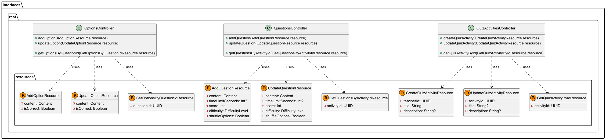

# Capítulo IV: Solution Software Design

## 4.1. Strategic-Level Domain-Driven Design

El **Strategic-Level Domain-Driven Design** constituye la base fundamental para el desarrollo de la aplicación LevelUpJourney. Este enfoque nos permite identificar y definir los límites de los contextos de dominio, establecer las relaciones entre ellos y crear una arquitectura de software sólida que soporte los objetivos del negocio.

En esta fase estratégica, nos enfocamos en:
- **Comprensión profunda del dominio**: Identificación de los procesos de negocio críticos
- **Definición de bounded contexts**: Establecimiento de límites claros entre diferentes áreas funcionales
- **Modelado de relaciones**: Definición de cómo interactúan los diferentes contextos
- **Arquitectura de alto nivel**: Diseño de la estructura general del sistema

### 4.1.1. EventStorming

El **EventStorming** es una técnica de modelado colaborativo que nos permite explorar y comprender el dominio complejo de LevelUpJourney. Esta técnica facilita la identificación de eventos de dominio, comandos, agregados y bounded contexts a través de sesiones colaborativas con expertos del dominio.

#### 4.1.1.1. Candidate Context Discovery

La **Candidate Context Discovery** es el proceso mediante el cual identificamos los posibles bounded contexts dentro del dominio de LevelUpJourney. Este proceso se basa en el análisis de los eventos, comandos y agregados identificados durante las sesiones de EventStorming.

##### Contextos candidatos identificados:
- **Identity and Access Management (IAM)**: Gestión de usuarios, autenticación y autorización
- **API Gateway**: Enrutamiento, seguridad y gestión de APIs
- **Challenges**: Gestión de desafíos y retos académicos
- **Community**: Interacciones sociales, foros y colaboración
- **Code Runner**: Ejecución y evaluación de código
- **Class Activities**: Gestión de actividades académicas y seguimiento del progreso
- **Analytics**: Análisis de datos y métricas para mejorar el rendimiento y la experiencia del usuario
- **User Profile**: Gestión de información personal del usuario

##### Flows de eventos principales:
- **Registro de usuario**: Flujo desde la creación de cuenta

- **Publicacion de un Post**: Creacion de un post y aumento de puntos de actividad al profesor que publica

- **Crear Analitica cuando un post es visto**: Cada vez que un post es visto, se crea una nueva analitica
  

- **Crear un Quiz Activity**: Flujo desde la creacion de un quiz activity

- **Empezar una sesion de clase en vivo**: Flujo desde el inicio de una sesion en vivo

- **Un participante ingresa mediante QR a una sesion en vivo**: Flujo desde que un participante ingresa a una sesion en vivo mediante QR

- **El profesor empieza con las preguntas interactivas**: Flujo desde que el profesor inicia las preguntas interactivas

- **El estudiante responde a una pregunta interactiva**: Flujo desde que el estudiante responde a una pregunta interactiva

- **El profesor termina una pregunta interactiva**: Flujo desde que el profesor termina una pregunta interactiva

- **El profesor termina la sesion en vivo**: Flujo desde que el profesor termina la sesion en vivo

- **El Estudiante empieza a resolver un challenge**: Flujo desde que el estudiante empieza a resolver un challenge

- **El Estudiante envía su solución a un challenge**: Flujo desde que el estudiante envía su solución a un challenge

#### 4.1.1.2. Domain Message Flows Modeling

El **Domain Message Flows Modeling** mapea cómo los mensajes (eventos, comandos) fluyen entre los diferentes bounded contexts identificados. Este modelado es crucial para entender las dependencias y patrones de comunicación del sistema.

#### 4.1.1.3. Bounded Context Canvases

Los **Bounded Context Canvases** proporcionan una visión detallada de cada contexto delimitado, documentando sus responsabilidades, interfaces, eventos y relaciones con otros contextos.

- **IAM Bounded Context Canvas**

- **Challenges Bounded Context Canvas**

- **Community Bounded Context Canvas**

- **Code Runner Bounded Context Canvas**

- **Class Activities Bounded Context Canvas**

- **Analytics Bounded Context Canvas**

### 4.1.2. Context Mapping

El **Context Mapping** define explícitamente las relaciones entre los bounded contexts identificados, estableciendo patrones de integración y clarificando las responsabilidades de cada contexto en las interacciones.

### 4.1.3. Software Architecture

La **Software Architecture** traduce el diseño estratégico en una arquitectura técnica concreta, proporcionando los diagramas y especificaciones necesarios para guiar la implementación del sistema LevelUpJourney.

#### Principios arquitectónicos adoptados:

1. **Separación de responsabilidades**: Cada bounded context tiene responsabilidades claras
2. **Bajo acoplamiento**: Minimización de dependencias entre contextos
3. **Alta cohesión**: Elementos relacionados están agrupados en el mismo contexto
4. **Escalabilidad**: Capacidad de escalar contextos independientemente
5. **Mantenibilidad**: Facilidad para realizar cambios y evolucionar el sistema

#### 4.1.3.1. Software Architecture Context Level Diagrams

Los **diagramas de nivel de contexto** proporcionan una vista de alto nivel del sistema LevelUpJourney, mostrando cómo interactúa con usuarios externos y sistemas externos.

Identificamos que los usuarios quienes van a interactuar con el sistema son 3.
- Student: Estudiante que participa dentro de la plataforma para mejorar sus habilidades de programación
- Teacher: Profesor que crea contenido para que los estudiantes puedan aprender de manera interactiva y dinamica.
- Admin: Administra la plataforma

Como sistemas externos identificamos:
- Google OAuth Provider: Facilita el inicio de sesión de los usuarios 
- Github OAuth Provider: Facilita el inicio de sesión de los usuarios 

#### 4.1.3.2. Software Architecture Container Level Diagrams

Los **diagramas de nivel de contenedor** descomponen el sistema LevelUpJourney en contenedores de alto nivel, mostrando las principales tecnologías y responsabilidades. Este diagrama ilustra la arquitectura distribuida de microservicios adoptada para garantizar escalabilidad, mantenibilidad y separación de responsabilidades.

##### Análisis del Container Diagram

El Container Diagram de LevelUpJourney presenta una arquitectura basada en microservicios que separa las responsabilidades y permite un desarrollo y despliegue independiente de cada componente. La arquitectura se estructura en las siguientes capas y elementos:

**Capa de Presentación:**
- **Landing Page**: Página web estática desarrollada con tecnologías web modernas que sirve como punto de entrada público al sistema, presentando información institucional y facilitando el registro inicial de usuarios.
- **Web App**: Aplicación web principal construida con React que proporciona una interfaz rica e interactiva para estudiantes, profesores y administradores. Utiliza tecnologías modernas del frontend para ofrecer una experiencia de usuario fluida.
- **Mobile App**: Aplicación móvil nativa que extiende las funcionalidades principales de la plataforma a dispositivos móviles, permitiendo el acceso ubicuo a las actividades de aprendizaje.

**Capa de Gateway:**
- **API Gateway**: Actúa como punto de entrada único y centralizado para todas las comunicaciones entre las aplicaciones cliente y los microservicios backend. Implementa funcionalidades transversales como autenticación, autorización, rate limiting, logging y enrutamiento inteligente. Esta centralización simplifica la gestión de políticas de seguridad y mejora la observabilidad del sistema.

**Capa de Microservicios:**
La arquitectura adopta un patrón de microservicios especializados, cada uno con su propia base de datos dedicada (Database per Service pattern):

- **IAM Microservice**: Gestiona la identidad y acceso de usuarios, implementando autenticación segura, autorización basada en roles, y integración con proveedores externos como Google OAuth y GitHub OAuth.
- **Community Microservice**: Facilita las interacciones sociales entre usuarios, publicaciones, comentarios y sistemas de puntuación que fomentan la colaboración.
- **Challenges Microservice**: Administra el catálogo de desafíos de programación, incluyendo su creación, categorización, dificultad y evaluación automática de soluciones.
- **Class Activities Microservice**: Coordina las actividades académicas en tiempo real, como sesiones de clase interactivas, quizzes en vivo, y seguimiento del progreso estudiantil.
- **Analytics Microservice**: Recopila, procesa y analiza métricas de uso y rendimiento, proporcionando insights valiosos para la mejora continua de la plataforma.
- **Code Runner Microservice**: Ejecuta y evalúa código de manera segura en un entorno aislado, soportando múltiples lenguajes de programación y proporcionando retroalimentación inmediata.
- **User Profile Microservice**: Mantiene y gestiona la información personal de los usuarios, preferencias, historial académico y configuraciones personalizadas.

**Decisiones Tecnológicas Principales:**
- **Arquitectura de Microservicios**: Permite escalabilidad independiente, despliegues aislados y uso de tecnologías específicas para cada dominio.
- **API Gateway Pattern**: Centraliza la gestión de APIs y simplifica la comunicación cliente-servidor.
- **Database per Service**: Garantiza la autonomía de datos de cada microservicio y evita acoplamiento entre contextos.
- **Comunicación Asíncrona**: Los microservicios se comunican mediante eventos y mensajería asíncrona para mantener bajo acoplamiento.
- **Tecnologías Modernas**: React para frontend web, aplicaciones móviles nativas, y tecnologías cloud-ready para el backend.

**Patrones de Comunicación:**
Los contenedores se comunican siguiendo patrones establecidos:
- **API REST**: Para comunicación síncrona entre aplicaciones cliente y API Gateway.
- **Event-Driven Architecture**: Para comunicación asíncrona entre microservicios mediante eventos de dominio.
- **Service Discovery**: Para el descubrimiento automático de servicios en el entorno distribuido.
- **Circuit Breaker**: Para manejo de fallos y resiliencia en las comunicaciones entre servicios.

Esta arquitectura asegura que LevelUpJourney pueda escalar eficientemente, mantener alta disponibilidad, y evolucionar de manera independiente en cada uno de sus dominios funcionales.

#### 4.1.3.3. Software Architecture Deployment Diagrams

Los **diagramas de despliegue** muestran cómo los contenedores se mapean a infraestructura física o virtual, incluyendo consideraciones de escalabilidad, disponibilidad y seguridad. Este diagrama visualiza la distribución física del sistema LevelUpJourney, destacando cómo los componentes del software se despliegan sobre la infraestructura en la nube y otros entornos de ejecución.

##### Análisis del Deployment Diagram

El Deployment Diagram de LevelUpJourney presenta una arquitectura cloud-native desplegada en **Microsoft Azure**, diseñada para proporcionar alta disponibilidad, escalabilidad automática y seguridad robusta. La distribución física del sistema se organiza en múltiples capas especializadas que optimizan el rendimiento y la gestión operacional.

**Infraestructura Cloud - Microsoft Azure:**

La solución está completamente desplegada en Microsoft Azure, aprovechando sus servicios administrados para reducir la complejidad operacional y mejorar la confiabilidad del sistema. Esta decisión estratégica permite al equipo enfocarse en el desarrollo de funcionalidades de negocio mientras Azure maneja la infraestructura subyacente.

**Arquitectura de Contenedores - Azure Container Instances (ACI):**

Todos los servicios de aplicación se ejecutan en contenedores Docker desplegados en Azure Container Instances, proporcionando:

- **Aislamiento**: Cada servicio opera en su propio contenedor independiente
- **Portabilidad**: Los contenedores pueden moverse entre entornos sin modificaciones
- **Escalabilidad**: Capacidad de escalar horizontalmente según demanda
- **Gestión simplificada**: Despliegue y actualización automatizada de servicios

**Capa de Presentación (Frontend Tier):**

- **Web Server (Docker)**: Aloja múltiples aplicaciones frontend:
  - **Landing Page (Astro)**: Página estática optimizada para SEO y rendimiento
  - **Web App (Next.js)**: Aplicación web principal con SSR/SPA híbrido
  - **Student & Teacher Portal**: Interfaces especializadas para cada tipo de usuario

- **Mobile API Server (Docker)**: Servidor proxy especializado que gestiona las comunicaciones entre la aplicación móvil Flutter y el API Gateway, optimizando el tráfico móvil y proporcionando caché específico.

**Capa de Gateway:**

- **API Gateway (Spring Boot)**: Punto de entrada centralizado que implementa:
  - Enrutamiento inteligente hacia microservicios
  - Autenticación y autorización centralizadas
  - Rate limiting y throttling
  - Logging y monitoreo centralizado
  - Load balancing hacia servicios backend

**Capa de Microservicios (Microservices Tier):**

La arquitectura despliega múltiples microservicios especializados, cada uno en su propio contenedor:

- **IAM Service**: Gestión de identidad y acceso con integración OAuth
- **User Profile Service**: Administración de perfiles de usuario
- **Challenges Service**: Gestión del catálogo de desafíos
- **Community Service**: Funcionalidades sociales y colaborativas
- **Class Activities Service**: Coordinación de actividades académicas
- **Analytics Service**: Procesamiento y análisis de métricas
- **Code Runner Cluster**: Cluster escalable para ejecución de código con múltiples instancias

**Cluster de Code Runner - Escalabilidad Horizontal:**

El servicio Code Runner está diseñado como un cluster horizontalmente escalable con múltiples instancias (CodeRunner 1, 2, ..., N) implementadas en **Go con framework Gin**. Esta arquitectura permite:

- **Auto-scaling**: Escalado automático basado en carga de trabajo
- **Distribución de carga**: Procesamiento paralelo de ejecuciones de código
- **Aislamiento de seguridad**: Cada instancia ejecuta código en entornos aislados
- **Alta disponibilidad**: Tolerancia a fallos con instancias redundantes

**Capa de Datos - Azure Database Services:**

La capa de datos utiliza servicios administrados de Azure Database para garantizar alta disponibilidad y gestión automática:

- **Azure Database for PostgreSQL**: Para la mayoría de microservicios (IAM, User Profile, Challenges, Class Activities, Code Runner, Analytics)
- **MongoDB**: Para el servicio Community, aprovechando la flexibilidad de documentos para datos sociales

**Consideración de Azure Cosmos DB como Alternativa:**

Como parte de la estrategia de optimización en la nube, se puede considerar **Azure Cosmos DB con API de MongoDB** como una evolución natural del actual deployment de MongoDB. Esta migración ofrecería ventajas significativas:

- **Escalabilidad Global**: Distribución automática de datos a nivel mundial con latencia mínima
- **Alta Disponibilidad**: SLA del 99.999% con replicación automática multi-región
- **Gestión Completamente Administrada**: Eliminación de tareas operacionales como patching, backups y monitoreo
- **Escalado Automático**: Ajuste dinámico de throughput basado en demanda real
- **Compatibilidad Total**: API wire-protocol compatible con MongoDB, permitiendo migración sin cambios de código
- **Seguridad Empresarial**: Cifrado en reposo y en tránsito, integración con Azure Active Directory
- **Costo-Beneficio**: Modelo de pricing por consumo que optimiza costos operacionales

La transición sería transparente para la aplicación, manteniendo todas las funcionalidades existentes mientras se obtienen los beneficios de una plataforma cloud-native completamente administrada.

**Infraestructura de Mensajería:**

- **Apache Kafka**: Implementado en contenedor Docker para comunicación asíncrona entre microservicios, facilitando arquitectura orientada a eventos y desacoplamiento temporal.

**Integraciones Externas:**

- **OAuth Providers**: Integración con GitHub OAuth y Google OAuth para autenticación federada
- **Acceso de Usuarios**: Soporte multi-plataforma (Web, Mobile) con conexiones HTTPS seguras

**Decisiones de Tecnología y Justificación:**

1. **Microsoft Azure**: Plataforma cloud robusta con servicios administrados
2. **Docker + ACI**: Containerización para portabilidad y gestión simplificada
3. **Spring Boot**: Framework Java maduro para microservicios empresariales
4. **Next.js**: Framework React con SSR para rendimiento web optimizado
5. **Flutter**: Framework cross-platform para aplicaciones móviles nativas
6. **PostgreSQL**: Base de datos relacional robusta y confiable
7. **MongoDB**: Base de datos NoSQL para flexibilidad en datos sociales
8. **Apache Kafka**: Sistema de mensajería distribuida para comunicación asíncrona
9. **Go + Gin**: Lenguaje de alto rendimiento para ejecución intensiva de código

**Consideraciones de Seguridad:**

- **HTTPS/TLS**: Todas las comunicaciones externas cifradas
- **OAuth 2.0**: Autenticación federada con proveedores confiables
- **Network Isolation**: Servicios internos aislados del acceso directo externo
- **Container Security**: Imágenes Docker escaneadas y actualizadas regularmente
- **Database Security**: Bases de datos administradas con cifrado en reposo y tránsito

**Escalabilidad y Disponibilidad:**

- **Horizontal Scaling**: Microservicios pueden escalar independientemente
- **Auto-scaling**: Code Runner cluster con escalado automático
- **Load Balancing**: API Gateway distribuye carga entre instancias
- **Database Scaling**: Servicios administrados de Azure con escalado automático
- **Geographic Distribution**: Potencial para despliegue multi-región

##### Posibilidades de Mejora

Para fortalecer y optimizar el deployment actual, se identifican las siguientes oportunidades de mejora:

**1. Mejoras en Alta Disponibilidad:**
- **Multi-Region Deployment**: Implementar despliegue en múltiples regiones de Azure para reducir latencia global y proporcionar tolerancia a fallos geográficos
- **Azure Kubernetes Service (AKS)**: Migrar de ACI a AKS para obtener mayor control sobre orquestación, auto-healing y gestión avanzada de contenedores
- **Database Replicas**: Configurar réplicas de lectura geográficamente distribuidas para mejorar rendimiento y disponibilidad de datos

**2. Optimizaciones de Rendimiento:**
- **Content Delivery Network (CDN)**: Implementar Azure CDN para distribución global de contenido estático y reducción de latencia
- **Caching Layer**: Introducir Azure Redis Cache para caché distribuido y mejora de tiempos de respuesta
- **Database Connection Pooling**: Implementar connection pooling avanzado para optimizar conexiones a bases de datos

**3. Mejoras en Seguridad:**
- **Azure Key Vault**: Centralizar gestión de secretos, certificados y claves de cifrado
- **Web Application Firewall (WAF)**: Implementar WAF para protección contra ataques web comunes
- **Azure Security Center**: Integrar monitoreo de seguridad continuo y detección de amenazas
- **Network Security Groups**: Configurar reglas de firewall granulares entre servicios
- **Private Endpoints**: Implementar endpoints privados para comunicación interna segura

**4. Observabilidad y Monitoreo:**
- **Azure Application Insights**: Implementar APM (Application Performance Monitoring) completo
- **Centralized Logging**: Configurar Azure Log Analytics para agregación centralizada de logs
- **Distributed Tracing**: Implementar trazabilidad distribuida para debugging en microservicios
- **Health Checks**: Configurar health checks avanzados y alertas proactivas

**5. Optimizaciones de Costo:**
- **Azure Reserved Instances**: Utilizar instancias reservadas para reducir costos de compute
- **Spot Instances**: Implementar Spot Instances para cargas de trabajo no críticas
- **Auto-scaling Policies**: Refinar políticas de auto-scaling para optimizar costos vs. rendimiento
- **Resource Tagging**: Implementar tagging comprehensive para gestión de costos por proyecto/entorno

**6. DevOps y CI/CD:**
- **Azure DevOps Pipelines**: Implementar pipelines de CI/CD completamente automatizados
- **GitOps**: Adoptar prácticas GitOps para gestión declarativa de infraestructura
- **Blue-Green Deployment**: Implementar estrategias de despliegue sin downtime
- **Infrastructure as Code**: Migrar toda la infraestructura a Terraform o ARM Templates

**7. Escalabilidad Avanzada:**
- **Event-Driven Autoscaling**: Implementar escalado basado en eventos de Kafka
- **Microservices Mesh**: Considerar Service Mesh (Istio) para comunicación inter-servicios avanzada
- **Serverless Components**: Migrar componentes apropiados a Azure Functions para escalado automático
- **Database Sharding**: Implementar sharding horizontal para bases de datos de alto volumen

**8. Backup y Disaster Recovery:**
- **Automated Backups**: Configurar backups automatizados cross-region
- **Disaster Recovery Plan**: Implementar plan de recuperación ante desastres con RTO/RPO definidos
- **Data Replication**: Configurar replicación asíncrona para continuidad de negocio

Estas mejoras proporcionarían una arquitectura de producción robusta, escalable y enterprise-ready, capaz de soportar el crecimiento futuro de LevelUpJourney mientras mantiene altos estándares de rendimiento, seguridad y disponibilidad.

## 4.2. Tactical-Level Domain-Driven Design

### Introducción al Diseño Táctico

El **Tactical-Level Domain-Driven Design** representa la materialización concreta del diseño estratégico definido anteriormente. En esta sección, profundizamos en la implementación específica de cada bounded context identificado, detallando sus capas arquitectónicas, componentes internos y relaciones. Este nivel táctico se enfoca en los patrones de implementación, la organización del código y la estructura interna de cada contexto delimitado, asegurando que el diseño estratégico se traduzca efectivamente en una arquitectura de software robusta y mantenible.

Para el sistema LevelUpJourney, hemos identificado seis bounded contexts principales que cubren las necesidades fundamentales de la plataforma: **IAM** (Identity and Access Management) para la gestión de identidades y autenticación, **API Gateway** como punto de entrada unificado y gestión de APIs, **Community** para las funcionalidades sociales y de comunidad, **Code Runner** para la ejecución y evaluación de código, **Class Activities** para la gestión de actividades académicas y seguimiento del progreso estudiantil, y **Analytics**.

### 4.2.1. Bounded Context: Challenges
#### 4.2.1.1. Domain Layer

## Challenges

### Entities y Aggregates
- **Challenge**  
  Representa el agregado raíz que contiene la información principal de un reto: su identificador, profesor, nombre, descripción, puntos de experiencia, estado, versiones de código y etiquetas.  
- **CodeVersion**  
  Representa una versión de código asociada a un reto. Incluye el lenguaje, código inicial y pruebas.  
- **CodeVersionTest**  
  Define los casos de prueba que deben ejecutarse para validar la versión de código.  

### Value Objects
- **ChallengeId, TeacherId, CodeVersionId, CodeVersionTestId**: identificadores únicos.  
- **ChallengeTag**: etiqueta asociada al reto (id, nombre, color, icono).  
- **ChallengeStatus**: estado de un reto (`DRAFT`, `PUBLISHED`, `HIDDEN`).  
- **CodeLanguage**: lenguaje de programación (`C_PLUS_PLUS`, `JAVASCRIPT`, `PYTHON`).  

### Commands
- **CreateChallengeCommand, UpdateChallengeCommand, PublishChallengeCommand, StartChallengeCommand, AddCodeVersionCommand, UpdateCodeVersionCommand, AddCodeVersionTestCommand, UpdateCodeVersionTestCommand**  
  Representan acciones de modificación del dominio.  

### Queries
- **GetChallengeByIdQuery, GetPublishedChallengesQuery, GetChallengesByTeacherIdQuery, GetAllChallengeTagsQuery, GetCodeVersionByIdQuery, GetCodeVersionsByChallengeIdQuery**  
  Representan consultas para obtener información del dominio.  

### Domain Services
- **ChallengeCommandService, CodeVersionCommandService, CodeVersionTestCommandService, ChallengeQueryService, CodeVersionQueryService**  
  Definen la lógica de aplicación que orquesta la ejecución de los comandos y queries.  

## Reports

### Entities y Aggregates
- **Report**  
  Representa el reporte de una solución enviada por un estudiante, con métricas como pruebas exitosas, tiempo y memoria utilizada.  

### Value Objects
- **SolutionReportId, SolutionId, StudentId**: identificadores únicos.  

### Commands
- **CreateSolutionReportCommand**  
  Comando para generar un nuevo reporte de solución.  

### Queries
- **GetReportsBySolutionIdQuery**  
  Consulta para obtener los reportes de una solución específica.  

## Solutions

### Entities y Aggregates
- **Solution**  
  Representa la solución enviada por un estudiante a un reto específico. Incluye el reto, versión de código, estudiante y detalles de la solución.  
- **SolutionDetails**  
  Objeto que contiene información sobre intentos, código, último intento y estado de la solución.  

### Value Objects
- **SolutionId, ChallengeId, CodeVersionId, StudentId**: identificadores únicos.  
- **SolutionStatus**: estado de la solución (`SUCCESS`, `FAILED`, `MAX_ATTEMPTS_REACHED`).  

### Commands
- **CreateSolutionCommand, UpdateSolutionCommand, SubmitSolutionCommand**  
  Comandos que permiten crear, actualizar o enviar una solución.  

### Queries
- **GetSolutionByIdQuery, GetSolutionsByStudentIdQuery, GetSolutionsByChallengeIdQuery**  
  Consultas para recuperar información de las soluciones.  

### Domain Services
- **SolutionCommandService, SolutionQueryService**  
  Interfaces que definen la lógica de orquestación entre los comandos y consultas del dominio de soluciones.  

#### 4.2.1.2. Interface Layer

## Challenges

### Controllers
- **ChallengesController**  
  Expone endpoints para crear, actualizar, publicar, iniciar y consultar retos.  
- **CodeVersionsController**  
  Expone endpoints para agregar y actualizar versiones de código, así como para consultarlas.  
- **CodeVersionTestsController**  
  Expone endpoints para agregar y actualizar pruebas de las versiones de código.  

### Resources
- **CreateChallengeResource, UpdateChallengeResource, PublishChallengeResource, StartChallengeResource**: recursos de entrada para acciones sobre retos.  
- **AddCodeVersionResource, UpdateCodeVersionResource**: recursos de entrada para manejar versiones de código.  
- **AddCodeVersionTestResource, UpdateCodeVersionTestResource**: recursos de entrada para manejar pruebas de versiones de código.  
- **GetChallengeByIdResource, GetChallengesByTeacherIdResource, GetCodeVersionByIdResource, GetCodeVersionsByChallengeIdResource**: recursos de entrada para parámetros de consultas.  

## Reports

### Controller
- **SolutionReportsController**  
  Expone endpoints para crear reportes de soluciones y consultar reportes por id de solución.  

### Resources
- **CreateSolutionReportResource**: recurso de entrada para crear un reporte de solución.  
- **GetReportsBySolutionIdResource**: recurso de entrada para consultar reportes asociados a una solución.  

## Solutions

### Controller
- **SolutionsController**  
  Expone endpoints para crear, actualizar, enviar y consultar soluciones.  

### Resources
- **CreateSolutionResource, UpdateSolutionResource, SubmitSolutionResource**: recursos de entrada para manipular soluciones.  
- **GetSolutionByIdResource, GetSolutionsByStudentIdResource, GetSolutionsByChallengeIdResource**: recursos de entrada para consultas de soluciones.  

### Challenges Interface

### Solution Interface

### Solution Report Interface

#### 4.2.1.3. Application Layer

En la **Application Layer** se gestionan los flujos de procesos del negocio mediante la definición de **Command Handlers** y **Query Handlers**, los cuales materializan las capacidades del bounded context y orquestan las interacciones con el dominio.  

### Challenges
- **Command Handlers**:  
  - `ChallengeCommandServiceImpl` procesa comandos como `CreateChallengeCommand`, `PublishChallengeCommand`, `StartChallengeCommand`, `UpdateChallengeCommand`.  
  - `CodeVersionCommandServiceImpl` procesa comandos como `AddCodeVersionCommand`, `UpdateCodeVersionCommand`.  
  - `CodeVersionTestCommandServiceImpl` procesa comandos como `AddCodeVersionTestCommand`, `UpdateCodeVersionTestCommand`.  

- **Query Handlers**:  
  - `ChallengeQueryServiceImpl` resuelve consultas como `GetChallengeByIdQuery`, `GetPublishedChallengesQuery`, `GetChallengesByTeacherIdQuery`, `GetAllChallengeTagsQuery`.  
  - `CodeVersionQueryServiceImpl` resuelve consultas como `GetCodeVersionByIdQuery`, `GetCodeVersionsByChallengeIdQuery`.  

### SolutionReports
- **Command Handlers**:  
  - `SolutionReportCommandServiceImpl` procesa el comando `CreateSolutionReportCommand`.  

- **Query Handlers**:  
  - `SolutionReportQueryServiceImpl` resuelve consultas como `GetReportsBySolutionIdQuery`.  

### Solutions
- **Command Handlers**:  
  - `SolutionCommandServiceImpl` procesa comandos como `CreateSolutionCommand`, `UpdateSolutionCommand`, `SubmitSolutionCommand`.  

- **Query Handlers**:  
  - `SolutionQueryServiceImpl` resuelve consultas como `GetSolutionByIdQuery`, `GetSolutionsByStudentIdQuery`, `GetSolutionsByChallengeIdQuery`.  

### Challenges Application

### Solution Application

### Solution Report Application

#### 4.2.1.4. Infrastructure Layer

En la **Infrastructure Layer** se muestran las clases encargadas de conectar la aplicación con servicios externos, particularmente **bases de datos** y la **implementación de los repositorios** definidos en el **Domain Layer**.  

En los diagramas presentados:  

- Para **Challenges**, se definen repositorios especializados (`ChallengeRepository`, `CodeVersionRepository`, `CodeVersionTestRepository`, `ChallengeTagRepository`) que permiten consultar, guardar o eliminar entidades como `Challenge`, `CodeVersion`, `CodeVersionTest` y `ChallengeTag`. Cada repositorio hereda de `JpaRepository`, lo que asegura las operaciones genéricas (CRUD) y a la vez incorpora consultas específicas del dominio (como `findByTeacherId`, `findPublishedChallenges` o `findByCodeVersionId`).  

- Para **SolutionReports**, el `SolutionReportRepository` implementa operaciones de persistencia y consultas específicas relacionadas con reportes (`Report`), vinculando a entidades del dominio como `SolutionId`, `StudentId` y `SolutionReportId`.  

- Para **Solutions**, el `SolutionRepository` también hereda de `JpaRepository` y administra la persistencia de la entidad `Solution`. Ofrece métodos de búsqueda específicos del dominio, como filtrar por estudiante (`findByStudentId`), desafío (`findByChallengeId`) o estado (`findByStatus`).  

### Challenges Infrastructure

### Solution Infrastructure

### Solution Report Infrastructure

#### 4.2.1.5. Bounded Context Software Architecture Component Level Diagrams

#### 4.2.1.6. Bounded Context Software Architecture Code Level Diagrams
##### 4.2.1.6.1. Bounded Context Domain Layer Class Diagrams

### Challenges Domain

### Solution Domain

### Solution Report Domain

##### 4.2.1.6.2. Bounded Context Database Design Diagram

### Challenges Database Diagram

### Solution Database Diagram

### Solution Report Database Diagram

### 4.2.2. Bounded Context: Class Activities
#### 4.2.2.1. Domain Layer

### Value Objects
En los diagramas se definen múltiples objetos de valor que encapsulan identificadores y propiedades inmutables que representan conceptos centrales del dominio:

- **ActivityId, TeacherId, QuestionId, OptionId, SessionId, ParticipantId, AnswerId, CurrentQuestionId**: encapsulan la identidad de cada entidad del dominio asegurando unicidad.
- **Content**: modela el contenido de una pregunta u opción, compuesto por un tipo (`ContentType`) y un valor de texto o imagen.
- **Enums** como `ContentType`, `DifficultyLevel`, `SessionStatus` y `ParticipantStatus` restringen los valores válidos en el dominio para mantener consistencia.

### Aggregates y Entities
El dominio se organiza alrededor de agregados que representan raíces de consistencia y controlan las reglas de negocio internas:

- **QuizActivity (Aggregate Root)**: representa la actividad de un cuestionario creada por un profesor, con metadatos, preguntas asociadas y control de fechas.
- **Question (Entity)**: entidad que pertenece a un `QuizActivity`, define enunciado, puntaje, límite de tiempo, dificultad y sus opciones.
- **Option (Entity)**: define el contenido de cada opción de respuesta y determina si es correcta o no.
- **LiveSession (Aggregate Root)**: representa una sesión en vivo asociada a una actividad y un profesor, gestiona participantes, estado de la sesión y la pregunta actual.
- **Participant (Entity)**: participante de la sesión en vivo, con nombre, puntaje, estado y respuestas asociadas.
- **Answer (Entity)**: respuesta seleccionada por un participante para una pregunta determinada en la sesión.
- **CurrentQuestion (Entity)**: mantiene la pregunta activa en la sesión en vivo junto con tiempos de inicio y fin.

### Commands y Queries
Se definen **comandos** y **consultas** como objetos de transporte que encapsulan intenciones de modificación o lectura del dominio:

- **Commands**: `CreateQuizActivityCommand`, `AddQuestionCommand`, `AddOptionCommand`, `UpdateQuestionCommand`, `CreateLiveSessionCommand`, `JoinSessionCommand`, `LeaveSessionCommand`, `StartSessionCommand`, `LoadQuestionCommand`, `EndCurrentQuestionCommand`, `SendAnswerCommand`, `CloseSessionCommand`.
- **Queries**: `GetQuizActivityByIdQuery`, `GetQuestionsByActivityIdQuery`, `GetOptionsByQuestionIdQuery`, `GetLiveSessionByIdQuery`, `GetParticipantsBySessionIdQuery`, `GetLeaderboardQuery`, `GetCurrentQuestionQuery`, `GetCurrentQuestionDetailsQuery`.

### Domain Services
Se modelan como interfaces que representan contratos para la ejecución de reglas de negocio relacionadas con comandos y consultas:

- **Command Services**: `QuizActivityCommandService`, `QuestionCommandService`, `OptionCommandService`, `LiveSessionCommandService`.
- **Query Services**: `QuizActivityQueryService`, `QuestionQueryService`, `OptionQueryService`, `LiveSessionQueryService`.

Estas interfaces garantizan separación de responsabilidades y un punto claro de interacción con la lógica del dominio.

### Repositories (Abstracciones)
Aunque en los diagramas no se muestran implementaciones específicas de repositorios, se asume la existencia de **interfaces de Repository** en la capa de dominio para la persistencia de agregados como `QuizActivity` o `LiveSession`. Estas actúan como puertos que serán implementados en la capa de infraestructura.

### Activities Manager Domain

### Class Activity Session Manager Domain

#### 4.2.2.2. Interface Layer

## 1. Bounded Context: QuizActivities

### Controllers
- **QuizActivitiesController**  
  Expone endpoints para crear, actualizar y consultar actividades de tipo cuestionario.  
- **QuestionsController**  
  Expone endpoints para agregar, actualizar y consultar preguntas asociadas a una actividad.  
- **OptionsController**  
  Expone endpoints para agregar, actualizar y consultar opciones asociadas a una pregunta.  

### Resources
- **CreateQuizActivityResource, UpdateQuizActivityResource**: recursos de entrada para crear o actualizar actividades de cuestionario.  
- **AddQuestionResource, UpdateQuestionResource**: recursos de entrada para agregar o actualizar preguntas.  
- **AddOptionResource, UpdateOptionResource**: recursos de entrada para agregar o actualizar opciones de una pregunta.  
- **GetQuizActivityByIdResource, GetQuestionsByActivityIdResource, GetOptionsByQuestionIdResource**: recursos de entrada para parámetros de consultas.  

## 2. Bounded Context: LiveSessions

### Controller
- **LiveSessionsController**  
  Expone endpoints para gestionar sesiones en vivo: crear, unirse, salir, iniciar, cargar preguntas, terminar preguntas, enviar respuestas, cerrar sesión y realizar consultas asociadas a la sesión en vivo.  

### Resources
- **CreateLiveSessionResource, JoinSessionResource, LeaveSessionResource, StartSessionResource, LoadQuestionResource, EndCurrentQuestionResource, SendAnswerResource, CloseSessionResource**: recursos de entrada para las acciones de gestión de sesiones en vivo.  
- **GetLiveSessionByIdResource, GetParticipantsBySessionIdResource, GetLeaderboardResource, GetCurrentQuestionResource, GetCurrentQuestionDetailsResource**: recursos de entrada para parámetros de consultas relacionadas con sesiones, participantes, ranking y preguntas actuales.  
- **CurrentQuestionResponse**: recurso de salida que representa la pregunta actual activa en la sesión.  

### Activities Manager Interface

### Class Activity Session Manager Interface

#### 4.2.2.3. Application Layer

### QuizActivity
- **Command Handlers**:  
  - `QuizActivityCommandServiceImpl` procesa el comando `CreateQuizActivityCommand`.  
  - `QuestionCommandServiceImpl` procesa los comandos `AddQuestionCommand`, `UpdateQuestionCommand`.  
  - `OptionCommandServiceImpl` procesa el comando `AddOptionCommand`.  

- **Query Handlers**:  
  - `QuizActivityQueryServiceImpl` resuelve consultas como `GetQuizActivityByIdQuery`.  
  - `QuestionQueryServiceImpl` resuelve consultas como `GetQuestionsByActivityIdQuery`.  
  - `OptionQueryServiceImpl` resuelve consultas como `GetOptionsByQuestionIdQuery`.  

### LiveSession
- **Command Handlers**:  
  - `LiveSessionCommandServiceImpl` procesa comandos como `CreateLiveSessionCommand`, `JoinSessionCommand`, `LeaveSessionCommand`, `StartSessionCommand`, `LoadQuestionCommand`, `EndCurrentQuestionCommand`, `SendAnswerCommand`, `CloseSessionCommand`.  

- **Query Handlers**:  
  - `LiveSessionQueryServiceImpl` resuelve consultas como `GetLiveSessionByIdQuery`, `GetParticipantsBySessionIdQuery`, `GetLeaderboardQuery`, `GetCurrentQuestionQuery`, `GetCurrentQuestionDetailsQuery`.  

### Activities Manager Application

### Class Activity Session Manager Application

#### 4.2.2.4. Infrastructure Layer

En los diagramas presentados:  

- Para **QuizActivity**, el `QuizActivityRepository` gestiona la entidad `QuizActivity` y permite consultas específicas por `TeacherId`, búsqueda por título y filtrado por fechas de creación.  
  El `QuestionRepository` administra las entidades `Question`, ofreciendo búsquedas por `ActivityId`, dificultad (`DifficultyLevel`) y orden cronológico, además de permitir eliminación en cascada por actividad.  
  El `OptionRepository` gestiona las entidades `Option`, habilitando búsquedas por `QuestionId`, opciones correctas o en orden de creación, así como eliminación de opciones ligadas a una pregunta.  

- Para **LiveSession**, el `LiveSessionRepository` administra sesiones en vivo (`LiveSession`) y permite consultas por `TeacherId`, `ActivityId` y `SessionStatus`.  
  El `ParticipantRepository` gestiona la entidad `Participant`, ofreciendo consultas por `SessionId`, estado del participante (`ParticipantStatus`), orden por puntaje y búsquedas específicas de un participante dentro de una sesión.  
  El `AnswerRepository` se encarga de las entidades `Answer`, habilitando consultas por `SessionId`, `ParticipantId` y `QuestionId`, así como combinaciones entre ellos, además de la eliminación de respuestas por sesión.  
  El `CurrentQuestionRepository` gestiona la entidad `CurrentQuestion`, con búsquedas por `SessionId`, estado activo e incluso consultas globales por preguntas activas, junto con operaciones de eliminación ligadas a una sesión.  

### Activities Manager Infrastructure

### Class Activity Session Manager Infrastructure

#### 4.2.2.5. Bounded Context Software Architecture Component Level Diagrams

#### 4.2.2.6. Bounded Context Software Architecture Code Level Diagrams
##### 4.2.2.6.1. Bounded Context Domain Layer Class Diagrams

##### 4.2.2.6.2. Bounded Context Database Design Diagram
### Activities Manager Database Design

### Class Activity Session Manager Database Design

### 4.2.3. Bounded Context: Community
#### 4.2.3.1. Domain Layer

La **Domain Layer** del bounded context **Community** constituye el núcleo social de la plataforma LevelUpJourney, enfocándose en facilitar la interacción, colaboración y construcción de comunidad entre usuarios. Esta capa encapsula las reglas de negocio relacionadas con la creación de contenido, participación social y sistemas de engagement que fomentan el aprendizaje colaborativo.

**Agregados (Aggregates):**

El dominio se estructura alrededor de un agregado principal que gestiona todas las interacciones sociales:

**1. Post Aggregate (Community Manager):**
- **Post**: Entidad raíz que representa una publicación creada por usuarios en la plataforma. Actúa como el centro de la interacción social, conteniendo contenido multimedia, comentarios asociados y métricas de engagement.
- **Comment**: Entidad que representa respuestas y discusiones vinculadas a publicaciones específicas. Permite crear hilos de conversación y facilita el intercambio de ideas entre usuarios.
- **Like**: Entidad que registra las reacciones positivas de usuarios hacia publicaciones y comentarios, creando métricas de popularidad y engagement.

**Value Objects:**

Los Value Objects proporcionan encapsulación de conceptos de dominio y type safety:

*Identificadores:*
- **PostId**: Identificador único para publicaciones
- **CommentId**: Identificador único para comentarios
- **UserId**: Identificador de usuarios del sistema

*Objetos de Contenido:*
- **Content**: Value Object complejo que encapsula el contenido de publicaciones, incluyendo texto y URLs de medios multimedia (imágenes, videos, documentos)
- **CommentContent**: Value Object especializado para comentarios que permite solo contenido textual, manteniendo las discusiones enfocadas y accesibles

*Objetos de Auditoría:*
- **Auditable**: Value Object que encapsula metadatos temporales para trazabilidad completa, incluyendo timestamps de creación y última modificación

**Commands (Comandos):**

Los comandos representan intenciones de acción social y operaciones de escritura:

*Post Commands:*
- **CreatePost**: Creación de nuevas publicaciones con contenido multimedia
- **EditPost**: Modificación de publicaciones existentes manteniendo historial
- **DeletePost**: Eliminación de publicaciones y contenido asociado

*Comment Commands:*
- **AddComment**: Adición de comentarios a publicaciones específicas
- **EditComment**: Modificación de comentarios existentes
- **DeleteComment**: Eliminación de comentarios individuales

*Engagement Commands:*
- **LikePost**: Registro de reacción positiva hacia publicación
- **UnlikePost**: Retiro de reacción positiva de publicación
- **LikeComment**: Registro de reacción positiva hacia comentario
- **UnlikeComment**: Retiro de reacción positiva de comentario

**Queries (Consultas):**

Las queries encapsulan operaciones de lectura optimizadas para la experiencia social:

*Post Queries:*
- **GetPostById**: Recuperación de publicación específica con metadatos completos
- **GetAllPosts**: Listado de publicaciones con paginación y filtros
- **GetLikesByPostId**: Métricas de engagement para publicación específica

*Comment Queries:*
- **GetCommentsByPostId**: Hilos de comentarios organizados por publicación
- **GetCommentById**: Recuperación de comentario específico
- **GetLikesByCommentId**: Métricas de engagement para comentario específico

**Domain Services:**

Los servicios de dominio coordinan operaciones sociales complejas:

*Content Management Services:*
- **PostCommandService**: Gestión completa del ciclo de vida de publicaciones incluyendo operaciones de engagement
- **CommentCommandService**: Administración de comentarios y sus interacciones sociales

*Query Services:*
- **PostQueryService**: Consultas optimizadas para publicaciones con métricas agregadas
- **CommentQueryService**: Acceso eficiente a comentarios con contexto de conversación

**Reglas de Negocio Encapsuladas:**

1. **Integridad de Contenido**: Las publicaciones deben contener al menos texto o media URLs válidas
2. **Restricciones de Comentarios**: Los comentarios solo pueden contener texto, sin medios multimedia para mantener simplicidad
3. **Unicidad de Likes**: Un usuario puede dar like solo una vez por publicación o comentario
4. **Propiedad de Contenido**: Solo el autor puede editar o eliminar sus propias publicaciones y comentarios
5. **Cascada de Eliminación**: Al eliminar una publicación, se eliminan automáticamente todos los comentarios y likes asociados
6. **Auditoría Completa**: Todas las acciones mantienen timestamps para trazabilidad y análisis temporal
7. **Validación de URLs**: Las URLs de medios deben ser válidas y accesibles antes de la publicación
8. **Límites de Contenido**: Restricciones de longitud para texto y número de media URLs por publicación
9. **Prevención de Spam**: Limitaciones temporales para creación de contenido por usuario
10. **Moderación de Contenido**: Validación automática de contenido apropiado antes de publicación

**Métodos de Dominio Especializados:**

*Post Entity Methods:*
- **addComment(comment)**: Agregación de comentario con validaciones de integridad
- **addLike(userId)**: Registro de like con validación de unicidad
- **removeLike(userId)**: Retiro de like con verificación de existencia

*Comment Entity Methods:*
- **editContent(content)**: Modificación de contenido con preservación de historial
- **addLike(userId)**: Gestión de likes en comentarios
- **removeLike(userId)**: Retiro de likes con consistencia

**Patrones de Engagement Social:**

El dominio implementa patrones específicos para fomentar la participación:
- **Immediate Feedback**: Likes instantáneos para gratificación inmediata
- **Threaded Discussions**: Comentarios organizados jerárquicamente
- **Content Ownership**: Control granular sobre contenido propio
- **Social Validation**: Métricas de engagement visibles
- **Temporal Tracking**: Análisis de patrones de actividad social

**Consideraciones de Escalabilidad:**

- **Denormalización Estratégica**: Contadores de likes pre-calculados para rendimiento
- **Paginación Inteligente**: Queries optimizadas para cargas incrementales
- **Caché de Contenido**: Estrategias de caché para contenido frecuentemente accedido
- **Media Optimization**: Gestión eficiente de URLs y recursos multimedia

### Community Manager Domain

#### 4.2.3.2. Interface Layer
### Community Manager Interface

#### 4.2.3.3. Application Layer
### Community Manager Application

#### 4.2.3.4. Infrastructure Layer
### Community Manager Infrastructure

#### 4.2.3.5. Bounded Context Software Architecture Component Level Diagrams

#### 4.2.3.6. Bounded Context Software Architecture Code Level Diagrams
##### 4.2.3.6.1. Bounded Context Domain Layer Class Diagrams
##### 4.2.3.6.2. Bounded Context Database Design Diagram

### Community Manager 

### 4.2.4. Bounded Context: Identity and Access Management (IAM)
#### 4.2.4.1. Domain Layer

La **Domain Layer** del bounded context **Identity and Access Management (IAM)** constituye el núcleo de seguridad y gestión de identidades de la plataforma LevelUpJourney. Esta capa encapsula las reglas de negocio críticas relacionadas con autenticación, autorización, gestión de usuarios y control de acceso, implementando patrones de seguridad robustos y escalables.

**Agregados (Aggregates):**

El dominio se estructura alrededor de un agregado principal que gestiona toda la información de identidad y acceso:

**1. User Aggregate (IAM Manager):**
- **User**: Entidad raíz que representa un usuario autenticado en el sistema. Encapsula credenciales de acceso, información de contacto y roles asignados que determinan los permisos de acceso a diferentes funcionalidades de la plataforma.
- **Role**: Entidad que define los roles disponibles en el sistema, encapsulando permisos y niveles de acceso específicos para diferentes tipos de usuarios.

**Value Objects:**

Los Value Objects proporcionan encapsulación segura de conceptos críticos de seguridad:

*Objetos de Credenciales:*
- **EmailAddress**: Value Object que encapsula direcciones de email con validaciones de formato, normalización y métodos para extraer partes locales y de dominio
- **Password**: Value Object que gestiona contraseñas con validaciones de fortaleza, scoring de seguridad y verificación de políticas de contraseñas
- **TokenPair**: Value Object que encapsula pares de tokens (access/refresh) para autenticación basada en JWT

*Objetos de Integración:*
- **OAuth2UserInfo**: Value Object que encapsula información de usuarios provenientes de proveedores OAuth2 externos (Google, GitHub), facilitando la integración federada

*Enumeraciones de Seguridad:*
- **Roles**: Enumeración que define los roles disponibles en el sistema (ROLE_STUDENT, ROLE_INSTRUCTOR, ROLE_ADMIN)

**Commands (Comandos):**

Los comandos representan intenciones de acción en el sistema de identidad:

*Authentication Commands:*
- **SignUpCommand**: Registro de nuevos usuarios con validación de credenciales y asignación de roles
- **SignInCommand**: Autenticación de usuarios existentes con verificación de credenciales

*System Administration Commands:*
- **SeedRolesCommand**: Inicialización del sistema de roles para bootstrap de la aplicación

**Queries (Consultas):**

Las queries encapsulan operaciones de lectura para gestión de identidades:

*User Management Queries:*
- **GetAllUsersQuery**: Listado completo de usuarios para administración del sistema
- **GetUserByIdQuery**: Recuperación de usuario específico por identificador único
- **GetUserByEmail_addressQuery**: Búsqueda de usuario por dirección de email para autenticación

*Role Management Queries:*
- **GetAllRolesQuery**: Listado de todos los roles disponibles en el sistema
- **GetRoleByNameQuery**: Recuperación de rol específico por nombre para asignaciones

**Domain Services:**

Los servicios de dominio coordinan operaciones complejas de seguridad y gestión de identidades:

*User Management Services:*
- **UserCommandService**: Gestión completa del ciclo de vida de usuarios incluyendo registro, autenticación y generación de tokens
- **UserQueryService**: Consultas optimizadas para recuperación de información de usuarios

*Role Management Services:*
- **RoleCommandService**: Administración de roles del sistema incluyendo inicialización y mantenimiento
- **RoleQueryService**: Consultas especializadas para gestión de roles y permisos

**Métodos de Dominio Especializados:**

*User Entity Methods:*
- **User()**: Constructor por defecto para instanciación básica
- **User(email, password)**: Constructor para creación con credenciales básicas
- **User(email, password, roles)**: Constructor completo con roles asignados
- **addRole(role)**: Adición de rol individual con validaciones de permisos
- **addRoles(roles)**: Asignación múltiple de roles con verificación de consistencia
- **getEmail_address()**: Acceso seguro a dirección de email
- **setEmail_address(email)**: Modificación de email con validaciones
- **getPassword()**: Acceso controlado a contraseña (hash)
- **setPassword(password)**: Actualización de contraseña con políticas de seguridad
- **getPasswordStrength()**: Evaluación de fortaleza de contraseña actual

*Role Entity Methods:*
- **Role()**: Constructor por defecto
- **Role(name)**: Constructor con nombre de rol específico
- **getStringName()**: Representación string del nombre del rol
- **getDefaultRole()**: Método estático para obtener rol por defecto (STUDENT)
- **toRoleFromName(name)**: Conversión desde string a objeto Role
- **validateRoleSet(roles)**: Validación estática de conjuntos de roles

*Value Object Methods:*
- **EmailAddress.normalized()**: Normalización de formato de email
- **EmailAddress.getLocalPart()**: Extracción de parte local del email
- **EmailAddress.getDomainPart()**: Extracción de dominio del email
- **Password.getStrengthScore()**: Cálculo numérico de fortaleza
- **Password.isStrong()**: Verificación booleana de política de contraseñas

**Reglas de Negocio Encapsuladas:**

1. **Unicidad de Email**: Las direcciones de email deben ser únicas en todo el sistema
2. **Políticas de Contraseñas**: Las contraseñas deben cumplir con criterios mínimos de seguridad
3. **Roles por Defecto**: Nuevos usuarios reciben automáticamente el rol STUDENT
4. **Validación de Roles**: Los roles asignados deben existir en el sistema
5. **Normalización de Email**: Los emails se normalizan para evitar duplicados
6. **Gestión de Tokens**: Los tokens tienen tiempos de vida específicos y renovación automática
7. **Integridad de Credenciales**: Las credenciales se validan antes del almacenamiento
8. **Auditoría de Acceso**: Todos los intentos de autenticación se registran
9. **Prevención de Escalación**: Los usuarios no pueden auto-asignarse roles superiores
10. **Consistencia de Roles**: Los conjuntos de roles deben ser lógicamente consistentes

**Patrones de Seguridad Implementados:**

- **Password Hashing**: Hashing seguro de contraseñas con salt
- **JWT Token Management**: Gestión de tokens de acceso y renovación
- **Role-Based Access Control (RBAC)**: Control de acceso basado en roles
- **OAuth2 Integration**: Integración con proveedores externos de identidad
- **Input Validation**: Validación exhaustiva de todas las entradas
- **Secure Storage**: Almacenamiento seguro de credenciales sensibles

**Estrategias de Autenticación:**

- **Local Authentication**: Autenticación tradicional con email/password
- **Federated Authentication**: Integración con Google OAuth y GitHub OAuth
- **Multi-Factor Ready**: Preparado para extensión con autenticación multifactor
- **Session Management**: Gestión segura de sesiones de usuario
- **Token Refresh**: Renovación automática de tokens de acceso

**Consideraciones de Seguridad:**

- **Credential Protection**: Protección de credenciales en tránsito y reposo
- **Brute Force Prevention**: Protección contra ataques de fuerza bruta
- **Account Lockout**: Bloqueo de cuentas por intentos fallidos
- **Audit Trail**: Rastro completo de auditoría para compliance
- **Privacy Compliance**: Cumplimiento con regulaciones de privacidad
- **Secure Communication**: Comunicación cifrada para todas las operaciones

**Integración con OAuth2:**

- **Provider Support**: Soporte para múltiples proveedores OAuth2
- **User Mapping**: Mapeo automático de información de proveedores externos
- **Account Linking**: Vinculación de cuentas locales con identidades externas
- **Fallback Authentication**: Autenticación local como respaldo

### IAM Domain

#### 4.2.4.2. Interface Layer
### IAM Interface

#### 4.2.4.3. Application Layer
### IAM Application

#### 4.2.4.4. Infrastructure Layer
### IAM Infrastructure

#### 4.2.4.5. Bounded Context Software Architecture Component Level Diagrams

#### 4.2.4.6. Bounded Context Software Architecture Code Level Diagrams
##### 4.2.4.6.1. Bounded Context Domain Layer Class Diagrams
##### 4.2.4.6.2. Bounded Context Database Design Diagram
### IAM Database Design

### 4.2.5. Bounded Context: User Profile
#### 4.2.5.1. Domain Layer

La **Domain Layer** del bounded context **User Profile** constituye el núcleo de gestión de identidad y progreso académico de los usuarios en la plataforma LevelUpJourney. Esta capa encapsula las reglas de negocio relacionadas con la representación de perfiles de usuario, sistemas de gamificación, progresión académica y reconocimientos de logros que motivan el engagement continuo en el aprendizaje.

**Agregados (Aggregates):**

El dominio se estructura alrededor de un agregado principal que centraliza toda la información del usuario:

**1. Profile Aggregate (Profile Management):**
- **Profile**: Entidad raíz que representa la identidad completa de un usuario en la plataforma. Encapsula información personal, progreso académico, logros obtenidos y métricas de gamificación que reflejan el journey de aprendizaje del usuario.

**Value Objects:**

Los Value Objects proporcionan encapsulación robusta de conceptos de dominio y garantizan la integridad de datos:

*Objetos de Identidad:*
- **PersonName**: Value Object compuesto que encapsula nombres y apellidos, proporcionando métodos para obtener el nombre completo formateado
- **Username**: Value Object que representa el identificador único del usuario en la plataforma, con validaciones de formato y unicidad
- **ProfileUrl**: Value Object que encapsula URLs de imágenes de perfil con validaciones de formato y accesibilidad

*Objetos de Gamificación:*
- **Experience**: Value Object que encapsula puntos de experiencia acumulados, proporcionando métodos para consulta y validación de rangos
- **Level**: Value Object que representa el nivel académico actual del usuario basado en experiencia acumulada
- **Badge**: Value Object complejo que representa reconocimientos específicos con nombre descriptivo y código de color para visualización
- **Ranking**: Enumeración que define categorías de clasificación jerárquica (BRONZE, SILVER, GOLD, PLATINUM, DIAMOND, MASTER)

**Commands (Comandos):**

Los comandos representan intenciones de modificación del perfil y progreso del usuario:

*Profile Management Commands:*
- **CreateProfileCommand**: Creación de nuevos perfiles de usuario con información personal básica
- **AddExperienceCommand**: Adición de puntos de experiencia por completar actividades académicas
- **UpdateLevelCommand**: Actualización de nivel basada en experiencia acumulada
- **UpdateRankingCommand**: Modificación de ranking según progreso y logros obtenidos
- **AddBadgeCommand**: Otorgamiento de badges por logros específicos o hitos académicos

**Queries (Consultas):**

Las queries encapsulan operaciones de lectura optimizadas para diferentes casos de uso:

*Profile Retrieval Queries:*
- **GetAllProfilesQuery**: Listado completo de perfiles para administración y leaderboards
- **GetProfileByIdQuery**: Recuperación de perfil específico por identificador único
- **GetProfileByUsernameQuery**: Búsqueda de perfil por username para funcionalidades sociales

*Analytics and Filtering Queries:*
- **GetProfilesByRankingQuery**: Filtrado de perfiles por categoría de ranking para competencias
- **GetProfilesByLevelQuery**: Agrupación de usuarios por nivel académico para análisis
- **GetProfileBadgesQuery**: Recuperación de colección de badges para visualización de logros

**Domain Services:**

Los servicios de dominio coordinan operaciones complejas que trascienden entidades individuales:

*Core Management Services:*
- **ProfileCommandService**: Gestión completa del ciclo de vida de perfiles incluyendo creación y modificaciones
- **ProfileQueryService**: Consultas optimizadas con múltiples criterios de búsqueda y filtrado

*Specialized Services:*
- **UsernameGeneratorService**: Generación automática de usernames únicos cuando el usuario no especifica uno personalizado

**Métodos de Dominio Especializados:**

*Profile Entity Methods:*
- **Profile()**: Constructor por defecto para instanciación básica
- **Profile(firstName, lastName, username, profileUrl)**: Constructor parametrizado para creación completa
- **Profile(CreateProfileCommand, username)**: Constructor específico para integración con Command pattern
- **addExperience(points)**: Adición de puntos con validaciones de rangos y triggers de level-up
- **setLevel(level)**: Actualización de nivel con validaciones de progresión lógica
- **setRanking(ranking)**: Modificación de ranking con verificación de prerrequisitos
- **addBadge(badge)**: Incorporación de badge con validación de duplicados y categorías

*Value Object Methods:*
- **PersonName.getFullName()**: Formateo consistente de nombres completos
- **Username.toString()**: Representación string segura de username
- **ProfileUrl.value()**: Acceso validado a URL de perfil
- **Experience.getPoints()**: Consulta segura de puntos de experiencia

**Reglas de Negocio Encapsuladas:**

1. **Unicidad de Username**: Los usernames deben ser únicos en toda la plataforma
2. **Progresión de Niveles**: Los niveles solo pueden incrementarse basado en experiencia acumulada
3. **Consistencia de Ranking**: El ranking debe ser coherente con el nivel y experiencia del usuario
4. **Validación de URLs**: Las URLs de perfil deben ser válidas y accesibles
5. **Límites de Experiencia**: Los puntos de experiencia tienen rangos válidos definidos
6. **Badges Únicos**: Un usuario no puede recibir el mismo badge múltiples veces
7. **Formato de Nombres**: Los nombres deben cumplir con formatos y longitudes específicas
8. **Integridad de Perfil**: Todos los perfiles deben tener información mínima requerida
9. **Auditoría de Cambios**: Todas las modificaciones de perfil mantienen trazabilidad
10. **Validación de Niveles**: Los niveles deben seguir una progresión lógica y matemática

**Patrones de Gamificación:**

El dominio implementa patrones específicos para motivar el engagement:
- **Progressive Disclosure**: Desbloquer características basado en nivel
- **Achievement Systems**: Badges como reconocimiento de logros específicos
- **Leaderboards**: Rankings para competencia sana entre usuarios
- **Experience Points**: Sistema cuantitativo de progreso
- **Level Progression**: Estructura jerárquica clara de advancement
- **Visual Recognition**: Badges y rankings visualmente distintivos

**Estrategias de Validación:**

- **Input Validation**: Validación exhaustiva de todos los datos de entrada
- **Business Rules Enforcement**: Aplicación automática de reglas de negocio
- **Consistency Checks**: Verificación de consistencia entre experience, level y ranking
- **Duplicate Prevention**: Prevención de duplicados en usernames y badges
- **Format Compliance**: Adherencia a formatos específicos para URLs y nombres

**Consideraciones de Performance:**

- **Lazy Loading**: Carga bajo demanda de badges y métricas detalladas
- **Computed Properties**: Cálculo eficiente de levels basado en experience
- **Indexing Strategy**: Índices optimizados para búsquedas por username y ranking
- **Caching Patterns**: Caché de perfiles frecuentemente consultados

### User Profile Domain

#### 4.2.5.2. Interface Layer
### User Profile Interface

#### 4.2.5.3. Application Layer
### User Profile Application

#### 4.2.5.4. Infrastructure Layer
### User Profile Infrastructure

#### 4.2.5.5. Bounded Context Software Architecture Component Level Diagrams

#### 4.2.5.6. Bounded Context Software Architecture Code Level Diagrams
##### 4.2.5.6.1. Bounded Context Domain Layer Class Diagrams
##### 4.2.5.6.2. Bounded Context Database Design Diagram
### User Profile Database Design

