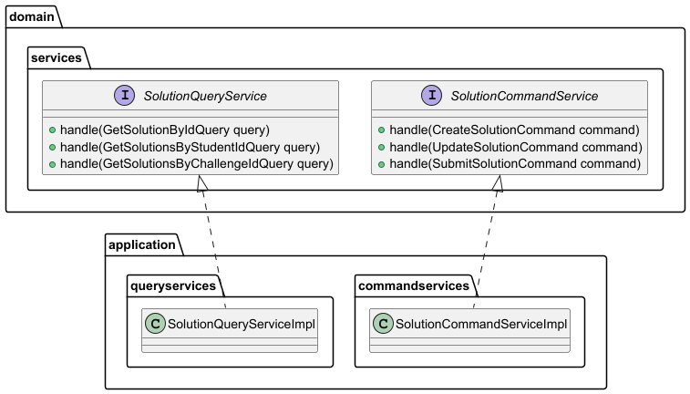

# Capítulo IV: Solution Software Design

## 4.1. Strategic-Level Domain-Driven Design

El **Strategic-Level Domain-Driven Design** constituye la base fundamental para el desarrollo de la aplicación LevelUpJourney. Este enfoque nos permite identificar y definir los límites de los contextos de dominio, establecer las relaciones entre ellos y crear una arquitectura de software sólida que soporte los objetivos del negocio.

En esta fase estratégica, nos enfocamos en:
- **Comprensión profunda del dominio**: Identificación de los procesos de negocio críticos
- **Definición de bounded contexts**: Establecimiento de límites claros entre diferentes áreas funcionales
- **Modelado de relaciones**: Definición de cómo interactúan los diferentes contextos
- **Arquitectura de alto nivel**: Diseño de la estructura general del sistema

### 4.1.1. EventStorming

El **EventStorming** es una técnica de modelado colaborativo que nos permite explorar y comprender el dominio complejo de LevelUpJourney. Esta técnica facilita la identificación de eventos de dominio, comandos, agregados y bounded contexts a través de sesiones colaborativas con expertos del dominio.

#### 4.1.1.1. Candidate Context Discovery

La **Candidate Context Discovery** es el proceso mediante el cual identificamos los posibles bounded contexts dentro del dominio de LevelUpJourney. Este proceso se basa en el análisis de los eventos, comandos y agregados identificados durante las sesiones de EventStorming.

##### Contextos candidatos identificados:
- **Identity and Access Management (IAM)**: Gestión de usuarios, autenticación y autorización
- **API Gateway**: Enrutamiento, seguridad y gestión de APIs
- **Challenges**: Gestión de desafíos y retos académicos
- **Community**: Interacciones sociales, foros y colaboración
- **Code Runner**: Ejecución y evaluación de código
- **Class Activities**: Gestión de actividades académicas y seguimiento del progreso
- **Analytics**: Análisis de datos y métricas para mejorar el rendimiento y la experiencia del usuario
- **User Profile**: Gestión de información personal del usuario

##### Flows de eventos principales:
- **Registro de usuario**: Flujo desde la creación de cuenta

- **Publicacion de un Post**: Creacion de un post y aumento de puntos de actividad al profesor que publica

- **Crear Analitica cuando un post es visto**: Cada vez que un post es visto, se crea una nueva analitica
  

- **Crear un Quiz Activity**: Flujo desde la creacion de un quiz activity

- **Empezar una sesion de clase en vivo**: Flujo desde el inicio de una sesion en vivo

- **Un participante ingresa mediante QR a una sesion en vivo**: Flujo desde que un participante ingresa a una sesion en vivo mediante QR

- **El profesor empieza con las preguntas interactivas**: Flujo desde que el profesor inicia las preguntas interactivas

- **El estudiante responde a una pregunta interactiva**: Flujo desde que el estudiante responde a una pregunta interactiva

- **El profesor termina una pregunta interactiva**: Flujo desde que el profesor termina una pregunta interactiva

- **El profesor termina la sesion en vivo**: Flujo desde que el profesor termina la sesion en vivo

- **El Estudiante empieza a resolver un challenge**: Flujo desde que el estudiante empieza a resolver un challenge

- **El Estudiante envía su solución a un challenge**: Flujo desde que el estudiante envía su solución a un challenge

#### 4.1.1.2. Domain Message Flows Modeling

El **Domain Message Flows Modeling** mapea cómo los mensajes (eventos, comandos) fluyen entre los diferentes bounded contexts identificados. Este modelado es crucial para entender las dependencias y patrones de comunicación del sistema.

#### 4.1.1.3. Bounded Context Canvases

Los **Bounded Context Canvases** proporcionan una visión detallada de cada contexto delimitado, documentando sus responsabilidades, interfaces, eventos y relaciones con otros contextos.

- **IAM Bounded Context Canvas**

- **Challenges Bounded Context Canvas**

- **Community Bounded Context Canvas**

- **Code Runner Bounded Context Canvas**

- **Class Activities Bounded Context Canvas**

- **Analytics Bounded Context Canvas**

### 4.1.2. Context Mapping

El **Context Mapping** define explícitamente las relaciones entre los bounded contexts identificados, estableciendo patrones de integración y clarificando las responsabilidades de cada contexto en las interacciones.

### 4.1.3. Software Architecture

La **Software Architecture** traduce el diseño estratégico en una arquitectura técnica concreta, proporcionando los diagramas y especificaciones necesarios para guiar la implementación del sistema LevelUpJourney.

#### Principios arquitectónicos adoptados:

1. **Separación de responsabilidades**: Cada bounded context tiene responsabilidades claras
2. **Bajo acoplamiento**: Minimización de dependencias entre contextos
3. **Alta cohesión**: Elementos relacionados están agrupados en el mismo contexto
4. **Escalabilidad**: Capacidad de escalar contextos independientemente
5. **Mantenibilidad**: Facilidad para realizar cambios y evolucionar el sistema

#### 4.1.3.1. Software Architecture Context Level Diagrams

Los **diagramas de nivel de contexto** proporcionan una vista de alto nivel del sistema LevelUpJourney, mostrando cómo interactúa con usuarios externos y sistemas externos.

Identificamos que los usuarios quienes van a interactuar con el sistema son 3.
- Student: Estudiante que participa dentro de la plataforma para mejorar sus habilidades de programación
- Teacher: Profesor que crea contenido para que los estudiantes puedan aprender de manera interactiva y dinamica.
- Admin: Administra la plataforma

Como sistemas externos identificamos:
- Google OAuth Provider: Facilita el inicio de sesión de los usuarios 
- Github OAuth Provider: Facilita el inicio de sesión de los usuarios 

#### 4.1.3.2. Software Architecture Container Level Diagrams

Los **diagramas de nivel de contenedor** descomponen el sistema LevelUpJourney en contenedores de alto nivel, mostrando las principales tecnologías y responsabilidades.

#### 4.1.3.3. Software Architecture Deployment Diagrams

Los **diagramas de despliegue** muestran cómo los contenedores se mapean a infraestructura física o virtual, incluyendo consideraciones de escalabilidad, disponibilidad y seguridad.

## 4.2. Tactical-Level Domain-Driven Design

### Introducción al Diseño Táctico

El **Tactical-Level Domain-Driven Design** representa la materialización concreta del diseño estratégico definido anteriormente. En esta sección, profundizamos en la implementación específica de cada bounded context identificado, detallando sus capas arquitectónicas, componentes internos y relaciones. Este nivel táctico se enfoca en los patrones de implementación, la organización del código y la estructura interna de cada contexto delimitado, asegurando que el diseño estratégico se traduzca efectivamente en una arquitectura de software robusta y mantenible.

Para el sistema LevelUpJourney, hemos identificado seis bounded contexts principales que cubren las necesidades fundamentales de la plataforma: **IAM** (Identity and Access Management) para la gestión de identidades y autenticación, **API Gateway** como punto de entrada unificado y gestión de APIs, **Community** para las funcionalidades sociales y de comunidad, **Code Runner** para la ejecución y evaluación de código, **Class Activities** para la gestión de actividades académicas y seguimiento del progreso estudiantil, y **Analytics**.

### 4.2.1. Bounedd Context: Challenges
#### 4.2.1.1. Domain Layer
### Challenges Domain

### Solution Domain

#### 4.2.1.2. Interface Layer
### Challenges Interface

### Solution Interface

#### 4.2.1.3. Application Layer
### Challenges Application

### Solution Application

#### 4.2.1.4. Infrastructure Layer
### Challenges Infrastructure

### Solution Infrastructure

#### 4.2.1.5. Bounded Context Software Architecture Component Level Diagrams
#### 4.2.1.6. Bounded Context Software Architecture Code Level Diagrams
##### 4.2.1.6.1. Bounded Context Domain Layer Class Diagrams
##### 4.2.1.6.2. Bounded Context Database Design Diagram

