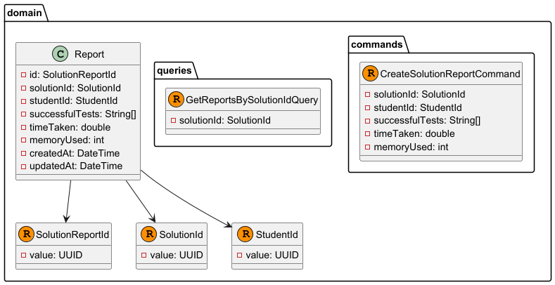

# Capítulo IV: Solution Software Design

## 4.1. Strategic-Level Domain-Driven Design

El **Strategic-Level Domain-Driven Design** constituye la base fundamental para el desarrollo de la aplicación LevelUpJourney. Este enfoque nos permite identificar y definir los límites de los contextos de dominio, establecer las relaciones entre ellos y crear una arquitectura de software sólida que soporte los objetivos del negocio.

En esta fase estratégica, nos enfocamos en:
- **Comprensión profunda del dominio**: Identificación de los procesos de negocio críticos
- **Definición de bounded contexts**: Establecimiento de límites claros entre diferentes áreas funcionales
- **Modelado de relaciones**: Definición de cómo interactúan los diferentes contextos
- **Arquitectura de alto nivel**: Diseño de la estructura general del sistema

### 4.1.1. EventStorming

El **EventStorming** es una técnica de modelado colaborativo que nos permite explorar y comprender el dominio complejo de LevelUpJourney. Esta técnica facilita la identificación de eventos de dominio, comandos, agregados y bounded contexts a través de sesiones colaborativas con expertos del dominio.

#### 4.1.1.1. Candidate Context Discovery

La **Candidate Context Discovery** es el proceso mediante el cual identificamos los posibles bounded contexts dentro del dominio de LevelUpJourney. Este proceso se basa en el análisis de los eventos, comandos y agregados identificados durante las sesiones de EventStorming.

##### Contextos candidatos identificados:
- **Identity and Access Management (IAM)**: Gestión de usuarios, autenticación y autorización
- **API Gateway**: Enrutamiento, seguridad y gestión de APIs
- **Challenges**: Gestión de desafíos y retos académicos
- **Community**: Interacciones sociales, foros y colaboración
- **Code Runner**: Ejecución y evaluación de código
- **Class Activities**: Gestión de actividades académicas y seguimiento del progreso
- **Analytics**: Análisis de datos y métricas para mejorar el rendimiento y la experiencia del usuario
- **User Profile**: Gestión de información personal del usuario

##### Flows de eventos principales:
- **Registro de usuario**: Flujo desde la creación de cuenta

- **Publicacion de un Post**: Creacion de un post y aumento de puntos de actividad al profesor que publica

- **Crear Analitica cuando un post es visto**: Cada vez que un post es visto, se crea una nueva analitica
  

- **Crear un Quiz Activity**: Flujo desde la creacion de un quiz activity

- **Empezar una sesion de clase en vivo**: Flujo desde el inicio de una sesion en vivo

- **Un participante ingresa mediante QR a una sesion en vivo**: Flujo desde que un participante ingresa a una sesion en vivo mediante QR

- **El profesor empieza con las preguntas interactivas**: Flujo desde que el profesor inicia las preguntas interactivas

- **El estudiante responde a una pregunta interactiva**: Flujo desde que el estudiante responde a una pregunta interactiva

- **El profesor termina una pregunta interactiva**: Flujo desde que el profesor termina una pregunta interactiva

- **El profesor termina la sesion en vivo**: Flujo desde que el profesor termina la sesion en vivo

- **El Estudiante empieza a resolver un challenge**: Flujo desde que el estudiante empieza a resolver un challenge

- **El Estudiante envía su solución a un challenge**: Flujo desde que el estudiante envía su solución a un challenge

#### 4.1.1.2. Domain Message Flows Modeling

El **Domain Message Flows Modeling** mapea cómo los mensajes (eventos, comandos) fluyen entre los diferentes bounded contexts identificados. Este modelado es crucial para entender las dependencias y patrones de comunicación del sistema.

#### 4.1.1.3. Bounded Context Canvases

Los **Bounded Context Canvases** proporcionan una visión detallada de cada contexto delimitado, documentando sus responsabilidades, interfaces, eventos y relaciones con otros contextos.

- **IAM Bounded Context Canvas**

- **Challenges Bounded Context Canvas**

- **Community Bounded Context Canvas**

- **Code Runner Bounded Context Canvas**

- **Class Activities Bounded Context Canvas**

- **Analytics Bounded Context Canvas**

### 4.1.2. Context Mapping

El **Context Mapping** define explícitamente las relaciones entre los bounded contexts identificados, estableciendo patrones de integración y clarificando las responsabilidades de cada contexto en las interacciones.

### 4.1.3. Software Architecture

La **Software Architecture** traduce el diseño estratégico en una arquitectura técnica concreta, proporcionando los diagramas y especificaciones necesarios para guiar la implementación del sistema LevelUpJourney.

#### Principios arquitectónicos adoptados:

1. **Separación de responsabilidades**: Cada bounded context tiene responsabilidades claras
2. **Bajo acoplamiento**: Minimización de dependencias entre contextos
3. **Alta cohesión**: Elementos relacionados están agrupados en el mismo contexto
4. **Escalabilidad**: Capacidad de escalar contextos independientemente
5. **Mantenibilidad**: Facilidad para realizar cambios y evolucionar el sistema

#### 4.1.3.1. Software Architecture Context Level Diagrams

Los **diagramas de nivel de contexto** proporcionan una vista de alto nivel del sistema LevelUpJourney, mostrando cómo interactúa con usuarios externos y sistemas externos.

Identificamos que los usuarios quienes van a interactuar con el sistema son 3.
- Student: Estudiante que participa dentro de la plataforma para mejorar sus habilidades de programación
- Teacher: Profesor que crea contenido para que los estudiantes puedan aprender de manera interactiva y dinamica.
- Admin: Administra la plataforma

Como sistemas externos identificamos:
- Google OAuth Provider: Facilita el inicio de sesión de los usuarios 
- Github OAuth Provider: Facilita el inicio de sesión de los usuarios 

#### 4.1.3.2. Software Architecture Container Level Diagrams

Los **diagramas de nivel de contenedor** descomponen el sistema LevelUpJourney en contenedores de alto nivel, mostrando las principales tecnologías y responsabilidades. Este diagrama ilustra la arquitectura distribuida de microservicios adoptada para garantizar escalabilidad, mantenibilidad y separación de responsabilidades.

##### Análisis del Container Diagram

El Container Diagram de LevelUpJourney presenta una arquitectura basada en microservicios que separa las responsabilidades y permite un desarrollo y despliegue independiente de cada componente. La arquitectura se estructura en las siguientes capas y elementos:

**Capa de Presentación:**
- **Landing Page**: Página web estática desarrollada con tecnologías web modernas que sirve como punto de entrada público al sistema, presentando información institucional y facilitando el registro inicial de usuarios.
- **Web App**: Aplicación web principal construida con React que proporciona una interfaz rica e interactiva para estudiantes, profesores y administradores. Utiliza tecnologías modernas del frontend para ofrecer una experiencia de usuario fluida.
- **Mobile App**: Aplicación móvil nativa que extiende las funcionalidades principales de la plataforma a dispositivos móviles, permitiendo el acceso ubicuo a las actividades de aprendizaje.

**Capa de Gateway:**
- **API Gateway**: Actúa como punto de entrada único y centralizado para todas las comunicaciones entre las aplicaciones cliente y los microservicios backend. Implementa funcionalidades transversales como autenticación, autorización, rate limiting, logging y enrutamiento inteligente. Esta centralización simplifica la gestión de políticas de seguridad y mejora la observabilidad del sistema.

**Capa de Microservicios:**
La arquitectura adopta un patrón de microservicios especializados, cada uno con su propia base de datos dedicada (Database per Service pattern):

- **IAM Microservice**: Gestiona la identidad y acceso de usuarios, implementando autenticación segura, autorización basada en roles, y integración con proveedores externos como Google OAuth y GitHub OAuth.
- **Community Microservice**: Facilita las interacciones sociales entre usuarios, publicaciones, comentarios y sistemas de puntuación que fomentan la colaboración.
- **Challenges Microservice**: Administra el catálogo de desafíos de programación, incluyendo su creación, categorización, dificultad y evaluación automática de soluciones.
- **Class Activities Microservice**: Coordina las actividades académicas en tiempo real, como sesiones de clase interactivas, quizzes en vivo, y seguimiento del progreso estudiantil.
- **Analytics Microservice**: Recopila, procesa y analiza métricas de uso y rendimiento, proporcionando insights valiosos para la mejora continua de la plataforma.
- **Code Runner Microservice**: Ejecuta y evalúa código de manera segura en un entorno aislado, soportando múltiples lenguajes de programación y proporcionando retroalimentación inmediata.
- **User Profile Microservice**: Mantiene y gestiona la información personal de los usuarios, preferencias, historial académico y configuraciones personalizadas.

**Decisiones Tecnológicas Principales:**
- **Arquitectura de Microservicios**: Permite escalabilidad independiente, despliegues aislados y uso de tecnologías específicas para cada dominio.
- **API Gateway Pattern**: Centraliza la gestión de APIs y simplifica la comunicación cliente-servidor.
- **Database per Service**: Garantiza la autonomía de datos de cada microservicio y evita acoplamiento entre contextos.
- **Comunicación Asíncrona**: Los microservicios se comunican mediante eventos y mensajería asíncrona para mantener bajo acoplamiento.
- **Tecnologías Modernas**: React para frontend web, aplicaciones móviles nativas, y tecnologías cloud-ready para el backend.

**Patrones de Comunicación:**
Los contenedores se comunican siguiendo patrones establecidos:
- **API REST**: Para comunicación síncrona entre aplicaciones cliente y API Gateway.
- **Event-Driven Architecture**: Para comunicación asíncrona entre microservicios mediante eventos de dominio.
- **Service Discovery**: Para el descubrimiento automático de servicios en el entorno distribuido.
- **Circuit Breaker**: Para manejo de fallos y resiliencia en las comunicaciones entre servicios.

Esta arquitectura asegura que LevelUpJourney pueda escalar eficientemente, mantener alta disponibilidad, y evolucionar de manera independiente en cada uno de sus dominios funcionales.

#### 4.1.3.3. Software Architecture Deployment Diagrams

Los **diagramas de despliegue** muestran cómo los contenedores se mapean a infraestructura física o virtual, incluyendo consideraciones de escalabilidad, disponibilidad y seguridad. Este diagrama visualiza la distribución física del sistema LevelUpJourney, destacando cómo los componentes del software se despliegan sobre la infraestructura en la nube y otros entornos de ejecución.

##### Análisis del Deployment Diagram

El Deployment Diagram de LevelUpJourney presenta una arquitectura cloud-native desplegada en **Microsoft Azure**, diseñada para proporcionar alta disponibilidad, escalabilidad automática y seguridad robusta. La distribución física del sistema se organiza en múltiples capas especializadas que optimizan el rendimiento y la gestión operacional.

**Infraestructura Cloud - Microsoft Azure:**

La solución está completamente desplegada en Microsoft Azure, aprovechando sus servicios administrados para reducir la complejidad operacional y mejorar la confiabilidad del sistema. Esta decisión estratégica permite al equipo enfocarse en el desarrollo de funcionalidades de negocio mientras Azure maneja la infraestructura subyacente.

**Arquitectura de Contenedores - Azure Container Instances (ACI):**

Todos los servicios de aplicación se ejecutan en contenedores Docker desplegados en Azure Container Instances, proporcionando:

- **Aislamiento**: Cada servicio opera en su propio contenedor independiente
- **Portabilidad**: Los contenedores pueden moverse entre entornos sin modificaciones
- **Escalabilidad**: Capacidad de escalar horizontalmente según demanda
- **Gestión simplificada**: Despliegue y actualización automatizada de servicios

**Capa de Presentación (Frontend Tier):**

- **Web Server (Docker)**: Aloja múltiples aplicaciones frontend:
  - **Landing Page (Astro)**: Página estática optimizada para SEO y rendimiento
  - **Web App (Next.js)**: Aplicación web principal con SSR/SPA híbrido
  - **Student & Teacher Portal**: Interfaces especializadas para cada tipo de usuario

- **Mobile API Server (Docker)**: Servidor proxy especializado que gestiona las comunicaciones entre la aplicación móvil Flutter y el API Gateway, optimizando el tráfico móvil y proporcionando caché específico.

**Capa de Gateway:**

- **API Gateway (Spring Boot)**: Punto de entrada centralizado que implementa:
  - Enrutamiento inteligente hacia microservicios
  - Autenticación y autorización centralizadas
  - Rate limiting y throttling
  - Logging y monitoreo centralizado
  - Load balancing hacia servicios backend

**Capa de Microservicios (Microservices Tier):**

La arquitectura despliega múltiples microservicios especializados, cada uno en su propio contenedor:

- **IAM Service**: Gestión de identidad y acceso con integración OAuth
- **User Profile Service**: Administración de perfiles de usuario
- **Challenges Service**: Gestión del catálogo de desafíos
- **Community Service**: Funcionalidades sociales y colaborativas
- **Class Activities Service**: Coordinación de actividades académicas
- **Analytics Service**: Procesamiento y análisis de métricas
- **Code Runner Cluster**: Cluster escalable para ejecución de código con múltiples instancias

**Cluster de Code Runner - Escalabilidad Horizontal:**

El servicio Code Runner está diseñado como un cluster horizontalmente escalable con múltiples instancias (CodeRunner 1, 2, ..., N) implementadas en **Go con framework Gin**. Esta arquitectura permite:

- **Auto-scaling**: Escalado automático basado en carga de trabajo
- **Distribución de carga**: Procesamiento paralelo de ejecuciones de código
- **Aislamiento de seguridad**: Cada instancia ejecuta código en entornos aislados
- **Alta disponibilidad**: Tolerancia a fallos con instancias redundantes

**Capa de Datos - Azure Database Services:**

La capa de datos utiliza servicios administrados de Azure Database para garantizar alta disponibilidad y gestión automática:

- **Azure Database for PostgreSQL**: Para la mayoría de microservicios (IAM, User Profile, Challenges, Class Activities, Code Runner, Analytics)
- **MongoDB**: Para el servicio Community, aprovechando la flexibilidad de documentos para datos sociales

**Consideración de Azure Cosmos DB como Alternativa:**

Como parte de la estrategia de optimización en la nube, se puede considerar **Azure Cosmos DB con API de MongoDB** como una evolución natural del actual deployment de MongoDB. Esta migración ofrecería ventajas significativas:

- **Escalabilidad Global**: Distribución automática de datos a nivel mundial con latencia mínima
- **Alta Disponibilidad**: SLA del 99.999% con replicación automática multi-región
- **Gestión Completamente Administrada**: Eliminación de tareas operacionales como patching, backups y monitoreo
- **Escalado Automático**: Ajuste dinámico de throughput basado en demanda real
- **Compatibilidad Total**: API wire-protocol compatible con MongoDB, permitiendo migración sin cambios de código
- **Seguridad Empresarial**: Cifrado en reposo y en tránsito, integración con Azure Active Directory
- **Costo-Beneficio**: Modelo de pricing por consumo que optimiza costos operacionales

La transición sería transparente para la aplicación, manteniendo todas las funcionalidades existentes mientras se obtienen los beneficios de una plataforma cloud-native completamente administrada.

**Infraestructura de Mensajería:**

- **Apache Kafka**: Implementado en contenedor Docker para comunicación asíncrona entre microservicios, facilitando arquitectura orientada a eventos y desacoplamiento temporal.

**Integraciones Externas:**

- **OAuth Providers**: Integración con GitHub OAuth y Google OAuth para autenticación federada
- **Acceso de Usuarios**: Soporte multi-plataforma (Web, Mobile) con conexiones HTTPS seguras

**Decisiones de Tecnología y Justificación:**

1. **Microsoft Azure**: Plataforma cloud robusta con servicios administrados
2. **Docker + ACI**: Containerización para portabilidad y gestión simplificada
3. **Spring Boot**: Framework Java maduro para microservicios empresariales
4. **Next.js**: Framework React con SSR para rendimiento web optimizado
5. **Flutter**: Framework cross-platform para aplicaciones móviles nativas
6. **PostgreSQL**: Base de datos relacional robusta y confiable
7. **MongoDB**: Base de datos NoSQL para flexibilidad en datos sociales
8. **Apache Kafka**: Sistema de mensajería distribuida para comunicación asíncrona
9. **Go + Gin**: Lenguaje de alto rendimiento para ejecución intensiva de código

**Consideraciones de Seguridad:**

- **HTTPS/TLS**: Todas las comunicaciones externas cifradas
- **OAuth 2.0**: Autenticación federada con proveedores confiables
- **Network Isolation**: Servicios internos aislados del acceso directo externo
- **Container Security**: Imágenes Docker escaneadas y actualizadas regularmente
- **Database Security**: Bases de datos administradas con cifrado en reposo y tránsito

**Escalabilidad y Disponibilidad:**

- **Horizontal Scaling**: Microservicios pueden escalar independientemente
- **Auto-scaling**: Code Runner cluster con escalado automático
- **Load Balancing**: API Gateway distribuye carga entre instancias
- **Database Scaling**: Servicios administrados de Azure con escalado automático
- **Geographic Distribution**: Potencial para despliegue multi-región

##### Posibilidades de Mejora

Para fortalecer y optimizar el deployment actual, se identifican las siguientes oportunidades de mejora:

**1. Mejoras en Alta Disponibilidad:**
- **Multi-Region Deployment**: Implementar despliegue en múltiples regiones de Azure para reducir latencia global y proporcionar tolerancia a fallos geográficos
- **Azure Kubernetes Service (AKS)**: Migrar de ACI a AKS para obtener mayor control sobre orquestación, auto-healing y gestión avanzada de contenedores
- **Database Replicas**: Configurar réplicas de lectura geográficamente distribuidas para mejorar rendimiento y disponibilidad de datos

**2. Optimizaciones de Rendimiento:**
- **Content Delivery Network (CDN)**: Implementar Azure CDN para distribución global de contenido estático y reducción de latencia
- **Caching Layer**: Introducir Azure Redis Cache para caché distribuido y mejora de tiempos de respuesta
- **Database Connection Pooling**: Implementar connection pooling avanzado para optimizar conexiones a bases de datos

**3. Mejoras en Seguridad:**
- **Azure Key Vault**: Centralizar gestión de secretos, certificados y claves de cifrado
- **Web Application Firewall (WAF)**: Implementar WAF para protección contra ataques web comunes
- **Azure Security Center**: Integrar monitoreo de seguridad continuo y detección de amenazas
- **Network Security Groups**: Configurar reglas de firewall granulares entre servicios
- **Private Endpoints**: Implementar endpoints privados para comunicación interna segura

**4. Observabilidad y Monitoreo:**
- **Azure Application Insights**: Implementar APM (Application Performance Monitoring) completo
- **Centralized Logging**: Configurar Azure Log Analytics para agregación centralizada de logs
- **Distributed Tracing**: Implementar trazabilidad distribuida para debugging en microservicios
- **Health Checks**: Configurar health checks avanzados y alertas proactivas

**5. Optimizaciones de Costo:**
- **Azure Reserved Instances**: Utilizar instancias reservadas para reducir costos de compute
- **Spot Instances**: Implementar Spot Instances para cargas de trabajo no críticas
- **Auto-scaling Policies**: Refinar políticas de auto-scaling para optimizar costos vs. rendimiento
- **Resource Tagging**: Implementar tagging comprehensive para gestión de costos por proyecto/entorno

**6. DevOps y CI/CD:**
- **Azure DevOps Pipelines**: Implementar pipelines de CI/CD completamente automatizados
- **GitOps**: Adoptar prácticas GitOps para gestión declarativa de infraestructura
- **Blue-Green Deployment**: Implementar estrategias de despliegue sin downtime
- **Infrastructure as Code**: Migrar toda la infraestructura a Terraform o ARM Templates

**7. Escalabilidad Avanzada:**
- **Event-Driven Autoscaling**: Implementar escalado basado en eventos de Kafka
- **Microservices Mesh**: Considerar Service Mesh (Istio) para comunicación inter-servicios avanzada
- **Serverless Components**: Migrar componentes apropiados a Azure Functions para escalado automático
- **Database Sharding**: Implementar sharding horizontal para bases de datos de alto volumen

**8. Backup y Disaster Recovery:**
- **Automated Backups**: Configurar backups automatizados cross-region
- **Disaster Recovery Plan**: Implementar plan de recuperación ante desastres con RTO/RPO definidos
- **Data Replication**: Configurar replicación asíncrona para continuidad de negocio

Estas mejoras proporcionarían una arquitectura de producción robusta, escalable y enterprise-ready, capaz de soportar el crecimiento futuro de LevelUpJourney mientras mantiene altos estándares de rendimiento, seguridad y disponibilidad.

## 4.2. Tactical-Level Domain-Driven Design

### Introducción al Diseño Táctico

El **Tactical-Level Domain-Driven Design** representa la materialización concreta del diseño estratégico definido anteriormente. En esta sección, profundizamos en la implementación específica de cada bounded context identificado, detallando sus capas arquitectónicas, componentes internos y relaciones. Este nivel táctico se enfoca en los patrones de implementación, la organización del código y la estructura interna de cada contexto delimitado, asegurando que el diseño estratégico se traduzca efectivamente en una arquitectura de software robusta y mantenible.

Para el sistema LevelUpJourney, hemos identificado seis bounded contexts principales que cubren las necesidades fundamentales de la plataforma: **IAM** (Identity and Access Management) para la gestión de identidades y autenticación, **API Gateway** como punto de entrada unificado y gestión de APIs, **Community** para las funcionalidades sociales y de comunidad, **Code Runner** para la ejecución y evaluación de código, **Class Activities** para la gestión de actividades académicas y seguimiento del progreso estudiantil, y **Analytics**.

### 4.2.1. Bounedd Context: Challenges
#### 4.2.1.1. Domain Layer

La **Domain Layer** del bounded context **Challenges** constituye el núcleo conceptual que encapsula las reglas de negocio fundamentales para la gestión de desafíos de programación, soluciones estudiantiles y reportes de evaluación. Esta capa implementa los patrones tácticos de Domain-Driven Design, asegurando que la lógica de dominio permanezca aislada de preocupaciones técnicas e infraestructurales.

**Agregados (Aggregates):**

El dominio se organiza alrededor de tres agregados principales que mantienen la consistencia y encapsulan las reglas de negocio:

**1. Challenge Aggregate:**
- **Challenge**: Entidad raíz que representa un desafío de programación creado por profesores. Contiene información esencial como nombre, descripción, puntos de experiencia, estado de publicación y metadatos temporales.
- **CodeVersion**: Entidad que representa las diferentes versiones de código para distintos lenguajes de programación dentro de un desafío. Mantiene el código inicial y las pruebas asociadas.
- **CodeVersionTest**: Entidad que define las pruebas específicas para cada versión de código, incluyendo entradas, salidas esperadas y validaciones personalizadas.

**2. Solution Aggregate:**
- **Solution**: Entidad raíz que representa el intento de un estudiante por resolver un desafío específico. Mantiene la relación con el desafío, la versión de código seleccionada y los detalles de la solución.
- **SolutionDetails**: Value Object que encapsula los detalles específicos de la solución, incluyendo número de intentos, código fuente, timestamp del último intento y estado actual.

**3. Report Aggregate:**
- **Report**: Entidad que registra los resultados de la evaluación de una solución, incluyendo pruebas exitosas, tiempo de ejecución y memoria utilizada.

**Value Objects:**

Los Value Objects proporcionan tipos seguros y encapsulación de conceptos de dominio:

- **ChallengeId, SolutionId, SolutionReportId**: Identificadores únicos que garantizan type safety
- **TeacherId, StudentId**: Identificadores de actores del sistema
- **CodeVersionId, CodeVersionTestId**: Identificadores para versiones y pruebas
- **ChallengeTag**: Objeto complejo que incluye metadatos de etiquetas (nombre, color, icono)
- **ChallengeStatus**: Enumeración que define estados del ciclo de vida (DRAFT, PUBLISHED, HIDDEN)
- **CodeLanguage**: Enumeración de lenguajes soportados (C_PLUS_PLUS, JAVASCRIPT, PYTHON)
- **SolutionStatus**: Enumeración de estados de solución (SUCCESS, FAILED, MAX_ATTEMPTS_REACHED)

**Commands (Comandos):**

Los comandos representan intenciones de cambio en el sistema y encapsulan las operaciones de escritura:

*Challenge Commands:*
- **CreateChallengeCommand**: Creación de nuevos desafíos por parte de profesores
- **UpdateChallengeCommand**: Modificación de desafíos existentes con campos opcionales
- **PublishChallengeCommand**: Publicación de desafíos para estudiantes
- **StartChallengeCommand**: Inicio de un desafío por parte de estudiantes

*CodeVersion Commands:*
- **AddCodeVersionCommand**: Adición de versiones en nuevos lenguajes
- **UpdateCodeVersionCommand**: Modificación de código base
- **AddCodeVersionTestCommand**: Creación de nuevas pruebas
- **UpdateCodeVersionTestCommand**: Modificación de pruebas existentes

*Solution Commands:*
- **CreateSolutionCommand**: Inicio de resolución de desafío por estudiante
- **UpdateSolutionCommand**: Actualización de progreso de solución
- **SubmitSolutionCommand**: Envío final de solución para evaluación

*Report Commands:*
- **CreateSolutionReportCommand**: Generación de reporte de evaluación

**Queries (Consultas):**

Las queries encapsulan las operaciones de lectura del sistema:

*Challenge Queries:*
- **GetChallengeByIdQuery**: Recuperación de desafío específico
- **GetPublishedChallengesQuery**: Listado de desafíos publicados
- **GetChallengesByTeacherIdQuery**: Desafíos creados por profesor específico
- **GetAllChallengeTagsQuery**: Catálogo de etiquetas disponibles

*CodeVersion Queries:*
- **GetCodeVersionByIdQuery**: Versión específica de código
- **GetCodeVersionsByChallengeIdQuery**: Todas las versiones de un desafío

*Solution Queries:*
- **GetSolutionByIdQuery**: Solución específica
- **GetSolutionsByStudentIdQuery**: Soluciones de un estudiante
- **GetSolutionsByChallengeIdQuery**: Todas las soluciones de un desafío

*Report Queries:*
- **GetReportsBySolutionIdQuery**: Reportes de una solución específica

**Domain Services:**

Los servicios de dominio manejan operaciones que no pertenecen naturalmente a una entidad específica:

- **ChallengeCommandService**: Coordina operaciones complejas de desafíos
- **CodeVersionCommandService**: Gestiona versiones de código y pruebas
- **CodeVersionTestCommandService**: Administra pruebas específicas
- **SolutionCommandService**: Coordina el ciclo de vida de soluciones
- **ChallengeQueryService**: Optimiza consultas complejas de desafíos
- **CodeVersionQueryService**: Proporciona acceso eficiente a versiones
- **SolutionQueryService**: Facilita consultas de soluciones con filtros

**Reglas de Negocio Encapsuladas:**

1. **Integridad de Desafíos**: Un desafío debe tener al menos una versión de código antes de ser publicado
2. **Límite de Intentos**: Las soluciones tienen un máximo de intentos configurable
3. **Versionado**: Cada lenguaje de programación requiere su propia versión con pruebas específicas
4. **Validación de Estados**: Transiciones de estado controladas para desafíos y soluciones
5. **Trazabilidad**: Todos los cambios mantienen metadatos temporales para auditoría

### Challenges Domain

### Solution Domain

### Solution Report Domain

#### 4.2.1.2. Interface Layer
### Challenges Interface

### Solution Interface

### Solution Report Interface

#### 4.2.1.3. Application Layer
### Challenges Application

### Solution Application

### Solution Report Application

#### 4.2.1.4. Infrastructure Layer
### Challenges Infrastructure

### Solution Infrastructure

### Solution Report Infrastructure

#### 4.2.1.5. Bounded Context Software Architecture Component Level Diagrams

#### 4.2.1.6. Bounded Context Software Architecture Code Level Diagrams
##### 4.2.1.6.1. Bounded Context Domain Layer Class Diagrams
##### 4.2.1.6.2. Bounded Context Database Design Diagram

### 4.2.2. Bounded Context: Class Activities
#### 4.2.2.1. Domain Layer

La **Domain Layer** del bounded context **Class Activities** gestiona las actividades académicas interactivas, específicamente enfocada en quizzes en tiempo real y sesiones de clase en vivo. Esta capa implementa patrones DDD tácticos para encapsular las reglas de negocio complejas relacionadas con la creación de actividades educativas y la gestión de sesiones colaborativas en tiempo real.

**Agregados (Aggregates):**

El dominio se estructura alrededor de dos agregados principales que manejan diferentes aspectos del ciclo de vida de las actividades:

**1. QuizActivity Aggregate (Activities Manager):**
- **QuizActivity**: Entidad raíz que representa una actividad de quiz creada por profesores. Encapsula la metadata del quiz incluyendo título, descripción opcional y colección de preguntas asociadas.
- **Question**: Entidad que define preguntas individuales dentro del quiz. Incluye contenido multimedia, límites de tiempo, puntuación, nivel de dificultad y configuraciones de presentación.
- **Option**: Entidad que representa las opciones de respuesta para cada pregunta, incluyendo contenido multimedia y marcador de respuesta correcta.

**2. LiveSession Aggregate (Class Activity Session Manager):**
- **LiveSession**: Entidad raíz que gestiona sesiones de quiz en tiempo real. Coordina la participación de estudiantes, el progreso de preguntas y el estado general de la sesión.
- **Participant**: Entidad que representa un estudiante participante en la sesión, manteniendo su estado, puntuación acumulada y respuestas registradas.
- **Answer**: Entidad que registra las respuestas específicas de participantes a preguntas durante la sesión.
- **CurrentQuestion**: Entidad que gestiona la pregunta actualmente activa en la sesión, incluyendo tiempos de inicio/fin y estado de activación.

**Value Objects:**

Los Value Objects aseguran type safety y encapsulan conceptos de dominio importantes:

*Identificadores:*
- **ActivityId, SessionId**: Identificadores únicos para actividades y sesiones
- **TeacherId, ParticipantId**: Identificadores de actores del sistema
- **QuestionId, OptionId, AnswerId**: Identificadores de componentes específicos
- **CurrentQuestionId**: Identificador para preguntas activas en sesiones

*Objetos de Contenido:*
- **Content**: Value Object complejo que encapsula contenido multimedia (texto/imagen) con su tipo correspondiente
- **ContentType**: Enumeración que define tipos de contenido soportados (TEXT, IMAGE)

*Enumeraciones de Estado:*
- **DifficultyLevel**: Niveles de dificultad (EASY, MEDIUM, HARD, NONE)
- **SessionStatus**: Estados del ciclo de vida de sesión (NOT_STARTED, LOADING, OPENED, IN_PROGRESS, CLOSED)
- **ParticipantStatus**: Estados de participación (JOINED, ACTIVE, DISCONNECTED, LEFT)

**Commands (Comandos):**

Los comandos representan intenciones de cambio y operaciones de escritura del sistema:

*QuizActivity Commands:*
- **CreateQuizActivityCommand**: Creación de nueva actividad de quiz por profesores
- **AddQuestionCommand**: Adición de preguntas a actividades existentes con configuraciones completas
- **AddOptionCommand**: Creación de opciones de respuesta para preguntas específicas
- **UpdateQuestionCommand**: Modificación de preguntas existentes incluyendo contenido y configuraciones

*LiveSession Commands:*
- **CreateLiveSessionCommand**: Inicio de nueva sesión en vivo basada en una actividad
- **JoinSessionCommand**: Incorporación de participantes a sesiones activas
- **LeaveSessionCommand**: Retiro de participantes de sesiones
- **StartSessionCommand**: Activación oficial de sesión para comenzar quiz
- **LoadQuestionCommand**: Carga de pregunta específica con tiempos definidos
- **EndCurrentQuestionCommand**: Finalización de pregunta activa
- **SendAnswerCommand**: Registro de respuesta de participante
- **CloseSessionCommand**: Cierre oficial de sesión

**Queries (Consultas):**

Las queries encapsulan operaciones de lectura optimizadas:

*QuizActivity Queries:*
- **GetQuizActivityByIdQuery**: Recuperación de actividad específica
- **GetQuestionsByActivityIdQuery**: Listado de preguntas de una actividad
- **GetOptionsByQuestionIdQuery**: Opciones de respuesta para pregunta específica

*LiveSession Queries:*
- **GetLiveSessionByIdQuery**: Recuperación de sesión específica
- **GetParticipantsBySessionIdQuery**: Listado de participantes activos
- **GetLeaderboardQuery**: Ranking de participantes por puntuación
- **GetCurrentQuestionQuery**: Pregunta actualmente activa
- **GetCurrentQuestionDetailsQuery**: Detalles completos de pregunta activa

**Domain Services:**

Los servicios de dominio coordinan operaciones complejas que trascienden entidades individuales:

*QuizActivity Services:*
- **QuizActivityCommandService**: Gestión del ciclo de vida de actividades
- **QuestionCommandService**: Administración de preguntas y modificaciones
- **OptionCommandService**: Gestión de opciones de respuesta
- **QuizActivityQueryService**: Consultas optimizadas de actividades
- **QuestionQueryService**: Acceso eficiente a preguntas
- **OptionQueryService**: Recuperación de opciones de respuesta

*LiveSession Services:*
- **LiveSessionCommandService**: Coordinación completa de sesiones en tiempo real
- **LiveSessionQueryService**: Consultas especializadas para sesiones activas

**Reglas de Negocio Encapsuladas:**

1. **Integridad de Actividades**: Una actividad debe contener al menos una pregunta con opciones válidas antes de poder generar sesiones
2. **Gestión de Contenido**: El contenido multimedia debe validarse según su tipo (TEXT/IMAGE)
3. **Control de Sesiones**: Solo un profesor puede iniciar y gestionar sesiones de sus propias actividades
4. **Participación Única**: Un participante no puede unirse múltiples veces a la misma sesión
5. **Secuencia de Preguntas**: Las preguntas deben cargarse secuencialmente y solo una puede estar activa por vez
6. **Validación Temporal**: Las respuestas solo son válidas durante el período activo de la pregunta
7. **Puntuación Consistente**: La puntuación se calcula basada en respuestas correctas y tiempo de respuesta
8. **Estados Transicionales**: Los cambios de estado siguen flujos predefinidos sin transiciones inválidas
9. **Persistencia de Respuestas**: Todas las respuestas se registran inmediatamente para garantizar integridad
10. **Límites de Tiempo**: Preguntas con límite de tiempo se cierran automáticamente al vencer

**Patrones de Comunicación en Tiempo Real:**

El dominio está diseñado para soportar comunicación en tiempo real mediante:
- **Event Sourcing**: Para mantener historial completo de sesiones
- **Command Segregation**: Separación clara entre operaciones de lectura y escritura
- **State Management**: Gestión precisa de estados de sesión y participantes
- **Temporal Constraints**: Manejo de restricciones temporales para preguntas

### Activities Manager Domain

### Class Activity Session Manager Domain

#### 4.2.2.2. Interface Layer
### Activities Manager Interface

### Class Activity Session Manager Interface

#### 4.2.2.3. Application Layer
### Activities Manager Application

### Class Activity Session Manager Application

#### 4.2.2.4. Infrastructure Layer
### Activities Manager Infrastructure

### Class Activity Session Manager Infrastructure

#### 4.2.2.5. Bounded Context Software Architecture Component Level Diagrams

#### 4.2.2.6. Bounded Context Software Architecture Code Level Diagrams
##### 4.2.2.6.1. Bounded Context Domain Layer Class Diagrams

##### 4.2.2.6.2. Bounded Context Database Design Diagram
### Activities Manager Database Design

### Class Activity Session Manager Database Design

### 4.2.3. Bounded Context: Community
#### 4.2.3.1. Domain Layer
### Community Manager Domain

#### 4.2.3.2. Interface Layer
### Community Manager Interface

#### 4.2.3.3. Application Layer
### Community Manager Application

#### 4.2.3.4. Infrastructure Layer
### Community Manager Infrastructure

#### 4.2.3.5. Bounded Context Software Architecture Component Level Diagrams

#### 4.2.3.6. Bounded Context Software Architecture Code Level Diagrams
##### 4.2.3.6.1. Bounded Context Domain Layer Class Diagrams
##### 4.2.3.6.2. Bounded Context Database Design Diagram

### Community Manager 

### 4.2.4. Bounded Context: Identity and Access Management (IAM)
#### 4.2.4.1. Domain Layer
### IAM Domain

#### 4.2.4.2. Interface Layer
### IAM Interface

#### 4.2.4.3. Application Layer
### IAM Application

#### 4.2.4.4. Infrastructure Layer
### IAM Infrastructure

#### 4.2.4.5. Bounded Context Software Architecture Component Level Diagrams

#### 4.2.4.6. Bounded Context Software Architecture Code Level Diagrams
##### 4.2.4.6.1. Bounded Context Domain Layer Class Diagrams
##### 4.2.4.6.2. Bounded Context Database Design Diagram
### IAM Database Design

### 4.2.5. Bounded Context: User Profile
#### 4.2.5.1. Domain Layer
### User Profile Domain

#### 4.2.5.2. Interface Layer
### User Profile Interface

#### 4.2.5.3. Application Layer
### User Profile Application

#### 4.2.5.4. Infrastructure Layer
### User Profile Infrastructure

#### 4.2.5.5. Bounded Context Software Architecture Component Level Diagrams

#### 4.2.5.6. Bounded Context Software Architecture Code Level Diagrams
##### 4.2.5.6.1. Bounded Context Domain Layer Class Diagrams
##### 4.2.5.6.2. Bounded Context Database Design Diagram
### User Profile Database Design

