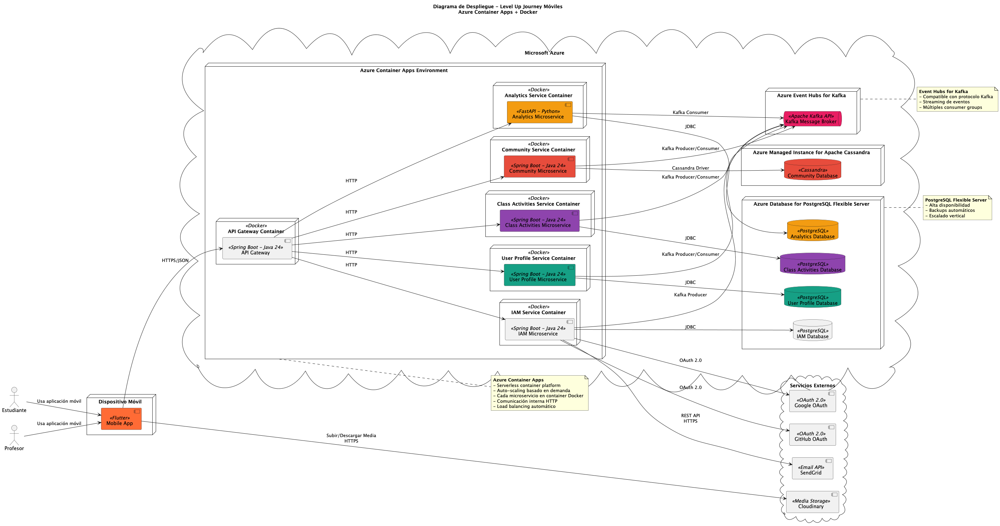

# Capítulo IV: Product Implementation & Validation

# 4. Product Implementation & Validation
En esta sección, se detalla el proceso de implementación, verificación, despliegue y validación de la solución. La solución se compone de una Landing Page que presenta el modelo de negocio, una aplicación móvil nativa para la interacción del usuario y servicios RESTful que soportan la lógica de negocio. Los procesos de negocio, tanto los `core` como los de soporte (ej. Autenticación y Autorización), se distribuyen a través de estos componentes.

## 4.1. Software Configuration Management
En esta sección, se establecen las decisiones y convenciones para mantener la consistencia durante todo el ciclo de vida del desarrollo de software. Se incluyen detalles sobre la gestión del código fuente, la configuración del entorno de desarrollo y la configuración del despliegue.

### 4.1.1. Software Development Environment Configuration
A continuación, se especifican las herramientas de software utilizadas por el equipo para colaborar en el ciclo de vida de los productos digitales.

| Herramienta                  | Propósito                                       | Referencia / Descarga                                     |
| ---------------------------- | ----------------------------------------------- | --------------------------------------------------------- |
| **Gestión de Proyectos**     |                                                 |                                                           |
| Jira                         | Gestión de tareas y seguimiento de Sprints      | [atlassian.com/software/jira](https://www.atlassian.com/software/jira) |
| **Diseño UX/UI**             |                                                 |                                                           |
| Figma                        | Diseño de prototipos y experiencia de usuario   | [figma.com](https://figma.com)                            |
| **Desarrollo Backend**       |                                                 |                                                           |
| IntelliJ IDEA Ultimate       | IDE para el desarrollo en Java y Spring Boot    | [jetbrains.com/idea](https://www.jetbrains.com/idea/)     |
| Java (JDK 24)                | Lenguaje de programación para el backend        | [oracle.com/java](https://www.oracle.com/java/)           |
| Spring Boot 3                | Framework para la creación de servicios RESTful | [spring.io/projects/spring-boot](https://spring.io/projects/spring-boot) |
| Maven                        | Gestión de dependencias y construcción del proyecto | [maven.apache.org](https://maven.apache.org)              |
| Docker                       | Contenerización de la aplicación                | [docker.com/get-started](https://www.docker.com/get-started) |
| **Desarrollo Frontend (Landing Page)** |                                     |                                                           |
| Visual Studio Code           | Editor de código para desarrollo web            | [code.visualstudio.com](https://code.visualstudio.com)    |
| Node.js                      | Entorno de ejecución para JavaScript            | [nodejs.org](https://nodejs.org)                          |
| Astro.js                     | Framework para construir la Landing Page        | [astro.build](https://astro.build)                        |
| TypeScript                   | Lenguaje de programación para el frontend       | [typescriptlang.org](https://www.typescriptlang.org)      |
| **Desarrollo Móvil**         |                                                 |                                                           |
| Android Studio               | IDE para el desarrollo de la aplicación Android | [developer.android.com/studio](https://developer.android.com/studio) |
| Kotlin                       | Lenguaje de programación para la app móvil      | [kotlinlang.org](https://kotlinlang.org)                  |
| Jetpack Compose              | Toolkit para la construcción de la UI nativa    | [developer.android.com/jetpack/compose](https://developer.android.com/jetpack/compose) |
| **Pruebas y Calidad**        |                                                 |                                                           |
| Postman                      | Pruebas de API y servicios web                  | [postman.com](https://www.postman.com)                    |
| JUnit 5                      | Framework para pruebas unitarias en Java        | [junit.org/junit5](https://junit.org/junit5)              |
| **Despliegue**               |                                                 |                                                           |
| Azure CLI                    | Interfaz de línea de comandos para Azure        | [docs.microsoft.com/cli/azure](https://docs.microsoft.com/cli/azure) |
| GitHub Actions               | CI/CD para automatización de despliegues        | [github.com/features/actions](https://github.com/features/actions) |

### 4.1.2. Source Code Management
Se utiliza GitHub como plataforma y sistema de control de versiones para gestionar el código fuente de todos los productos.

- **Repositorio de Backend (Web Services):** [https://github.com/LevelUp-Journey](https://github.com/LevelUp-Journey)
- **Repositorio de Frontend (Landing Page):** [https://github.com/LevelUp-Journey/Landing-Page](https://github.com/LevelUp-Journey/Landing-Page)
- **Repositorio de Aplicación Móvil:** [https://github.com/LevelUp-Journey/MobileApp-Front](https://github.com/LevelUp-Journey/MobileApp-Front)

**Workflow de Control de Versiones (GitFlow)**

Se adopta el modelo de branching GitFlow para organizar el trabajo y gestionar las versiones del software.

- **`main`:** Esta rama siempre contiene el código de producción estable. Solo se fusiona desde las ramas `release` y `hotfix`.
- **`develop`:** Es la rama principal de desarrollo. Contiene las últimas funcionalidades desarrolladas y estables. Sirve como base para crear nuevas ramas de `feature`.

**Convenciones de Nomenclatura de Ramas:**

- **Feature Branches:** Se crean a partir de `develop` para trabajar en nuevas funcionalidades.
  - **Formato:** `feature/<nombre-descriptivo-de-la-feature>`
  - **Ejemplo:** `feature/user-authentication`
- **Release Branches:** Se crean a partir de `develop` cuando se prepara una nueva versión de producción. Permiten la preparación final (pruebas, correcciones menores).
  - **Formato:** `release/vX.Y.Z` (siguiendo Semantic Versioning)
  - **Ejemplo:** `release/v1.0.0`
- **Hotfix Branches:** Se crean a partir de `main` para corregir errores críticos en producción.
  - **Formato:** `hotfix/vX.Y.Z`
  - **Ejemplo:** `hotfix/v1.0.1`

**Versionamiento Semántico (Semantic Versioning):**
Todas las releases seguirán el estándar de [Semantic Versioning 2.0.0](https://semver.org/). El formato de versión es `MAJOR.MINOR.PATCH`.

**Convencional Commits:**
Todos los mensajes de commit deben seguir la especificación de [Conventional Commits](https://www.conventionalcommits.org/). Esto mejora la legibilidad del historial y permite automatizar la generación de changelogs.
- **Ejemplo:** `feat: allow users to upload a profile picture`

### 4.1.3. Source Code Style Guide & Coding Conventions
Para asegurar la consistencia y calidad del código, el equipo adopta las siguientes guías de estilo y convenciones. El inglés es el idioma estándar para todo el código y la nomenclatura.

- **Java (Backend):** Se sigue la [Google Java Style Guide](https://google.github.io/styleguide/javaguide.html) junto con las convenciones y el formato de código estándar de [Spring Boot](https://docs.spring.io/spring-boot/docs/current/reference/html/using-spring-boot.html#using-boot-code-style).
- **TypeScript (Landing Page):** Se adhiere a la [Google TypeScript Style Guide](https://google.github.io/styleguide/tsguide.html).
- **Kotlin (Aplicación Móvil):** Se aplican las [convenciones de codificación oficiales de Kotlin](https://kotlinlang.org/docs/coding-conventions.html) y las guías recomendadas para Jetpack Compose.
- **Gherkin (Archivos .feature):** Se utiliza la guía [Gherkin Conventions for Readable Specifications](https://docs.cucumber.io/gherkin/reference/#conventions) para escribir escenarios de prueba claros y comprensibles.

### 4.1.4. Software Deployment Configuration
Esta sección detalla la configuración y los pasos necesarios para el despliegue de cada producto digital de la solución.

**Landing Page (Astro.js):**
1.  **Disparador:** Un `push` o `merge` a la rama `main` en el repositorio de GitHub.
2.  **CI/CD:** Vercel se encarga automáticamente del proceso de CI/CD.
3.  **Build:** Vercel instala las dependencias (`npm install`) y construye el sitio estático (`npm run build`).
4.  **Deploy:** Los archivos estáticos generados se despliegan en **Vercel** para su publicación.

**Backend (Spring Boot Web Services):**
1.  **Disparador:** Un `push` o `merge` a la rama `main`.
2.  **CI/CD:** Un workflow de GitHub Actions se activa.
3.  **Build & Test:** El workflow compila el código, ejecuta las pruebas unitarias y de integración (`mvn clean install`).
4.  **Contenerización:** Se construye una imagen Docker de la aplicación a partir de su Dockerfile.
5.  **Push a Registro:** La imagen Docker se etiqueta y se sube a **Azure Container Registry**.
6.  **Deploy:** Se actualiza el servicio en **Azure Container Apps** para que utilice la nueva imagen del contenedor, completando el despliegue.

**Mobile Application (Jetpack Compose):**
1.  **Disparador:** Creación de una `release` en el repositorio de GitHub.
2.  **CI/CD:** Un workflow de GitHub Actions se activa para construir la aplicación.
3.  **Build & Sign:** El workflow genera un Android App Bundle (`.aab`) firmado para producción.
4.  **Deploy:** El archivo `.aab` se sube a la **Google Play Console**. Desde allí, se gestiona el lanzamiento a través de los diferentes canales (interno, alfa, beta, producción) para su publicación en la Google Play Store.

**Diagrama de Despliegue (C4 Model):**

A continuación, se muestra el diagrama de despliegue que ilustra la infraestructura y la disposición de los componentes de la solución en los diferentes entornos.

## 4.2. Landing Page & Mobile Application Implementation

### 4.2.1. Sprint n1

El Sprint 1 se enfoca en establecer las bases del microservicio de comunidad, implementando funcionalidades CRUD para comunidades y publicaciones. Se incluyen validaciones de permisos, gestión de suscripciones y reacciones básicas. El objetivo es tener un sistema funcional para la creación y visualización de contenido comunitario, con un total de 72 puntos de historia.

#### 4.2.1.1. Sprint Planning n1

| **Sprint #**                        | **Sprint 1** |
| ----------------------------------- | ------------ |
| **Sprint Planning Background**      | Planificación inicial del microservicio de comunidad, enfocándonos en las funcionalidades básicas de gestión de comunidades y publicaciones. |
| **Date**                            | 2025-10-01   |
| **Time**                            | 10:00 AM    |
| **Location**                        | Salón de Reuniones |
| **Prepared By**                     | Mate         |
| **Attendees (to planning meeting)** | Mate, Fabrizio, Jonatan |
| **Sprint Goal & User Stories**      | - Registrar comunidad académica - Actualizar información de comunidad - Eliminar comunidad obsoleta - Consultar comunidad por ID - Listar comunidades por filtros - Exponer métricas de comunidad - Publicar contenido en comunidad - Validar permisos de publicación docente - Consultar publicación por ID - Listar publicaciones globales - Listar publicaciones por comunidad - Eliminar publicación inapropiada - Suscribirse a una comunidad - Evitar suscripciones duplicadas - Listar suscripciones del usuario - Consultar suscriptores de una comunidad - Cancelar suscripción - Crear seguimiento entre usuarios - Evitar seguimientos duplicados - Consultar conteo de seguidores - Eliminar seguimiento - Alternar reacción "like" - Obtener resumen de reacciones |
| **Sprint 1 Velocity**               | 72           |
| **Sum of Story Points**             | 72           |

#### 4.2.1.2. Sprint Backlog n1

https://trello.com/invite/b/6916c172472e47bfa3b0fff1/ATTI3f3b4b3732cc82a36cf475d87f496e611E485B05/lvl-down

| User Story Id | Title | Work-Item / Task Id | Title | Description | Estimation (Hours) | Assigned To | Status |
| --- | --- | --- | --- | --- | --- | --- | --- |
| US-01 | Registrar comunidad académica | US-01 | Registrar comunidad académica | Como Docente, quiero registrar una comunidad proporcionando su información básica, para disponer de un espacio de colaboración. | 5 | Fabrizio | To-do |
| US-02 | Actualizar información de comunidad | US-02 | Actualizar información de comunidad | Como Docente, quiero modificar el nombre, descripción o imagen de mi comunidad, para mantenerla vigente. | 3 | Fabrizio | To-do |
| US-03 | Eliminar comunidad obsoleta | US-03 | Eliminar comunidad obsoleta | Como Administrador, quiero eliminar una comunidad cuando deja de ser necesaria, para mantener el catálogo limpio. | 2 | Fabrizio | To-do |
| US-04 | Consultar comunidad por ID | US-04 | Consultar comunidad por ID | Como Usuario, quiero obtener la información de una comunidad específica, para conocer sus detalles. | 2 | Fabrizio | To-do |
| US-05 | Listar comunidades por filtros | US-05 | Listar comunidades por filtros | Como Usuario, quiero listar comunidades existentes y filtrarlas por creador, para encontrar espacios relevantes. | 3 | Fabrizio | To-do |
| US-06 | Exponer métricas de comunidad | US-06 | Exponer métricas de comunidad | Como Docente, quiero visualizar el número de seguidores y mis identificadores asociados a la comunidad, para evaluar su impacto. | 3 | Fabrizio | To-do |
| US-07 | Publicar contenido en comunidad | US-07 | Publicar contenido en comunidad | Como Docente, quiero publicar contenido con texto e imagen opcional, para compartir información con los miembros. | 5 | Fabrizio | To-do |
| US-08 | Validar permisos de publicación docente | US-08 | Validar permisos de publicación docente | Como Administrador, quiero asegurar que solo Docentes propietarios o suscritos publiquen, para preservar la calidad del contenido. | 3 | Fabrizio | To-do |
| US-09 | Consultar publicación por ID | US-09 | Consultar publicación por ID | Como Usuario, quiero consultar un post específico con todos sus metadatos, para entender su contexto. | 3 | Fabrizio | To-do |
| US-10 | Listar publicaciones globales | US-10 | Listar publicaciones globales | Como Usuario, quiero revisar un listado paginado de publicaciones recientes, para mantenerme informado. | 5 | Fabrizio | To-do |
| US-11 | Listar publicaciones por comunidad | US-11 | Listar publicaciones por comunidad | Como Usuario, quiero revisar exclusivamente las publicaciones de una comunidad con paginación, para enfocarme en temas específicos. | 3 | Fabrizio | To-do |
| US-12 | Eliminar publicación inapropiada | US-12 | Eliminar publicación inapropiada | Como Docente, quiero eliminar un post que administré, para retirar contenido erróneo o inapropiado. | 5 | Fabrizio | To-do |
| US-13 | Suscribirse a una comunidad | US-13 | Suscribirse a una comunidad | Como Usuario, quiero suscribirme a una comunidad, para recibir sus publicaciones. | 3 | Fabrizio | To-do |
| US-14 | Evitar suscripciones duplicadas | US-14 | Evitar suscripciones duplicadas | Como Administrador, quiero garantizar que ningún Usuario cree suscripciones duplicadas, para mantener la integridad. | 2 | Fabrizio | To-do |
| US-15 | Listar suscripciones del usuario | US-15 | Listar suscripciones del usuario | Como Usuario, quiero ver mis suscripciones con paginación, para gestionar mis fuentes de contenido. | 3 | Fabrizio | To-do |
| US-16 | Consultar suscriptores de una comunidad | US-16 | Consultar suscriptores de una comunidad | Como Docente, quiero conocer quiénes están suscritos a mi comunidad, para entender su alcance. | 3 | Fabrizio | To-do |
| US-17 | Cancelar suscripción | US-17 | Cancelar suscripción | Como Usuario, quiero cancelar mi suscripción a una comunidad, para dejar de recibir su información. | 2 | Fabrizio | To-do |
| US-18 | Crear seguimiento entre usuarios | US-18 | Crear seguimiento entre usuarios | Como Usuario, quiero seguir a otro Usuario válido, para ver su actividad en mi feed. | 3 | Fabrizio | To-do |
| US-19 | Evitar seguimientos duplicados | US-19 | Evitar seguimientos duplicados | Como Administrador, quiero impedir duplicidades en los seguimientos, para mantener datos consistentes. | 2 | Fabrizio | To-do |
| US-20 | Consultar conteo de seguidores | US-20 | Consultar conteo de seguidores | Como Usuario, quiero conocer cuántos seguidores tengo, para evaluar mi alcance. | 2 | Fabrizio | To-do |
| US-21 | Eliminar seguimiento | US-21 | Eliminar seguimiento | Como Usuario, quiero dejar de seguir a alguien, para actualizar mis preferencias. | 2 | Fabrizio | To-do |
| US-22 | Alternar reacción "like" | US-22 | Alternar reacción "like" | Como Usuario, quiero alternar mi reacción "like" en un post, para reflejar mi opinión. | 5 | Fabrizio | To-do |
| US-23 | Obtener resumen de reacciones | US-23 | Obtener resumen de reacciones | Como Usuario, quiero conocer el resumen de reacciones de un post, para entender su interacción. | 3 | Fabrizio | To-do |

#### 4.2.1.3. Development Evidence for Sprint n1 Review

#### 4.2.1.4. Testing Suite Evidence for Sprint n1 Review

Acceptance Tests - Code Evaluation Module

Feature: Gestión de Publicaciones y Multimedia

Como docente (ROLE_TEACHER)
 Quiero crear, editar y destacar publicaciones con multimedia
 Para compartir contenido académico relevante con mi comunidad

Scenario: Crear publicación con multimedia válida

ID: COMM-US-001
 Given que soy un docente autenticado con ROLE_TEACHER
 And tengo un título, contenido enriquecido, tipo y categoría válidos
 And adjunto hasta 5 archivos multimedia de máximo 10MB cada uno
 When envío la solicitud POST `/api/v1/posts` con todos los campos válidos
 Then la API responde 201 Created con el identificador de la publicación
 And la publicación queda visible en el feed inmediatamente
 And los metadatos de los archivos quedan asociados a la publicación

Scenario: Rechazar creación por exceder adjuntos permitidos

ID: COMM-US-001
 Given que soy un docente autenticado con ROLE_TEACHER
 And intento adjuntar 6 archivos multimedia
 When envío la solicitud POST `/api/v1/posts`
 Then la API responde 400 Bad Request con el código `MAX_ATTACHMENTS_EXCEEDED`
 And la publicación no se crea ni queda visible

Scenario: Restringir creación de publicación a roles válidos

ID: COMM-US-001
 Given que soy un estudiante autenticado con ROLE_STUDENT
 When envío POST `/api/v1/posts` con datos correctos
 Then la API responde 403 Forbidden con mensaje `ROLE_NOT_ALLOWED`
 And no se persiste ninguna publicación

Scenario: Editar publicación propia con marca de edición

ID: COMM-US-002
 Given que soy un docente con ROLE_TEACHER y tengo una publicación propia
 When actualizo título y contenido mediante PUT `/api/v1/posts/{postId}`
 Then la API responde 200 OK con el contenido actualizado
 And la publicación queda marcada como `edited=true` con timestamp

Scenario: Eliminar publicación propia con cascada

ID: COMM-US-002
 Given que soy un docente con ROLE_TEACHER y la publicación tiene comentarios y likes
 When ejecuto DELETE `/api/v1/posts/{postId}`
 Then la API responde 204 No Content
 And la publicación y sus comentarios y likes asociados se eliminan definitivamente

Scenario: Impedir edición de publicación ajena

ID: COMM-US-002
 Given que intento editar una publicación creada por otro docente
 When envío PUT `/api/v1/posts/{postId}`
 Then la API responde 403 Forbidden con código `POST_OWNER_MISMATCH`
 And la publicación conserva su contenido original

Scenario: Fijar publicación respetando límite máximo

ID: COMM-US-003
 Given que soy un docente con ROLE_TEACHER y existen solo 2 publicaciones fijadas
 When envío PATCH `/api/v1/posts/{postId}/pin` para fijar una tercera publicación
 Then la API responde 200 OK con la publicación marcada `pinned=true`
 And el feed muestra la publicación en la sección de fijadas

Scenario: Rechazar cuarta publicación fijada

ID: COMM-US-003
 Given que ya existen 3 publicaciones fijadas activas
 When intento fijar una nueva publicación
 Then la API responde 409 Conflict con código `PIN_LIMIT_REACHED`
 And la publicación permanece sin estado fijado

------

Feature: Participación en la Comunidad

Como estudiante (ROLE_STUDENT)
 Quiero explorar, comentar y reaccionar en el feed
 Para involucrarme en discusiones académicas y seguir novedades

Scenario: Visualizar feed con fijadas al inicio

ID: COMM-US-004
 Given que soy un estudiante autenticado con ROLE_STUDENT
 And existen publicaciones fijadas y no fijadas con diferentes fechas
 When consulto GET `/api/v1/feed?page=0&size=10`
 Then la API responde 200 OK con las publicaciones fijadas primero
 And el resto del feed aparece en orden cronológico descendente
 And cada tarjeta incluye título, extracto, autor, fecha y contadores

Scenario: Impedir acceso al feed a usuarios no autenticados

ID: COMM-US-004
 Given que navego el feed sin iniciar sesión (ROLE_GUEST)
 When realizo GET `/api/v1/feed`
 Then la API responde 401 Unauthorized
 And no retorna datos de publicaciones

Scenario: Publicar comentario dentro del límite permitido

ID: COMM-US-005
 Given que soy un estudiante autenticado y visualizo una publicación
 And mi comentario tiene máximo 500 caracteres
 When envío POST `/api/v1/posts/{postId}/comments`
 Then la API responde 201 Created con el comentario y metadatos de autor
 And el comentario aparece bajo la publicación

Scenario: Editar comentario dentro de ventana de 24 horas

ID: COMM-US-005
 Given que mi comentario fue creado hace menos de 24 horas
 When envío PUT `/api/v1/posts/{postId}/comments/{commentId}` con nuevo texto
 Then la API responde 200 OK con flag `edited=true` y timestamp actualizado

Scenario: Rechazar edición luego de 24 horas

ID: COMM-US-005
 Given que mi comentario tiene más de 24 horas de creado
 When intento editarlo con PUT `/api/v1/posts/{postId}/comments/{commentId}`
 Then la API responde 409 Conflict con código `COMMENT_EDIT_WINDOW_EXPIRED`

Scenario: Eliminar comentario propio en cualquier momento

ID: COMM-US-005
 Given que soy propietario del comentario
 When realizo DELETE `/api/v1/posts/{postId}/comments/{commentId}`
 Then la API responde 204 No Content
 And el comentario deja de mostrarse en la publicación

Scenario: Dar like a publicación

ID: COMM-US-006
 Given que soy un usuario autenticado y aún no he reaccionado al post
 When envío POST `/api/v1/posts/{postId}/likes`
 Then la API responde 201 Created
 And el contador de likes aumenta en 1 y registra mi usuario

Scenario: Retirar like existente

ID: COMM-US-006
 Given que previamente había dado like a la publicación
 When ejecuto DELETE `/api/v1/posts/{postId}/likes`
 Then la API responde 204 No Content
 And el contador de likes disminuye en 1

Scenario: Consultar usuarios que reaccionaron

ID: COMM-US-006
 Given que una publicación tiene reacciones de múltiples usuarios
 When solicito GET `/api/v1/posts/{postId}/likes`
 Then la API responde 200 OK con lista paginada de usuarios, rol y avatar

------

Feature: Notificaciones y Búsqueda

Como usuario (ROLE_STUDENT/ROLE_TEACHER)
 Quiero recibir notificaciones y personalizar alertas
 Para estar informado de actividad relevante y controlar mis preferencias

Scenario: Notificar nueva publicación a estudiantes suscritos

ID: COMM-US-007
 Given que soy un estudiante suscrito con preferencias activas para nuevas publicaciones
 And un docente crea una publicación en mi comunidad
 When se procesa la creación
 Then recibo una notificación en tiempo real con enlace al contenido
 And la alerta queda registrada en mi bandeja de notificaciones

Scenario: Notificar comentario a docente autor

ID: COMM-US-007
 Given que soy un docente con preferencias activas para comentarios en mis publicaciones
 When un estudiante comenta mi post
 Then recibo una notificación push con el detalle y enlace al comentario

Scenario: Configurar preferencias para desactivar tipo de notificación

ID: COMM-US-007
 Given que deseo dejar de recibir notificaciones por likes
 When envío PATCH `/api/v1/notifications/preferences` desactivando el tipo `likes`
 Then la API responde 200 OK con el estado actualizado
 And a partir de ese momento los likes no generan nuevas alertas

------

Feature: Moderación de Contenido Reportado

Como administrador (ROLE_ADMIN)
 Quiero gestionar reportes y aplicar sanciones
 Para mantener la comunidad segura y respetuosa

Scenario: Revisar y eliminar contenido reportado

ID: COMM-US-008
 Given que existe un reporte con motivo "contenido inapropiado"
 And estoy autenticado como ROLE_ADMIN
 When consulto GET `/api/v1/reports/{reportId}`
 And resuelvo con POST `/api/v1/reports/{reportId}/resolve` acción `delete`
 Then la API responde 200 OK confirmando la acción
 And la publicación o comentario reportado deja de ser visible en el feed

Scenario: Emitir advertencia con registro en historial

ID: COMM-US-008
 Given que un reporte requiere advertir al usuario infractor
 When resuelvo el reporte aplicando advertencia con motivo y duración
 Then se crea una entrada en el historial de moderación con timestamp, admin y motivo
 And el usuario involucrado recibe notificación de la sanción

Scenario: Restringir acceso de roles no admin a reportes

ID: COMM-US-008
 Given que intento acceder a la moderación con ROLE_TEACHER
 When realizo GET `/api/v1/reports`
 Then la API responde 403 Forbidden con código `ADMIN_ONLY_FEATURE`
 And no muestra detalles de los reportes

#### 4.2.1.5. Execution Evidence for Sprint n1 Review

#### 4.2.1.6. Services Documentation Evidence for Sprint n1 Review

#### 4.2.1.7. Software Deployment Evidence for Sprint n1 Review

#### 4.2.1.8. Team Collaboration Insights during Sprint n1

### 4.2.1. Sprint n2

El Sprint 2 expande las capacidades con un sistema de feed paginado, manejo avanzado de reacciones y eventos de usuario. Incluye integración inicial con aplicaciones móviles (Flutter y Kotlin) para consumir feeds y gestionar interacciones. Se suma autenticación básica, totalizando 92 puntos de historia para mejorar la experiencia de usuario en plataformas móviles.

#### 4.2.1.1. Sprint Planning n2

| **Sprint #**                        | **Sprint 2** |
| ----------------------------------- | ------------ |
| **Sprint Planning Background**      | Desarrollo de funcionalidades avanzadas para el feed de publicaciones, reacciones y integración con aplicaciones móviles. |
| **Date**                            | 2025-10-15   |
| **Time**                            | 11:00 AM    |
| **Location**                        | Google Meet  |
| **Prepared By**                     | Mate         |
| **Attendees (to planning meeting)** | Mate, Fabrizio, Jonatan |
| **Sprint Goal & User Stories**      | - Eliminar reacción por usuario y post - Limpiar reacciones al borrar un post - Generar feed paginado - Consultar fuentes del feed - Obtener estadísticas del feed - Tratar feeds sin fuentes - Procesar evento de usuario registrado - Procesar evento de perfil actualizado - Exponer datos de usuario vía ACL - Validar identidad antes de comandos críticos - Exponer comunidades para Flutter - Gestionar suscripciones desde Flutter - Consumir feed en Flutter - Registrar reacciones desde Flutter - Listar comunidades en Kotlin - Administrar seguimientos desde Kotlin - Obtener feed en Kotlin - Mantener datos de usuario sincronizados en Kotlin - Registro con validaciones y rol por defecto - Autenticación con proveedores (Google/GitHub) - Caso GitHub sin email - Implementar POST /auth/signup - Inicio de sesión (email/contraseña) |
| **Sprint 2 Velocity**               | 92           |
| **Sum of Story Points**             | 92           |

#### 4.2.1.2. Sprint Backlog n2

https://trello.com/invite/b/6916c172472e47bfa3b0fff1/ATTI3f3b4b3732cc82a36cf475d87f496e611E485B05/lvl-down

| User Story Id | Title | Work-Item / Task Id | Title | Description | Estimation (Hours) | Assigned To | Status |
| --- | --- | --- | --- | --- | --- | --- | --- |
| US-24 | Eliminar reacción por usuario y post | US-24 | Eliminar reacción por usuario y post | Como Usuario, quiero retirar mi reacción específica de un post, para modificar mi opinión. | 2 | Jonatan | To-do |
| US-25 | Limpiar reacciones al borrar un post | US-25 | Limpiar reacciones al borrar un post | Como Administrador, quiero que al eliminar un post se eliminen todas sus reacciones, para evitar datos huérfanos. | 3 | Jonatan | To-do |
| US-26 | Generar feed paginado | US-26 | Generar feed paginado | Como Usuario, quiero obtener un feed paginado con publicaciones de mis fuentes, para consumir contenido actualizado. | 8 | Jonatan | To-do |
| US-27 | Consultar fuentes del feed | US-27 | Consultar fuentes del feed | Como Usuario, quiero conocer a quiénes sigo y a qué comunidades estoy suscrito, para entender qué compone mi feed. | 3 | Jonatan | To-do |
| US-28 | Obtener estadísticas del feed | US-28 | Obtener estadísticas del feed | Como Usuario, quiero conocer cuántas fuentes alimentan mi feed, para evaluar mi alcance. | 2 | Jonatan | To-do |
| US-29 | Tratar feeds sin fuentes | US-29 | Tratar feeds sin fuentes | Como Administrador, quiero que el feed responda correctamente cuando un Usuario no tiene fuentes, para evitar confusión. | 2 | Jonatan | To-do |
| US-30 | Procesar evento de usuario registrado | US-30 | Procesar evento de usuario registrado | Como Administrador, quiero registrar o refrescar usuarios internos a partir de eventos de registro, para contar con datos actualizados. | 5 | Jonatan | To-do |
| US-31 | Procesar evento de perfil actualizado | US-31 | Procesar evento de perfil actualizado | Como Administrador, quiero actualizar los datos cacheados cuando exista un evento de perfil, para mantener coherencia. | 3 | Jonatan | To-do |
| US-32 | Exponer datos de usuario vía ACL | US-32 | Exponer datos de usuario vía ACL | Como Administrador, quiero que los contextos internos soliciten nombre y URL de un usuario mediante un contrato estable, para enriquecer respuestas. | 3 | Jonatan | To-do |
| US-33 | Validar identidad antes de comandos críticos | US-33 | Validar identidad antes de comandos críticos | Como Administrador, quiero que cada comando crítico verifique la existencia del usuario en el directorio, para evitar acciones huérfanas. | 5 | Jonatan | To-do |
| US-34 | Exponer comunidades para Flutter | US-34 | Exponer comunidades para Flutter | Como Usuario, quiero visualizar comunidades con sus métricas desde la app Flutter, para elegir dónde participar. | 3 | Jonatan | To-do |
| US-35 | Gestionar suscripciones desde Flutter | US-35 | Gestionar suscripciones desde Flutter | Como Usuario, quiero suscribirme o cancelar suscripciones usando la app Flutter, para controlar mis espacios desde el móvil. | 5 | Jonatan | To-do |
| US-36 | Consumir feed en Flutter | US-36 | Consumir feed en Flutter | Como Usuario, quiero ver mi feed personalizado en la app Flutter, para mantenerme al día. | 5 | Jonatan | To-do |
| US-37 | Registrar reacciones desde Flutter | US-37 | Registrar reacciones desde Flutter | Como Usuario, quiero reaccionar a los posts directamente desde la app Flutter, para expresar mi opinión. | 5 | Jonatan | To-do |
| US-38 | Listar comunidades en Kotlin | US-38 | Listar comunidades en Kotlin | Como Usuario, quiero consultar comunidades disponibles desde la app Kotlin, para integrarme a las adecuadas. | 3 | Jonatan | To-do |
| US-39 | Administraristrar seguimientos desde Kotlin | US-39 | Administraristrar seguimientos desde Kotlin | Como Usuario, quiero seguir o dejar de seguir a otros usuarios desde mi app Kotlin, para ajustar mi feed. | 5 | Jonatan | To-do |
| US-40 | Obtener feed en Kotlin | US-40 | Obtener feed en Kotlin | Como Usuario, quiero consumir mi feed personalizado en la app Kotlin, para revisar novedades. | 5 | Jonatan | To-do |
| US-41 | Mantener datos de usuario sincronizados en Kotlin | US-41 | Mantener datos de usuario sincronizados en Kotlin | Como Usuario, quiero recibir datos actualizados de perfiles en la app Kotlin, para visualizar autores correctamente. | 3 | Jonatan | To-do |
| IAM-US-001 | Registro con validaciones y rol por defecto | IAM-US-001 | Registro con validaciones y rol por defecto | Como usuario nuevo, quiero registrarme con email y contraseña para acceder a la plataforma con rol estudiante por defecto. | 5 | Jonatan | To-do |
| IAM-US-006 | Autenticación con proveedores (Google/GitHub) | IAM-US-006 | Autenticación con proveedores (Google/GitHub) | Como usuario, quiero autenticarme con Google o GitHub para ingresar rápidamente. | 2 | Jonatan | To-do |
| IAM-US-007 | Caso GitHub sin email | IAM-US-007 | Caso GitHub sin email | Como usuario de GitHub sin email, quiero un identificador alternativo para completar el login. | 5 | Jonatan | To-do |
| TIAM-001 | Implementar POST /auth/signup | TIAM-001 | Implementar POST /auth/signup | Como Desarrollador, quiero implementar el endpoint de registro para crear usuarios seguros y asignar rol por defecto para permitir el acceso inicial a la plataforma | 5 | Jonatan | To-do |
| IAM-US-002 | Inicio de sesión (email/contraseña) | IAM-US-002 | Inicio de sesión (email/contraseña) | Como usuario, quiero iniciar sesión para obtener tokens y acceder a recursos protegidos. | 5 | Jonatan | To-do |

#### 4.2.1.3. Development Evidence for Sprint n2 Review

#### 4.2.1.4. Testing Suite Evidence for Sprint n2 Review

Acceptance Tests - IAM (Identity and Access Management) Module

Feature: Registro de Nuevos Usuarios

Como usuario nuevo
 Quiero registrarme con email y contraseña
 Para acceder a la plataforma con seguridad (rol estudiante por defecto)

Scenario: Registro exitoso con email y contraseña válidos

ID: IAM-US-001
 Given que soy un usuario nuevo sin cuenta en la plataforma
 And proporciono el email "[nuevo.usuario@example.com](mailto:nuevo.usuario@example.com)" (formato RFC 5322 válido)
 And proporciono una contraseña "SecureP@ss123" que cumple las políticas de seguridad
 When envío la solicitud de registro sin especificar roles
 Then el sistema crea una nueva cuenta de usuario
 And el email se normaliza a minúsculas "[nuevo.usuario@example.com](mailto:nuevo.usuario@example.com)"
 And se me asigna automáticamente el rol ROLE_STUDENT
 And recibo una confirmación de registro exitoso
 And puedo iniciar sesión con mis credenciales

Scenario: Rechazo de registro con email inválido

ID: IAM-US-001
 Given que soy un usuario nuevo
 And proporciono un email inválido "usuario-sin-arroba.com"
 And proporciono una contraseña válida
 When envío la solicitud de registro
 Then el sistema rechaza la solicitud
 And muestra el mensaje "El email proporcionado no es válido"
 And no se crea ninguna cuenta

Scenario: Rechazo de registro con contraseña débil

ID: IAM-US-001
 Given que soy un usuario nuevo
 And proporciono un email válido "[usuario@example.com](mailto:usuario@example.com)"
 And proporciono una contraseña débil "123"
 When envío la solicitud de registro
 Then el sistema rechaza la solicitud
 And muestra el mensaje "La contraseña no cumple con los requisitos de seguridad"
 And no se crea ninguna cuenta

Scenario: Rechazo de registro con email ya registrado

ID: IAM-US-001
 Given que existe un usuario con email "[existente@example.com](mailto:existente@example.com)"
 And intento registrarme con el mismo email "[existente@example.com](mailto:existente@example.com)"
 When envío la solicitud de registro
 Then el sistema rechaza la solicitud
 And muestra el mensaje "El email ya está registrado"
 And no se crea una cuenta duplicada

Feature: Inicio de Sesión y Gestión de Tokens

Como usuario autenticado
 Quiero iniciar sesión y gestionar tokens (validar y refrescar)
 Para mantener una sesión segura y continua

Scenario: Inicio de sesión exitoso con credenciales válidas

ID: IAM-US-002
 Given que existe un usuario registrado con email "[usuario@test.com](mailto:usuario@test.com)" y contraseña "Pass@word123"
 When envío una solicitud de inicio de sesión con email "[usuario@test.com](mailto:usuario@test.com)" y contraseña "Pass@word123"
 Then el sistema autentica las credenciales mediante comparación segura
 And retorna los datos del usuario (ID, email, roles)
 And retorna un token de acceso (access token) válido
 And retorna un token de actualización (refresh token) válido
 And puedo usar el access token para acceder a recursos protegidos

Scenario: Rechazo de inicio de sesión con email incorrecto

ID: IAM-US-003
 Given que existe un usuario con email "[correcto@test.com](mailto:correcto@test.com)"
 When intento iniciar sesión con email "[incorrecto@test.com](mailto:incorrecto@test.com)" y una contraseña cualquiera
 Then el sistema rechaza la autenticación
 And muestra el mensaje "Credenciales inválidas"
 And no retorna tokens
 And no revela si el email existe o no (seguridad)

Scenario: Rechazo de inicio de sesión con contraseña incorrecta

ID: IAM-US-003
 Given que existe un usuario con email "[usuario@test.com](mailto:usuario@test.com)" y contraseña correcta
 When intento iniciar sesión con email "[usuario@test.com](mailto:usuario@test.com)" y contraseña "ContraseñaIncorrecta"
 Then el sistema rechaza la autenticación
 And muestra el mensaje "Credenciales inválidas"
 And no retorna tokens

Scenario: Renovación de sesión con refresh token válido

ID: IAM-US-004
 Given que inicié sesión previamente y obtuve un refresh token válido
 And el refresh token no ha expirado
 When envío una solicitud de renovación con el refresh token
 Then el sistema valida el refresh token
 And genera un nuevo access token
 And genera un nuevo refresh token
 And los nuevos tokens reemplazan a los anteriores
 And puedo continuar usando la plataforma sin volver a autenticarme

Scenario: Rechazo de renovación con refresh token expirado

ID: IAM-US-004
 Given que tengo un refresh token que expiró hace 2 días
 When intento renovar mi sesión con el refresh token expirado
 Then el sistema rechaza la renovación
 And muestra el mensaje "Token expirado"
 And no genera nuevos tokens
 And debo iniciar sesión nuevamente

Scenario: Validación de access token vigente

ID: IAM-US-005
 Given que tengo un access token emitido por el sistema hace 5 minutos
 And el token aún no ha expirado
 When solicito validar el access token
 Then el sistema confirma que el token es válido
 And retorna el email asociado al token
 And puedo usar el token para acceder a recursos protegidos

Scenario: Rechazo de validación de access token expirado

ID: IAM-US-005
 Given que tengo un access token que expiró hace 1 hora
 When solicito validar el access token
 Then el sistema indica que el token no es válido
 And muestra el mensaje "Token expirado"
 And no puedo acceder a recursos protegidos

Feature: Autenticación con Proveedores OAuth2

Como usuario nuevo
 Quiero autenticarme con Google o GitHub
 Para ingresar rápidamente sin crear contraseña

Scenario: Primer login con Google exitoso

ID: IAM-US-006
 Given que no tengo una cuenta en la plataforma
 And inicio sesión con mi cuenta de Google
 When Google retorna mis datos válidos (email, nombre)
 Then el sistema registra automáticamente mi cuenta
 And me asigna el rol ROLE_STUDENT por defecto
 And emite un access token válido
 And emite un refresh token válido
 And puedo acceder inmediatamente a la plataforma

Scenario: Login subsecuente con Google

ID: IAM-US-006
 Given que previamente me registré usando Google
 And mi cuenta ya existe en el sistema
 When inicio sesión nuevamente con Google
 Then el sistema identifica mi cuenta existente
 And no crea una cuenta duplicada
 And emite nuevos tokens de acceso
 And mantengo mis roles y datos previamente configurados

Scenario: Primer login con GitHub sin email público

ID: IAM-US-007
 Given que no tengo una cuenta en la plataforma
 And inicio sesión con mi cuenta de GitHub
 And GitHub no devuelve mi email (email privado)
 And mi login de GitHub es "developerJohn"
 When GitHub retorna mis datos sin email
 Then el sistema genera un identificador alternativo "[developerJohn@github.oauth](mailto:developerJohn@github.oauth)"
 And registra mi cuenta con ese identificador
 And me asigna el rol ROLE_STUDENT
 And emite tokens de acceso
 And puedo usar la plataforma normalmente

Scenario: Login con GitHub con email público

ID: IAM-US-007
 Given que inicio sesión con GitHub
 And GitHub devuelve mi email "[john@developer.com](mailto:john@developer.com)"
 When completo la autenticación
 Then el sistema registra mi cuenta con el email real "[john@developer.com](mailto:john@developer.com)"
 And no usa el identificador alternativo
 And emite tokens de acceso

Feature: Gestión de Usuarios y Roles

Como administrador o docente (ROLE_ADMIN/ROLE_TEACHER)
 Quiero gestionar usuarios y roles
 Para controlar el acceso y permisos del sistema

Scenario: Listar todos los usuarios como administrador

ID: IAM-US-008
 Given que soy un administrador autenticado con rol ROLE_ADMIN
 And existen 50 usuarios registrados en el sistema
 When solicito listar todos los usuarios
 Then recibo la lista completa de 50 usuarios
 And cada usuario muestra su ID, email y roles asignados
 And la lista se ordena por fecha de creación

Scenario: Obtener usuario específico por ID

ID: IAM-US-009
 Given que tengo un token válido con permisos de docente o administrador
 And existe un usuario con UUID "123e4567-e89b-12d3-a456-426614174000"
 When consulto el usuario por su UUID
 Then obtengo la información completa del usuario
 And veo su email, roles asignados y fecha de registro
 And veo su estado activo/inactivo

Scenario: Obtener usuario específico por email

ID: IAM-US-009
 Given que tengo un token válido con permisos
 And existe un usuario con email "[estudiante@university.edu](mailto:estudiante@university.edu)"
 When consulto el usuario por su email "[estudiante@university.edu](mailto:estudiante@university.edu)"
 Then obtengo la información del usuario
 And veo su ID, roles y datos asociados

Scenario: Usuario no encontrado por ID inexistente

ID: IAM-US-009
 Given que tengo un token válido
 And no existe un usuario con UUID "999e9999-e99b-99d9-a999-999999999999"
 When intento consultar ese UUID
 Then el sistema retorna "Usuario no encontrado"
 And no retorna datos de usuario

Scenario: Listar roles disponibles en el sistema

ID: IAM-US-010
 Given que tengo permisos de ROLE_TEACHER o ROLE_ADMIN
 When consulto el catálogo de roles
 Then obtengo la lista de roles disponibles
 And veo ROLE_STUDENT con su descripción
 And veo ROLE_TEACHER con su descripción
 And veo ROLE_ADMIN con su descripción

Scenario: Consultar rol específico por nombre

ID: IAM-US-010
 Given que tengo permisos de docente o administrador
 When consulto el rol "ROLE_TEACHER" por su nombre
 Then obtengo los detalles del rol
 And veo su nombre, permisos asociados y descripción

Scenario: Inicialización de roles base del sistema

ID: IAM-US-011
 Given que el sistema se inicia por primera vez
 And no existen roles en la base de datos
 When se ejecuta la operación de seed de roles
 Then se crean los 3 roles predefinidos: ROLE_STUDENT, ROLE_TEACHER, ROLE_ADMIN
 And cada rol se crea con sus permisos correspondientes
 And la operación completa exitosamente

Scenario: Verificación de roles existentes sin duplicar

ID: IAM-US-011
 Given que los roles ROLE_STUDENT y ROLE_TEACHER ya existen en el sistema
 And falta crear ROLE_ADMIN
 When ejecuto la operación de seed de roles
 Then el sistema verifica los roles existentes
 And no duplica ROLE_STUDENT ni ROLE_TEACHER
 And crea únicamente ROLE_ADMIN
 And finaliza sin errores

Scenario: Asignar rol individual a usuario

ID: IAM-US-013
 Given que soy un administrador autenticado
 And existe un usuario "[usuario@test.com](mailto:usuario@test.com)" con rol ROLE_STUDENT
 And el rol ROLE_TEACHER existe en el sistema
 When asigno el rol ROLE_TEACHER al usuario
 Then el usuario tiene ahora los roles ROLE_STUDENT y ROLE_TEACHER
 And el sistema valida la existencia del rol antes de asignar
 And no se crean roles duplicados

Scenario: Asignar múltiples roles en lote

ID: IAM-US-013
 Given que soy un administrador autenticado
 And existe un usuario "[profesor@university.edu](mailto:profesor@university.edu)" solo con ROLE_STUDENT
 When asigno los roles ROLE_TEACHER y ROLE_ADMIN en una sola operación
 Then el usuario tiene ahora los 3 roles: ROLE_STUDENT, ROLE_TEACHER y ROLE_ADMIN
 And no se generan duplicados
 And la asignación se registra en el historial de cambios

Scenario: Garantizar ROLE_STUDENT si usuario no tiene roles

ID: IAM-US-013
 Given que existe un usuario sin roles asignados (inconsistencia de datos)
 When el sistema valida los roles del usuario
 Then automáticamente se asigna ROLE_STUDENT
 And el usuario tiene al menos un rol para operar en la plataforma

Scenario: Rechazo de asignación de rol inexistente

ID: IAM-US-013
 Given que soy un administrador
 And intento asignar un rol "ROLE_SUPERUSER" que no existe
 When ejecuto la asignación
 Then el sistema rechaza la operación
 And muestra el mensaje "El rol no existe"
 And no se modifica la lista de roles del usuario

Feature: Evaluación de Fortaleza de Contraseñas

Como usuario
 Quiero evaluar la fortaleza de mi contraseña
 Para mejorar mi seguridad antes de registrarme o cambiarla

Scenario: Contraseña muy fuerte (puntaje 5)

ID: IAM-US-012
 Given que proporciono la contraseña "MyV3ry$tr0ng&C0mpl3xP@ssw0rd!"
 When solicito evaluar su fortaleza
 Then el sistema calcula un puntaje de 5
 And clasifica la contraseña como "Muy Fuerte"
 And indica que es segura para usar

Scenario: Contraseña fuerte (puntaje 4)

ID: IAM-US-012
 Given que proporciono la contraseña "S3cur3P@ssw0rd"
 When solicito evaluar su fortaleza
 Then el sistema calcula un puntaje de 4
 And clasifica la contraseña como "Fuerte"
 And cumple con los requisitos mínimos de seguridad

Scenario: Contraseña moderada (puntaje 3)

ID: IAM-US-012
 Given que proporciono la contraseña "password123"
 When solicito evaluar su fortaleza
 Then el sistema calcula un puntaje de 3
 And clasifica la contraseña como "Moderada"
 And sugiere mejorarla con más caracteres especiales

Scenario: Contraseña débil (puntaje 1-2)

ID: IAM-US-012
 Given que proporciono la contraseña "12345"
 When solicito evaluar su fortaleza
 Then el sistema calcula un puntaje de 1
 And clasifica la contraseña como "Muy Débil"
 And rechaza su uso para registro
 And muestra recomendaciones para crear una contraseña fuerte

Scenario: Validación de contraseña al registrarse

ID: IAM-US-012
 Given que intento registrarme con la contraseña "weak"
 And la contraseña tiene un puntaje de 1
 When envío la solicitud de registro
 Then el sistema evalúa automáticamente la fortaleza
 And rechaza el registro por contraseña débil
 And solicita una contraseña con puntaje >= 4

#### 4.2.1.5. Execution Evidence for Sprint n2 Review

#### 4.2.1.6. Services Documentation Evidence for Sprint n2 Review

#### 4.2.1.7. Software Deployment Evidence for Sprint n2 Review

#### 4.2.1.8. Team Collaboration Insights during Sprint n2

### 4.2.1. Sprint n3

El Sprint 3 completa el sistema de autenticación y gestión de usuarios, implementando JWT, OAuth2 con Google/GitHub, roles y permisos. Se añade documentación OpenAPI, configuración de seguridad (HTTPS/CORS) y métricas de auditoría. Con 67 puntos de historia, este sprint asegura un sistema seguro y escalable para la gestión de identidades.

#### 4.2.1.1. Sprint Planning n3

| **Sprint #**                        | **Sprint 3** |
| ----------------------------------- | ------------ |
| **Sprint Planning Background**      | Implementación completa del sistema de autenticación, gestión de usuarios y roles. |
| **Date**                            | 2025-10-29   |
| **Time**                            | 9:30 AM     |
| **Location**                        | Microsoft Teams |
| **Prepared By**                     | Mate         |
| **Attendees (to planning meeting)** | Mate, Jonatan, Jonatan |
| **Sprint Goal & User Stories**      | - Rechazo por credenciales inválidas - Renovación de token (refresh) - Validación de token de acceso - Implementar POST /auth/signin - Implementar POST /auth/token/refresh - Implementar POST /auth/token/validate - Listar usuarios (ADMIN) - Obtener usuario por ID o email - Listar roles y consultar rol - Seed de roles base - Asignación de múltiples roles - Implementar /auth/oauth2/authorize y /auth/oauth2/callback - Implementar GET /users (paginado) - Implementar GET /users/{userId} y GET /users:by-email - Implementar GET /roles y GET /roles/{roleName} - Implementar POST /roles/seed - Implementar POST /users/{userId}/roles - Documentación OpenAPI 3.0 - Configurar HTTPS y CORS - Filtro de autenticación/autoría JWT - Logging y métricas de seguridad - Puntaje de fortaleza 0–5 - Implementar POST /auth/password/strength |
| **Sprint 3 Velocity**               | 67           |
| **Sum of Story Points**             | 67           |

#### 4.2.1.2. Sprint Backlog n3

https://trello.com/invite/b/6916c172472e47bfa3b0fff1/ATTI3f3b4b3732cc82a36cf475d87f496e611E485B05/lvl-down

| User Story Id | Title                                                      | Work-Item / Task Id | Title                                                      | Description                                                  | Estimation (Hours) | Assigned To     | Status |
| ------------- | ---------------------------------------------------------- | ------------------- | ---------------------------------------------------------- | ------------------------------------------------------------ | ------------------ | --------------- | ------ |
| IAM-US-003    | Rechazo por credenciales inválidas                         | IAM-US-003          | Rechazo por credenciales inválidas                         | Como usuario, quiero recibir mensajes claros si mis credenciales son inválidas para corregir el acceso. | 3                  | Mateo | To-do  |
| IAM-US-004    | Renovación de token (refresh)                              | IAM-US-004          | Renovación de token (refresh)                              | Como usuario, quiero renovar mi token con el refresh para mantener la sesión sin volver a autenticarme. | 3                  | Mateo | To-do  |
| IAM-US-005    | Validación de token de acceso                              | IAM-US-005          | Validación de token de acceso                              | Como usuario, quiero validar mi token para confirmar que mi sesión sigue activa. | 3                  | Mateo | To-do  |
| TIAM-002      | Implementar POST /auth/signin                              | TIAM-002            | Implementar POST /auth/signin                              | Como Desarrollador, quiero implementar el inicio de sesión con verificación segura para emitir tokens JWT y permitir sesiones stateless | 5                  | Mateo | To-do  |
| TIAM-003      | Implementar POST /auth/token/refresh                       | TIAM-003            | Implementar POST /auth/token/refresh                       | Como Desarrollador, quiero implementar la renovación de tokens para extender sesiones válidas sin reautenticación para mejorar UX y seguridad | 3                  | Mateo | To-do  |
| TIAM-004      | Implementar POST /auth/token/validate                      | TIAM-004            | Implementar POST /auth/token/validate                      | Como Desarrollador, quiero exponer validación de token de acceso para permitir a clientes verificar sesiones activas con confianza | 2                  | Mateo | To-do  |
| IAM-US-008    | Listar usuarios (ADMIN)                                    | IAM-US-008          | Listar usuarios (ADMIN)                                    | Como administrador, quiero listar usuarios para gestionarlos y auditarlos. | 1                  | Mateo | To-do  |
| IAM-US-009    | Obtener usuario por ID o email                             | IAM-US-009          | Obtener usuario por ID o email                             | Como administrador o docente, quiero obtener usuarios por ID o email para consultar su información. | 3                  | Mateo | To-do  |
| IAM-US-010    | Listar roles y consultar rol                               | IAM-US-010          | Listar roles y consultar rol                               | Como administrador o docente, quiero listar y consultar roles para validar permisos. | 2                  | Mateo | To-do  |
| IAM-US-011    | Seed de roles base                                         | IAM-US-011          | Seed de roles base                                         | Como administrador o docente, quiero crear roles base para preparar el sistema. | 3                  | Mateo | To-do  |
| IAM-US-013    | Asignación de múltiples roles                              | IAM-US-013          | Asignación de múltiples roles                              | Como administrador o docente, quiero asignar múltiples roles a un usuario para controlar sus permisos. | 5                  | Mateo | To-do  |
| TIAM-005      | Implementar /auth/oauth2/authorize y /auth/oauth2/callback | TIAM-005            | Implementar /auth/oauth2/authorize y /auth/oauth2/callback | Como Desarrollador, quiero integrar OAuth2 (Google/GitHub) con registro automático para soportar inicio social | 5                  | Mateo | To-do  |
| TIAM-006      | Implementar GET /users (paginado)                          | TIAM-006            | Implementar GET /users (paginado)                          | Como Desarrollador, quiero listar usuarios con control RBAC para permitir gestión administrativa segura | 3                  | Mateo | To-do  |
| TIAM-007      | Implementar GET /users/{userId} y GET /users:by-email      | TIAM-007            | Implementar GET /users/{userId} y GET /users:by-email      | Como Desarrollador, quiero obtener un usuario por ID o email con RBAC para facilitar consultas puntuales | 3                  | Mateo | To-do  |
| TIAM-008      | Implementar GET /roles y GET /roles/{roleName}             | TIAM-008            | Implementar GET /roles y GET /roles/{roleName}             | Como Desarrollador, quiero exponer catálogo de roles y detalle para soportar UI de administración | 2                  | Mateo | To-do  |
| TIAM-009      | Implementar POST /roles/seed                               | TIAM-009            | Implementar POST /roles/seed                               | Como Desarrollador, quiero inicializar/sembrar roles base idempotente para asegurar que el sistema esté listo desde el arranque | 2                  | Mateo | To-do  |
| TIAM-011      | Implementar POST /users/{userId}/roles                     | TIAM-011            | Implementar POST /users/{userId}/roles                     | Como Desarrollador, quiero asignar múltiples roles a un usuario con validaciones y deduplicación para mantener coherencia de permisos | 3                  | Mateo | To-do  |
| TIAM-012      | Documentación OpenAPI 3.0                                  | TIAM-012            | Documentación OpenAPI 3.0                                  | Como Desarrollador, quiero documentar automáticamente la API para facilitar integración y reducir ambigüedad de contratos | 2                  | Mateo | To-do  |
| TIAM-013      | Configurar HTTPS y CORS                                    | TIAM-013            | Configurar HTTPS y CORS                                    | Como Desarrollador, quiero aplicar CORS seguro y HTTPS/TLS para proteger datos en tránsito y restringir orígenes | 2                  | Mateo | To-do  |
| TIAM-014      | Filtro de autenticación/autoría JWT                        | TIAM-014            | Filtro de autenticación/autoría JWT                        | Como Desarrollador, quiero validar JWT en endpoints protegidos para asegurar acceso por rol y sesiones stateless | 3                  | Mateo | To-do  |
| TIAM-015      | Logging y métricas de seguridad                            | TIAM-015            | Logging y métricas de seguridad                            | Como Desarrollador, quiero registrar logs estructurados y métricas de autenticación para auditoría y monitoreo | 2                  | Mateo | To-do  |
| IAM-US-012    | Puntaje de fortaleza 0–5                                   | IAM-US-012          | Puntaje de fortaleza 0–5                                   | Como usuario, quiero evaluar la fortaleza de mi contraseña para mejorar la seguridad. | 5                  | Mateo | To-do  |
| TIAM-010      | Implementar POST /auth/password/strength                   | TIAM-010            | Implementar POST /auth/password/strength                   | Como Desarrollador, quiero evaluar fortaleza de contraseñas para guiar a usuarios hacia credenciales seguras | 2                  | Mateo | To-do  |

#### 4.2.1.3. Development Evidence for Sprint n3 Review

#### 4.2.1.4. Testing Suite Evidence for Sprint n3 Review

Acceptance Tests - Profiles Module

Feature: Creación y Mantenimiento de Perfiles de Usuario

Como usuario (ROLE_STUDENT/ROLE_TEACHER)
 Quiero crear y mantener mi perfil
 Para identificarme en la plataforma y en rankings

Scenario: Crear perfil con username generado automáticamente

ID: PROF-US-001
 Given que estoy autenticado en la plataforma
 And proporciono mi nombre "Juan", apellido "Pérez" y URL de perfil "https://linkedin.com/in/juanperez"
 When registro mi perfil
 Then el sistema crea un nuevo perfil asociado a mi cuenta
 And genera automáticamente un Username en formato "USER#########" (ej: USER000000123)
 And me asigna el nivel inicial "Bronze" con 1000 puntos
 And registra un evento en el historial de cambios de puntuación
 And el perfil queda disponible para consulta pública

Scenario: Crear perfil sin URL opcional

ID: PROF-US-001
 Given que estoy autenticado
 And proporciono nombre "María" y apellido "García"
 And no proporciono una URL de perfil
 When registro mi perfil
 Then el sistema crea el perfil exitosamente
 And genera un Username único
 And el campo URL queda vacío pero el perfil es válido
 And puedo agregar la URL posteriormente

Scenario: Consultar perfil propio por ID

ID: PROF-US-002
 Given que tengo un perfil creado con ID "profile-123"
 And mi perfil tiene nombre "Carlos Rodríguez" y Username "USER000000456"
 When consulto mi perfil por el ID "profile-123"
 Then obtengo mi información completa
 And veo mi nombre completo "Carlos Rodríguez"
 And veo mi Username "USER000000456"
 And veo mi URL de perfil si está configurada

Scenario: Consultar perfil de otro usuario por Username

ID: PROF-US-002
 Given que existe un usuario con Username "USER000000789"
 And ese perfil pertenece a "Ana López"
 When busco el perfil por Username "USER000000789"
 Then obtengo la información pública del perfil
 And veo el nombre completo y Username
 And veo la URL de perfil si está disponible

Scenario: Perfil no encontrado por ID inexistente

ID: PROF-US-002
 Given que no existe un perfil con ID "profile-999999"
 When intento consultar ese ID
 Then el sistema retorna "Perfil no encontrado"
 And no muestra información de ningún perfil

Scenario: Listar todos los perfiles como docente

ID: PROF-US-003
 Given que soy un docente autenticado (ROLE_TEACHER)
 And existen 100 perfiles registrados en la plataforma
 When consulto el listado general de perfiles
 Then recibo la lista completa de 100 perfiles
 And cada entrada muestra ID, nombre completo, Username y URL
 And los perfiles se ordenan por fecha de creación

Scenario: Listar perfiles como administrador

ID: PROF-US-003
 Given que soy un administrador autenticado (ROLE_ADMIN)
 When consulto el listado de perfiles
 Then tengo acceso completo a todos los perfiles
 And puedo ver información adicional de gestión
 And puedo filtrar y buscar perfiles específicos

Feature: Gestión de Puntuación y Niveles Competitivos

Como administrador o docente (ROLE_ADMIN/ROLE_TEACHER)
 Quiero gestionar puntuación y niveles
 Para reflejar progreso y motivar a los usuarios

Scenario: Inicialización de niveles competitivos por primera vez

ID: PROF-US-004
 Given que el sistema no tiene niveles registrados en la base de datos
 When ejecuto la operación de seed de niveles
 Then el sistema crea los 7 niveles competitivos en orden:
 And Bronze (1000-2499 puntos) - Nivel 1
 And Silver (2500-4999 puntos) - Nivel 2
 And Gold (5000-9999 puntos) - Nivel 3
 And Platinum (10000-19999 puntos) - Nivel 4
 And Diamond (20000-39999 puntos) - Nivel 5
 And Master (40000-74999 puntos) - Nivel 6
 And Grandmaster (75000+ puntos) - Nivel 7
 And la operación completa exitosamente

Scenario: Verificación de niveles existentes sin duplicar

ID: PROF-US-004
 Given que los niveles Bronze, Silver y Gold ya existen
 And faltan los niveles Platinum, Diamond, Master y Grandmaster
 When ejecuto la operación de seed
 Then el sistema verifica los niveles existentes
 And no duplica Bronze, Silver ni Gold
 And crea únicamente Platinum, Diamond, Master y Grandmaster
 And mantiene el orden y rangos correctos

Scenario: Consultar todos los niveles disponibles

ID: PROF-US-005
 Given que los niveles competitivos están inicializados
 When consulto todos los niveles
 Then obtengo la lista completa de 7 niveles
 And cada nivel muestra su nombre, rango de puntuación y orden
 And están ordenados del nivel más bajo (Bronze) al más alto (Grandmaster)

Scenario: Consultar nivel específico por nombre

ID: PROF-US-005
 Given que existe el nivel "Diamond"
 When consulto el nivel por nombre "Diamond"
 Then obtengo los detalles del nivel Diamond
 And veo que requiere 20000-39999 puntos
 And veo que es el nivel 5 en la jerarquía
 And veo su descripción y beneficios asociados

Scenario: Agregar puntos y mantener nivel actual

ID: PROF-US-006
 Given que un perfil tiene 3000 puntos actuales en nivel Silver (2500-4999)
 And el total acumulado es 3000 puntos
 When agrego 500 puntos con la razón "Completó desafío de algoritmos"
 Then el puntaje actual aumenta a 3500 puntos
 And el total acumulado aumenta a 3500 puntos
 And el nivel permanece en Silver (dentro del rango)
 And se registra un evento de auditoría con puntaje anterior 3000 y nuevo 3500
 And el evento incluye tipo "POINTS_ADDED" y la razón proporcionada

Scenario: Agregar puntos y ascender de nivel automáticamente

ID: PROF-US-006
 Given que un perfil tiene 4800 puntos actuales en nivel Silver (2500-4999)
 And el total acumulado es 4800 puntos
 When agrego 500 puntos con la razón "Completó desafío avanzado"
 Then el puntaje actual aumenta a 5300 puntos
 And el total acumulado aumenta a 5300 puntos
 And el sistema detecta que 5300 > 4999 (límite de Silver)
 And el nivel se actualiza automáticamente de Silver a Gold
 And se registra un evento de cambio de nivel en el historial
 And se notifica al usuario del ascenso

Scenario: Agregar puntos con referencia externa

ID: PROF-US-006
 Given que un perfil tiene 1500 puntos
 When agrego 250 puntos con razón "Desafío completado" y referencia "challenge-id-789"
 Then los puntos se agregan correctamente
 And el evento de auditoría incluye la referencia "challenge-id-789"
 And puedo rastrear el origen específico de los puntos

Scenario: Ascenso múltiple de niveles con gran cantidad de puntos

ID: PROF-US-009
 Given que un perfil tiene 1500 puntos en nivel Bronze
 When agrego 50000 puntos por un logro excepcional
 Then el puntaje aumenta a 51500 puntos
 And el sistema evalúa los niveles en orden ascendente
 And el nivel se actualiza directamente a Master (40000-74999)
 And se registran los cambios de nivel intermedios en el historial

Feature: Consulta de Puntuación, Nivel e Historial

Como usuario (ROLE_STUDENT/ROLE_TEACHER)
 Quiero consultar mi puntuación/nivel e historial
 Para seguir mi progreso y auditar cambios

Scenario: Consultar nivel y puntuación actual

ID: PROF-US-007
 Given que tengo un perfil con ID "profile-456"
 And mi nivel actual es Gold con 7500 puntos
 And mi total acumulado es 12000 puntos (incluye puntos de niveles anteriores)
 When consulto mi estado competitivo
 Then obtengo mi ID de perfil "profile-456"
 And veo mi nivel actual: "Gold" (ID y nombre)
 And veo mi puntuación vigente: 7500 puntos
 And veo mi total acumulado: 12000 puntos
 And veo cuántos puntos necesito para el siguiente nivel (Platinum)

Scenario: Consultar estado competitivo de otro usuario

ID: PROF-US-007
 Given que existe un perfil público con ID "profile-789"
 And ese perfil está en nivel Diamond con 25000 puntos
 When consulto el estado competitivo del perfil "profile-789"
 Then obtengo la información pública del estado
 And veo el nivel Diamond y puntuación actual
 And puedo comparar con mi propio progreso

Scenario: Ver historial completo de cambios de puntuación

ID: PROF-US-008
 Given que mi perfil tiene 15 eventos de puntuación registrados
 And los eventos incluyen adiciones, deducciones y cambios de nivel
 When consulto mi historial de puntuación
 Then veo los 15 eventos ordenados cronológicamente (más recientes primero)
 And cada evento muestra:
 And - Fecha y hora del cambio
 And - Tipo de cambio (POINTS_ADDED, POINTS_DEDUCTED, LEVEL_UP)
 And - Puntos agregados o deducidos
 And - Puntaje anterior y puntaje nuevo
 And - Razón del cambio
 And - Referencia externa (si aplica)

Scenario: Auditar cambio específico en el historial

ID: PROF-US-008
 Given que tengo un evento de puntuación con ID "event-123"
 And el evento corresponde a "Completó desafío de estructuras de datos"
 When consulto el detalle del evento "event-123"
 Then veo toda la información del cambio:
 And - Timestamp: "2025-10-05 14:30:00 UTC"
 And - Tipo: "POINTS_ADDED"
 And - Puntos: +500
 And - Puntaje anterior: 4200
 And - Puntaje nuevo: 4700
 And - Razón: "Completó desafío de estructuras de datos"
 And - Referencia: "challenge-id-456"

Scenario: Filtrar historial por rango de fechas

ID: PROF-US-008
 Given que mi perfil tiene eventos desde enero 2025 hasta octubre 2025
 When consulto el historial filtrando por septiembre 2025
 Then obtengo únicamente los eventos ocurridos en septiembre
 And puedo analizar mi actividad en ese periodo específico

Feature: Leaderboard y Rankings

Como comunidad (todos los roles)
 Quiero un leaderboard con límites
 Para reconocer a los mejores y fomentar competencia sana

Scenario: Ver leaderboard top 10 por defecto

ID: PROF-US-009
 Given que existen 500 perfiles con diferentes puntuaciones
 And no especifico un límite personalizado
 When solicito ver el leaderboard
 Then recibo los 10 perfiles con mayor puntuación
 And la lista está ordenada de mayor a menor puntuación
 And cada entrada muestra:
 And - Posición en el ranking (1-10)
 And - ID del perfil
 And - Nombre del nivel competitivo actual
 And - Puntuación total
 And el primer lugar tiene la mayor puntuación

Scenario: Ver leaderboard top 50 personalizado

ID: PROF-US-009
 Given que existen 500 perfiles registrados
 When solicito el leaderboard con límite de 50
 Then recibo los 50 perfiles con mayor puntuación
 And están ordenados correctamente del puesto 1 al 50
 And puedo ver quién está en el top 50 de la plataforma

Scenario: Límite máximo de 100 en el leaderboard

ID: PROF-US-009
 Given que existen 500 perfiles
 When solicito el leaderboard con límite de 150
 Then el sistema aplica el límite máximo permitido de 100
 And recibo únicamente los 100 mejores perfiles
 And se muestra un mensaje indicando el límite aplicado

Scenario: Leaderboard con empate en puntuación

ID: PROF-US-009
 Given que 3 usuarios tienen exactamente 8500 puntos
 And todos están en nivel Gold
 When consulto el leaderboard
 Then los 3 usuarios aparecen en el ranking
 And el desempate se resuelve por fecha de registro (más antiguo primero)
 And cada uno tiene su posición claramente definida

Scenario: Ver mi posición en el ranking global

ID: PROF-US-009
 Given que tengo 6500 puntos en nivel Gold
 And estoy en la posición 45 del ranking global
 And consulto el leaderboard top 100
 When busco mi perfil en el leaderboard
 Then veo que aparezco en la posición 45
 And puedo ver cuántos puntos me separan del puesto 44
 And puedo ver cuántos puntos me separan del puesto 46

Scenario: Leaderboard actualizado en tiempo real

ID: PROF-US-009
 Given que consulto el leaderboard
 And un usuario completa un desafío y gana 1000 puntos
 And ese cambio lo hace ascender del puesto 15 al puesto 8
 When refresco el leaderboard
 Then veo la nueva posición actualizada
 And el ranking refleja el cambio inmediatamente
 And todos los puestos se reordenan correctamente

Scenario: Reasignación automática de nivel visible en leaderboard

ID: PROF-US-009
 Given que un usuario estaba en nivel Silver en el puesto 25
 And ese usuario ganó suficientes puntos para ascender a Gold
 When consulto el leaderboard después del ascenso
 Then veo al usuario con su nuevo nivel "Gold"
 And su posición en el ranking refleja la nueva puntuación
 And el nombre del nivel se actualiza automáticamente

#### 4.2.1.5. Execution Evidence for Sprint n3 Review

#### 4.2.1.6. Services Documentation Evidence for Sprint n3 Review

#### 4.2.1.7. Software Deployment Evidence for Sprint n3 Review

#### 4.2.1.8. Team Collaboration Insights during Sprint n3

### 4.2.1. Sprint n4

#### 4.2.1.1. Sprint Planning n4

| **Sprint #**                        | **Sprint 4** |
| ----------------------------------- | ------------ |
| **Sprint Planning Background**      | Desarrollo del sistema de perfiles de usuario y gamificación con rankings y puntos. |
| **Date**                            | 2025-11-12   |
| **Time**                            | 2:00 PM     |
| **Location**                        | Salón de Reuniones |
| **Prepared By**                     | Mate         |
| **Attendees (to planning meeting)** | Mate, Fabrizio, Mateo |
| **Sprint Goal & User Stories**      | - Crear perfil con username y rank inicial - Consultar perfil por ID o Username - Listar perfiles - Implementar endpoint POST /profiles - Obtener perfil por ID - Obtener perfil por Username - Seed de niveles competitivos - Consultar niveles - Agregar puntos y evaluar ascenso - Reasignación automática de nivel - Listar perfiles (paginado) - Seed de niveles - Listar y detallar niveles - Agregar puntos y evaluar ascenso - Obtener estado competitivo - Listar historial de puntuación - Consultar nivel y puntuación actual - Ver historial de cambios de puntuación - Documentación y errores estándar - IDs y auditoría de entidades - Leaderboard con límite y orden - Leaderboard top-N |
| **Sprint 4 Velocity**               | 60           |
| **Sum of Story Points**             | 60           |

#### 4.2.1.2. Sprint Backlog n4

| User Story Id | Title | Work-Item / Task Id | Title | Description | Estimation (Hours) | Assigned To | Status |
| --- | --- | --- | --- | --- | --- | --- | --- |
| PROF-US-001 | Crear perfil con username y rank inicial | PROF-US-001 | Crear perfil con username y rank inicial | Como usuario, quiero crear mi perfil con username y rank inicial para participar en la gamificación. | 3 | Fabrizio | To-do |
| PROF-US-002 | Consultar perfil por ID o Username | PROF-US-002 | Consultar perfil por ID o Username | Como usuario, quiero consultar mi perfil por ID o username para ver mi información. | 2 | Fabrizio | To-do |
| PROF-US-003 | Listar perfiles | PROF-US-003 | Listar perfiles | Como docente o administrador, quiero listar perfiles para administrarlos. | 5 | Fabrizio | To-do |
| TPROF-001 | Implementar endpoint POST /profiles | TPROF-001 | Implementar endpoint POST /profiles | Como Desarrollador, quiero exponer POST /profiles para crear perfiles con username único y rank inicial para habilitar identidad y gamificación desde el inicio | 5 | Fabrizio | To-do |
| TPROF-002 | Obtener perfil por ID | TPROF-002 | Obtener perfil por ID | Como Desarrollador, quiero exponer GET /profiles/{profileId} con RBAC para permitir consulta segura del perfil | 2 | Fabrizio | To-do |
| TPROF-003 | Obtener perfil por Username | TPROF-003 | Obtener perfil por Username | Como Desarrollador, quiero exponer GET /profiles/username/{username} para permitir búsqueda por username | 2 | Fabrizio | To-do |
| PROF-US-004 | Seed de niveles competitivos | PROF-US-004 | Seed de niveles competitivos | Como docente o administrador, quiero inicializar los niveles competitivos para habilitar el ranking. | 3 | Fabrizio | To-do |
| PROF-US-005 | Consultar niveles | PROF-US-005 | Consultar niveles | Como usuario, quiero consultar los niveles para conocer rangos y requisitos. | 3 | Fabrizio | To-do |
| PROF-US-006 | Agregar puntos y evaluar ascenso | PROF-US-006 | Agregar puntos y evaluar ascenso | Como docente o administrador, quiero agregar puntos y evaluar ascenso para reflejar logros. | 2 | Fabrizio | To-do |
| PROF-US-010 | Reasignación automática de nivel | PROF-US-010 | Reasignación automática de nivel | Como docente o administrador, quiero que el sistema reasigne el nivel automáticamente para mantener coherencia con los rangos. | 2 | Fabrizio | To-do |
| TPROF-004 | Listar perfiles (paginado) | TPROF-004 | Listar perfiles (paginado) | Como Desarrollador, quiero exponer GET /profiles con paginación y filtro para soportar listados administrativos | 3 | Fabrizio | To-do |
| TPROF-005 | Seed de niveles | TPROF-005 | Seed de niveles | Como Desarrollador, quiero exponer POST /ranks/seed idempotente para garantizar disponibilidad de niveles competitivos | 2 | Fabrizio | To-do |
| TPROF-006 | Listar y detallar niveles | TPROF-006 | Listar y detallar niveles | Como Desarrollador, quiero exponer GET /ranks y GET /ranks/{rankName} para consulta de catálogos | 2 | Fabrizio | To-do |
| TPROF-007 | Agregar puntos y evaluar ascenso | TPROF-007 | Agregar puntos y evaluar ascenso | Como Desarrollador, quiero exponer POST /profiles/{profileId}/scores:add transaccional para sumar puntos, auditar el cambio y evaluar ascenso de rango | 5 | Fabrizio | To-do |
| TPROF-008 | Obtener estado competitivo | TPROF-008 | Obtener estado competitivo | Como Desarrollador, quiero exponer GET /profiles/{profileId}/score para consultar estado competitivo del perfil | 2 | Fabrizio | To-do |
| TPROF-009 | Listar historial de puntuación | TPROF-009 | Listar historial de puntuación | Como Desarrollador, quiero exponer GET /profiles/{profileId}/score/audit-logs con orden cronológico para auditoría completa | 3 | Fabrizio | To-do |
| PROF-US-007 | Consultar nivel y puntuación actual | PROF-US-007 | Consultar nivel y puntuación actual | Como usuario, quiero consultar mi puntuación y nivel actuales para conocer mi estado. | 2 | Fabrizio | To-do |
| PROF-US-008 | Ver historial de cambios de puntuación | PROF-US-008 | Ver historial de cambios de puntuación | Como usuario o administrador, quiero ver el historial de puntuación para auditar cambios. | 2 | Fabrizio | To-do |
| TPROF-011 | Documentación y errores estándar | TPROF-011 | Documentación y errores estándar | Como Desarrollador, quiero documentar OpenAPI y aplicar códigos HTTP consistentes para asegurar contratos claros | 2 | Fabrizio | To-do |
| TPROF-012 | IDs y auditoría de entidades | TPROF-012 | IDs y auditoría de entidades | Como Desarrollador, quiero asegurar identificadores UUID v4 y auditoría de entidades para mantener trazabilidad y unicidad | 2 | Fabrizio | To-do |
| PROF-US-009 | Leaderboard con límite y orden | PROF-US-009 | Leaderboard con límite y orden | Como usuario, quiero ver el leaderboard para conocer a los mejores y motivarme. | 3 | Fabrizio | To-do |
| TPROF-010 | Leaderboard top-N | TPROF-010 | Leaderboard top-N | Como Desarrollador, quiero exponer GET /leaderboard con límite y orden para visibilidad del top de usuarios | 3 | Fabrizio | To-do |

#### 4.2.1.3. Development Evidence for Sprint n3 Review

#### 4.2.1.5. Execution Evidence for Sprint n4 Review

#### 4.2.1.6. Services Documentation Evidence for Sprint n4 Review

#### 4.2.1.7. Software Deployment Evidence for Sprint n4 Review

## 4.3. Validation Interviews

### 4.3.1. Diseño de Entrevistas
Para evaluar la usabilidad del sitio web, se diseñaron entrevistas estructuradas basadas en las 10 heurísticas de Nielsen. Cada entrevista incluyó preguntas específicas para cada heurística, permitiendo a los participantes expresar sus opiniones y experiencias al interactuar con el sitio. A continuación, se presentan las preguntas formuladas para cada heurística:

1. Visibilidad del estado del sistema

¿En todo momento sabes en qué parte de la página estás o qué acción estás realizando?

2. Correspondencia entre el sistema y el mundo real

¿El lenguaje y los textos te resultan claros y naturales, como si hablaran tu mismo idioma?

3. Control y libertad del usuario

¿Sientes que puedes moverte libremente por la página sin perderte o quedar “atrapado” en una sección?

4. Consistencia y estándares

¿Notas que los botones, textos y enlaces siguen un estilo coherente en toda la página?

5. Prevención de errores

¿Hay algo en el diseño que pueda confundirte o hacerte dar un clic por error?

6. Reconocimiento antes que recuerdo

¿La información importante está visible o necesitas recordar dónde estaba algo para volver a encontrarlo?

7. Flexibilidad y eficiencia de uso

¿Puedes acceder fácilmente a lo que te interesa sin pasos innecesarios o distracciones?

8. Diseño estético y minimalista

¿Te parece que la cantidad de texto, imágenes y espacio está bien equilibrada o sientes saturación visual?

9. Ayuda al reconocimiento de errores y recuperación

Si algo no funciona (por ejemplo, un enlace o formulario), ¿el diseño te ayudaría a entender qué pasó y cómo solucionarlo?

10. Ayuda y documentación

¿El footer te parece fácil de encontrar y útil para resolver dudas básicas?

### 4.3.2. Registro de Entrevistas

**Segmento: Estudiantes**

**Participantes:**

- Leticia Domínguez – Estudiante de Ingeniería de Sistemas
- Brisaos – Estudiante de Ingeniería de Sistemas

**Objetivo de la entrevista:**
 Recoger percepciones de usabilidad, claridad visual y comprensión de contenido del prototipo web de *LevelUp Journey*, con énfasis en los aspectos de diseño visual, navegación e interacción.

**Resumen de hallazgos:**
 Las estudiantes manifestaron una **experiencia positiva** durante la interacción con la plataforma, destacando principalmente la **claridad visual**, la **organización del contenido** y el **diseño minimalista**. Consideraron que la distribución de la información facilita la búsqueda y comprensión del contenido, y valoraron la coherencia visual de los botones, textos y colores.

**Principales observaciones:**

| **Aspecto evaluado**             | **Percepción de los estudiantes**                            | **Conclusión**                                               |
| -------------------------------- | ------------------------------------------------------------ | ------------------------------------------------------------ |
| **Navegación y estructura**      | “Se ve claro el orden de la página, puedo darme cuenta de lo que quiero buscar y en dónde encontrarlo.” | La estructura general es comprensible, aunque se recomienda incluir un marcador visual que indique la ubicación actual en el sitio. |
| **Lenguaje y textos**            | “La letra es entendible, los colores no complican la lectura.” | El lenguaje resulta natural y accesible, alineado al público objetivo inicial. |
| **Diseño visual**                | “El tema de los colores es minimalista pero a la vez llamativo.” | El diseño visual apoya la atención del usuario y mantiene coherencia estética. |
| **Consistencia de estilo**       | “Los botones y textos mantienen un estilo coherente, se entiende bien el orden.” | La coherencia visual está lograda; se sugiere reforzar el feedback de interacción (hover o click). |
| **Mensajes de error o feedback** | “Sería bueno que aparezca una ventanita que diga que algo no funciona o falta.” | Falta un sistema claro de mensajes de error o estados visuales, lo que puede afectar la retroalimentación en caso de fallas. |

**Conclusión del segmento estudiante:**
 El segmento **percibe positivamente** la propuesta de diseño y navegación. Los comentarios apuntan a **refinar detalles de interacción** (estados visuales, retroalimentación ante errores) y **añadir guías contextuales**, manteniendo la estética minimalista que favorece la comprensión y el enfoque del usuario.

**Segmento: Profesores**

**Participantes:**

- [En esta fase se registrará la sesión de entrevista con docentes de la Facultad de Ingeniería, tales como el Prof. Mario o Prof. Sandro Ventura, según cronograma de validación UX.]*

> *Nota: si ya cuentas con las entrevistas docentes (por ejemplo, las de validación metodológica o de usabilidad con docentes de la carrera), puedo integrarlas aquí.*

**Objetivo de la entrevista:**
 Evaluar la pertinencia pedagógica, el enfoque motivacional y la claridad comunicativa del producto desde la perspectiva docente, considerando su aplicabilidad como herramienta de acompañamiento a estudiantes de primeros ciclos.

**Resumen de hallazgos (previstos o preliminares):**
 Los docentes resaltaron el potencial de *LevelUp Journey* como plataforma de **acompañamiento académico y motivacional**, destacando su alineación con los objetivos institucionales de **retención y mejora del rendimiento estudiantil**. Recomendaron incorporar métricas de progreso, contenidos adaptativos y retroalimentación automatizada para reforzar el aprendizaje autónomo.

**Principales observaciones:**

| **Aspecto evaluado**                   | **Percepción de los docentes**                               | **Conclusión**                                               |
| -------------------------------------- | ------------------------------------------------------------ | ------------------------------------------------------------ |
| **Claridad del objetivo del producto** | Reconocen la importancia de una herramienta que fortalezca la motivación y permanencia académica. | El propósito está alineado a las necesidades institucionales. |
| **Enfoque pedagógico**                 | Sugieren integrar dinámicas que fomenten la autoevaluación y la gamificación del progreso. | Se recomienda ampliar las mecánicas de logro para mantener el interés. |
| **Adaptabilidad del contenido**        | Plantean que el contenido debe personalizarse según el perfil del estudiante y su carrera. | Integrar perfiles de usuario o rutas de aprendizaje personalizadas. |
| **Usabilidad general**                 | Consideran intuitiva la interfaz, pero resaltan la importancia de incorporar más feedback visual. | La experiencia base es positiva; se requiere mejorar el sistema de retroalimentación. |

**Conclusión del segmento profesor:**
 El segmento docente percibe el producto como **una herramienta prometedora** de acompañamiento y seguimiento académico. Destacan la necesidad de incorporar **mayor personalización**, **seguimiento del progreso** y **reforzar la comunicación visual y pedagógica** en la interfaz, asegurando coherencia entre el propósito educativo y la experiencia digital.

### **Conclusión general del registro de entrevistas**

Ambos segmentos —estudiantes y docentes— confirman que *LevelUp Journey* cumple con principios esenciales de **claridad, coherencia y accesibilidad**, mostrando una propuesta sólida de interfaz para la etapa de validación. Las mejoras identificadas se concentran en la **retroalimentación visual**, la **personalización del contenido** y la **guía contextual**, reforzando la usabilidad y pertinencia académica del producto.

¿Deseas que te lo prepare también en **versión Word (.docx)** con el formato institucional (encabezados azules, logo de la UPC y márgenes normalizados), o prefieres que te lo deje en **Markdown (.md)** para integrarlo directamente al informe de validación UX?

### 4.3.3. Evaluaciones según heurísticas

**UX Heuristics & Principles Evaluation**

**Usability – Inclusive Design – Information Architecture**

| **CARRERA**            | **CURSO**                      | **SECCIÓN**         | **PROFESORES** | **AUDITOR**            | **CLIENTE(S)**             |
| ---------------------- | ------------------------------ | ------------------- | -------------- | ---------------------- | -------------------------- |
| Ingeniería de Software | CC238 – Experiencia de Usuario | [Código de sección] | Todos          | Equipo LevelUp Journey | Leticia Domínguez, Brisaos |

**SITE o APP A EVALUAR:**

**LevelUp Journey – Plataforma Web (Versión de validación UX)**

**TAREAS A EVALUAR:**

El alcance de esta evaluación incluye la revisión de la usabilidad en las siguientes tareas:

1. Navegación y exploración de secciones principales.
2. Lectura e interpretación de textos e información descriptiva.
3. Identificación de botones, íconos e interacciones visuales.
4. Comprensión de mensajes y feedback visual.

No están incluidas en esta versión:

1. Registro o autenticación de usuarios.
2. Acceso a funcionalidades de progreso o gamificación.
3. Integración con otros servicios (por ejemplo, API o notificaciones).

**ESCALA DE SEVERIDAD**

| **Nivel** | **Descripción**                                              |
| --------- | ------------------------------------------------------------ |
| **1**     | Problema superficial: fácilmente superable, de baja frecuencia. |
| **2**     | Problema menor: ocurre ocasionalmente, prioridad baja.       |
| **3**     | Problema mayor: frecuente, afecta la experiencia, prioridad alta. |
| **4**     | Problema muy grave: impide el uso de la herramienta, requiere corrección inmediata. |

**TABLA RESUMEN**

| #    | **Problema identificado**                                    | **Escala de severidad** | **Heurística/Principio violado(a)**                        |
| ---- | ------------------------------------------------------------ | ----------------------- | ---------------------------------------------------------- |
| 1    | No existe un elemento visual que indique exactamente en qué parte del sitio se encuentra el usuario (aunque el orden general se entiende). | 2                       | *Information Architecture: Is it locatable?*               |
| 2    | El lenguaje es claro y natural, pero podría beneficiarse de mensajes más conversacionales o de guía (UX writing). | 1                       | *Usability: Match between system and real-world language.* |
| 3    | Los colores y textos mantienen buena legibilidad, pero se recomienda reforzar el contraste para accesibilidad total. | 2                       | *Inclusive Design: Provide comparable experiences.*        |
| 4    | Los botones y textos mantienen consistencia, pero algunos podrían mejorar el feedback visual al hacer clic (por ejemplo, hover o estados activos). | 2                       | *Usability: Consistency and standards.*                    |
| 5    | No existen mensajes de error visibles predefinidos ante fallos de interacción (por ejemplo, si una sección no carga o no funciona). | 3                       | *Usability: Error prevention & feedback.*                  |

**DESCRIPCIÓN DE PROBLEMAS**

**PROBLEMA #1: Falta de indicador de ubicación dentro del sitio**

- **Severidad:** 2
- **Heurística violada:** *Information Architecture – Is it locatable?*
- **Problema:** Aunque los usuarios mencionan que el orden general es claro, no hay un breadcrumb o barra activa que señale la sección actual.
- **Recomendación:** Agregar un indicador visual o subrayado activo en el menú que muestre dónde se encuentra el usuario.

**PROBLEMA #2: Lenguaje claro pero poco guiado**

- **Severidad:** 1
- **Heurística violada:** *Usability – Match between system and real-world language.*
- **Problema:** Los textos son comprensibles, pero podrían incluir más tono conversacional o mensajes motivadores que refuercen la interacción.
- **Recomendación:** Aplicar principios de UX Writing (microcopys, tono empático, mensajes de guía contextual).

**PROBLEMA #3: Contraste visual en algunos elementos secundarios**

- **Severidad:** 2
- **Heurística violada:** *Inclusive Design – Provide comparable experiences.*
- **Problema:** Aunque la interfaz es minimalista y atractiva, algunos colores secundarios podrían afectar la legibilidad para usuarios con baja visión.
- **Recomendación:** Aumentar el contraste (al menos 4.5:1) según las normas WCAG 2.1.

**PROBLEMA #4: Falta de feedback visual en botones**

- **Severidad:** 2
- **Heurística violada:** *Usability – Consistency and standards.*
- **Problema:** Los botones son coherentes, pero no muestran cambios claros al hacer clic o al pasar el cursor.
- **Recomendación:** Añadir estados de hover, active y disabled que comuniquen interactividad y respuesta del sistema.

**PROBLEMA #5: Ausencia de mensajes de error o feedback ante fallas**

- **Severidad:** 3
- **Heurística violada:** *Usability – Error prevention & feedback.*
- **Problema:** Los usuarios mencionan que preferirían una “ventanita” o alerta cuando algo no funcione, en lugar de no recibir respuesta.
- **Recomendación:** Implementar mensajes modales o toasts que informen claramente el estado de error o función no disponible (“Ups, esta función aún no está disponible”).

La experiencia de usuario en **LevelUp Journey** resulta **positiva**, mostrando **claridad visual, consistencia estilística y lenguaje accesible**, aunque existen oportunidades de mejora en **feedback interactivo**, **contraste visual** y **comunicación de errores**. La usabilidad general cumple estándares medios-altos según Nielsen, con una severidad promedio **2.0 (problema menor)**.

